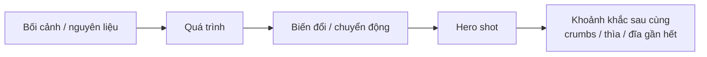

# Bài 02 — Kể chuyện bằng đồ ăn và “bán” cảm xúc

**Phần nguồn chính:** khoảng 03:37–13:32.

## Mục tiêu

- chuyển từ tư duy “một ảnh đẹp” sang **chuỗi ảnh có mở đầu – phát triển – kết thúc**;
- hiểu vì sao đồ ăn có khả năng chạm đến ký ức và cảm giác;
- dùng chuyển động gợi ý như giọt chảy, khói, sốt, vệt múc để tạo cảm giác sống động.

## 1. Món ăn là trải nghiệm

Workshop nhấn mạnh: thực phẩm không chỉ là vật thể. Nó gắn với ký ức, văn hóa, thói quen gia đình, mùa trong năm và cảm giác cơ thể.

Một chiếc kem đang chảy có thể ngay lập tức gợi người xem nghĩ đến hành động “liếm trước khi nó rơi”. Khói từ món nóng có thể gợi buổi sáng mùa đông. Caramel kéo sợi làm người xem hình dung độ dính ngay cả khi chưa nếm.

Đó là lý do người nói mô tả food photography như việc **bán cảm xúc**.

## 2. Storyboard bằng ảnh tĩnh

Một chuỗi hình có thể vận hành giống điện ảnh:

Bạn có thể “đẩy vào – kéo ra” bằng cách xen ảnh rộng và ảnh gần:

- ảnh rộng để cho bối cảnh;
- ảnh vừa để người xem hiểu hành động;
- ảnh cận để tăng cảm giác;
- ảnh hoàn thiện để chốt mong muốn ăn;
- ảnh “after” để tạo cảm giác câu chuyện đã thực sự xảy ra.

## 3. Chuyển động không cần video

Ảnh tĩnh vẫn có thể năng động. Những dấu hiệu gợi chuyển động gồm:

- giọt sắp rơi;
- sốt đang chảy;
- hơi nước hoặc khói;
- bột đang rắc;
- tay đang thao tác;
- vệt thìa vừa kéo qua;
- phần món ăn đã bị cắn hoặc múc.

Chúng khiến người xem tự hoàn thiện hành động tiếp theo trong đầu.

## 4. Đừng để “quy trình” giết mất nghệ thuật

Ảnh thao tác tay, ảnh chuẩn bị hoặc ảnh quy trình dễ trở thành ảnh hướng dẫn khô cứng. Workshop cảnh báo rằng khi chỉ tập trung vào thủ tục, ta có thể đánh mất ánh sáng, bóng tối, bố cục và cảm xúc.

Giải pháp: storyboard trước. Mỗi ảnh quy trình vẫn phải có lý do thẩm mỹ.

## Bài tập: Chuỗi 5 ảnh kể một món

Chọn một món đơn giản như bánh mì nướng, cà phê, mì, soup hoặc pancake.

Tạo 5 ảnh:

1. **mở:** nguyên liệu hoặc bối cảnh;
2. **hành động:** đổ/rắc/cắt/khuấy;
3. **chuyển động:** khói, giọt, sốt, bột;
4. **hero:** món hoàn chỉnh;
5. **kết:** một phần đã được ăn hoặc chiếc thìa còn dấu vết.

Sau đó viết 1 câu cho mỗi ảnh: “ảnh này muốn người xem cảm thấy gì?”.

## Tiêu chí tự chấm

- [ ] Chuỗi ảnh có thể hiểu mà không cần caption dài.
- [ ] Ít nhất 1 ảnh tạo kỳ vọng “điều gì xảy ra tiếp theo?”.
- [ ] Ít nhất 1 ảnh gợi ký ức hoặc tình huống quen thuộc.
- [ ] Ảnh quy trình vẫn có ánh sáng/bố cục có chủ ý.
- [ ] Hero shot là kết quả của câu chuyện, không phải một ảnh rời rạc.
