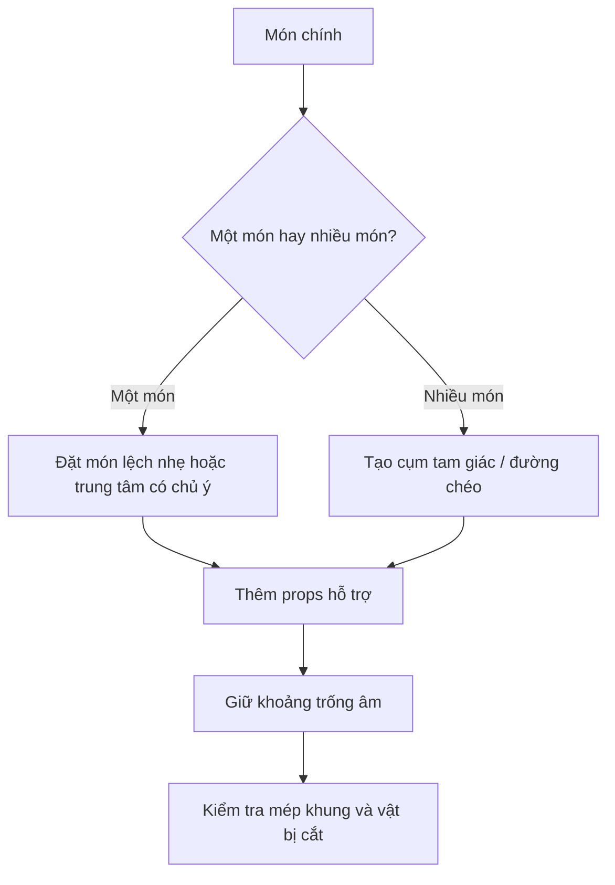

# Bài 04 — Top-down: chụp từ trên xuống

## Mục tiêu
Hiểu khi nào góc top-down tạo ra bố cục mạnh và cách tránh làm ảnh trở thành một flat lay nhàm chán.

## 1. Top-down là gì?
Máy ảnh đặt gần vuông góc với mặt bàn và nhìn thẳng xuống món.

Đây là góc rất phổ biến trên social media vì tạo ra góc nhìn mà mắt người ít khi thấy trong lúc ngồi ăn bình thường.

## 2. Khi nào top-down đặc biệt hiệu quả?
- Bàn ăn có nhiều món.
- Flat lay.
- Pizza, tart, salad, món có hình dạng tròn rõ.
- Smoothie bowl hoặc món có topping trang trí trên bề mặt.
- Cảnh cần thể hiện pattern, hình học và sự sắp xếp.

## 3. Tiêu cự gợi ý
- 50 mm: tự nhiên, dễ kiểm soát méo.
- 35 mm: lấy được nhiều không gian hơn nhưng cần chú ý méo hình ở rìa.
- Điện thoại: camera chính thường an toàn hơn ultra-wide.

## 4. Điểm mạnh của top-down
Top-down biến bề mặt bàn thành một canvas 2D. Bạn có thể điều khiển:
- Hình tròn, đường chéo, tam giác.
- Khoảng trống âm.
- Nhịp điệu giữa bát, đĩa, dao nĩa, khăn.
- Màu sắc giữa các thành phần.

## 5. Món không phù hợp
Không phải món nào cũng đẹp khi nhìn thẳng từ trên xuống.

Các món có điểm mạnh nằm ở chiều cao như:
- Burger nhiều lớp.
- Bánh pancake xếp tầng.
- Sandwich cao.

thường bị mất điểm mạnh nếu chụp hoàn toàn top-down.

## 6. Sơ đồ bố cục top-down

## Bài tập
Chụp một món có topping đẹp từ top-down. Làm 3 phiên bản:
- Chính giữa.
- Lệch 1/3 khung hình.
- Nhiều props tạo đường chéo.
