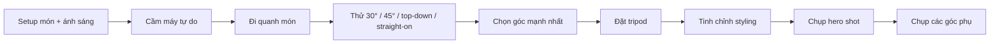

# Bài 06 — Workflow với tripod và shot list cho khách hàng

## Mục tiêu
Xây dựng quy trình chụp hiệu quả thay vì cố tìm một “góc hoàn hảo duy nhất”.

## 1. Quy trình đề xuất

## 2. Vì sao nên chụp nhiều góc?
Khi làm việc với khách hàng, một setup tốt thường có thể tạo nhiều tài sản hình ảnh.

Ví dụ từ cùng một món:
- Hero shot 45°.
- Top-down cho social post.
- Straight-on để khoe layer.
- Góc 30° để có background kể chuyện.
- Close-up texture.

Điều này giúp khách hàng có nhiều lựa chọn cho:
- Website.
- Instagram.
- Banner.
- Menu.
- Quảng cáo.

## 3. Shot list tối thiểu
Với một món, hãy cố gắng lấy ít nhất:
1. Một ảnh hero.
2. Một ảnh top-down.
3. Một ảnh 30–45°.
4. Một ảnh thẳng ngang nếu món có chiều cao.
5. Một close-up texture.

## 4. Đừng thay đổi quá nhiều thứ cùng lúc
Nếu muốn đánh giá góc chụp, hãy giữ ổn định:
- Ánh sáng.
- Styling chính.
- Lens nếu có thể.

Sau đó chỉ thay đổi góc. Nhờ vậy bạn biết chính xác góc nào đang làm ảnh tốt hơn.
