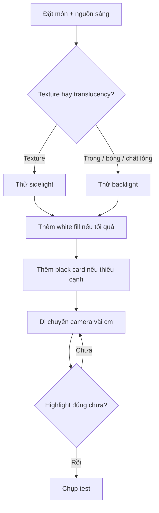

# Bài 04 — Ánh sáng nền tảng cho food photography

**Phần nguồn chính:** khoảng 13:32–18:51.

## Mục tiêu

- dựng một setup tabletop nhỏ bằng ánh sáng cửa sổ hoặc nguồn sáng liên tục;
- hiểu backlight, sidelight, fill và negative fill;
- học cách tìm “sweet spot” bằng cách di chuyển máy và nguồn sáng.

## 1. Không cần production lớn

Workshop cho thấy một setup tabletop tương đối nhỏ vẫn có thể tạo nên cả một “thế giới”. Tư duy quan trọng là:

- có câu chuyện;
- có nguồn sáng tốt;
- kiểm soát bề mặt;
- dùng thẻ trắng/đen để phản xạ hoặc hút sáng;
- biết thiết bị mình đang có.

Thông điệp đáng nhớ: **máy ảnh tốt nhất là máy bạn biết dùng hiệu quả**, không phải máy đắt nhất trên bàn.

## 2. Ba vai trò cơ bản của ánh sáng

### Backlight
Đặt nguồn sáng phía sau hoặc chếch sau chủ thể. Hữu ích với:

- chất lỏng;
- đồ trong mờ;
- hơi nước;
- cạnh và highlight.

### Sidelight
Ánh sáng từ bên làm texture và hình khối rõ hơn. Phù hợp khi cần thấy bề mặt bánh, thịt, chocolate, rau củ.

### Fill / negative fill
- **white fill:** mở vùng tối;
- **black card:** làm bóng sâu hơn, tạo cạnh rõ hoặc kiểm soát phản xạ.

## 3. Ánh sáng liên tục giúp học nhanh

Người nói thích nguồn sáng ổn định vì có thể nhìn trực tiếp ánh sáng thay đổi khi di chuyển máy hoặc vật thể. Đây là một bài tập cực tốt: không đoán, mà **quan sát highlight di chuyển**.

## 4. Di chuyển để tìm điểm đẹp nhất

Thay vì khóa máy ngay từ đầu, workshop đề cao việc thử nghiệm: di chuyển máy, chân máy hoặc cơ thể để nhìn highlight trên chất lỏng, bề mặt bóng và vật trong suốt thay đổi.

Một thay đổi vài centimet có thể quyết định:

- highlight đẹp hay bị cháy;
- viền ly có hiện không;
- chocolate có “sống” hay thành khối nâu phẳng;
- chất lỏng có phát sáng không.

## Bài tập: 1 món — 4 setup ánh sáng

Chọn một món có bề mặt bóng hoặc ẩm.

Chụp:

1. sidelight + không fill;
2. sidelight + white fill;
3. backlight + white fill;
4. backlight + black card ở một phía.

Ghi chú dưới mỗi ảnh: “ánh sáng làm thay đổi điều gì?”.

## Checklist

- [ ] Tôi biết nguồn sáng đang ở đâu.
- [ ] Tôi đọc được highlight và shadow.
- [ ] Tôi đã thử white fill và black card.
- [ ] Tôi di chuyển máy để tìm sweet spot thay vì chỉ đổi setting.
- [ ] Chất liệu món nhìn rõ hơn sau khi chỉnh ánh sáng.
