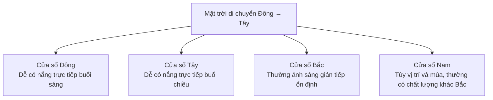

# Bài 04 – Nền tảng ánh sáng tự nhiên cho food photography

## 1. Ánh sáng trực tiếp và gián tiếp

### Ánh sáng trực tiếp

Xảy ra khi chủ thể có “đường nhìn” trực tiếp tới mặt trời.

Đặc điểm:

- Bóng rõ.
- Contrast mạnh.
- Cảm giác nắng hè.
- Texture nổi mạnh.
- Khó kiểm soát hơn nếu mặt trời thay đổi.

### Ánh sáng gián tiếp

Xảy ra khi ánh sáng bầu trời đi vào cửa sổ nhưng mặt trời không chiếu thẳng lên set.

Đặc điểm:

- Mềm hơn.
- Chuyển vùng sáng – tối êm hơn.
- Dễ dùng cho người mới.
- Rất hợp với food photography editorial nhẹ nhàng.

## 2. Hướng cửa sổ

Một cách đơn giản để hiểu:



Lưu ý: hướng ánh sáng thực tế còn phụ thuộc:

- Vĩ độ.
- Mùa.
- Tòa nhà xung quanh.
- Mái hiên.
- Cây cối.
- Thời tiết.

## 3. Nguồn sáng càng lớn, ánh sáng càng mềm

Một cửa sổ lớn so với món ăn sẽ tạo:

- Bóng mềm hơn.
- Highlight rộng hơn.
- Chuyển sáng tối dịu.

Một cửa sổ nhỏ hoặc bị thu hẹp sẽ tạo ánh sáng cứng hơn.

### Mô hình

```text
Cửa sổ lớn
██████████████████
        ↓
    ánh sáng rộng
        ↓
      [MÓN]
 → bóng mềm, chuyển sáng êm
```

## 4. Có thể thay đổi “kích thước nguồn sáng”

Bạn có thể thu nhỏ phần cửa sổ bằng:

- Rèm.
- Black card.
- Foam board.
- Vải đen.
- Flag.

Điều này làm thay đổi:

- Hướng ánh sáng.
- Contrast.
- Độ mềm.
- Vùng bị chiếu sáng.

## 5. Đừng quên màu sắc bên ngoài cửa sổ

Ánh sáng phản xạ từ:

- Cây xanh.
- Tường đỏ.
- Mái hiên màu.
- Xe cộ.
- Biển quảng cáo.

…có thể tạo color cast lên món ăn.

Nếu màu món bị lạ, đừng chỉ nghĩ tới white balance. Hãy nhìn ra ngoài cửa sổ.

## 6. Bài tập

Đặt một quả táo hoặc chiếc bánh cạnh cửa sổ.

Chụp 3 phiên bản:

1. Sát cửa sổ.
2. Cách cửa sổ 1 m.
3. Thu nhỏ cửa sổ bằng rèm hoặc tấm đen.

So sánh:

- Bóng.
- Contrast.
- Độ nổi texture.
- Highlight.
