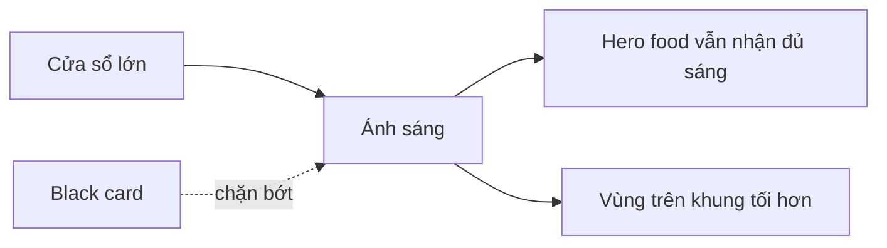

# Bài 05 – Setup overhead và kiểm soát ánh sáng bằng black card

## 1. Vì sao overhead rất phổ biến?

Ảnh overhead phù hợp khi:

- Có nhiều món nhỏ.
- Muốn kể câu chuyện bằng props.
- Muốn nhìn rõ hình dạng đĩa / bát.
- Muốn xây bố cục phẳng.
- Muốn ảnh dùng tốt cho social media, editorial hoặc website.

## 2. Hướng ánh sáng cho overhead

Một lựa chọn phổ biến là để ánh sáng đi từ **phía trên khung hình xuống**.

```text
        CỬA SỔ / NGUỒN SÁNG
        ↓ ↓ ↓ ↓ ↓ ↓ ↓

┌───────────────────────────┐
│       vùng sáng hơn        │
│                           │
│       HERO FOOD           │
│                           │
│       vùng tối hơn         │
└───────────────────────────┘
```

Lợi ích:

- Bóng đổ xuống dưới khung hình.
- Cảm giác tự nhiên với người xem.
- Dễ tạo gradient sáng → tối.
- Hợp với flow đọc ảnh từ trên xuống.

## 3. Vấn đề: vùng trên quá sáng

Trong setup cửa sổ, phần gần cửa sổ thường sáng hơn.

Nếu vùng đó:

- Không chứa hero.
- Chỉ có khoảng trống.
- Có props phụ.

…thì nó có thể kéo mắt người xem ra khỏi chủ thể chính.

## 4. Black card / negative fill

Một tấm foam core màu đen có thể dùng để:

- Chặn một phần ánh sáng.
- Làm tối vùng thừa.
- Tạo vignette tự nhiên.
- Tăng độ tập trung vào hero.



### Nguyên tắc quan trọng

Black card không nhất thiết phải chặn ánh sáng tới món.

Nó có thể chỉ cần:

- Cắt bớt ánh sáng ở background.
- Làm tối mép khung.
- Tạo chuyển vùng sáng tự nhiên.

## 5. Làm ngay khi chụp hay sửa hậu kỳ?

Bạn có thể tạo vignette trong Lightroom/Photoshop.

Nhưng nếu có thể, nên kiểm soát ngay trên set vì:

- Ánh sáng tự nhiên hơn.
- Gradient hợp lý hơn.
- Ít phải “cứu” ảnh.
- Dễ đánh giá bố cục thật ngay lúc chụp.

## 6. Bài tập

Dựng set overhead bằng:

- 1 bàn.
- 1 cửa sổ.
- 1 tấm bìa đen.
- 1 món ăn hoặc vật thể.

Chụp:

1. Không dùng black card.
2. Black card che 20–30% ánh sáng phía trên.
3. Black card đặt gần món hơn.

Quan sát hướng mắt của bạn khi xem lại.
