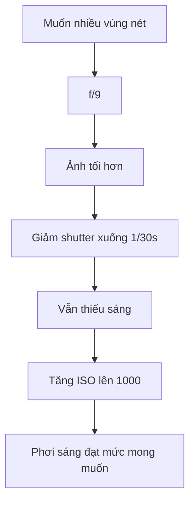

# Bài 07 – Cài đặt phơi sáng: khẩu độ, tốc độ, ISO

## 1. Bắt đầu từ yếu tố quan trọng nhất

Trong buổi chụp overhead này, ưu tiên là:

> Từ mặt bàn tới phần cao nhất của xiên gà đều cần đủ nét.

Vì vậy photographer chọn **khẩu độ trước**.

## 2. Khẩu độ: f/9

f/9 được chọn để có depth of field đủ lớn.

Trong overhead có nhiều lớp cao thấp:

- Mặt bàn.
- Đĩa.
- Cơm.
- Kebab.
- Topping.

Nếu khẩu độ quá lớn như f/2.8:

- Một phần món có thể đẹp.
- Nhưng nhiều thành phần sẽ out focus.

## 3. Tốc độ: 1/30 giây

Camera đã được cố định trên support nên có thể dùng tốc độ thấp hơn handheld.

Tuy vậy, vẫn cần tránh:

- Camera rung.
- Bàn rung.
- Người va vào setup.
- Đồ ăn chuyển động.

1/30 giây là mức an toàn mà photographer cảm thấy thoải mái trong setup này.

## 4. ISO: 1000

Do:

- Ánh sáng tự nhiên không quá mạnh.
- f/9 làm giảm lượng ánh sáng.
- 1/30 giây không muốn chậm hơn.

…ISO được tăng lên khoảng 1000.

Với nhiều máy ảnh hiện đại, ISO 1000 vẫn có thể cho chất lượng tốt.

## 5. Exposure triangle trong setup

## 6. Không có một bộ thông số “chuẩn”

Thông số phụ thuộc:

- Cường độ ánh sáng.
- Kích thước cửa sổ.
- Khoảng cách tới cửa sổ.
- Màu background.
- Độ cao món ăn.
- Máy ảnh.
- Mức noise bạn chấp nhận.

Hãy học logic thay vì học thuộc con số.

## 7. Bài tập

Dùng chế độ Manual.

Giữ set cố định và thử:

- f/4.
- f/8.
- f/11.

Điều chỉnh shutter / ISO để giữ độ sáng gần bằng nhau.

So sánh depth of field.
