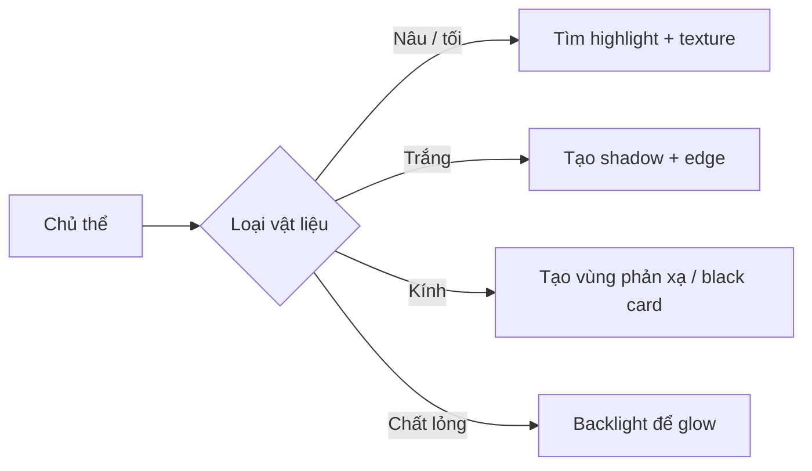

# Bài 05 — Màu sắc, tương phản và vật liệu khó chụp

**Phần nguồn chính:** khoảng 16:13–23:12.

## Mục tiêu

- dùng màu và tương phản như một phần của phong cách;
- xử lý các chủ thể khó: nâu-on-nâu, trắng-on-trắng, kính, chất lỏng;
- hiểu vì sao highlight nhỏ có thể quan trọng hơn việc tăng sáng toàn cảnh.

## 1. Màu sắc phải giúp món nổi lên

Người nói mô tả phong cách cá nhân thiên về nền tối để màu thực phẩm bật lên. Đây không phải công thức chung cho tất cả, mà là ví dụ về cách một bảng màu có thể trở thành dấu hiệu nhận diện.

Câu hỏi nên đặt:

- màu nền có nâng món hay cạnh tranh với món?
- có cần high contrast không?
- câu chuyện muốn ấm, nhẹ, tối, mộc, sáng hay graphic?

## 2. Nâu là bài kiểm tra của highlight

Chocolate, thịt nướng, caramel, bánh nâu hoặc sốt nâu dễ thành một khối phẳng. Thay vì “làm sáng hết”, workshop gợi cách tìm **một điểm highlight hợp lý** để tạo độ bóng và khối.

Với nâu, hãy tìm:

- highlight cạnh;
- độ bóng khác nhau giữa vùng ẩm và khô;
- texture nhỏ;
- chênh tông nâu chứ không chỉ chênh exposure.

## 3. Trắng-on-trắng: hình dạng đến từ bóng

Nếu mọi thứ đều trắng, màu không giúp bạn tách hình. Khi đó cần:

- bóng mềm;
- viền;
- sự khác nhau giữa matte và gloss;
- góc ánh sáng;
- khoảng cách giữa lớp trước và lớp sau.

## 4. Kính và chất lỏng

Kính cần “thứ để phản chiếu”. White glass setup thường cần vùng tối hoặc black card để cạnh ly hiện lên. Chất lỏng lại thường đẹp khi ánh sáng đi xuyên qua, tạo glow.

### Mini-diagram

## Bài tập: material challenge

Chọn 2 trong 4:

- chocolate;
- whipped cream / sữa chua;
- ly nước;
- mật ong / syrup.

Mỗi chủ thể chụp ít nhất 3 test. Mục tiêu không phải ảnh đẹp ngay mà là tìm **điều kiện ánh sáng khiến vật liệu đọc đúng**.

## Checklist

- [ ] Vật liệu nhìn đúng chất, không chỉ đúng màu.
- [ ] Có vùng highlight hoặc edge cần thiết.
- [ ] Shadow giữ đủ thông tin.
- [ ] Màu nền không phá món.
- [ ] Tôi biết lý do chọn high-key hay low-key.
