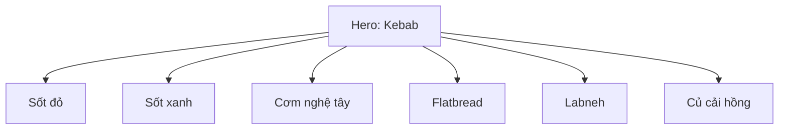

# Bài 03 – Concept, màu sắc, nguyên liệu và đạo cụ

## 1. Concept của buổi chụp

Buổi chụp hướng tới hình ảnh:

- Táo bạo.
- Biểu cảm.
- Nhiều màu.
- Mang cảm giác editorial.
- Vẫn giữ món ăn là nhân vật chính.

Món trung tâm là **kebab gà**, kết hợp với:

- Harissa đỏ.
- Sốt xanh.
- Flatbread.
- Cơm nghệ tây vàng.
- Labneh.
- Củ cải dưa hấu màu hồng.

Đây là một ví dụ tốt về việc **dùng nguyên liệu phụ để tạo palette**, không chỉ để trang trí.

## 2. Xây palette màu

Một palette hấp dẫn không nhất thiết dùng thật nhiều màu. Quan trọng là có vai trò rõ ràng.

Ví dụ:

| Vai trò | Màu |
|---|---|
| Nền | Xanh lá |
| Hero food | Nâu vàng / cháy |
| Accent mạnh | Đỏ harissa |
| Accent tươi | Xanh sốt thảo mộc |
| Accent ấm | Vàng nghệ tây |
| Accent mềm | Hồng củ cải |

## 3. Contrast màu và cảm xúc

- **Đỏ + xanh**: mạnh, giàu năng lượng.
- **Vàng**: tăng cảm giác ấm, ngon miệng.
- **Hồng**: làm dịu tổng thể.
- **Nâu cháy**: gợi nhiệt, nướng, caramelization.

## 4. Props nên phục vụ món ăn

Props không nên cạnh tranh với hero.

Khi chọn đĩa hoặc bát, hãy kiểm tra:

- Màu có xung đột với món không?
- Texture có quá mạnh không?
- Kích thước có làm món trông nhỏ không?
- Hình dáng có hỗ trợ bố cục không?
- Có hợp với câu chuyện món ăn không?

Trong buổi chụp, đĩa có texture tự nhiên được chọn vì nó bổ sung cảm giác thủ công mà không chiếm spotlight.

## 5. Nguyên tắc “một hero – nhiều supporting elements”

Các supporting elements cần:

- Hỗ trợ màu.
- Hỗ trợ texture.
- Hỗ trợ câu chuyện.
- Không tạo quá nhiều điểm nhìn mạnh ngang hero.

## 6. Bài tập

Chọn một món đơn giản như:

- Gà nướng.
- Mì.
- Cơm.
- Bánh mì.
- Salad.

Tạo palette gồm:

- 1 màu nền.
- 1 màu hero.
- 2 màu accent.
- 1 màu “làm dịu”.

Viết palette trước khi chụp.
