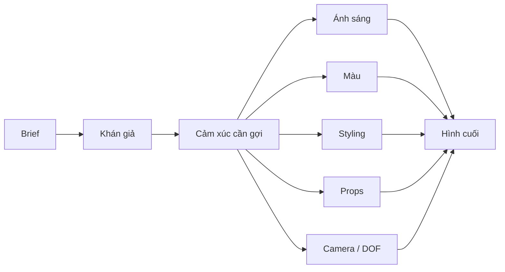

# Bài 07 — Hiểu câu chuyện, khách hàng và khán giả

**Phần nguồn chính:** khoảng 31:37–37:13 và 50:34–51:41.

## Mục tiêu

- chuyển brief thành lựa chọn thị giác;
- phân biệt phong cách cá nhân với yêu cầu của câu chuyện;
- thiết kế hình ảnh phù hợp với khán giả cụ thể.

## 1. “Biết câu chuyện, biết khán giả”

Phong cách cá nhân quan trọng nhưng không phải lúc nào cũng được áp nguyên xi. Nếu câu chuyện cần sáng, nhẹ, tự làm, gần gũi với gia đình, một phong cách tối kịch tính có thể không phù hợp.

Người nói dùng ví dụ nội dung hướng tới các bà mẹ và trẻ em: hình cần sáng hơn, vui hơn, tự làm hơn, không quá “quý giá” hoặc hoàn hảo.

## 2. Audience resonance

Một hình tốt không chỉ “đẹp” mà còn phải khớp với kinh nghiệm của người xem.

Ví dụ trong workshop:

- burger có kỳ vọng thị giác rất mạnh trong văn hóa;
- món tự làm cần trông đủ tự nhiên để người xem tin rằng họ có thể làm;
- nội dung vegan cho trẻ vẫn phải gợi đúng trải nghiệm bánh ngọt mà trẻ quen thuộc.

## 3. Từ brief → cảm xúc → lựa chọn

## 4. Bài tập: cùng một món, hai khán giả

Chọn một cupcake / sandwich / bowl.

Tạo hai concept:

### Concept A — trẻ em/gia đình
- vui;
- gần gũi;
- sáng;
- handmade;
- props thân thiện.

### Concept B — editorial cao cấp
- tinh gọn;
- kiểm soát;
- ít props;
- contrast cao hơn;
- framing chủ ý.

Chụp mỗi concept ít nhất 3 ảnh.

## Checklist

- [ ] Tôi biết ai là người xem chính.
- [ ] Tôi biết cảm xúc muốn gợi.
- [ ] Styling khớp audience.
- [ ] Màu và light khớp câu chuyện.
- [ ] Tôi không áp phong cách cá nhân một cách máy móc.
