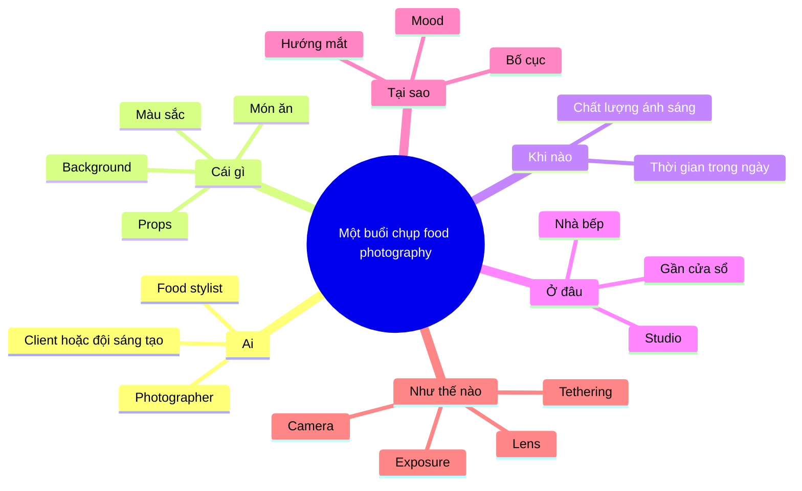

# Bài 01 – Tư duy hậu trường: Ai, Cái gì, Khi nào, Ở đâu, Tại sao, Như thế nào

## 1. Vì sao cần phân tích hậu trường?

Một bức ảnh món ăn hoàn chỉnh chỉ là kết quả cuối. Điều quan trọng hơn với người học là hiểu chuỗi quyết định phía sau bức ảnh.

Có thể phân tích một buổi chụp bằng 6 câu hỏi:

- **Ai?** Ai tham gia?
- **Cái gì?** Món ăn và concept là gì?
- **Khi nào?** Chụp thời điểm nào?
- **Ở đâu?** Không gian và nguồn sáng ở đâu?
- **Tại sao?** Vì sao chọn setup, góc máy và cách điều khiển ánh sáng đó?
- **Như thế nào?** Máy ảnh, ống kính, thông số và workflow cụ thể ra sao?

## 2. Bài học quan trọng từ buổi chụp

Buổi chụp trong transcript không phải một job thương mại bị ràng buộc bởi brief khách hàng. Đây là một buổi chụp cá nhân để photographer và food stylist thử nghiệm hình ảnh:

- Táo bạo.
- Nhiều màu.
- Có tính biên tập.
- Tự do thử nghiệm hơn so với công việc khách hàng.

Điều này rất quan trọng: **personal project là nơi xây phong cách và thử điều mà job thương mại chưa cho phép bạn làm**.

## 3. Không cần studio lớn để bắt đầu

Studio chuyên nghiệp giúp:

- Có nhiều không gian thao tác.
- Dễ bố trí bàn và thiết bị.
- Có khu vực chuẩn bị món.
- Giữ workflow ổn định.

Nhưng đây không phải điều kiện để học food photography.

Bạn hoàn toàn có thể bắt đầu từ:

- Bàn ăn.
- Góc bếp.
- Phòng ngủ trống.
- Ban công.
- Một chiếc bàn cạnh cửa sổ.

### Nguyên tắc

> Chất lượng quyết định và khả năng kiểm soát ánh sáng quan trọng hơn diện tích studio.

## 4. Bài tập

Chọn một ảnh món ăn bạn thích và trả lời 6 câu hỏi:

1. Ai có thể đã tham gia?
2. Món chính là gì?
3. Mood hình ảnh là gì?
4. Nguồn sáng có thể nằm ở đâu?
5. Vì sao photographer chọn hướng ánh sáng đó?
6. Bạn đoán họ dùng góc máy và tiêu cự nào?

Không cần đoán chính xác. Mục tiêu là tập **đọc hình ảnh như một photographer**.
