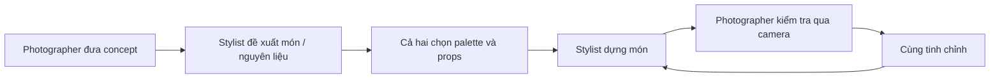

# Bài 02 – Làm việc với food stylist và xây dựng ngôn ngữ hình ảnh

## 1. Food stylist không chỉ là người “xếp đồ ăn”

Food stylist chịu trách nhiệm giúp món ăn:

- Đẹp đúng concept.
- Giữ hình dáng phù hợp trước camera.
- Có texture và màu sắc rõ ràng.
- Dễ điều chỉnh theo góc máy.
- Đồng nhất với props và background.

Một food stylist có kinh nghiệm nhà hàng thường có lợi thế lớn ở:

- Tốc độ xử lý.
- Hiểu nguyên liệu.
- Bình tĩnh khi có lỗi.
- Biết món nào chịu nhiệt tốt.
- Biết món nào nhanh mất texture hoặc màu.

## 2. Mỗi stylist có thế mạnh khác nhau

Cũng như photographer, stylist thường có “chất” riêng:

- Editorial.
- Commercial.
- Fine dining.
- Rustic.
- Bold color.
- Minimal.
- Lifestyle.

Trước khi hợp tác, hãy xem portfolio và tự hỏi:

- Họ thường dùng màu sắc như thế nào?
- Món ăn có thiên về tự nhiên hay hoàn hảo?
- Họ giỏi plating kiểu nào?
- Công việc của họ có hợp mood bạn cần không?

## 3. Collaboration tốt là gì?

Một workflow tốt không phải photographer ra lệnh còn stylist chỉ làm theo.

Nó là vòng lặp:

## 4. Tại sao tethering giúp collaboration?

Khi ảnh hiển thị ngay trên màn hình lớn:

- Photographer nhìn rõ bố cục.
- Stylist thấy đúng những gì camera thấy.
- Hai bên dùng chung một “ngôn ngữ hình ảnh”.
- Không cần tranh luận dựa trên tưởng tượng.
- Các chỉnh sửa nhỏ nhanh hơn rất nhiều.

## 5. Bài tập

Tạo một mini brief cho món ăn của bạn với 5 dòng:

- Món:
- Mood:
- 3 màu chính:
- 3 texture cần thấy:
- Điểm người xem phải nhìn đầu tiên:

Sau đó thử styling một phiên bản và chụp thử bằng điện thoại.
