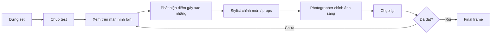

# Bài 08 – Workflow chụp, tethering và tinh chỉnh set

## 1. Food photography là quá trình lặp

Ảnh cuối hiếm khi là tấm đầu tiên.

Workflow thường là:

## 2. Tethering giúp gì?

Tethering là chụp ảnh và chuyển trực tiếp ảnh sang máy tính.

Lợi ích:

- Xem ảnh lớn hơn.
- Kiểm tra focus.
- Kiểm tra texture món.
- So bố cục tốt hơn.
- Stylist thấy ngay những gì camera đang thấy.
- Dễ ra quyết định tập thể.

## 3. Tinh chỉnh “nhỏ” nhưng ảnh hưởng lớn

Những thay đổi nhỏ thường gồm:

- Xoay một chiếc đĩa.
- Dịch rau vài cm.
- Thêm dầu để highlight đẹp hơn.
- Brush nhẹ lên bề mặt món.
- Giảm khoảng trống.
- Kéo một props ra khỏi khung.
- Tăng negative fill.
- Chỉnh hướng một xiên kebab.

## 4. Kiểm tra theo thứ tự

Khi nhìn ảnh test, kiểm tra:

1. **Hero có nổi bật nhất không?**
2. **Vùng sáng nhất nằm ở đâu?**
3. **Có props nào kéo mắt ra ngoài không?**
4. **Món có texture rõ chưa?**
5. **Các màu có cân bằng không?**
6. **Có vùng nào quá trống hoặc quá dày không?**
7. **Focus và depth of field đã đủ chưa?**

## 5. Bài tập

Chụp một set 5 vòng.

Mỗi vòng chỉ được thay đổi **một nhóm yếu tố**:

- Vòng 1: bố cục.
- Vòng 2: ánh sáng.
- Vòng 3: food styling.
- Vòng 4: props.
- Vòng 5: exposure.

Ghi chú thay đổi giữa các vòng.
