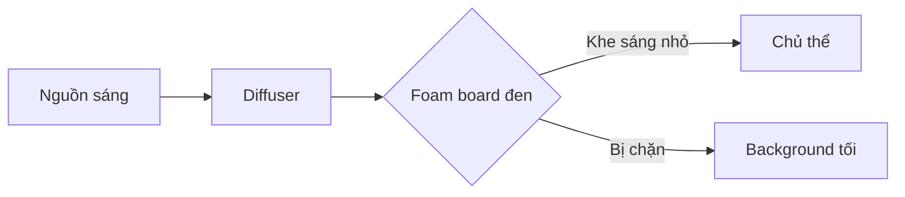

# Bài 02 — Kiểm soát ánh sáng bằng cách giới hạn vùng chiếu

## 1. Ánh sáng giống như nước

Một hình dung rất hữu ích:

> Ánh sáng giống như nước. Nếu không chặn lại, nó sẽ tràn ra toàn bộ cảnh.

Trong dark food photography, chúng ta muốn:

- giảm ánh sáng tràn,
- chỉ cho ánh sáng đi qua một khe hẹp,
- để highlight rơi đúng vào món ăn.

## 2. Light modifier là gì?

Một số công cụ đơn giản:

- black foam board,
- cờ đen,
- barn doors,
- bìa carton sơn đen,
- V-flat,
- tấm chắn sáng nhỏ.

Mục tiêu của chúng là:

- chặn ánh sáng không mong muốn,
- thu hẹp vùng sáng,
- tạo shadow sâu hơn,
- tách chủ thể khỏi background.

## 3. Negative fill

Negative fill là kỹ thuật dùng vật liệu tối để **hấp thụ ánh sáng phản xạ**.

Ví dụ:

- đặt một tấm foam board đen sát bên món ăn,
- giảm lượng ánh sáng phản hồi vào vùng shadow,
- tạo chiều sâu cho vật thể.

## 4. Tạo khe sáng hẹp

Thay vì chiếu sáng cả bàn:

- đặt hai tấm chắn,
- chừa một khe nhỏ,
- để ánh sáng chỉ lọt qua vùng cần thiết.

## 5. Điều cần quan sát

Khi di chuyển tấm chắn vài centimet, hãy nhìn:

- highlight trên món ăn có thay đổi không?
- vùng shadow có sâu hơn không?
- background có bị sáng lên không?
- đạo cụ có nổi bật hơn món chính không?

## 6. Nguyên tắc

Không cố “làm tất cả tối”.

Hãy tìm:

> **Một vùng sáng đẹp nhất để kể câu chuyện về món ăn.**
