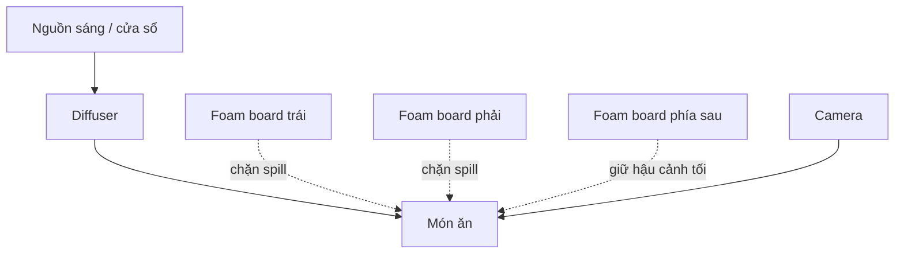

# Bài 03 — Dựng setup ánh sáng tối bằng thiết bị đơn giản

## 1. Setup cơ bản

Bạn cần:

- 1 nguồn sáng liên tục hoặc cửa sổ,
- 1 lớp diffusion,
- 2–4 tấm foam board đen,
- background tối,
- tabletop tối,
- món ăn.

## 2. Sơ đồ setup

## 3. Diffusion

Nếu ánh sáng quá gắt:

- thêm diffuser,
- kéo rèm trắng,
- dùng softbox,
- tăng khoảng cách giữa nguồn sáng và chủ thể nếu cần.

Mục tiêu là:

- highlight mềm,
- texture vẫn rõ,
- transition từ sáng sang tối mượt.

## 4. Tạo “hộp ánh sáng tối”

Bạn có thể dùng 3 tấm foam board:

- một bên trái,
- một bên phải,
- một phía sau.

Sau đó để một khe sáng nhỏ đi vào chủ thể.

Kết quả:

- ánh sáng ít bị spill,
- background tối tự nhiên,
- món ăn có chiều sâu.

## 5. Không cần thiết bị đắt tiền

Bạn có thể thay:

| Thiết bị studio | Thay thế tại nhà |
|---|---|
| LED panel | Cửa sổ |
| Diffuser | Rèm trắng |
| Foam board | Bìa carton đen |
| Barn door | Hai miếng bìa đen |
| V-flat | Hai tấm carton ghép chữ V |

## 6. Thực hành

Hãy dựng cùng một món ăn theo 3 cách:

1. không dùng foam board,
2. dùng 1 tấm,
3. dùng 3 tấm.

So sánh:

- độ sâu shadow,
- độ sáng background,
- mức độ tập trung vào món ăn.
