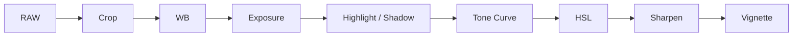

# Bài 06 — Chỉnh ảnh Dark Food trong Lightroom

## 1. Bước 1 — Cân lại khung hình

Trước tiên:

- crop,
- straighten,
- sửa horizon,
- loại vùng thừa.

## 2. Bước 2 — White Balance

Ảnh dark food thường hợp với cảm giác hơi lạnh hơn một chút, nhưng không phải lúc nào cũng vậy.

Mục tiêu:

- giữ màu món ăn tự nhiên,
- không để chocolate thành xám,
- không để gỗ chuyển xanh quá mức.

## 3. Bước 3 — Exposure

Không tăng exposure quá nhiều.

Ảnh dark food cần giữ được:

- vùng tối,
- độ sâu,
- contrast tự nhiên.

## 4. Bước 4 — Highlights và Shadows

Workflow tham khảo:

- Highlights: giảm nhẹ
- Shadows: tăng vừa phải
- Whites: tăng để lấy lại điểm sáng
- Blacks: không nhất thiết kéo xuống cực mạnh

Mục tiêu:

> Giữ shadow nhưng vẫn có thông tin.

## 5. Bước 5 — Clarity / Texture

Có thể tăng nhẹ clarity hoặc texture để:

- cacao rõ hơn,
- vỏ bánh rõ hơn,
- chocolate có texture,
- bề mặt gỗ sống động hơn.

Không nên tăng quá nhiều vì ảnh sẽ thô và “HDR”.

## 6. Bước 6 — Tone Curve

Tone Curve là phần quan trọng.

Một workflow phổ biến:

- nâng black point nhẹ → vintage / matte,
- giữ midtone,
- hạ shadow có kiểm soát,
- giữ highlight đủ sáng.

## 7. Bước 7 — HSL

Dark food thường dùng HSL để “làm giàu màu”.

Ví dụ:

### Blue
- giảm luminance,
- giảm saturation nếu quá mạnh.

### Orange / Brown
- giảm luminance nhẹ,
- tăng saturation nhẹ nếu món cần cảm giác ấm và ngon hơn.

### Yellow
- giảm luminance nếu background hoặc gỗ quá sáng.

## 8. Bước 8 — Sharpening + Masking

Tăng sharpen nhưng dùng masking để chỉ làm nét:

- viền món ăn,
- texture cần thiết,
- topping,
- bề mặt chính.

Không nên sharpen toàn bộ shadow và background.

## 9. Bước 9 — Vignette

Vignette giúp:

- kéo mắt vào trung tâm,
- làm tiền cảnh và rìa khung tối hơn.

Nhưng chỉ nên dùng nhẹ.

Nếu nhìn thấy “vòng tối nhân tạo”, bạn đã đi quá xa.

## 10. Quy tắc cuối

Mục tiêu hậu kỳ không phải biến ảnh sáng thành ảnh tối.

Mục tiêu là:

> **Củng cố cấu trúc ánh sáng đã tạo từ lúc chụp.**
