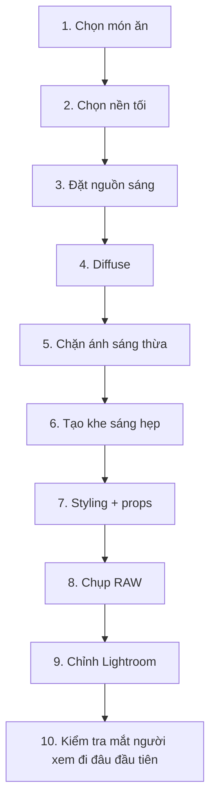

# Bài 07 — Workflow hoàn chỉnh + checklist thực hành

## Workflow 10 bước

## Checklist ánh sáng

- [ ] Nguồn sáng có hướng rõ?
- [ ] Ánh sáng có bị spill quá nhiều?
- [ ] Có cần thêm foam board?
- [ ] Highlight có đúng vị trí?
- [ ] Shadow còn chi tiết?

## Checklist styling

- [ ] Props có tối hơn hoặc ít nổi bật hơn món chính?
- [ ] Có vật trắng sáng gây phân tâm?
- [ ] Đạo cụ có kể câu chuyện?
- [ ] Có khoảng thở trong bố cục?

## Checklist Lightroom

- [ ] Crop / straighten
- [ ] White balance
- [ ] Exposure
- [ ] Highlights
- [ ] Shadows
- [ ] Whites
- [ ] Blacks
- [ ] Clarity / Texture
- [ ] Tone Curve
- [ ] HSL
- [ ] Sharpening
- [ ] Vignette

## Những lỗi thường gặp

### Lỗi 1 — Chỉ kéo exposure xuống

Kết quả:

- ảnh tối nhưng bệt,
- món ăn không hấp dẫn,
- texture mất.

**Cách sửa:** kiểm soát ánh sáng ngay từ lúc chụp.

### Lỗi 2 — Background tối nhưng món cũng tối như nhau

**Cách sửa:** tạo vùng highlight rõ trên chủ thể.

### Lỗi 3 — Props sáng hơn món ăn

**Cách sửa:** dùng props tối hoặc giảm ánh sáng trên props.

### Lỗi 4 — Shadow đen hoàn toàn

**Cách sửa:** tăng shadow nhẹ hoặc thay đổi negative fill.

### Lỗi 5 — Vignette quá mạnh

**Cách sửa:** giảm mức vignette, ưu tiên darkening tự nhiên bằng ánh sáng.

## Bài tập cuối khóa

Chụp một món có nhiều texture, ví dụ:

- chocolate truffle,
- bánh brownie,
- steak,
- mì sốt đậm,
- cà phê,
- món hầm.

Yêu cầu:

1. Chỉ dùng 1 nguồn sáng.
2. Có ít nhất 2 tấm foam board đen.
3. Tạo một khe sáng hẹp.
4. Props phải tối hơn món chính.
5. Chụp RAW.
6. Chỉnh Lightroom theo bài 06.
7. Xuất:
   - ảnh trước chỉnh,
   - ảnh sau chỉnh,
   - ảnh setup hậu trường.

## Tiêu chí tự chấm

| Tiêu chí | Điểm |
|---|---:|
| Ánh sáng có chủ đích | /10 |
| Món ăn nổi bật | /10 |
| Shadow có chiều sâu | /10 |
| Props hỗ trợ câu chuyện | /10 |
| Texture món ăn | /10 |
| Hậu kỳ tự nhiên | /10 |
| Màu sắc hài hòa | /10 |
| Bố cục | /10 |
| Không bị “đen bệt” | /10 |
| Tổng thể hấp dẫn | /10 |

**Tổng: /100**
