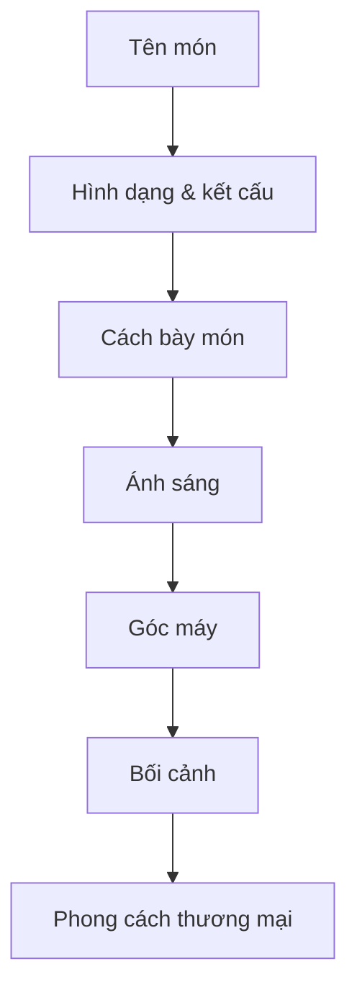

# Bài 1 — Giới thiệu AI Food Photography

## Mục tiêu

Hiểu vì sao AI có thể hỗ trợ blogger ẩm thực, nhà hàng và người làm quảng cáo tạo visual món ăn mà không cần studio chuyên nghiệp.

## Nội dung chính

Video mở đầu bằng một nhu cầu rất thực tế: bạn cần ảnh món ăn đẹp cho website, quảng cáo, menu hoặc ảnh stock nhưng không có máy ảnh, đèn studio hay kỹ năng chụp chuyên nghiệp.

AI image generator giải quyết phần lớn khâu “dàn cảnh” bằng cách biến mô tả bằng chữ thành hình ảnh.

Điểm quan trọng không nằm ở việc gõ tên món ăn, mà ở việc mô tả đủ rõ:

- Món gì?
- Trông như thế nào?
- Được bày trên vật dụng gì?
- Ánh sáng ra sao?
- Góc chụp nào?
- Không khí của cảnh là gì?
- Ảnh dành cho menu, quảng cáo hay social?

## Tư duy đúng

Đừng xem prompt là một câu lệnh ngắn.

Hãy xem prompt như **brief cho một nhiếp ảnh gia ẩm thực**.

## Bài tập

Viết một brief 6 dòng cho món ăn bạn muốn tạo, chưa cần dùng AI.

Ví dụ:

- món: phở bò
- điểm nhấn: nước dùng trong, lát bò mềm
- bát: gốm trắng
- ánh sáng: sáng cửa sổ dịu
- góc máy: chéo 45°
- mục đích: ảnh menu nhà hàng
