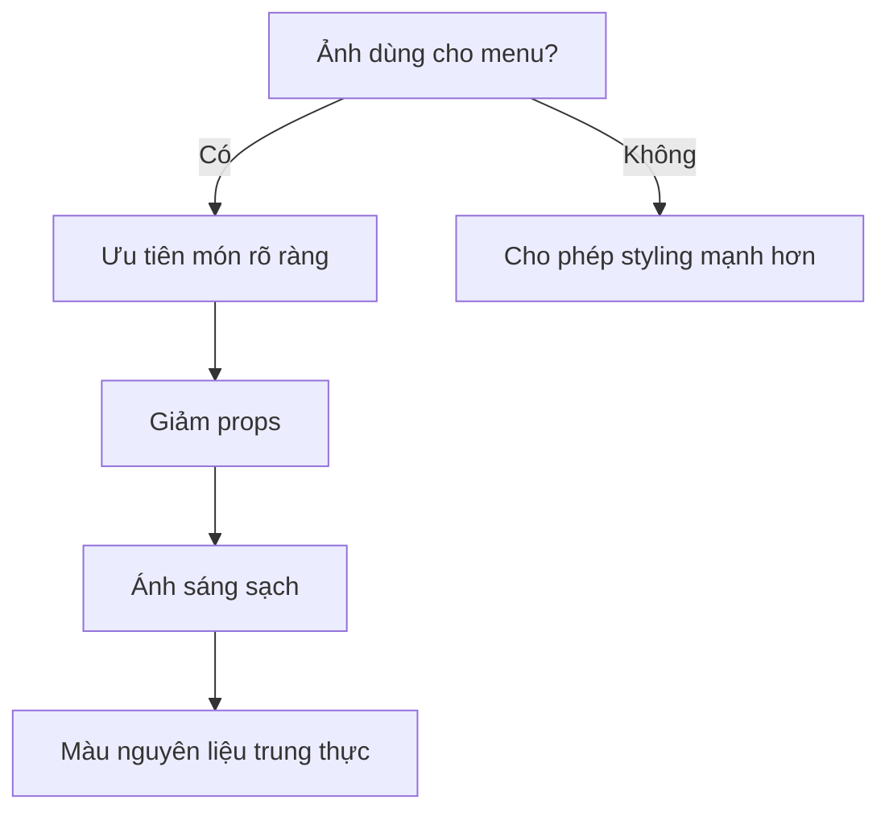

# Bài 5 — Món chay và ảnh menu

Video tiếp tục với một món chay nhiều màu sắc và nhấn mạnh khả năng dùng ảnh AI cho **menu nhà hàng chay**.

## Mục tiêu của ảnh menu

Ảnh menu cần:

- nhìn rõ món
- nhận diện thành phần chính
- màu sắc chân thật
- bố cục gọn
- không có quá nhiều props gây mất tập trung

## Prompt thực hành

```text
A colorful vegetarian grain bowl with roasted vegetables,
leafy greens, chickpeas, avocado slices and a light dressing,
ingredients arranged naturally rather than symmetrically,
served in a matte ceramic bowl,
45-degree restaurant menu photography,
soft diffused daylight,
clean neutral tabletop,
realistic food color, subtle texture, appetizing but natural,
commercial menu photography
```

## Sơ đồ quyết định



## Bài tập

Chọn một món chay và tạo hai prompt:

- bản menu sạch
- bản editorial nhiều không khí hơn
