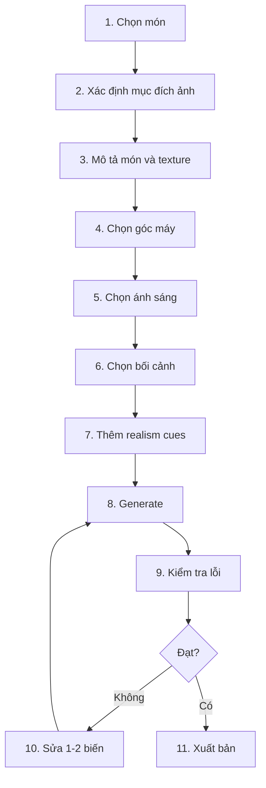

# Bài 8 — Workflow hoàn chỉnh

Video kết luận rằng từ một prompt nền, bạn có thể thay đổi món ăn và bối cảnh để tạo ra nhiều ảnh khác nhau.

## Workflow đề xuất



## Nguyên tắc sửa prompt

Chỉ thay 1–2 nhóm yếu tố mỗi lần.

Ví dụ:

### Ảnh quá AI

Thêm:

```text
natural imperfections, realistic texture,
subtle asymmetry, restrained highlights
```

### Món không đủ hấp dẫn

Thêm tín hiệu vật lý:

```text
gentle steam, melted edge, glossy sauce, crisp surface
```

### Bố cục quá cứng

Thêm:

```text
casual restaurant plating, naturally scattered garnish,
slight asymmetry
```

### Ảnh quá top-down

Thêm:

```text
three-quarter view, 45-degree camera angle
```

## Checklist trước khi dùng ảnh

- món có đúng cấu trúc không?
- nguyên liệu có đúng hình dạng không?
- có chi tiết lặp bất thường không?
- vật dụng ăn uống có méo không?
- bóng đổ có hợp lý không?
- độ bóng có quá nhựa không?
- garnish có quá đều không?
- ảnh có đúng mục tiêu menu/quảng cáo/social không?

## Bài tập cuối khóa

Chọn một món và tạo 4 phiên bản:

1. menu
2. quảng cáo
3. social
4. editorial

Sau đó ghi lại những thành phần prompt thay đổi giữa 4 phiên bản.
