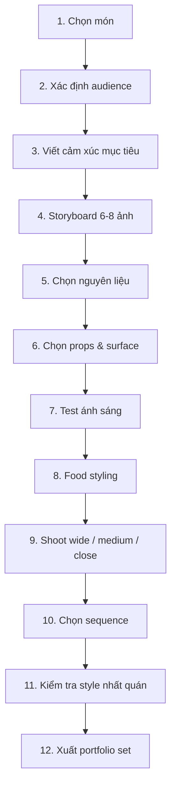

# Bài 12 — Capstone: thực hiện một bộ ảnh hoàn chỉnh

## Mục tiêu

Gom toàn bộ khóa học vào một project 6–8 ảnh có câu chuyện, ánh sáng, styling và phong cách nhất quán.

## Đề bài

Chọn một món có **quá trình**, ví dụ:

- pizza;
- pancake;
- mì;
- bánh nướng;
- soup;
- hot pot;
- chocolate dessert;
- đồ uống nóng/lạnh.

Tạo một series 6–8 ảnh với một audience cụ thể.

## Workflow

## Deliverables

### 1. Creative brief — 1 trang

- món ăn;
- khán giả;
- 3 từ cảm xúc;
- ánh sáng chủ đạo;
- palette;
- props;
- kiểu framing;
- điều tuyệt đối tránh.

### 2. Storyboard

Ít nhất 6 frame:

1. context/ingredient;
2. process;
3. motion;
4. texture/detail;
5. hero shot;
6. after/bite/ending.

### 3. Contact sheet

Giữ cả test frame để đánh giá quá trình.

### 4. Final set

6–8 ảnh theo đúng thứ tự kể chuyện.

## Rubric 100 điểm

| Tiêu chí | Điểm |
|---|---:|
| Câu chuyện rõ | 20 |
| Ánh sáng làm rõ chất liệu | 20 |
| Food styling đáng tin | 15 |
| Bố cục & chuyển động thị giác | 15 |
| Props/set phục vụ câu chuyện | 10 |
| Style nhất quán | 10 |
| Chọn ảnh & sequence | 10 |

## Tự phản biện sau buổi chụp

Trả lời 7 câu:

1. Ảnh nào làm mình muốn ăn nhất? Vì sao?
2. Ảnh nào có ánh sáng tốt nhất?
3. Ảnh nào yếu nhất và yếu ở styling hay photography?
4. Props nào thừa?
5. Audience có đọc đúng cảm xúc không?
6. Nếu chụp lại, thay đổi 1 điều gì?
7. Series có dấu hiệu phong cách cá nhân chưa?
