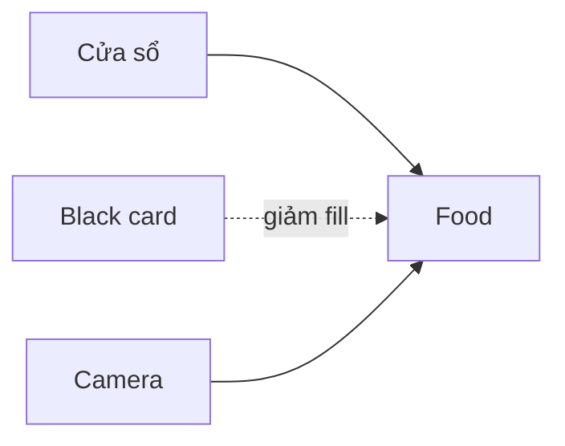

# Final Project – Một bộ ảnh món ăn ánh sáng tự nhiên

## Mục tiêu

Tạo một mini series 3 ảnh thể hiện khả năng:

- Xây concept.
- Điều khiển ánh sáng.
- Styling.
- Bố cục.
- Exposure.
- Consistency.

## Yêu cầu

### Ảnh 1 – Hero overhead
Một ảnh nhìn từ trên xuống, món chính là điểm nhìn đầu tiên.

### Ảnh 2 – Góc 45°
Chụp cùng món ở góc khoảng 45° để thể hiện chiều cao và texture.

### Ảnh 3 – Detail
Chụp cận một texture đặc trưng: nước sốt, vết cháy, topping, hơi nóng, lớp giòn...

## Hồ sơ nộp

- 3 ảnh final.
- 1 ảnh setup ánh sáng.
- Palette màu.
- Sơ đồ ánh sáng.
- Camera settings.
- 150–300 từ tự đánh giá.

## Mẫu sơ đồ ánh sáng

## Tự chấm theo 5 tiêu chí

Mỗi tiêu chí 1–5 điểm:

- Hero clarity.
- Lighting control.
- Food styling.
- Composition.
- Technical quality.

Tổng: 25 điểm.

Mục tiêu không phải đạt điểm tuyệt đối mà là biết **vì sao ảnh của mình trông như vậy**.
