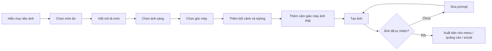

# Sơ đồ khóa học

```mermaid
flowchart LR
    A[Hiểu mục tiêu ảnh] --> B[Chọn món ăn]
    B --> C[Viết mô tả món]
    C --> D[Chọn ánh sáng]
    D --> E[Chọn góc máy]
    E --> F[Thêm bối cảnh và styling]
    F --> G[Thêm cảm giác máy ảnh thật]
    G --> H[Tạo ảnh]
    H --> I{Ảnh đã tự nhiên?}
    I -- Chưa --> J[Sửa prompt]
    J --> H
    I -- Rồi --> K[Xuất bản cho menu / quảng cáo / social]
```
