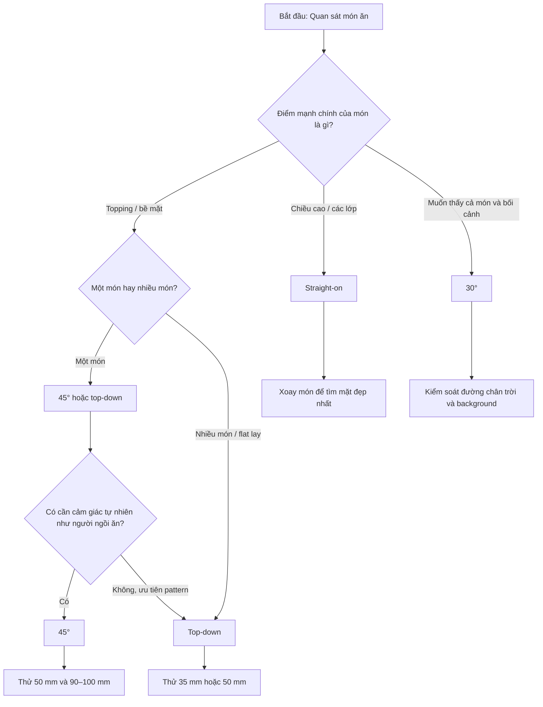

# Sơ đồ quyết định chọn góc máy

## Cách dùng
1. Xác định điểm hấp dẫn nhất của món.
2. Đi theo nhánh tương ứng.
3. Chụp thử ít nhất 2 biến thể gần nhau, ví dụ 35° và 45°.
4. Chỉ đặt tripod sau khi góc đã được chọn.
