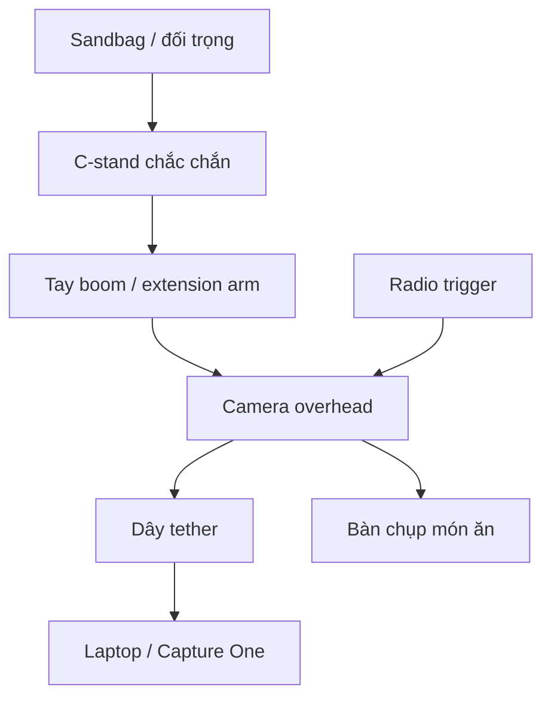

# Sơ đồ — Setup camera overhead

## Lưu ý an toàn

- Không để camera treo trên đầu bàn mà thiếu đối trọng.
- Dùng sandbag cho chân C-stand.
- Dây tether cần có slack.
- Không để khách hàng hoặc nhân viên đi vào vùng chân đèn.
