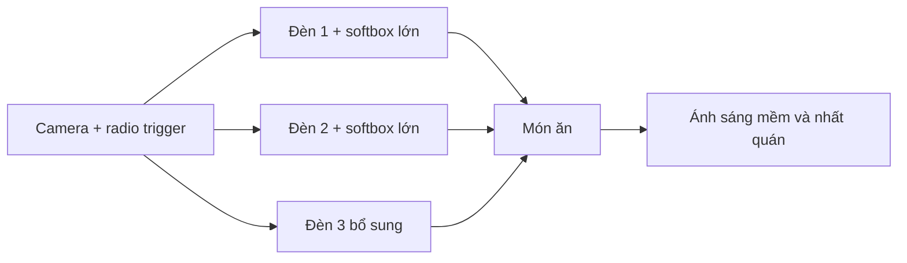

# Sơ đồ — Hệ thống 3 đèn

```mermaid
flowchart LR
    CAM[Camera + radio trigger] --> L1[Đèn 1 + softbox lớn]
    CAM --> L2[Đèn 2 + softbox lớn]
    CAM --> L3[Đèn 3 bổ sung]

    L1 --> FOOD[Món ăn]
    L2 --> FOOD
    L3 --> FOOD

    FOOD --> RESULT[Ánh sáng mềm và nhất quán]
```

## Mục tiêu

Không phải để “chiếu sáng từ mọi hướng”, mà để kiểm soát:

- hướng sáng chính;
- độ sâu của bóng;
- độ bóng của món;
- consistency giữa nhiều shot.
