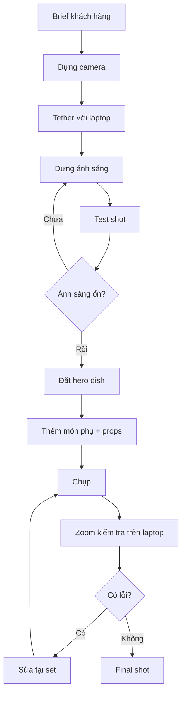

# Sơ đồ — Workflow một buổi chụp

```mermaid
flowchart TD
    A[Brief khách hàng] --> B[Dựng camera]
    B --> C[Tether với laptop]
    C --> D[Dựng ánh sáng]
    D --> E[Test shot]
    E --> F{Ánh sáng ổn?}
    F -- Chưa --> D
    F -- Rồi --> G[Đặt hero dish]
    G --> H[Thêm món phụ + props]
    H --> I[Chụp]
    I --> J[Zoom kiểm tra trên laptop]
    J --> K{Có lỗi?}
    K -- Có --> L[Sửa tại set]
    L --> I
    K -- Không --> M[Final shot]
```
