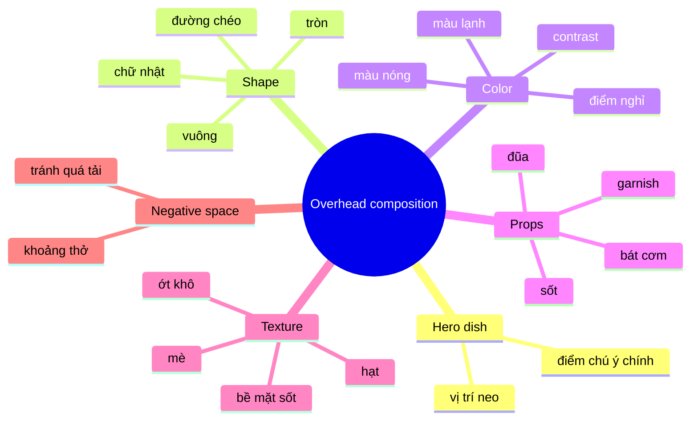

# Sơ đồ — Tư duy bố cục overhead

```mermaid
mindmap
  root((Overhead composition))
    Hero dish
      điểm chú ý chính
      vị trí neo
    Shape
      tròn
      vuông
      chữ nhật
      đường chéo
    Color
      màu nóng
      màu lạnh
      contrast
      điểm nghỉ
    Props
      bát cơm
      sốt
      đũa
      garnish
    Texture
      ớt khô
      hạt
      mè
      bề mặt sốt
    Negative space
      khoảng thở
      tránh quá tải
```
