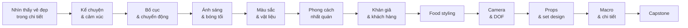

# Bản đồ khóa học

## 5 trụ cột xuyên suốt

### 1. Food photography không chỉ là “chụp món ăn”
Người nói liên tục quay lại một ý: món ăn là **trải nghiệm**. Một bức ảnh tốt cần đánh thức ký ức về mùi, nhiệt, độ giòn, độ chảy, hơi nước, cảm giác cắn hoặc múc.

### 2. Ánh sáng là một thành phần của món ăn trong ảnh
Ánh sáng không chỉ làm “đủ sáng”. Nó tạo hình, tạo bóng, làm chất lỏng phát sáng, làm viền thủy tinh hiện ra, hoặc giúp một vật vốn bình thường trở nên đáng nhìn.

### 3. Câu chuyện quyết định lựa chọn hình ảnh
Từ màu sắc, styling, props, độ sâu trường ảnh đến mức độ “hoàn hảo” của món ăn đều phải phục vụ câu chuyện và khán giả.

### 4. Phong cách đến từ cách nhìn, không chỉ từ preset
Hai người có thể cầm cùng máy ảnh, cùng cài đặt và đứng trước cùng một bàn nhưng tạo ra hai hình khác nhau. Phong cách là cách bạn nhìn, chọn và lặp lại những lựa chọn thị giác có chủ đích.

### 5. Mọi chi tiết đều có lý do
Đĩa, khăn, khay, vết xước, độ lệch của topping, kích thước berry, hơi khói, độ bóng của sốt — đều có thể làm ảnh “đúng” hoặc “sai” về cảm giác.

## Lộ trình thực hành

- **Giai đoạn 1 — Eye training:** Bài 01–03
- **Giai đoạn 2 — Light & material:** Bài 04–05
- **Giai đoạn 3 — Identity & audience:** Bài 06–07
- **Giai đoạn 4 — Styling & execution:** Bài 08–10
- **Giai đoạn 5 — Detail & capstone:** Bài 11–12
