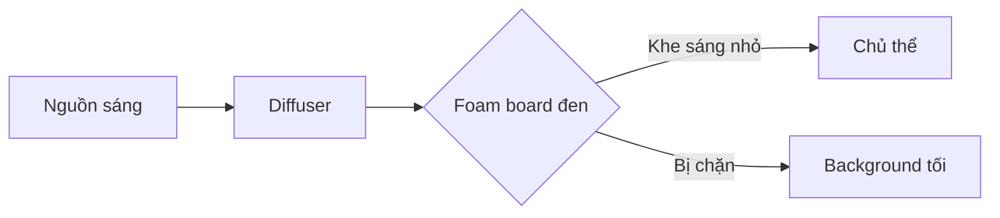
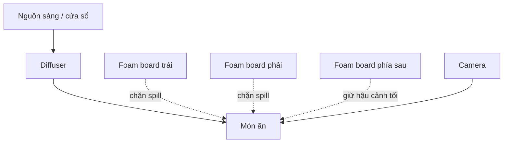
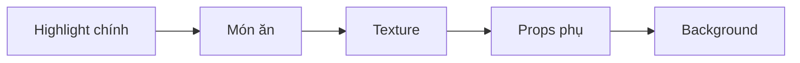
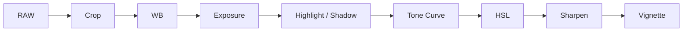
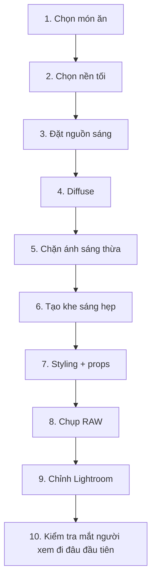

# Khóa học: Dark Food Photography — Chụp ảnh món ăn tông tối

Khóa học được biên soạn từ transcript hướng dẫn thực tế về **dark food photography** bằng ánh sáng liên tục / ánh sáng tự nhiên.

## Mục tiêu khóa học

Sau khi hoàn thành, bạn có thể:

- Hiểu bản chất của ảnh món ăn tông tối.
- Biết cách **hạn chế và định hướng ánh sáng** thay vì chỉ làm ảnh tối đi.
- Tự dựng setup đơn giản bằng cửa sổ, đèn LED, diffuser và foam board đen.
- Chọn background, props và màu sắc để món ăn vẫn là chủ thể chính.
- Biết cách tạo vùng sáng hẹp để dẫn mắt.
- Chỉnh ảnh dark food trong Lightroom theo quy trình có kiểm soát.
- Biết khi nào nên tăng texture, clarity, giảm highlight, tinh chỉnh shadow và HSL.
- Tránh những lỗi thường gặp khiến ảnh tối nhưng “bệt”, mất chi tiết hoặc trông giả.

## Cấu trúc

1. Bài 01 — Dark Food Photography là gì?
2. Bài 02 — Kiểm soát ánh sáng bằng cách giới hạn vùng chiếu
3. Bài 03 — Dựng setup ánh sáng tối bằng thiết bị đơn giản
4. Bài 04 — Styling, props và dẫn mắt bằng vùng sáng
5. Bài 05 — Quy trình chụp thực tế từ setup đến bấm máy
6. Bài 06 — Chỉnh ảnh trong Lightroom
7. Bài 07 — Workflow hoàn chỉnh + checklist thực hành

## Thiết bị gợi ý

Bạn không cần đúng thiết bị trong video. Có thể thay thế:

- Đèn LED liên tục → cửa sổ lớn.
- Diffuser chuyên dụng → rèm trắng / vải trắng mỏng.
- Black foam board → bìa đen / carton sơn đen.
- Barn doors → hai miếng bìa đen đặt hai bên nguồn sáng.
- Máy ảnh → DSLR, mirrorless hoặc điện thoại có chế độ chỉnh tay.

## Nguyên tắc cốt lõi

> Dark food photography không phải là “làm ảnh thật tối”.  
> Nó là **đặt ánh sáng đúng nơi và để phần còn lại chìm vào bóng tối có chủ đích**.

## Sơ đồ toàn khóa học

```mermaid
flowchart LR
    A[Chọn món ăn] --> B[Chọn nền và props tối]
    B --> C[Đặt nguồn sáng]
    C --> D[Khuếch tán ánh sáng]
    D --> E[Chặn ánh sáng bằng foam board]
    E --> F[Tạo khe sáng hẹp]
    F --> G[Đặt highlight lên chủ thể chính]
    G --> H[Chụp RAW]
    H --> I[Crop + cân bằng]
    I --> J[Exposure / Highlight / Shadow]
    J --> K[Tone Curve]
    K --> L[HSL / Color]
    L --> M[Vignette + Sharpen]
    M --> N[Ảnh dark food hoàn chỉnh]
```

---

# TOÀN BỘ BÀI HỌC

---

# Bài 01 — Dark Food Photography là gì?

## 1. Khái niệm

Dark food photography là phong cách chụp món ăn sử dụng:

- nền tối,
- nhiều vùng shadow,
- highlight có kiểm soát,
- ánh sáng tập trung vào món ăn,
- không gian có cảm giác sâu, bí ẩn hoặc cổ điển.

Điểm quan trọng nhất là:

> **Không phải toàn bộ bức ảnh đều tối. Chủ thể vẫn phải được nhìn thấy rõ.**

Một ảnh dark food tốt thường có tương phản thị giác giữa:

- chủ thể chính,
- highlight,
- texture,
- shadow,
- background.

## 2. Điều gì tạo nên cảm giác “dark”?

Không phải chỉ giảm exposure.

Cảm giác dark thường đến từ 4 yếu tố:

1. **Nguồn sáng hẹp**
2. **Nhiều negative fill**
3. **Đạo cụ và background tối**
4. **Hậu kỳ giữ được chi tiết trong bóng**

## 3. Ánh sáng liên tục phù hợp nhất khi nào?

Bài học này tập trung vào:

- ánh sáng cửa sổ,
- LED liên tục,
- đèn studio luôn bật.

Không tập trung vào flash/strobe.

Ưu điểm:

- thấy ngay hướng sáng,
- dễ điều chỉnh,
- dễ quan sát vùng shadow,
- phù hợp người mới học.

## 4. Tư duy quan trọng

Trong ảnh thông thường, người chụp thường cố đưa nhiều ánh sáng vào cảnh.

Trong dark food photography, tư duy ngược lại:

> **Hãy bắt đầu với ít ánh sáng hơn, sau đó cho ánh sáng vào đúng nơi cần thiết.**

## 5. Bài tập

Chọn 5 ảnh dark food trên mạng hoặc trong bộ sưu tập của bạn và tự trả lời:

- Vùng sáng nhất nằm ở đâu?
- Vùng nào chìm vào bóng?
- Chủ thể được nhìn thấy nhờ ánh sáng hay nhờ màu sắc?
- Background có sáng hơn món ăn không?
- Có vật nào đang “tranh spotlight” với món chính không?

---

# Bài 02 — Kiểm soát ánh sáng bằng cách giới hạn vùng chiếu

## 1. Ánh sáng giống như nước

Một hình dung rất hữu ích:

> Ánh sáng giống như nước. Nếu không chặn lại, nó sẽ tràn ra toàn bộ cảnh.

Trong dark food photography, chúng ta muốn:

- giảm ánh sáng tràn,
- chỉ cho ánh sáng đi qua một khe hẹp,
- để highlight rơi đúng vào món ăn.

## 2. Light modifier là gì?

Một số công cụ đơn giản:

- black foam board,
- cờ đen,
- barn doors,
- bìa carton sơn đen,
- V-flat,
- tấm chắn sáng nhỏ.

Mục tiêu của chúng là:

- chặn ánh sáng không mong muốn,
- thu hẹp vùng sáng,
- tạo shadow sâu hơn,
- tách chủ thể khỏi background.

## 3. Negative fill

Negative fill là kỹ thuật dùng vật liệu tối để **hấp thụ ánh sáng phản xạ**.

Ví dụ:

- đặt một tấm foam board đen sát bên món ăn,
- giảm lượng ánh sáng phản hồi vào vùng shadow,
- tạo chiều sâu cho vật thể.

## 4. Tạo khe sáng hẹp

Thay vì chiếu sáng cả bàn:

- đặt hai tấm chắn,
- chừa một khe nhỏ,
- để ánh sáng chỉ lọt qua vùng cần thiết.

## 5. Điều cần quan sát

Khi di chuyển tấm chắn vài centimet, hãy nhìn:

- highlight trên món ăn có thay đổi không?
- vùng shadow có sâu hơn không?
- background có bị sáng lên không?
- đạo cụ có nổi bật hơn món chính không?

## 6. Nguyên tắc

Không cố “làm tất cả tối”.

Hãy tìm:

> **Một vùng sáng đẹp nhất để kể câu chuyện về món ăn.**

---

# Bài 03 — Dựng setup ánh sáng tối bằng thiết bị đơn giản

## 1. Setup cơ bản

Bạn cần:

- 1 nguồn sáng liên tục hoặc cửa sổ,
- 1 lớp diffusion,
- 2–4 tấm foam board đen,
- background tối,
- tabletop tối,
- món ăn.

## 2. Sơ đồ setup

## 3. Diffusion

Nếu ánh sáng quá gắt:

- thêm diffuser,
- kéo rèm trắng,
- dùng softbox,
- tăng khoảng cách giữa nguồn sáng và chủ thể nếu cần.

Mục tiêu là:

- highlight mềm,
- texture vẫn rõ,
- transition từ sáng sang tối mượt.

## 4. Tạo “hộp ánh sáng tối”

Bạn có thể dùng 3 tấm foam board:

- một bên trái,
- một bên phải,
- một phía sau.

Sau đó để một khe sáng nhỏ đi vào chủ thể.

Kết quả:

- ánh sáng ít bị spill,
- background tối tự nhiên,
- món ăn có chiều sâu.

## 5. Không cần thiết bị đắt tiền

Bạn có thể thay:

| Thiết bị studio | Thay thế tại nhà |
|---|---|
| LED panel | Cửa sổ |
| Diffuser | Rèm trắng |
| Foam board | Bìa carton đen |
| Barn door | Hai miếng bìa đen |
| V-flat | Hai tấm carton ghép chữ V |

## 6. Thực hành

Hãy dựng cùng một món ăn theo 3 cách:

1. không dùng foam board,
2. dùng 1 tấm,
3. dùng 3 tấm.

So sánh:

- độ sâu shadow,
- độ sáng background,
- mức độ tập trung vào món ăn.

---

# Bài 04 — Styling, props và dẫn mắt bằng vùng sáng

## 1. Món ăn phải là vùng được chú ý đầu tiên

Nếu một chiếc ramekin trắng sáng hơn món ăn, mắt người xem sẽ nhìn vào ramekin trước.

Vì vậy, trong ảnh dark food:

- ưu tiên props tối,
- ưu tiên bề mặt matte,
- tránh vật quá trắng hoặc phản xạ mạnh,
- chỉ dùng vật sáng khi nó có vai trò kể chuyện.

## 2. Chọn props

Gợi ý:

- đĩa đen / xám,
- khăn tối,
- gỗ cũ,
- thìa kim loại xỉn,
- gốm matte,
- nền vải tối.

## 3. Props phải kể chuyện

Trong ví dụ chocolate truffle:

- cacao powder → kể cách truffle được phủ cacao,
- chocolate chip → gợi nguyên liệu,
- bề mặt gỗ → tăng cảm giác thủ công.

Đạo cụ không nên tồn tại chỉ để “lấp đầy khung hình”.

## 4. Dẫn mắt bằng ánh sáng

Thứ tự thị giác nên gần giống:

Nếu props phụ sáng hơn món chính, thứ tự này bị đảo ngược.

## 5. Chỉ chiếu sáng một phần món ăn

Không nhất thiết toàn bộ món phải sáng đều.

Có thể:

- sáng mặt trước,
- tối dần về sau,
- giữ rim light mỏng ở cạnh,
- để một số phần chìm nhẹ vào bóng.

Điều này tạo chiều sâu.

## 6. Bài tập

Với cùng một món ăn, chụp 3 phiên bản:

- món sáng hoàn toàn,
- sáng 50%,
- chỉ một vùng highlight nhỏ.

Chọn phiên bản có cảm giác hấp dẫn và có chiều sâu nhất.

---

# Bài 05 — Quy trình chụp thực tế từ setup đến bấm máy

## 1. Trình tự đề xuất

1. Chọn background.
2. Đặt món ăn.
3. Đặt nguồn sáng.
4. Khuếch tán.
5. Thêm foam board.
6. Thu hẹp vùng sáng.
7. Di chuyển món ăn vào vùng highlight đẹp.
8. Kiểm tra props phụ.
9. Chụp RAW.
10. Điều chỉnh nhỏ rồi chụp lại.

## 2. Đừng bắt đầu bằng camera setting

Trong dark food photography, ánh sáng quan trọng hơn việc “đoán thông số”.

Ưu tiên:

- vị trí nguồn sáng,
- khoảng cách,
- độ rộng khe sáng,
- hướng ánh sáng,
- vị trí món.

Sau đó mới tinh chỉnh:

- ISO,
- shutter,
- aperture.

## 3. Quan sát highlight

Highlight đẹp nên:

- không cháy,
- không quá rộng,
- làm lộ texture,
- chỉ vào đúng phần ngon nhất của món.

## 4. Kiểm tra background

Nếu background quá sáng:

- kéo foam board lại gần,
- giảm spill,
- đổi góc nguồn sáng,
- tăng khoảng cách giữa chủ thể và background.

## 5. Chụp nhiều biến thể

Đừng dừng ở ảnh đầu tiên.

Thử:

- dịch món ăn 2–3 cm,
- dịch foam board,
- đổi góc máy,
- xoay đĩa,
- đổi vị trí props.

Dark food photography rất nhạy với những thay đổi nhỏ.

## 6. Checklist trước khi bấm máy

- [ ] Chủ thể là vùng sáng nhất?
- [ ] Highlight không cháy?
- [ ] Shadow còn texture?
- [ ] Props không tranh spotlight?
- [ ] Background đủ tối?
- [ ] Góc máy kể đúng câu chuyện?
- [ ] Có chi tiết phụ dẫn mắt nhưng không gây rối?

---

# Bài 06 — Chỉnh ảnh Dark Food trong Lightroom

## 1. Bước 1 — Cân lại khung hình

Trước tiên:

- crop,
- straighten,
- sửa horizon,
- loại vùng thừa.

## 2. Bước 2 — White Balance

Ảnh dark food thường hợp với cảm giác hơi lạnh hơn một chút, nhưng không phải lúc nào cũng vậy.

Mục tiêu:

- giữ màu món ăn tự nhiên,
- không để chocolate thành xám,
- không để gỗ chuyển xanh quá mức.

## 3. Bước 3 — Exposure

Không tăng exposure quá nhiều.

Ảnh dark food cần giữ được:

- vùng tối,
- độ sâu,
- contrast tự nhiên.

## 4. Bước 4 — Highlights và Shadows

Workflow tham khảo:

- Highlights: giảm nhẹ
- Shadows: tăng vừa phải
- Whites: tăng để lấy lại điểm sáng
- Blacks: không nhất thiết kéo xuống cực mạnh

Mục tiêu:

> Giữ shadow nhưng vẫn có thông tin.

## 5. Bước 5 — Clarity / Texture

Có thể tăng nhẹ clarity hoặc texture để:

- cacao rõ hơn,
- vỏ bánh rõ hơn,
- chocolate có texture,
- bề mặt gỗ sống động hơn.

Không nên tăng quá nhiều vì ảnh sẽ thô và “HDR”.

## 6. Bước 6 — Tone Curve

Tone Curve là phần quan trọng.

Một workflow phổ biến:

- nâng black point nhẹ → vintage / matte,
- giữ midtone,
- hạ shadow có kiểm soát,
- giữ highlight đủ sáng.

## 7. Bước 7 — HSL

Dark food thường dùng HSL để “làm giàu màu”.

Ví dụ:

### Blue
- giảm luminance,
- giảm saturation nếu quá mạnh.

### Orange / Brown
- giảm luminance nhẹ,
- tăng saturation nhẹ nếu món cần cảm giác ấm và ngon hơn.

### Yellow
- giảm luminance nếu background hoặc gỗ quá sáng.

## 8. Bước 8 — Sharpening + Masking

Tăng sharpen nhưng dùng masking để chỉ làm nét:

- viền món ăn,
- texture cần thiết,
- topping,
- bề mặt chính.

Không nên sharpen toàn bộ shadow và background.

## 9. Bước 9 — Vignette

Vignette giúp:

- kéo mắt vào trung tâm,
- làm tiền cảnh và rìa khung tối hơn.

Nhưng chỉ nên dùng nhẹ.

Nếu nhìn thấy “vòng tối nhân tạo”, bạn đã đi quá xa.

## 10. Quy tắc cuối

Mục tiêu hậu kỳ không phải biến ảnh sáng thành ảnh tối.

Mục tiêu là:

> **Củng cố cấu trúc ánh sáng đã tạo từ lúc chụp.**

---

# Bài 07 — Workflow hoàn chỉnh + checklist thực hành

## Workflow 10 bước

## Checklist ánh sáng

- [ ] Nguồn sáng có hướng rõ?
- [ ] Ánh sáng có bị spill quá nhiều?
- [ ] Có cần thêm foam board?
- [ ] Highlight có đúng vị trí?
- [ ] Shadow còn chi tiết?

## Checklist styling

- [ ] Props có tối hơn hoặc ít nổi bật hơn món chính?
- [ ] Có vật trắng sáng gây phân tâm?
- [ ] Đạo cụ có kể câu chuyện?
- [ ] Có khoảng thở trong bố cục?

## Checklist Lightroom

- [ ] Crop / straighten
- [ ] White balance
- [ ] Exposure
- [ ] Highlights
- [ ] Shadows
- [ ] Whites
- [ ] Blacks
- [ ] Clarity / Texture
- [ ] Tone Curve
- [ ] HSL
- [ ] Sharpening
- [ ] Vignette

## Những lỗi thường gặp

### Lỗi 1 — Chỉ kéo exposure xuống

Kết quả:

- ảnh tối nhưng bệt,
- món ăn không hấp dẫn,
- texture mất.

**Cách sửa:** kiểm soát ánh sáng ngay từ lúc chụp.

### Lỗi 2 — Background tối nhưng món cũng tối như nhau

**Cách sửa:** tạo vùng highlight rõ trên chủ thể.

### Lỗi 3 — Props sáng hơn món ăn

**Cách sửa:** dùng props tối hoặc giảm ánh sáng trên props.

### Lỗi 4 — Shadow đen hoàn toàn

**Cách sửa:** tăng shadow nhẹ hoặc thay đổi negative fill.

### Lỗi 5 — Vignette quá mạnh

**Cách sửa:** giảm mức vignette, ưu tiên darkening tự nhiên bằng ánh sáng.

## Bài tập cuối khóa

Chụp một món có nhiều texture, ví dụ:

- chocolate truffle,
- bánh brownie,
- steak,
- mì sốt đậm,
- cà phê,
- món hầm.

Yêu cầu:

1. Chỉ dùng 1 nguồn sáng.
2. Có ít nhất 2 tấm foam board đen.
3. Tạo một khe sáng hẹp.
4. Props phải tối hơn món chính.
5. Chụp RAW.
6. Chỉnh Lightroom theo bài 06.
7. Xuất:
   - ảnh trước chỉnh,
   - ảnh sau chỉnh,
   - ảnh setup hậu trường.

## Tiêu chí tự chấm

| Tiêu chí | Điểm |
|---|---:|
| Ánh sáng có chủ đích | /10 |
| Món ăn nổi bật | /10 |
| Shadow có chiều sâu | /10 |
| Props hỗ trợ câu chuyện | /10 |
| Texture món ăn | /10 |
| Hậu kỳ tự nhiên | /10 |
| Màu sắc hài hòa | /10 |
| Bố cục | /10 |
| Không bị “đen bệt” | /10 |
| Tổng thể hấp dẫn | /10 |

**Tổng: /100**
