# Khóa học: Dark Food Photography — Chụp ảnh món ăn tông tối

Khóa học được biên soạn từ transcript hướng dẫn thực tế về **dark food photography** bằng ánh sáng liên tục / ánh sáng tự nhiên.

## Mục tiêu khóa học

Sau khi hoàn thành, bạn có thể:

- Hiểu bản chất của ảnh món ăn tông tối.
- Biết cách **hạn chế và định hướng ánh sáng** thay vì chỉ làm ảnh tối đi.
- Tự dựng setup đơn giản bằng cửa sổ, đèn LED, diffuser và foam board đen.
- Chọn background, props và màu sắc để món ăn vẫn là chủ thể chính.
- Biết cách tạo vùng sáng hẹp để dẫn mắt.
- Chỉnh ảnh dark food trong Lightroom theo quy trình có kiểm soát.
- Biết khi nào nên tăng texture, clarity, giảm highlight, tinh chỉnh shadow và HSL.
- Tránh những lỗi thường gặp khiến ảnh tối nhưng “bệt”, mất chi tiết hoặc trông giả.

## Cấu trúc

1. Bài 01 — Dark Food Photography là gì?
2. Bài 02 — Kiểm soát ánh sáng bằng cách giới hạn vùng chiếu
3. Bài 03 — Dựng setup ánh sáng tối bằng thiết bị đơn giản
4. Bài 04 — Styling, props và dẫn mắt bằng vùng sáng
5. Bài 05 — Quy trình chụp thực tế từ setup đến bấm máy
6. Bài 06 — Chỉnh ảnh trong Lightroom
7. Bài 07 — Workflow hoàn chỉnh + checklist thực hành

## Thiết bị gợi ý

Bạn không cần đúng thiết bị trong video. Có thể thay thế:

- Đèn LED liên tục → cửa sổ lớn.
- Diffuser chuyên dụng → rèm trắng / vải trắng mỏng.
- Black foam board → bìa đen / carton sơn đen.
- Barn doors → hai miếng bìa đen đặt hai bên nguồn sáng.
- Máy ảnh → DSLR, mirrorless hoặc điện thoại có chế độ chỉnh tay.

## Nguyên tắc cốt lõi

> Dark food photography không phải là “làm ảnh thật tối”.  
> Nó là **đặt ánh sáng đúng nơi và để phần còn lại chìm vào bóng tối có chủ đích**.

## Sơ đồ toàn khóa học

```mermaid
flowchart LR
    A[Chọn món ăn] --> B[Chọn nền và props tối]
    B --> C[Đặt nguồn sáng]
    C --> D[Khuếch tán ánh sáng]
    D --> E[Chặn ánh sáng bằng foam board]
    E --> F[Tạo khe sáng hẹp]
    F --> G[Đặt highlight lên chủ thể chính]
    G --> H[Chụp RAW]
    H --> I[Crop + cân bằng]
    I --> J[Exposure / Highlight / Shadow]
    J --> K[Tone Curve]
    K --> L[HSL / Color]
    L --> M[Vignette + Sharpen]
    M --> N[Ảnh dark food hoàn chỉnh]
```

