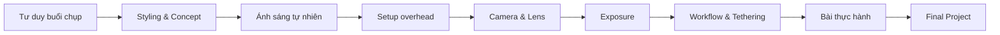

# Khóa học: Food Photography với ánh sáng tự nhiên

## Mục tiêu khóa học

Khóa học này được xây dựng lại từ một buổi hậu trường chụp ảnh món ăn bằng ánh sáng tự nhiên. Nội dung tập trung vào **cách tư duy và ra quyết định** trong một buổi chụp thực tế, thay vì chỉ liệt kê thiết bị.

Sau khi hoàn thành, bạn có thể:

- Phân tích một buổi chụp theo khung **Ai – Chụp gì – Khi nào – Ở đâu – Tại sao – Như thế nào**.
- Chọn và kiểm soát ánh sáng tự nhiên từ cửa sổ.
- Phân biệt ánh sáng trực tiếp, gián tiếp, cứng và mềm.
- Chọn góc chiếu sáng phù hợp cho ảnh flat lay / overhead.
- Dùng black card / negative fill để điều hướng mắt người xem.
- Phối hợp với food stylist hoặc tự styling món ăn có chủ đích.
- Chọn máy ảnh, ống kính và thông số phơi sáng hợp lý.
- Tạo workflow chụp – kiểm tra – chỉnh bố cục – chụp lại.
- Tự dựng một set chụp món ăn bằng thiết bị tối giản.

## Đối tượng phù hợp

- Người mới học food photography.
- Content creator chụp món ăn cho TikTok, Instagram, website hoặc menu.
- Nhiếp ảnh gia muốn hiểu workflow chụp món ăn với ánh sáng cửa sổ.
- Food stylist muốn hiểu cách ánh sáng và bố cục ảnh hưởng đến cách trình bày món.

## Cấu trúc khóa học

1. [Bài 01 – Tư duy hậu trường: Ai, Cái gì, Khi nào, Ở đâu, Tại sao, Như thế nào](lessons/01-tu-duy-hau-truong.md)
2. [Bài 02 – Làm việc với food stylist và xây dựng ngôn ngữ hình ảnh](lessons/02-food-stylist-va-collaboration.md)
3. [Bài 03 – Concept, màu sắc, nguyên liệu và đạo cụ](lessons/03-concept-mau-sac-dao-cu.md)
4. [Bài 04 – Nền tảng ánh sáng tự nhiên cho food photography](lessons/04-anh-sang-tu-nhien.md)
5. [Bài 05 – Setup overhead và kiểm soát ánh sáng bằng black card](lessons/05-overhead-black-card.md)
6. [Bài 06 – Chọn máy ảnh, ống kính và tiêu cự](lessons/06-camera-lens.md)
7. [Bài 07 – Cài đặt phơi sáng: khẩu độ, tốc độ, ISO](lessons/07-exposure-settings.md)
8. [Bài 08 – Workflow chụp, tethering và tinh chỉnh set](lessons/08-workflow-tethering.md)
9. [Bài 09 – Bài thực hành: tái tạo một ảnh kebab bằng ánh sáng tự nhiên](lessons/09-thuc-hanh-kebab.md)
10. [Bài 10 – Checklist và xử lý lỗi thường gặp](lessons/10-checklist-troubleshooting.md)

## Tài nguyên bổ sung

- [Glossary thuật ngữ](resources/glossary.md)
- [Cheat sheet ánh sáng tự nhiên](resources/natural-light-cheatsheet.md)
- [Bài tập cuối khóa](assignments/final-project.md)

## Lộ trình học đề xuất

## Cách học hiệu quả

Mỗi bài nên đi theo 4 bước:

1. Đọc phần lý thuyết.
2. Quan sát sơ đồ hoặc setup mẫu.
3. Thực hiện bài tập nhỏ cuối bài.
4. Ghi lại ảnh chụp thử và nhận xét: **điểm nào hiệu quả, điểm nào cần sửa, vì sao**.

> Tinh thần chính của khóa học: thiết bị tốt có thể giúp workflow thuận tiện hơn, nhưng **không phải điều kiện bắt buộc để tạo ra ảnh món ăn tốt**.
