# 001 - Vai trò và hướng đi Game Developer

**Module:** Module 01 - Tổng quan Game Developer
**Roadmap item:** 1.1
**Nhóm nội dung:** Game AI
**Thứ tự trong module:** 001
**Thời lượng gợi ý:** 40–55 phút

---

## 1. Tóm tắt

**Game Developer** là người tham gia xây dựng phần mềm vận hành một trò chơi: từ điều khiển nhân vật, combat, UI, AI của NPC cho đến rendering, physics, networking và các công cụ hỗ trợ đội phát triển.

Trong dự án nhỏ, một Game Developer có thể đảm nhiệm nhiều phần cùng lúc. Trong studio lớn, công việc thường được chuyên môn hóa thành các hướng như **Gameplay Programmer, Engine Programmer, Graphics Programmer, Physics Programmer, AI Programmer, Multiplayer/Backend Developer** hoặc **Technical Artist**.

Unity cung cấp các lộ trình học riêng cho lập trình viên, creative/technical skills và portfolio; Unreal Engine cũng tách các hệ thống gameplay, rendering, physics và AI thành những nhóm kỹ thuật riêng.


*Minh họa: môi trường làm việc của Game Developer với game engine, code và asset.*

### Sau bài này bạn cần trả lời được

> **"Mình muốn trở thành loại Game Developer nào và cần học những gì để đi theo hướng đó?"**

Bài học vẫn thuộc nhóm **Game AI**, vì vậy phần thực hành cuối bài sẽ sử dụng **Enemy AI: Patrol → Chase → Attack → Flee** làm prototype đầu tiên.

---

## 2. Mục tiêu học tập

Sau khi hoàn thành bài học, bạn có thể:

* Giải thích Game Developer làm gì trong một dự án game.
* Phân biệt **client-side** và **server-side game development**.
* Nhận biết những hướng chuyên sâu phổ biến trong lập trình game.
* Hiểu vị trí của **Game AI Programmer** trong đội phát triển.
* Phân biệt sơ bộ:

  * Rule-based AI.
  * Finite State Machine.
  * Behavior Tree.
  * Search/Pathfinding.
  * Learning-based AI.
* Xây dựng một enemy AI nhỏ có:

  * Patrol.
  * Chase.
  * Attack.
  * Flee.
* Biểu diễn logic NPC bằng sơ đồ.
* Viết test case cho hành vi AI.
* Tạo artifact có thể đưa lên GitHub hoặc portfolio.

Unity hiện có lộ trình **Junior Programmer** dành cho người muốn học lập trình và chuẩn bị cho các vị trí entry-level liên quan đến Unity.


---

## 3. Nội dung roadmap

## 3.1. Game Developer là gì?

Game Developer biến thiết kế game thành một hệ thống có thể chạy được.

Ví dụ Game Designer đưa ra yêu cầu:

> Enemy nhìn thấy player trong phạm vi 15 m thì đuổi theo.
> Nếu đến gần dưới 2 m thì tấn công.
> Nếu HP còn dưới 20% thì bỏ chạy.

Game Developer phải chuyển yêu cầu đó thành:

```text
Input / Game State
        ↓
Perception
        ↓
Decision
        ↓
Movement / Action
        ↓
Animation + VFX + Audio
        ↓
Kết quả Gameplay
```

Đằng sau một hành động đơn giản như enemy đuổi player có thể liên quan đến:

* Collision.
* Transform.
* Character Controller.
* Animation.
* Pathfinding.
* AI decision.
* Combat.
* Damage system.
* Networking.
* Audio.
* VFX.
* Performance.

### Một game thực tế có thể được nhìn dưới dạng

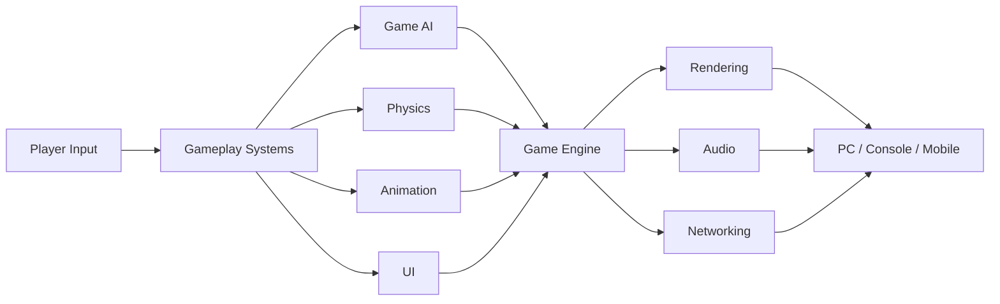

Game engine chính là lớp tích hợp nhiều subsystem như rendering, physics, gameplay, AI và asset management vào cùng một runtime/editor. Unreal Engine, chẳng hạn, cung cấp riêng các hệ thống rendering, physics, AI, VFX và gameplay.


---

# 3.2. Client-side Game Development

**Client** là phần game chạy trên thiết bị của người chơi.

Ví dụ:

```text
PC
PlayStation
Xbox
Nintendo Switch
Android
iPhone
        ↓
      CLIENT
```

Client thường chịu trách nhiệm cho những phần người chơi trực tiếp nhìn thấy và tương tác:

| Thành phần           | Ví dụ                           |
| -------------------- | ------------------------------- |
| Input                | WASD, joystick, touch           |
| Character Controller | chạy, nhảy, né                  |
| Camera               | FPS camera, third-person camera |
| UI                   | HP bar, inventory               |
| Animation            | run, attack, hit                |
| Audio                | footsteps, weapon sound         |
| VFX                  | explosion, spell                |
| Rendering            | model, lighting, shader         |
| Client prediction    | dự đoán chuyển động multiplayer |

Ví dụ:

```text
Player nhấn W
      ↓
Input System
      ↓
Character Controller
      ↓
Movement
      ↓
Animation
      ↓
Camera
      ↓
Render Frame
```

### Công nghệ thường gặp

```text
Unity
 └── C#

Unreal Engine
 ├── C++
 └── Blueprint

Godot
 ├── GDScript
 ├── C#
 └── C++
```

---

# 3.3. Server-side Game Development

Game multiplayer thường cần một hệ thống chịu trách nhiệm đồng bộ nhiều người chơi.

Ví dụ:

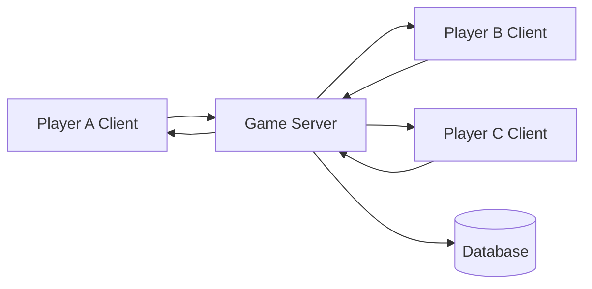

Server có thể xử lý:

* Match state.
* Player state.
* Combat validation.
* Position synchronization.
* Matchmaking.
* Inventory.
* Leaderboard.
* Account.
* Database.
* Anti-cheat logic.
* Session management.

Trong hệ thống multiplayer hiện đại, mô hình **server-authoritative** thường được sử dụng để server giữ quyền quyết định trạng thái gameplay quan trọng. Unity Netcode for Entities, chẳng hạn, cung cấp mô hình server-authoritative cùng client prediction.

### Ví dụ

Player gửi:

```json
{
  "action": "shoot",
  "direction": [0.2, 0.0, 0.9]
}
```

Không nên chỉ để client gửi:

```json
{
  "enemyKilled": true
}
```

Server nên kiểm tra:

```text
Player có súng?
      ↓
Có đạn?
      ↓
Có thể bắn lúc này?
      ↓
Raycast có trúng?
      ↓
Damage hợp lệ?
      ↓
Server cập nhật HP
```

---

# 3.4. Các hướng chuyên sâu của Game Developer

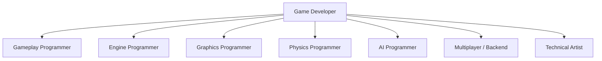

---

## 3.4.1. Gameplay Programmer

Gameplay Programmer xây dựng những thứ trực tiếp tạo thành **gameplay loop**.

Ví dụ:

```text
Movement
Combat
Weapon
Ability
Inventory
Quest
Interaction
Character
Camera
Puzzle
Vehicle
```

Ví dụ với game action RPG:

```text
Player
 ├── Movement
 ├── Dodge
 ├── Attack
 ├── Skill
 ├── Weapon
 ├── Damage
 └── Inventory
```

### Kiến thức quan trọng

* C# hoặc C++.
* OOP.
* Data structures.
* Vector math.
* State machine.
* Event system.
* Game loop.
* Animation integration.
* Physics cơ bản.
* Debugging.

### Prototype portfolio phù hợp

> Third-person combat prototype.

Có:

* Run.
* Dodge.
* Light attack.
* Heavy attack.
* HP.
* Enemy.
* Damage.
* Camera.

---

# 3.4.2. Engine Programmer

Engine Programmer làm việc gần phần lõi của game engine hơn.

Ví dụ:

```text
Game
 ↓
Gameplay Framework
 ↓
Engine Systems
 ↓
Rendering / Physics / Audio
 ↓
OS
 ↓
CPU / GPU
```

Công việc có thể liên quan đến:

* Memory management.
* Asset loading.
* Scene system.
* ECS.
* Serialization.
* Multithreading.
* Runtime.
* Editor tools.
* Build pipeline.
* Platform abstraction.

### Kiến thức nên mạnh

```text
C++
Data Structures
Algorithms
Memory
Pointers
CPU
Cache
Multithreading
Operating Systems
Profiling
```

Đây thường là một trong những hướng có yêu cầu kiến thức Computer Science thấp tầng cao nhất.

---

# 3.4.3. Graphics Programmer

Graphics Programmer tập trung vào cách thế giới game được biến thành hình ảnh trên màn hình.

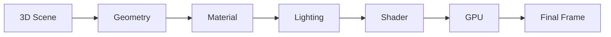

Công việc có thể liên quan đến:

* Rendering pipeline.
* Shader.
* Lighting.
* Shadow.
* GPU optimization.
* Post-processing.
* Ray tracing.
* Culling.
* Material system.
* Particle rendering.

Tài liệu Unreal dành riêng một nhóm **Graphics Programming** cho rendering systems và shader development; engine cũng có Render Hardware Interface để trừu tượng hóa graphics API theo nền tảng.


### Kiến thức quan trọng

* Linear Algebra.
* Vector.
* Matrix.
* Coordinate systems.
* C++.
* HLSL/GLSL.
* GPU architecture.
* DirectX/Vulkan/OpenGL/Metal.
* Rendering pipeline.

---

# 3.4.4. Physics Programmer

Physics Programmer xây dựng hoặc mở rộng các hệ thống mô phỏng vật lý.

Ví dụ:

```text
Gravity
Collision
Rigid Body
Vehicle
Ragdoll
Cloth
Destruction
Fluid
Constraint
```

Unreal Engine hiện sử dụng hệ thống Chaos cho nhiều bài toán như rigid-body dynamics, destruction, ragdoll, vehicles, cloth và networked physics.


### Kiến thức cần mạnh

* Vector.
* Matrix.
* Calculus cơ bản.
* Mechanics.
* Collision detection.
* Numerical methods.
* C++.
* Optimization.

---

# 3.4.5. AI Programmer

Đây là hướng quan trọng nhất đối với nhóm nội dung **Game AI** trong roadmap này.

AI Programmer xây dựng hệ thống khiến NPC có thể:

```text
Quan sát
   ↓
Hiểu trạng thái
   ↓
Ra quyết định
   ↓
Di chuyển
   ↓
Thực hiện hành động
```

Ví dụ:

```text
Enemy nhìn thấy Player
        ↓
Player ở xa?
        ↓ Yes
      CHASE
        ↓
Player đủ gần?
        ↓ Yes
      ATTACK
        ↓
Enemy HP < 20%?
        ↓ Yes
       FLEE
```

### Một Game AI thường gồm

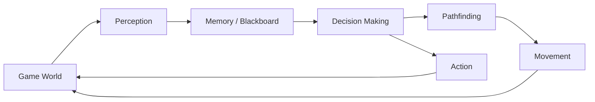

---

## Rule-based AI

Dạng đơn giản nhất:

```csharp
if (canSeePlayer)
{
    ChasePlayer();
}
else
{
    Patrol();
}
```

Ưu điểm:

* Dễ hiểu.
* Dễ debug.
* Tốt cho prototype.

Nhược điểm:

* Nhanh trở nên rối khi số lượng điều kiện tăng.

---

## Finite State Machine

Ví dụ enemy:

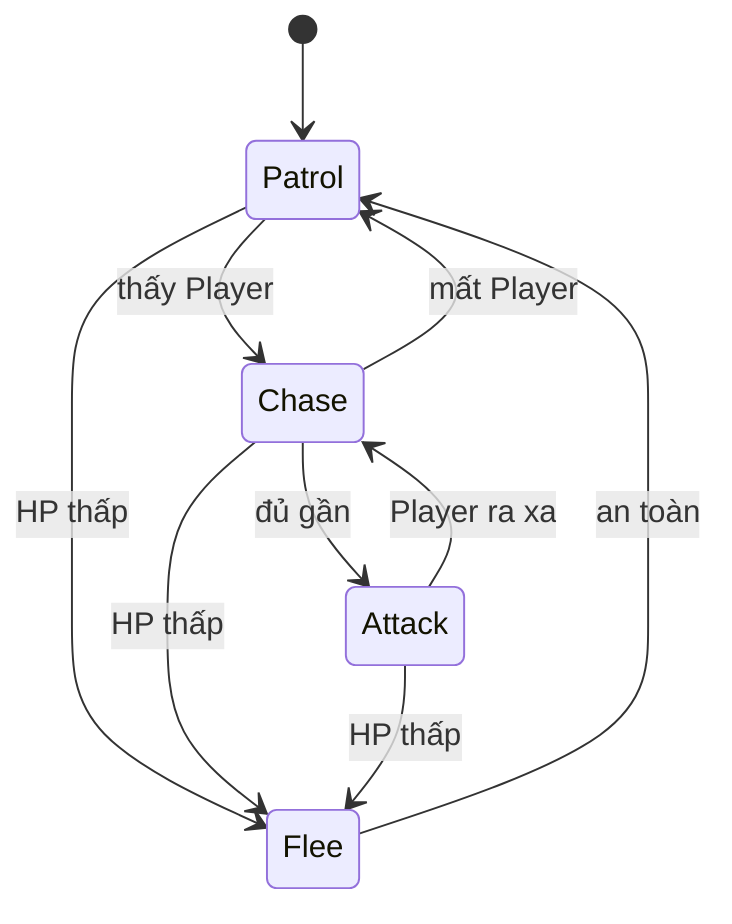

Một FSM thực tế có thể có:

```text
Idle
Patrol
Investigate
Search
Chase
Attack
TakeCover
Flee
Dead
```


---

## Behavior Tree

Behavior Tree phù hợp khi hành vi bắt đầu phức tạp hơn.

Ví dụ:

```text
ROOT
 │
 Selector
 ├── Sequence
 │   ├── Player Visible?
 │   ├── In Attack Range?
 │   └── Attack
 │
 ├── Sequence
 │   ├── Player Visible?
 │   └── Chase
 │
 └── Patrol
```

Unreal Engine có Behavior Tree và Blackboard tích hợp. Blackboard lưu thông tin AI cần sử dụng, trong khi Behavior Tree quyết định nhánh logic nào được thực thi.


Epic cũng cung cấp ví dụ chính thức về AI chuyển giữa **patrol** và **chase** dựa trên việc có nhìn thấy player hay không.

---

## Search AI và Pathfinding

AI cần tìm cách di chuyển:

```text
Start
  ↓
A → B → C
    ↓
Obstacle
    ↓
D → E → Goal
```

Các thuật toán thường gặp:

```text
Breadth-First Search
Dijkstra
A*
```

Trong game 3D, NavMesh thường được sử dụng để mô tả vùng mà agent có thể di chuyển.

Unity AI Navigation cung cấp các thành phần để tạo **NavMesh, agent, links và obstacles** phục vụ navigation/pathfinding.

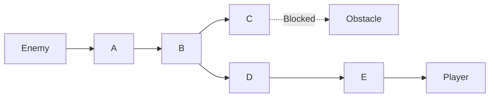

---

## Learning-based AI

Learning-based AI sử dụng dữ liệu hoặc quá trình training để học một policy/thói quen thay vì định nghĩa toàn bộ logic bằng các rule cố định.

Có thể gặp trong:

* Reinforcement Learning.
* Imitation Learning.
* Neural Network agents.
* Adaptive difficulty.
* Game research.

Không phải NPC nào cũng cần Machine Learning.

Ví dụ guard đơn giản:

```text
Patrol
Chase
Attack
```

thường có thể giải quyết rõ ràng bằng FSM hoặc Behavior Tree.

---

# 3.4.6. Multiplayer / Backend Game Developer

Developer hướng này xử lý:

```text
Networking
Lobby
Matchmaking
Replication
Dedicated Server
Authentication
Database
Leaderboard
Inventory
Cloud Save
```

Unity hiện cung cấp các networking solution như **Netcode for GameObjects** và **Netcode for Entities**, cùng các Multiplayer Services phục vụ session, relay và các workflow multiplayer khác.

Ví dụ kiến trúc:

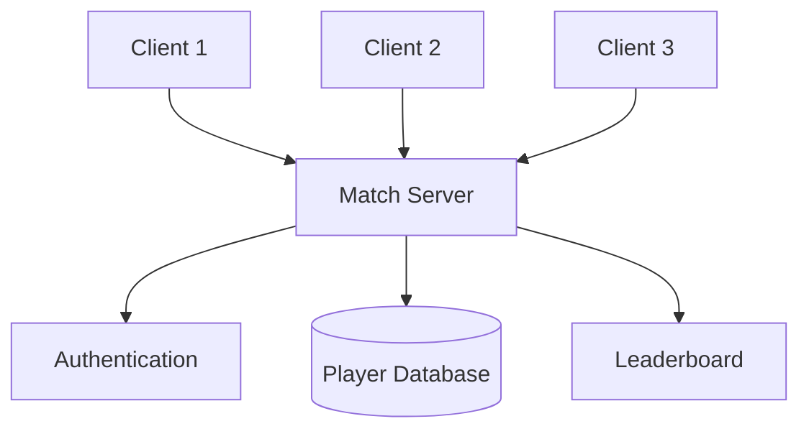

### Kiến thức quan trọng

* Networking.
* TCP/UDP.
* Client/server architecture.
* Latency.
* Prediction.
* Interpolation.
* Replication.
* Databases.
* Backend services.
* Security.

---

# 3.4.7. Technical Artist

Technical Artist nằm ở vùng giao nhau giữa:

```text
ART ←──── Technical Artist ────→ PROGRAMMING
```

Một Technical Artist có thể làm:

* Shader.
* Material.
* VFX.
* Procedural tools.
* Animation pipeline.
* Rigging tools.
* Asset optimization.
* Editor tools.
* Performance profiling.
* Automation cho artist.

Ví dụ:

```text
3D Artist
   ↓
High-poly model
   ↓
Technical Artist
   ├── LOD
   ├── Shader
   ├── Material
   ├── Rig
   ├── Optimization
   └── Import Pipeline
            ↓
          Game
```

Đây là hướng rất phù hợp với người vừa thích **đồ họa/3D** vừa thích **lập trình**.

---

# 3.5. So sánh nhanh các hướng

| Hướng            | Làm nhiều với       |  Toán |  Code | Hệ thống |
| ---------------- | ------------------- | ----: | ----: | -------: |
| Gameplay         | mechanic, character |    ⭐⭐ |  ⭐⭐⭐⭐ |      ⭐⭐⭐ |
| Engine           | engine core         |   ⭐⭐⭐ | ⭐⭐⭐⭐⭐ |    ⭐⭐⭐⭐⭐ |
| Graphics         | rendering, shader   | ⭐⭐⭐⭐⭐ |  ⭐⭐⭐⭐ |     ⭐⭐⭐⭐ |
| Physics          | simulation          | ⭐⭐⭐⭐⭐ |  ⭐⭐⭐⭐ |     ⭐⭐⭐⭐ |
| AI               | NPC, decision       |  ⭐⭐⭐⭐ |  ⭐⭐⭐⭐ |     ⭐⭐⭐⭐ |
| Multiplayer      | networking          |   ⭐⭐⭐ |  ⭐⭐⭐⭐ |    ⭐⭐⭐⭐⭐ |
| Technical Artist | art pipeline        |   ⭐⭐⭐ |   ⭐⭐⭐ |      ⭐⭐⭐ |

> Các mức sao chỉ mang tính định hướng học tập, không phải yêu cầu tuyển dụng cố định.

---

# 3.6. Làm sao chọn hướng phù hợp?

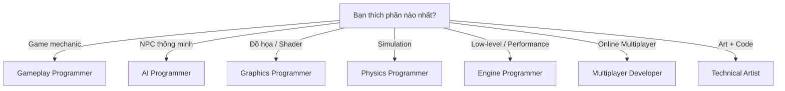

### Ví dụ

Nếu thích:

> "Tôi muốn enemy biết tìm đường, phục kích và phối hợp với nhau."

→ **AI Programmer**

Nếu thích:

> "Tôi muốn viết combat system giống Soulslike."

→ **Gameplay Programmer**

Nếu thích:

> "Tôi muốn làm shader nước, lighting và tối ưu GPU."

→ **Graphics Programmer**

Nếu thích:

> "Tôi muốn 100 người chơi cùng một server."

→ **Multiplayer / Backend Developer**

---

## 4. Bài tập thực hành

### Mini Project — Enemy AI

Tạo một scene nhỏ:

```text
+-----------------------------------+
|                                   |
|       Patrol Point A              |
|            ●                      |
|                                   |
|                 Enemy             |
|                   E               |
|                                   |
|                         Player    |
|                           P       |
|                                   |
|       ●                           |
| Patrol Point B                    |
+-----------------------------------+
```

Enemy phải có bốn state:

```text
PATROL
CHASE
ATTACK
FLEE
```


### Rule

```text
Không thấy Player
        ↓
      PATROL

Thấy Player
        ↓
      CHASE

Khoảng cách < AttackRange
        ↓
      ATTACK

HP < 20%
        ↓
       FLEE
```

---

# 4.1. Tạo NavMesh

Nếu làm bằng Unity, AI Navigation cho phép tạo NavMesh từ geometry của scene để xác định khu vực agent có thể đi.

Quy trình cơ bản:

```text
Scene Geometry
      ↓
NavMesh Surface
      ↓
Bake
      ↓
NavMesh
      ↓
NavMesh Agent
      ↓
Enemy Movement
```


Unreal Engine cũng sử dụng Navigation Mesh để cho AI character di chuyển trong level trong tutorial Behavior Tree chính thức.

---

# 4.2. State Machine mẫu

```csharp
public enum EnemyState
{
    Patrol,
    Chase,
    Attack,
    Flee
}
```

Enemy lưu state hiện tại:

```csharp
private EnemyState currentState;
```

Sau đó:

```csharp
void Update()
{
    switch (currentState)
    {
        case EnemyState.Patrol:
            Patrol();
            break;

        case EnemyState.Chase:
            Chase();
            break;

        case EnemyState.Attack:
            Attack();
            break;

        case EnemyState.Flee:
            Flee();
            break;
    }
}
```

---

# 4.3. Decision Logic

```csharp
void UpdateDecision()
{
    float distance = Vector3.Distance(
        transform.position,
        player.position
    );

    if (health <= maxHealth * 0.2f)
    {
        currentState = EnemyState.Flee;
        return;
    }

    if (distance <= attackRange)
    {
        currentState = EnemyState.Attack;
    }
    else if (distance <= detectionRange)
    {
        currentState = EnemyState.Chase;
    }
    else
    {
        currentState = EnemyState.Patrol;
    }
}
```

---

# 4.4. Di chuyển bằng NavMeshAgent

Một NavMesh Agent chịu trách nhiệm tìm đường và điều khiển chuyển động của character trên NavMesh.

Ví dụ:

```csharp
using UnityEngine;
using UnityEngine.AI;

public class EnemyAI : MonoBehaviour
{
    public Transform player;
    public Transform[] patrolPoints;

    public float detectionRange = 10f;
    public float attackRange = 2f;

    public float maxHealth = 100f;
    public float health = 100f;

    private NavMeshAgent agent;

    private int patrolIndex;

    private EnemyState state;

    void Awake()
    {
        agent = GetComponent<NavMeshAgent>();
    }

    void Update()
    {
        UpdateState();

        switch (state)
        {
            case EnemyState.Patrol:
                Patrol();
                break;

            case EnemyState.Chase:
                Chase();
                break;

            case EnemyState.Attack:
                Attack();
                break;

            case EnemyState.Flee:
                Flee();
                break;
        }
    }

    void UpdateState()
    {
        float distance =
            Vector3.Distance(transform.position, player.position);

        if (health <= maxHealth * 0.2f)
        {
            state = EnemyState.Flee;
        }
        else if (distance <= attackRange)
        {
            state = EnemyState.Attack;
        }
        else if (distance <= detectionRange)
        {
            state = EnemyState.Chase;
        }
        else
        {
            state = EnemyState.Patrol;
        }
    }

    void Patrol()
    {
        if (patrolPoints.Length == 0)
            return;

        agent.SetDestination(
            patrolPoints[patrolIndex].position
        );

        if (!agent.pathPending &&
            agent.remainingDistance < 0.5f)
        {
            patrolIndex++;

            patrolIndex %= patrolPoints.Length;
        }
    }

    void Chase()
    {
        agent.SetDestination(player.position);
    }

    void Attack()
    {
        agent.ResetPath();

        Debug.Log("Enemy Attack");
    }

    void Flee()
    {
        Vector3 direction =
            transform.position - player.position;

        Vector3 fleePosition =
            transform.position +
            direction.normalized * 8f;

        agent.SetDestination(fleePosition);
    }
}
```

Prototype này chưa phải AI production-ready, nhưng đủ để minh họa kiến trúc:

```text
Perception
    ↓
Decision
    ↓
State
    ↓
Action
```

---

# 4.5. Test ít nhất ba tình huống

| Test | Điều kiện                    | Kết quả mong đợi     |
| ---- | ---------------------------- | -------------------- |
| TC01 | Player ngoài detection range | Enemy Patrol         |
| TC02 | Player vào detection range   | Enemy Chase          |
| TC03 | Player vào attack range      | Enemy Attack         |
| TC04 | Player rời detection range   | Enemy trở lại Patrol |
| TC05 | Enemy HP < 20%               | Enemy Flee           |

Ví dụ:

```text
TC02

Given:
Enemy đang Patrol

And:
Distance(Player, Enemy) = 7m

And:
DetectionRange = 10m

When:
AI Update

Then:
State = Chase
```

### Test edge case

Thử thêm:

```text
Player chết khi Enemy Chase
Player teleport
Enemy bị kẹt
Không có patrol point
Player đứng ngoài NavMesh
Enemy HP = 0
Hai enemy cùng đuổi Player
```

---

## 5. Artifact nên tạo

Sau bài học, nên tạo ba artifact.


## Artifact 1 — AI Behavior Prototype

```text
Enemy AI Demo
│
├── Patrol
├── Chase
├── Attack
└── Flee
```

Quay video khoảng:

```text
30–60 giây
```

thể hiện đủ bốn state.

---

## Artifact 2 — State Machine Diagram

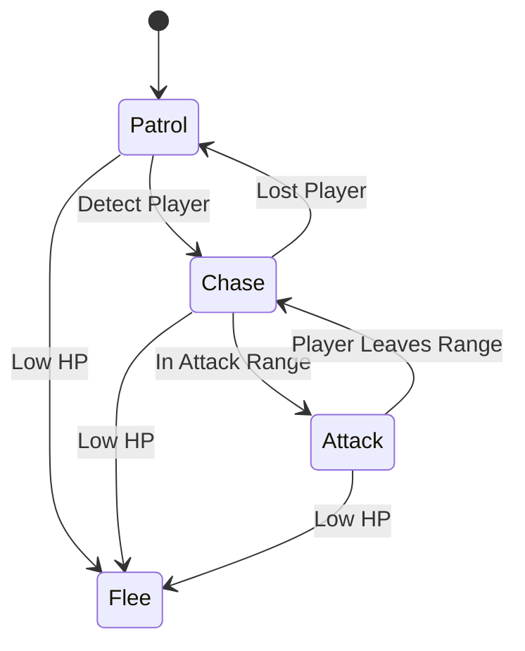

Xuất thành:

```text
enemy-ai-state-machine.png
```

---

## Artifact 3 — Test Cases

Ví dụ repository:

```text
enemy-ai-demo/
│
├── Assets/
│
├── Scripts/
│   └── EnemyAI.cs
│
├── Docs/
│   ├── state-machine.png
│   └── test-cases.md
│
└── README.md
```

README nên ghi:

```markdown
# Enemy AI Prototype

## Features

- Patrol
- Player detection
- Chase
- Attack
- Flee

## Architecture

Finite State Machine + NavMesh.

## States

Patrol → Chase → Attack → Flee

## Test Cases

5 behavior tests.

## Future Improvements

- Field of view
- Hearing
- Search state
- Behavior Tree
- Multiple enemies
```

Unity cũng có tài liệu riêng về việc xây dựng portfolio để trình bày project khi tìm việc hoặc học lên.

---

## 6. Câu hỏi tự kiểm tra


### Câu 1

**Game Developer khác Game Designer như thế nào?**

<details>
<summary>Đáp án</summary>

Game Designer chủ yếu thiết kế luật chơi, mechanic và trải nghiệm.

Game Developer hiện thực các hệ thống đó bằng code, engine và các công cụ kỹ thuật.

</details>

---

### Câu 2

Gameplay Programmer thường làm gì?

* A. Chỉ thiết kế texture.
* B. Xây dựng mechanic và gameplay system.
* C. Chỉ quản lý database.
* D. Chỉ viết shader.

**Đáp án:** B.

---

### Câu 3

Nếu muốn tập trung vào shader, lighting và GPU optimization nên đi hướng nào?

**Đáp án:**

```text
Graphics Programmer
```

---

### Câu 4

Nếu muốn NPC biết:

```text
Patrol
Search
Chase
Attack
Take Cover
```

hướng phù hợp nhất là:

```text
AI Programmer
```

---

### Câu 5

Client-side thường xử lý những gì?

Ví dụ:

```text
Input
Camera
UI
Animation
Rendering
Local Gameplay
```

---

### Câu 6

Server-side multiplayer thường liên quan đến:

```text
Game State
Replication
Matchmaking
Database
Validation
Sessions
```

---

### Câu 7

FSM thích hợp cho trường hợp nào?

Ví dụ:

```text
Idle
Patrol
Chase
Attack
```

với số state và transition còn tương đối dễ quản lý.

---

### Câu 8

Behavior Tree hữu ích khi nào?

Khi AI có nhiều hành vi phân nhánh và cần tổ chức decision logic thành các node/subtree rõ ràng. Unreal Engine cung cấp Behavior Tree cùng Blackboard chính thức cho mục đích này.

---

### Câu 9

Pathfinding trả lời câu hỏi nào?

> **NPC phải đi đường nào từ vị trí A đến mục tiêu B?**

---

### Câu 10

Hãy tự trả lời:

* Tôi thích gameplay hay công nghệ engine?
* Tôi thích AI hay graphics?
* Tôi thích code thấp tầng hay làm mechanic?
* Tôi có thích toán không?
* Tôi thích multiplayer không?
* Tôi thích art nhưng vẫn muốn lập trình không?

Sau đó chọn thử:

```text
Gameplay
Engine
Graphics
Physics
AI
Multiplayer
Technical Art
```

---

## 7. Tổng kết


Game Developer không phải một công việc duy nhất mà là một **hệ sinh thái nhiều hướng chuyên môn**.

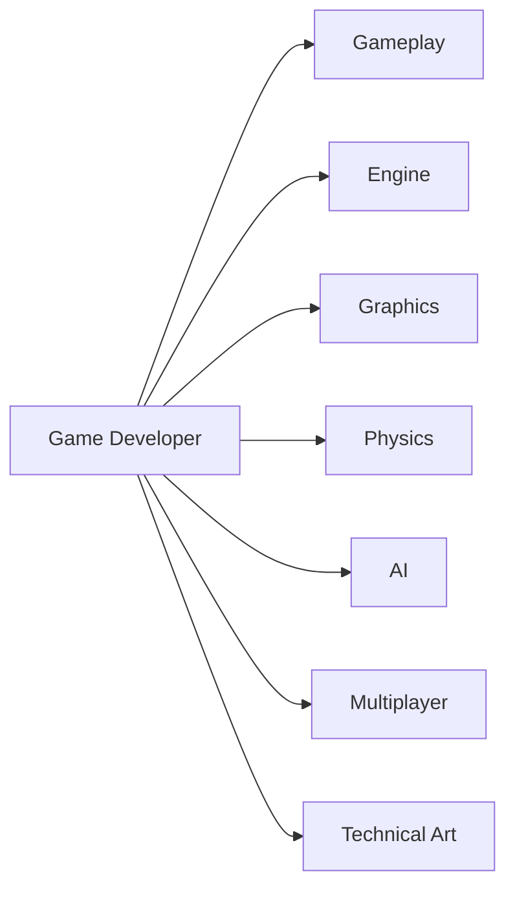

Trong roadmap **Game AI**, hướng cần chú ý đặc biệt là:

```text
AI Programmer
      ↓
Perception
      ↓
Decision Making
      ↓
State Machine
      ↓
Behavior Tree
      ↓
Pathfinding
      ↓
NPC Behavior
```

Một AI character thực tế thường cần kết hợp **nhận biết trạng thái thế giới, ra quyết định và navigation**. Unreal Engine tích hợp Behavior Tree/Blackboard cho AI decision, trong khi Unity AI Navigation cung cấp NavMesh, Agent, Link và Obstacle cho navigation/pathfinding.

### Kết quả tối thiểu của bài 001

Bạn nên hoàn thành:

```text
☑ Hiểu Game Developer là gì
☑ Phân biệt Client và Server
☑ Biết 7 hướng chuyên sâu
☑ Xác định hướng mình muốn thử
☑ Tạo Enemy AI Prototype
☑ Tạo State Machine Diagram
☑ Viết ít nhất 3 Test Cases
☑ Viết README cho project
```

### Artifact cuối bài

```text
001-game-developer-role/
│
├── enemy-ai-demo/
│
├── enemy-ai-state-machine.png
├── test-cases.md
└── README.md
```

> **Nguyên tắc học:** đừng chỉ đọc Game AI. Hãy tạo NPC, chạy thử, quan sát hành vi sai, debug và ghi lại lý do bạn chọn FSM, Behavior Tree hay một giải pháp khác.

**Bài tiếp theo nên tiếp tục từ nền tảng này sang game engine, game loop, kiến trúc gameplay hoặc nền tảng Game AI trước khi đi sâu vào pathfinding và decision making.**
