# 002 - Roadmap liên quan

**Module:** Module 01 - Tổng quan Game Developer
**Roadmap item:** 1.2
**Nhóm nội dung:** Game Development Foundation
**Thứ tự trong module:** 002
**Thời lượng gợi ý:** 25–35 phút

---

## 1. Tóm tắt

Một **Game Developer Roadmap** không tồn tại độc lập. Khi game ngày càng phức tạp, lập trình viên game sẽ phải sử dụng kiến thức từ nhiều roadmap khác như:

* Backend Development.
* API Design.
* Server Side Game Development.
* Networking.
* Database.
* System Design.
* DevOps.
* Security.

Roadmap Game Developer 2026 của roadmap.sh hiện trực tiếp dẫn người học tới các roadmap liên quan, trong đó có **Backend** và **Server Side Game Developer**; roadmap.sh cũng duy trì **Server Side Game Developer** như một role-based roadmap riêng.


*Minh họa: khi game có multiplayer hoặc dịch vụ online, phần game chạy trên máy người chơi chỉ là một phần của toàn bộ hệ thống.*

### Ý tưởng chính của bài

```text
Game Developer
     │
     ├── Client-side Game
     │
     ├── Gameplay
     ├── Graphics
     ├── Physics
     ├── AI
     │
     └── Online Features
             │
             ├── Backend
             ├── API Design
             ├── Networking
             └── Server Side Game Development
```

Bài này không yêu cầu học toàn bộ Backend ngay lập tức.

Mục tiêu là hiểu:

> **Khi nào kiến thức Game Developer là đủ và khi nào cần đi sang một roadmap liên quan?**

---

## 2. Mục tiêu học tập

Sau bài học, bạn có thể:

* Giải thích được **Roadmap liên quan** trong bối cảnh Game Developer.
* Biết Game Developer Roadmap liên kết với:

  * Backend.
  * API Design.
  * Server Side Game Developer.
* Phân biệt sơ bộ:

  * Client game.
  * Game server.
  * Backend service.
  * API.
  * Database.
* Xác định roadmap bổ sung dựa trên loại game muốn phát triển.
* Biết phần nào liên quan tới:

  * Gameplay.
  * Engine.
  * Graphics.
  * Physics.
  * AI.
  * Multiplayer.
  * Backend.
* Tạo một ghi chú kiến trúc nhỏ có thể đưa vào portfolio.


---

# 3. Nội dung roadmap

## 3.1. Roadmap liên quan là gì?

Roadmap có thể hiểu đơn giản là bản đồ kiến thức giúp xác định:

```text
Học cái gì?
     ↓
Học theo thứ tự nào?
     ↓
Kiến thức nào là nền tảng?
     ↓
Kiến thức nào là chuyên sâu?
     ↓
Dùng nó để xây dựng thứ gì?
```

Trong Game Development, không nên hiểu roadmap theo kiểu:

```text
Bước 1
 ↓
Bước 2
 ↓
Bước 3
 ↓
Học hết
 ↓
Mới được làm game
```

Cách thực tế hơn là:

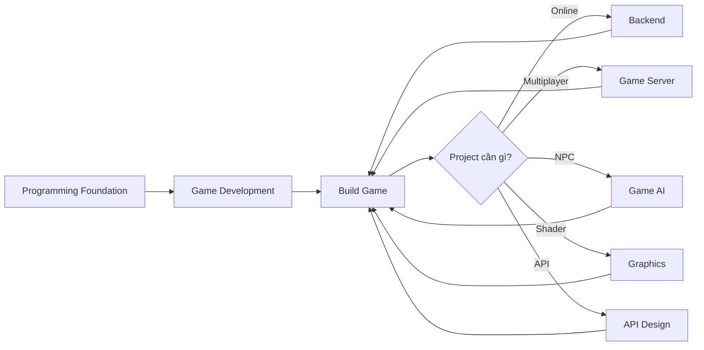

Tức là:

> **Project tạo ra nhu cầu học kiến thức mới, sau đó kiến thức mới quay trở lại cải thiện project.**

---

# 3.2. Game Developer Roadmap nằm ở đâu?

roadmap.sh hiện có **Game Developer** và **Server Side Game Developer** trong hệ thống roadmap của mình. Game Developer Roadmap 2026 cũng chỉ ra những roadmap liên quan như Backend và Server Side Development.

Một cách nhìn tổng quát:

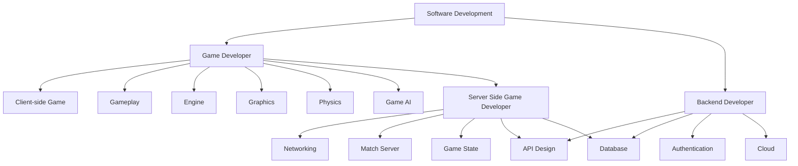

Điểm quan trọng:

**Game Developer** và **Backend Developer** có vùng kiến thức giao nhau nhưng không phải cùng một nghề.

---

# 3.3. Client-side Game Development

Client là chương trình game chạy trên thiết bị người chơi.

Ví dụ:

```text
PC
Console
Android
iOS
      ↓
 Game Client
```

Client thường chịu trách nhiệm:

* Input.
* Camera.
* UI.
* Animation.
* Rendering.
* Audio.
* VFX.
* Character Controller.
* Local gameplay.
* Một phần AI.
* Client prediction trong game online.

Ví dụ:

```text
Người chơi nhấn Attack
          ↓
       Input
          ↓
   Gameplay System
          ↓
      Animation
          ↓
        VFX
          ↓
      Rendering
```

### Với game offline

Kiến trúc có thể rất đơn giản:

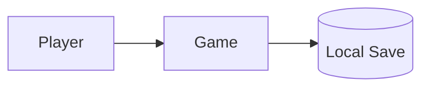

Không nhất thiết cần backend riêng.

---

# 3.4. Khi nào Game Developer cần Backend?

Backend development tập trung vào logic phía server, API, database, authentication và xử lý request của client. Đây cũng là các thành phần được roadmap.sh đưa vào Backend Developer Roadmap hiện tại.


Backend bắt đầu trở nên quan trọng khi game có:

```text
Account
Cloud Save
Leaderboard
Friends
Inventory Online
Daily Reward
Shop
Guild
Mail
Analytics
Match History
Live Event
```

Ví dụ một game mobile:

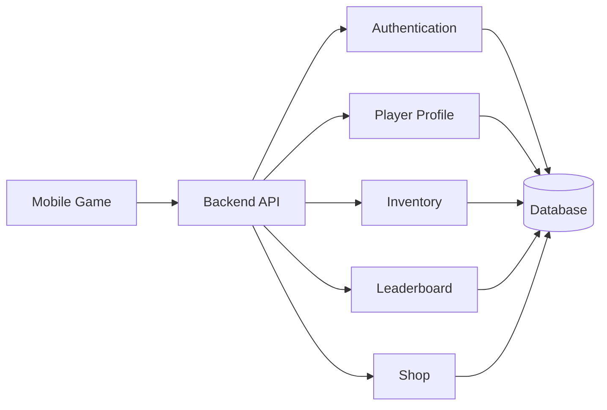

---

## Ví dụ thực tế

Người chơi mở game.

```text
Launch Game
    ↓
Login
    ↓
Load Player Profile
    ↓
Load Inventory
    ↓
Load Daily Reward
    ↓
Load Leaderboard
```

Những dữ liệu này không nhất thiết được lưu hoàn toàn ở client.

Client có thể gọi:

```text
Backend API
```

để lấy dữ liệu.

---

# 3.5. Backend khác Game Server như thế nào?

Đây là một điểm rất dễ nhầm.

## Backend Server

Có thể xử lý:

```text
Login
Account
Inventory
Leaderboard
Shop
Achievement
Guild
Cloud Save
```

## Game Server

Thường tập trung vào trận đấu đang diễn ra:

```text
Player Position
Combat
Physics
Game State
Enemy State
Match Rules
Spawn
Damage
Winner
```

Ví dụ:

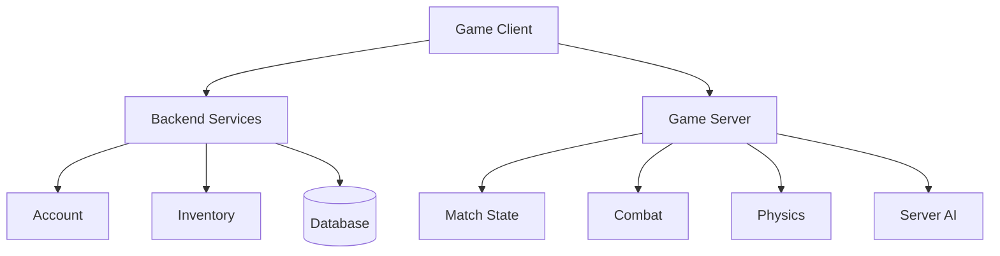

### Có thể hiểu ngắn gọn

```text
Backend
   ↓
Quản lý người chơi ngoài trận đấu

Game Server
   ↓
Quản lý gameplay trong trận đấu
```

Đây chỉ là mô hình khái niệm; kiến trúc thực tế có thể kết hợp hoặc chia nhỏ các service khác nhau.

---

# 3.6. Server Side Game Developer

roadmap.sh hiện có roadmap riêng **Server Side Game Developer 2026**, cho thấy server-side game development đủ lớn để trở thành một nhánh chuyên môn riêng thay vì chỉ là một phần nhỏ của lập trình gameplay.


Server Side Game Developer thường phải suy nghĩ về:

* Client/server architecture.
* Networking.
* Latency.
* Game state.
* Tick rate.
* Replication.
* Matchmaking.
* Dedicated server.
* Persistence.
* Database.
* Authentication.
* Scalability.
* Security.
* Monitoring.

---

## Kiến trúc multiplayer đơn giản

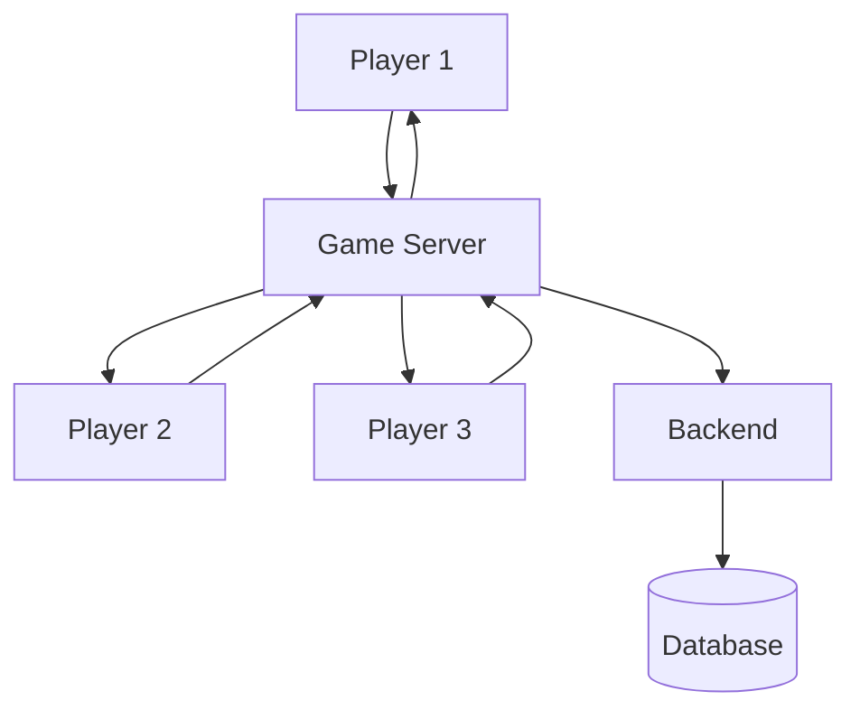

Game Server có thể giữ:

```text
Match #1204

Player 1:
Position
HP
Weapon

Player 2:
Position
HP
Weapon

Enemies:
Position
HP
State

Match:
Time
Score
Objectives
```

---

# 3.7. Ví dụ: Player bắn Enemy

Trong game offline:

```text
Player Shoot
     ↓
Raycast
     ↓
Enemy Hit
     ↓
Enemy HP -= 20
```

Nhưng trong multiplayer có thể phức tạp hơn:

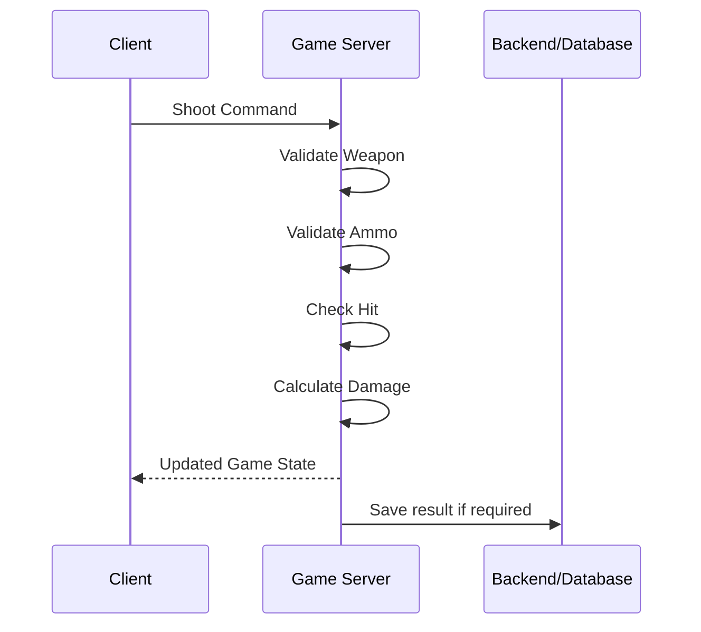

Một nguyên tắc thiết kế thường gặp là:

```text
Client
   ↓
"Tôi muốn thực hiện hành động"

Server
   ↓
"Kiểm tra hành động có hợp lệ không"

Server
   ↓
"Cập nhật trạng thái chính thức"
```

---

# 3.8. API Design

API Design là roadmap liên quan rất quan trọng khi game cần giao tiếp với backend.

roadmap.sh mô tả API Design là quá trình thiết kế interface cho phép các ứng dụng hoặc service trao đổi dữ liệu và chức năng; roadmap này bao gồm các hướng như REST, SOAP và GraphQL cùng các vấn đề về tiêu chuẩn và bảo mật API.

Ví dụ:

```text
Game Client
     ↓
HTTP Request
     ↓
Backend API
     ↓
Database
```

---

## Ví dụ API đăng nhập

Client gửi:

```http
POST /api/login
```

Body:

```json
{
  "username": "player01",
  "password": "..."
}
```

Server trả:

```json
{
  "playerId": "P1001",
  "token": "...",
  "displayName": "Knight01"
}
```

---

## API Inventory

```http
GET /api/players/P1001/inventory
```

Response:

```json
{
  "items": [
    {
      "id": "sword_01",
      "quantity": 1
    },
    {
      "id": "potion_01",
      "quantity": 5
    }
  ]
}
```

Luồng dữ liệu:

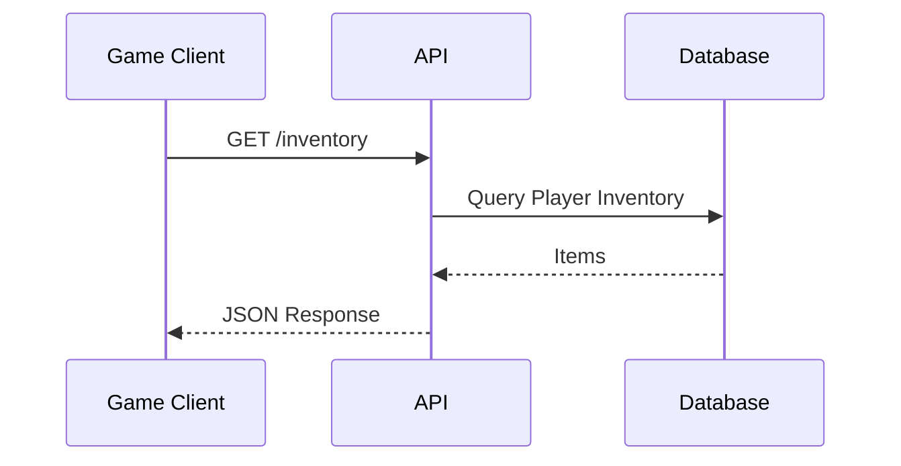

---

# 3.9. Tại sao Game Developer nên biết API?

Ngay cả khi không trở thành Backend Developer, Game Developer vẫn có thể phải tích hợp:

```text
Login API
Leaderboard API
Payment API
Analytics API
Cloud Save API
Matchmaking API
Achievement API
Remote Config API
```

Ví dụ:

```text
Unity / Unreal / Godot
          ↓
      HTTP Client
          ↓
          API
          ↓
       Backend
```

Nếu không hiểu API, Game Developer dễ gặp các vấn đề:

```text
Không biết request gửi ở đâu
Không hiểu status code
Không xử lý lỗi network
Không hiểu JSON
Không biết authentication token
Không xử lý timeout
Không hiểu API version
```

---

# 3.10. Backend Roadmap liên quan như thế nào?

Backend Roadmap của roadmap.sh hiện bao gồm những nền tảng như server-side programming, database, API và authentication/authorization.

Đối với Game Developer, không nhất thiết phải học toàn bộ roadmap Backend ngay từ đầu.

Có thể chọn phần cần thiết:

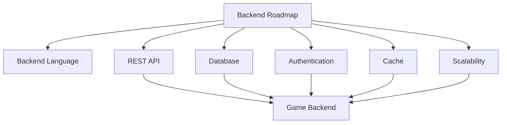

### Phần nên biết sớm

```text
HTTP
JSON
REST API
Database
Authentication
Client / Server
```

### Có thể học sau

```text
Load Balancer
Microservices
Distributed Systems
Message Queue
Caching Strategy
Observability
Container Orchestration
```

---

# 3.11. Mối quan hệ giữa các roadmap

Có thể xem các roadmap như những nhánh kết nối với nhau:

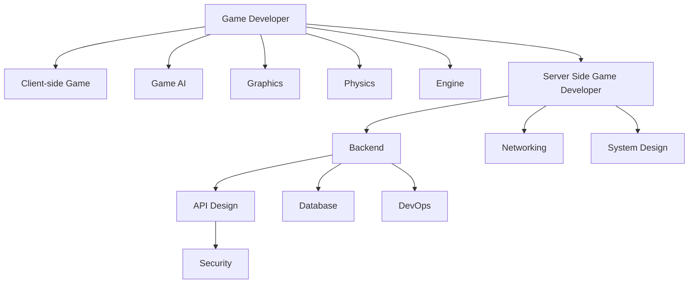

Không cần trở thành chuyên gia tất cả các nhánh.

Hãy chọn theo project.

---

# 3.12. Roadmap nào liên quan tới loại game nào?

| Project                 | Roadmap cần ưu tiên                         |
| ----------------------- | ------------------------------------------- |
| Platformer offline      | Gameplay                                    |
| Visual Novel            | Gameplay + UI + Data                        |
| Puzzle game             | Gameplay                                    |
| RPG offline             | Gameplay + AI + Data                        |
| FPS offline             | Gameplay + AI + Physics                     |
| MMORPG                  | Gameplay + Server Side + Backend + Database |
| MOBA                    | Multiplayer + Server Side + Backend         |
| Battle Royale           | Networking + Game Server + Backend          |
| Mobile gacha            | Backend + API + Database + LiveOps          |
| Racing game             | Gameplay + Physics                          |
| Strategy game           | Gameplay + AI                               |
| Procedural game         | Gameplay + Algorithms                       |
| Game có shader phức tạp | Graphics                                    |
| Custom game engine      | Engine + Graphics + Physics                 |

---

# 3.13. Roadmap theo mục tiêu nghề nghiệp

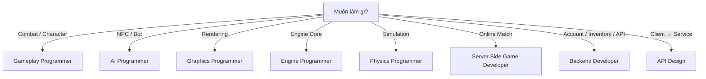

---

## 4. Case Study: Một game online cần những roadmap nào?

Giả sử xây dựng một game:

> **4 người cùng chiến đấu với quái vật trong dungeon.**


Hệ thống có:

```text
Login
Lobby
4 Players
Enemies
Combat
Inventory
XP
Leaderboard
```

---

## 4.1. Game Client

Chịu trách nhiệm:

```text
Input
Camera
Animation
UI
VFX
Audio
Local Prediction
```

Roadmap:

```text
Game Developer
```

---

## 4.2. Enemy AI

Chịu trách nhiệm:

```text
Patrol
Detect Player
Chase
Attack
Flee
```

Roadmap:

```text
Game AI
```

---

## 4.3. Game Server

Chịu trách nhiệm:

```text
Player State
Enemy State
Combat Validation
Match Rules
Synchronization
```

Roadmap:

```text
Server Side Game Developer
```

---

## 4.4. Backend

Chịu trách nhiệm:

```text
Account
Inventory
XP
Leaderboard
Match History
```

Roadmap:

```text
Backend
```

---

## 4.5. API

Dùng để kết nối:

```text
Game Client
     ↓
Backend
```

Ví dụ:

```http
POST /login
GET /inventory
GET /leaderboard
POST /claim-reward
```

Roadmap:

```text
API Design
```

---

## 4.6. Database

Có thể lưu:

```text
Players
Items
Inventory
Matches
Achievements
Leaderboard
```

Ví dụ:

```text
Player
│
├── PlayerId
├── Username
├── Level
├── XP
└── Inventory
```

---

## Kiến trúc cuối cùng

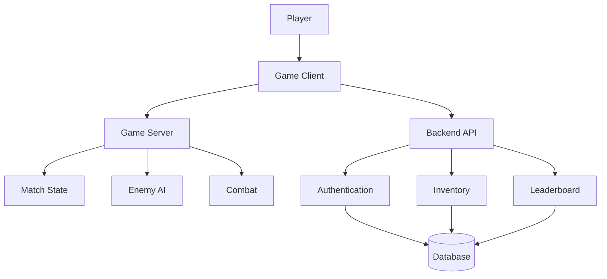

Một game duy nhất vì thế có thể sử dụng kiến thức từ **nhiều roadmap cùng lúc**.

---

# 5. Nên học roadmap theo thứ tự nào?

Đối với người mới:

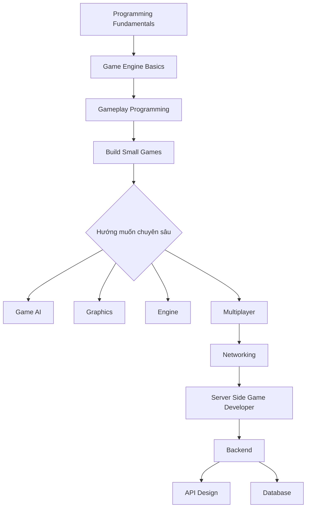

### Không nên học theo kiểu

```text
C++
↓
Unity
↓
Unreal
↓
Godot
↓
Graphics
↓
AI
↓
Backend
↓
DevOps
↓
Database
↓
Networking
↓
2 năm sau mới làm game
```

Nên:

```text
Học
 ↓
Prototype
 ↓
Gặp vấn đề
 ↓
Học kiến thức cần thiết
 ↓
Sửa prototype
 ↓
Project lớn hơn
```

---

# 6. Bài tập thực hành

## Bài tập 1 — Tóm tắt bài trong 5 dòng

Viết lại bằng lời của bạn.

Ví dụ:

```markdown
1. Game Developer Roadmap không tồn tại độc lập.
2. Game online thường cần kiến thức Backend và Networking.
3. Game Server xử lý trạng thái gameplay trong trận đấu.
4. Backend thường quản lý account, inventory và dữ liệu lâu dài.
5. API là cầu nối quan trọng giữa game client và backend.
```

---

## Bài tập 2 — Phân tích một game

Chọn một game.

Ví dụ:

```text
Pokémon Unite
Valorant
Genshin Impact
Minecraft
League of Legends
Clash of Clans
```

Sau đó xác định:

```text
Client
Server
Backend
API
Database
AI
Graphics
Physics
```

Không cần biết kiến trúc nội bộ thực sự của trò chơi; mục tiêu là **tự thiết kế một kiến trúc hợp lý dựa trên chức năng quan sát được**.

---

## Bài tập 3 — Thiết kế kiến trúc game của bạn

Ví dụ game:

```text
Online RPG
```

Tạo sơ đồ:

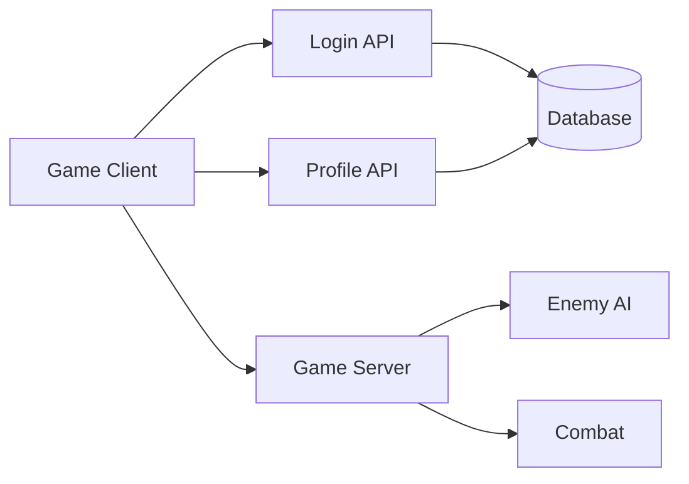

---

## Bài tập 4 — Thiết kế API đơn giản

Giả sử game có player profile.

Thiết kế ba endpoint:

```http
POST /api/login
```

```http
GET /api/player/profile
```

```http
GET /api/player/inventory
```

Ví dụ response:

```json
{
  "id": 1001,
  "name": "PlayerOne",
  "level": 12,
  "gold": 4500
}
```

---

## Bài tập 5 — Xác định roadmap cần học

Giả sử muốn xây dựng:

```text
2D Online RPG
```

Điền:

| Requirement        | Roadmap                    |
| ------------------ | -------------------------- |
| Character movement | Gameplay                   |
| Enemy behavior     | Game AI                    |
| Online players     | Server Side Game Developer |
| Login              | Backend                    |
| Player inventory   | Backend + Database         |
| Client gọi server  | API Design                 |
| Deployment         | DevOps                     |
| Shader             | Graphics                   |

---

# 7. Artifact nên tạo


Sau bài này, chưa cần xây một multiplayer server hoàn chỉnh.

Artifact phù hợp hơn là một **Architecture Study Note**.

---

## Artifact 1 — Study Note

Tạo:

```text
002-related-roadmaps.md
```

Nội dung:

```markdown
# Related Game Development Roadmaps

## Game Developer

Client gameplay and engine systems.

## Game AI

NPC decision making and navigation.

## Server Side Game Developer

Online game state and networking.

## Backend

Accounts, inventory and persistent data.

## API Design

Communication between game clients and services.
```

---

# Artifact 2 — Architecture Diagram

Tạo file:

```text
game-system-architecture.md
```

hoặc:

```text
game-system-architecture.png
```

Ví dụ:

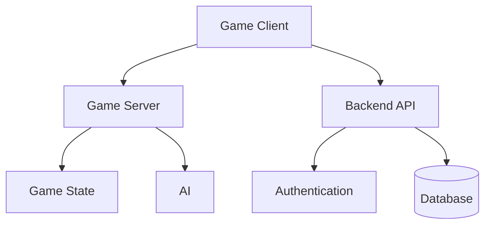

---

# Artifact 3 — Mini API Prototype

Nếu muốn thực hành thêm, có thể tạo backend cực nhỏ:

```text
GET /player
```

Response:

```json
{
  "id": 1,
  "name": "Knight",
  "level": 5
}
```

Client game chỉ cần gửi HTTP request và hiển thị:

```text
Player: Knight
Level: 5
```

Mục tiêu chưa phải xây backend production.

Mục tiêu là hiểu luồng:

```text
Game
 ↓
Request
 ↓
API
 ↓
Response
 ↓
Game
```

---

# Artifact 4 — Portfolio README

Cấu trúc:

```text
002-related-roadmaps/
│
├── README.md
├── roadmap-notes.md
├── architecture.md
└── api-example/
```

README:

```markdown
# Game Development Related Roadmaps

## Goal

Understand how Game Development connects with
Backend, API Design and Server Side Game Development.

## Architecture

Game Client
→ Game Server
→ Backend
→ Database

## Concepts

- Client / Server
- Backend
- REST API
- Database
- Game Server

## Future Work

- Build Login API
- Add Inventory API
- Connect Unity client
- Build simple multiplayer prototype
```

---

# 8. Câu hỏi tự kiểm tra

## Câu 1

**Tại sao Game Developer cần biết các roadmap liên quan?**

<details>
<summary>Đáp án</summary>

Vì một game hiện đại có thể cần nhiều hệ thống ngoài gameplay như networking, backend, API, database, deployment và security.

</details>

---

## Câu 2

Game offline đơn giản có bắt buộc phải có Backend không?

**Không.**

Ví dụ:

```text
Player
  ↓
Game
  ↓
Local Save
```

có thể hoạt động hoàn toàn trên thiết bị.

---

## Câu 3

Hệ thống nào phù hợp để lưu Inventory online?

```text
Backend + Database
```

---

## Câu 4

Ai thường chịu trách nhiệm xử lý trạng thái trận đấu multiplayer?

```text
Game Server
```

---

## Câu 5

API có vai trò gì?

```text
Client
  ↕
 API
  ↕
Backend
```

API định nghĩa cách các hệ thống giao tiếp và trao đổi dữ liệu với nhau.

---

## Câu 6

Game Server và Backend có giống nhau hoàn toàn không?

**Không.**

Một cách phân biệt hữu ích:

```text
Game Server
→ Real-time match/gameplay

Backend
→ Persistent services/data
```

---

## Câu 7

Nếu muốn xây MMO nên học thêm gì?

Ít nhất cần xem xét:

```text
Networking
Server Side Game Development
Backend
Database
API Design
System Design
DevOps
Security
```

---

## Câu 8

Nếu chỉ muốn làm AI NPC thì có cần học toàn bộ Backend Roadmap ngay không?

**Không.**

Có thể ưu tiên:

```text
Game Programming
       ↓
Game AI
       ↓
FSM
       ↓
Behavior Tree
       ↓
Pathfinding
       ↓
Perception
```

Backend chỉ cần học khi project thực sự cần.

---

# 9. Checklist sau bài học

```text
☑ Hiểu Roadmap liên quan là gì

☑ Biết Game Developer không phải roadmap độc lập hoàn toàn

☑ Phân biệt Game Client và Game Server

☑ Hiểu Backend cơ bản

☑ Hiểu API cơ bản

☑ Biết Server Side Game Developer là một hướng riêng

☑ Biết khi nào cần học Backend

☑ Biết khi nào cần học API Design

☑ Biết khi nào cần Server Side Game Development

☑ Vẽ được kiến trúc một game online đơn giản

☑ Tạo Study Note

☑ Tạo Architecture Diagram

☑ Viết Portfolio README
```

---

# 10. Sơ đồ kiến thức toàn bài

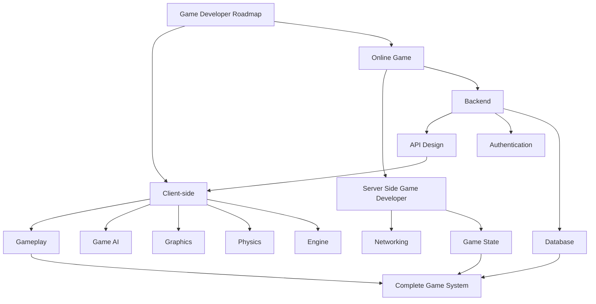

---

# 11. Tổng kết

**Roadmap liên quan** giúp tránh suy nghĩ rằng Game Developer chỉ cần biết một game engine.

roadmap.sh hiện duy trì cả **Game Developer**, **Backend**, **API Design** và **Server Side Game Developer** như các lộ trình riêng nhưng có khả năng giao nhau trong quá trình xây dựng game online.


Có thể ghi nhớ toàn bài bằng sơ đồ:

```text
                    GAME DEVELOPER
                           │
            ┌──────────────┴──────────────┐
            │                             │
          CLIENT                        ONLINE
            │                             │
    ┌───────┼────────┐           ┌────────┴────────┐
    │       │        │           │                 │
Gameplay   AI    Graphics    Game Server        Backend
                               │                 │
                         Networking             API
                               │                 │
                          Game State          Database
```

### Nguyên tắc quan trọng

Không cần học tất cả roadmap cùng lúc.

Hãy dùng:

```text
Project
   ↓
Requirement
   ↓
Roadmap cần thiết
   ↓
Kiến thức
   ↓
Prototype
   ↓
Test
   ↓
Portfolio
```

### Artifact cuối bài

```text
002-related-roadmaps/
│
├── README.md
├── study-note.md
├── game-architecture.md
└── api-example.json
```

> **Mục tiêu của bài 002 không phải biến bạn thành Backend Developer, mà giúp bạn nhìn Game Development như một hệ thống lớn và biết chính xác roadmap nào cần mở ra khi project bắt đầu yêu cầu kiến thức ngoài gameplay.**

---

# Bài luyện tập

## Mục tiêu


## Đề bài


## Yêu cầu hoàn thành

- [ ] 
- [ ] 
- [ ] 

## Kết quả / lời giải


## Ghi chú
