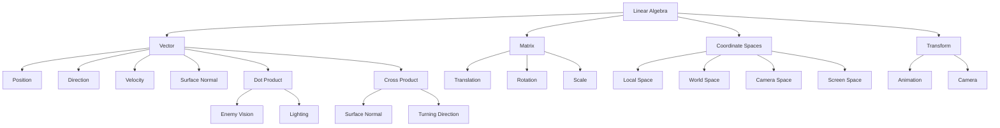
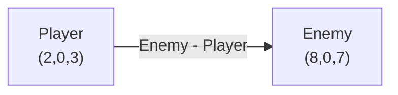
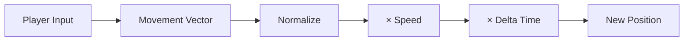
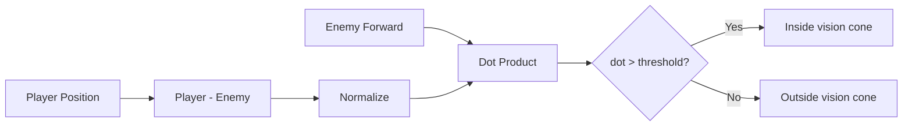
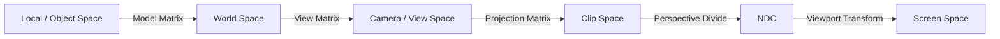
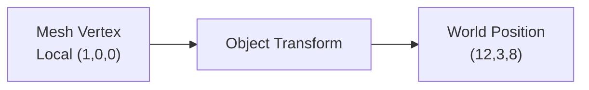
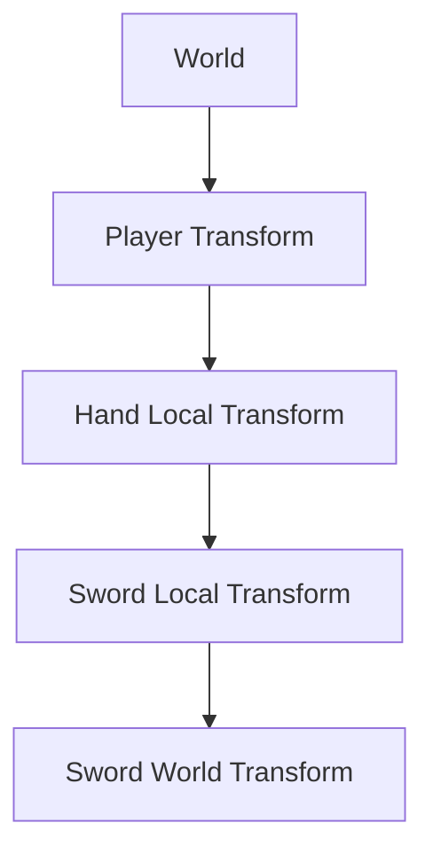
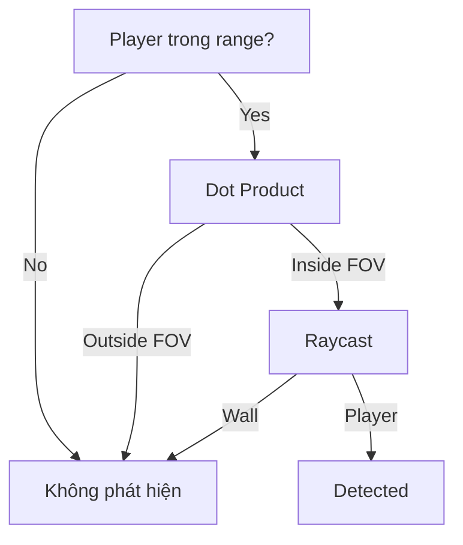
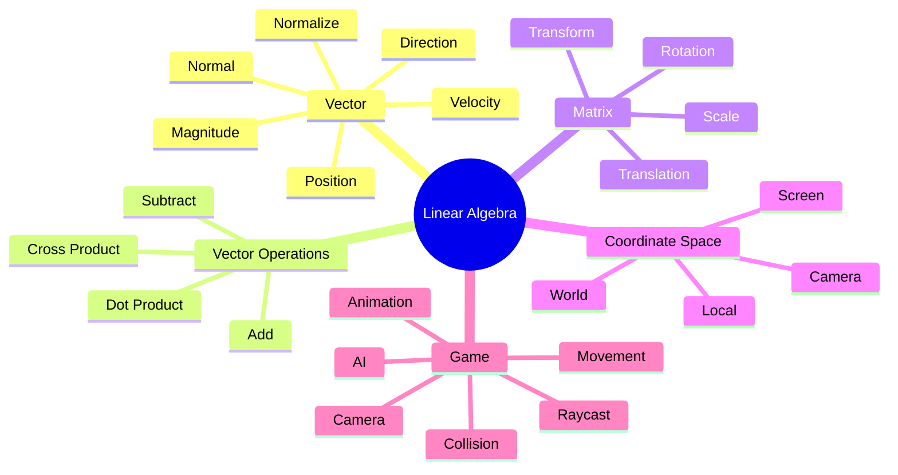
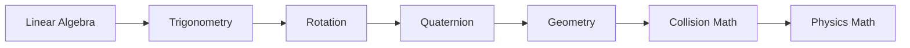

# 001 - Linear Algebra

**Module:** Module 02 - Game Mathematics
**Roadmap item:** 2.1
**Nhóm nội dung:** Game Mathematics
**Thứ tự trong module:** 001
**Thời lượng gợi ý:** 40-55 phút
**Mức độ:** Nền tảng
**Ứng dụng chính:** Gameplay, Graphics, Physics, Camera, Animation, AI

---

## 1. Tóm tắt

**Linear Algebra – Đại số tuyến tính** là một trong những nền tảng toán học quan trọng nhất của lập trình game.

Trong game, gần như mọi đối tượng đều có:

* vị trí;
* hướng;
* vận tốc;
* kích thước;
* rotation;
* hệ tọa độ riêng;
* quan hệ với camera hoặc các object khác.

Những thông tin đó thường được biểu diễn bằng **vector**, **matrix** và **transform**.

Ví dụ:

```text
Player Position      -> Vector3
Player Velocity      -> Vector3
Looking Direction    -> Vector3
Surface Normal       -> Vector3
Object Rotation      -> Matrix / Quaternion
Object Transform     -> Matrix4x4
Camera Transform     -> Matrix4x4
```

Trong graphics pipeline, matrix được dùng để chuyển vertex từ model/local space qua world space, view/camera space rồi đến projection/screen space. MDN mô tả model, view và projection matrix là ba thành phần cốt lõi của pipeline 3D; Unity và Godot cũng xây dựng hệ transform của object dựa trên các khái niệm này. ([MDN Web Docs][2])

---

## 2. Mục tiêu học tập

Sau bài này, bạn nên có thể:

* Giải thích **Vector2** và **Vector3** bằng ví dụ game thực tế.
* Tính direction và distance giữa hai object.
* Hiểu ý nghĩa của normalize.
* Sử dụng **dot product** để kiểm tra hướng nhìn.
* Sử dụng **cross product** để tìm vector vuông góc hoặc xác định phía quay.
* Hiểu matrix dùng để transform object như thế nào.
* Phân biệt:

  * Local Space
  * World Space
  * Camera/View Space
  * Screen Space
* Hiểu pipeline:

```text
Local -> World -> Camera -> Projection -> Screen
```

* Áp dụng kiến thức vào:

  * movement;
  * camera follow;
  * raycast;
  * collision;
  * animation;
  * enemy vision.

---

# 3. Bức tranh tổng thể



Một cách suy nghĩ hữu ích là:

> **Vector mô tả "ở đâu / đi đâu", còn matrix/transform mô tả "chuyển từ hệ tọa độ này sang hệ tọa độ khác như thế nào".**

---

# 4. Vector

## 4.1 Vector là gì?

Vector là đại lượng có:

* **magnitude** – độ lớn;
* **direction** – hướng.

Trong game 2D:

```text
v = (x, y)
```

Trong game 3D:

```text
v = (x, y, z)
```

Godot mô tả `Vector3` như cấu trúc ba thành phần dùng cho toán học 3D, trong khi Unity sử dụng vector cho position, movement, direction và nhiều phép toán gameplay khác. ([Godot Engine documentation][3])

---

## 4.2 Hệ tọa độ 3D


*Nguồn ảnh: [Wikimedia Commons - 3D coordinate system](https://commons.wikimedia.org/wiki/File:3D_coordinate_system.svg).* Hình minh họa một hệ tọa độ Cartesian 3D thuận tay phải. ([Wikimedia Commons][4])

Thông thường một vector 3D có dạng:

```text
Vector3(x, y, z)
```

Ví dụ:

```text
Player Position = (3, 1, 8)
```

có thể hiểu là player đang nằm tại một điểm trong scene.

---

# 5. Position Vector và Direction Vector

Hai vector sau nhìn giống nhau về mặt dữ liệu:

```text
Position  = (5, 2, 8)

Direction = (0.8, 0, 0.6)
```

nhưng ý nghĩa khác nhau.

### Position

```text
"Object đang ở đâu?"
```

### Direction

```text
"Object đang hướng về đâu?"
```

Ví dụ:

```text
Player = (2, 0, 3)

Enemy = (8, 0, 7)
```

Direction từ player tới enemy:

```text
direction = enemy - player
```

Ta được:

```text
direction =
(8, 0, 7)
-
(2, 0, 3)

= (6, 0, 4)
```

Sơ đồ:



Đây là một pattern xuất hiện liên tục trong game:

```text
TargetDirection = TargetPosition - CurrentPosition
```

---

# 6. Magnitude – Độ dài vector

Magnitude của vector:

$$
v=(x,y,z)
$$

là:

$$
|v|=\sqrt{x^2+y^2+z^2}
$$

Ví dụ:

```text
v = (3, 0, 4)
```

thì:

$$
|v|=\sqrt{3^2+4^2}=5
$$

Trong game, magnitude thường được dùng để tính:

```text
distance
speed
range
radius
```

Ví dụ:

```text
distanceToEnemy =
(TargetPosition - PlayerPosition).magnitude
```

---

# 7. Normalize

Nếu:

```text
v = (3, 0, 4)
```

thì magnitude bằng:

```text
5
```

Normalized vector:

$$
\hat{v}=\frac{v}{|v|}
$$

nên:

```text
normalized(v)

= (0.6, 0, 0.8)
```

Magnitude mới:

```text
1
```

Normalized vector còn được gọi là **unit vector**.

---

## Vì sao normalize quan trọng trong game?

Giả sử:

```text
direction = target - player
```

Nếu ta làm:

```text
position += direction * speed
```

thì object ở càng xa target có thể càng di chuyển nhanh vì `direction` chứa cả khoảng cách.

Thay vào đó:

```text
direction = normalize(target - player)

position += direction * speed
```

Ta tách được:

```text
Direction
+
Speed
```

thành hai yếu tố độc lập.

---

# 8. Vector Movement

Movement cơ bản có thể viết:

$$
P_{new}=P_{old}+D \times Speed \times \Delta t
$$

Trong đó:

```text
P     = Position
D     = Direction
Speed = tốc độ
dt    = thời gian giữa hai frame
```

Ví dụ:

```csharp
Vector3 direction = new Vector3(inputX, 0, inputY);

direction.Normalize();

transform.position +=
    direction * moveSpeed * Time.deltaTime;
```

Mô hình:



---

# 9. Dot Product

Dot product là một trong những phép toán vector hữu ích nhất trong gameplay.

Với:

$$
A=(A_x,A_y,A_z)
$$

và:

$$
B=(B_x,B_y,B_z)
$$

ta có:

$$
A\cdot B = A_xB_x+A_yB_y+A_zB_z
$$

Hoặc:

$$
A\cdot B = |A||B|\cos(\theta)
$$

Dot product nhận hai vector và trả về **một scalar**. Unity và Godot đều dùng nó để suy ra quan hệ góc giữa hai hướng. ([Unity Documentation][5])

---

## 9.1 Hình minh họa Dot Product


*Nguồn ảnh: [Wikimedia Commons - Dot-product-2](https://commons.wikimedia.org/wiki/File:Dot-product-2.svg).* Hình biểu diễn phép chiếu vector `b` lên hướng của vector `a`. ([Wikimedia Commons][6])

---

# 10. Ý nghĩa Dot Product

Nếu hai vector đã normalize:

```text
A · B ≈ 1
```

→ gần cùng hướng.

```text
A · B ≈ 0
```

→ gần vuông góc.

```text
A · B ≈ -1
```

→ gần ngược hướng.

```text
       Target
          ↑
          │
          │

←──── Enemy ────→
BACK             FRONT

dot < 0          dot > 0
```

Godot cũng mô tả trực tiếp rằng dot product dương tương ứng góc nhỏ hơn 90°, bằng 0 ở 90° và âm với góc lớn hơn 90°. ([Godot Engine documentation][3])

---

# 11. Dot Product trong Enemy Vision

Giả sử enemy có:

```text
enemyForward
```

và:

```text
directionToPlayer
```

Ta tính:

```csharp
float dot =
    Vector3.Dot(
        enemyForward,
        directionToPlayer.normalized
    );
```

Nếu:

```text
dot = 0.95
```

player gần như ở phía trước enemy.

Nếu:

```text
dot = -0.8
```

player nằm phía sau.

---

## Field of View

Ví dụ enemy chỉ nhìn trong góc khoảng:

```text
90°
```

Ta có thể kiểm tra:

```text
Enemy Forward
      ↑
     / \
    /   \
   / FOV \
  /       \
```

Pipeline:



Sau đó có thể kết hợp thêm **raycast** để kiểm tra vật cản:

```text
Dot Product
     ↓
Player có nằm phía trước?
     ↓
Raycast
     ↓
Có tường chắn không?
     ↓
Enemy thấy Player
```

---

# 12. Cross Product

Trong game 3D, cross product:

$$
A\times B
$$

trả về một vector vuông góc với cả `A` và `B`.

Unity và Godot đều sử dụng phép toán này theo cách đó trong vector math 3D. ([Unity Documentation][1])

---

## 12.1 Hình minh họa


*Nguồn ảnh: [Wikimedia Commons - Cross product vector](https://commons.wikimedia.org/wiki/File:Cross_product_vector.svg).* Hình này được phát hành public domain. ([Wikimedia Commons][7])

---

## 12.2 Ví dụ

```text
A = Forward
B = Right
```

Cross product có thể cho vector:

```text
Up
```

Tùy vào thứ tự:

```text
A × B
```

và:

```text
B × A
```

sẽ cho hai hướng ngược nhau.

$$
A\times B=-(B\times A)
$$

Vì vậy thứ tự vector rất quan trọng.

---

# 13. Cross Product dùng làm gì trong game?

### Tìm surface normal

Cho hai cạnh của triangle:

```text
A
 \
  \
   C────B
```

Ta có:

```text
edge1 = B - A
edge2 = C - A

normal = cross(edge1, edge2)
```

Normal được dùng trong:

```text
lighting
collision
physics
mesh generation
shader
```

---

## Xác định quay trái hay phải

Ví dụ:

```text
Current Forward
        ↑
        │
        │
        O ─────→ Target
```

Ta có thể dùng:

```csharp
Vector3 cross =
    Vector3.Cross(transform.forward, toTarget);
```

Dấu hoặc hướng của thành phần thích hợp của `cross` có thể giúp quyết định target nằm về bên nào của hướng hiện tại.

Ứng dụng:

```text
NPC steering
car steering
aircraft turning
fish swimming
enemy rotation
```

---

# 14. Matrix

Matrix có thể hiểu là một bảng số:

$$
M=
\begin{bmatrix}
a&b\\
c&d
\end{bmatrix}
$$

Trong graphics 3D, **4×4 matrix** đặc biệt phổ biến.

Ví dụ:

$$
M=
\begin{bmatrix}
m_{00}&m_{01}&m_{02}&m_{03}\\
m_{10}&m_{11}&m_{12}&m_{13}\\
m_{20}&m_{21}&m_{22}&m_{23}\\
m_{30}&m_{31}&m_{32}&m_{33}
\end{bmatrix}
$$

Matrix có thể biểu diễn hoặc kết hợp các transform như:

```text
Rotation
Scale
Translation
```

Graphics API thường dùng homogeneous coordinates để đưa translation vào cùng hệ matrix 4×4 với rotation và scale. Nói chính xác về toán học, translation không phải linear transformation thuần túy trong tọa độ Euclidean thông thường; nó trở thành phép nhân matrix khi mở rộng sang homogeneous coordinates. ([MDN Web Docs][8])

---

# 15. Transformation Matrix


*Nguồn ảnh: [Wikimedia Commons - 2D affine transformation matrix](https://commons.wikimedia.org/wiki/File:2D_affine_transformation_matrix.svg).* Ảnh cho thấy nhiều biến đổi affine khác nhau tác động lên cùng một hình ban đầu. ([Wikimedia Commons][9])

Các transform quan trọng:

```text
Translation
Rotation
Scale
```

---

# 16. Scale

Trong 2D:

$$
S=
\begin{bmatrix}
S_x&0\\
0&S_y
\end{bmatrix}
$$

Ví dụ:

```text
Sx = 2
Sy = 1
```

Object sẽ:

```text
rộng gấp đôi
cao giữ nguyên
```

---

# 17. Rotation Matrix 2D

Rotation quanh origin:

$$
R(\theta)=
\begin{bmatrix}
\cos\theta&-\sin\theta\\
\sin\theta&\cos\theta
\end{bmatrix}
$$

Giả sử:

```text
Point = (1,0)
```

rotate:

```text
90°
```

sẽ tạo ra gần:

```text
(0,1)
```

Sơ đồ:

```text
Y
↑

│   B (0,1)
│   ↑
│  /
│ /
│/________→ X
O       A (1,0)

A rotate 90° -> B
```

---

# 18. Matrix Transform Pipeline

Một object 3D thường trải qua chuỗi:



MDN mô tả model matrix là phép đưa model từ dữ liệu ban đầu vào world space, sau đó view và projection matrix tiếp tục chuyển đổi dữ liệu để render cảnh 3D ra màn hình. ([MDN Web Docs][2])

---

# 19. Coordinate Space

Một trong những nguồn bug phổ biến nhất khi làm game 3D là:

> **hai vector đúng về giá trị nhưng đang nằm trong hai coordinate space khác nhau.**

Ví dụ:

```text
Player Position = World Space

Weapon Direction = Local Space
```

Bạn không nên tùy tiện thực hiện:

```text
PlayerPosition + WeaponDirection
```

mà chưa xác định hai dữ liệu có cùng coordinate space hay không.

---

# 20. Local Space

Local Space hay Object Space là hệ tọa độ gắn với object.

Ví dụ một spaceship:

```text
              Local Y
                ↑
                │
                │
Local X ←────── Ship ──────→
                │
                │
```

Dù spaceship đang nằm ở:

```text
World Position = (100, 20, 300)
```

mesh của nó vẫn có thể được định nghĩa quanh:

```text
Local Origin = (0,0,0)
```

Trong Unity, Transform position/rotation/scale có thể được đo tương đối với parent; Godot cũng phân biệt transform tương đối với parent và `global_transform` trong world coordinates. ([Unity Documentation][10])

---

# 21. World Space

World Space là hệ tọa độ chung của scene.

Ví dụ:

```text
World
│
├── Player (5,0,10)
│
├── Enemy (20,0,15)
│
├── Tree (14,0,30)
│
└── Camera (3,8,-10)
```

Các object khác nhau đều có thể được mô tả tương đối với một hệ world chung.

---

# 22. Local Space vs World Space



Có thể tưởng tượng:

```text
World Space

Y
↑
│
│                  Object
│                 ↗ local Y
│                ●────→ local X
│
│
O────────────────────────→ X
```

Object có hệ trục riêng nhưng nằm bên trong hệ trục world.

Một tài liệu về graphics spaces mô tả object/local space là hệ tọa độ nơi mesh được định nghĩa ban đầu, trước khi transform sang world và view space. ([P.A. Minerva][11])

---

# 23. Camera Space / View Space

Camera Space đặt camera như trung tâm của hệ quan sát.

Thay vì suy nghĩ:

```text
Camera đang ở đâu trong world?
```

ta có thể transform cả scene sao cho:

```text
Camera = origin
```

và các object được biểu diễn tương đối với camera.

```text
World Space
     ↓
View Matrix
     ↓
Camera Space
```

Đây là chức năng chính của **View Matrix** trong graphics pipeline. ([MDN Web Docs][2])

---

# 24. Perspective Projection

Sau camera space, game cần biến scene 3D thành hình ảnh 2D.

Một camera perspective có thể hình dung bằng một **view frustum**:


*Nguồn ảnh: [Wikimedia Commons - Perspective view frustum](https://commons.wikimedia.org/wiki/File:Perspective_view_frustum.png).* Hình biểu diễn view frustum, near clipping plane và far clipping plane trong view coordinates. ([Wikimedia Commons][12])

---

## View Frustum

```text
                  Far Plane
              ┌──────────────┐
             /                \
            /                  \
Camera ●---/--------------------\
          /                      \
         └────────────────────────┘
              Near Plane
```

Object nằm ngoài frustum thường không cần xuất hiện trong hình ảnh cuối.

---

# 25. Từ World tới Screen

Có thể hình dung pipeline:

```text
          MODEL
            │
            ▼
      Local Coordinates
            │
        Model Matrix
            ▼
       World Space
            │
         View Matrix
            ▼
       Camera Space
            │
      Projection Matrix
            ▼
        Clip Space
            │
     Perspective Divide
            ▼
           NDC
            │
     Viewport Transform
            ▼
         SCREEN
```

---

# 26. Linear Transformation trong Game

Một transformation có thể thay đổi vector hoặc điểm.

Các transform phổ biến:

| Transformation | Tác dụng                   |
| -------------- | -------------------------- |
| Translation    | Di chuyển                  |
| Rotation       | Xoay                       |
| Scale          | Thay đổi kích thước        |
| Reflection     | Phản chiếu                 |
| Shear          | Xiên                       |
| Projection     | Chiếu sang không gian khác |

Trong game engine, rotation, scale và translation thường được gom lại thành một **Transform**. Godot cũng tập trung matrix/transform tutorial của mình quanh translation, rotation và scale. ([Godot Engine documentation][13])

---

# 27. Transform Hierarchy

Giả sử:

```text
Player
└── Hand
    └── Sword
```

Sword có:

```text
localPosition
```

so với:

```text
Hand
```

Hand lại có transform so với:

```text
Player
```

Do đó world transform của Sword về mặt ý tưởng là:

```text
Player Transform
       ×
Hand Transform
       ×
Sword Transform
```

Sơ đồ:



Đây chính là cơ sở của:

```text
skeletal animation
weapon attachment
vehicle wheels
character equipment
camera rigs
```

---

# 28. Animation Transform

Một skeleton có cấu trúc:

```text
Root
└── Spine
    ├── Head
    ├── Arm.L
    │   └── Hand.L
    └── Arm.R
        └── Hand.R
```

Mỗi bone thường có transform tương đối với parent.

Ví dụ:

```text
UpperArm rotates
       ↓
Forearm follows
       ↓
Hand follows
       ↓
Weapon follows
```

Đây là lý do linear algebra xuất hiện rất sâu trong:

```text
skeletal animation
inverse kinematics
skin deformation
procedural animation
```

MDN cũng liệt kê việc pose animated characters là một trong các ứng dụng của matrix math trong graphics. ([MDN Web Docs][8])

---

# 29. Ứng dụng Linear Algebra trong game

## 29.1 Character Movement

Công thức cơ bản:

```text
direction =
targetPosition - currentPosition
```

Sau đó:

```text
direction.Normalize()
```

và:

```text
velocity =
direction * speed
```

Cuối cùng:

```text
position += velocity * deltaTime
```

---

# 30. Character Look Direction

```text
Player
  ●
   \
    \
     \ direction
      \
       ● Enemy
```

Ta tính:

```csharp
Vector3 direction =
    enemy.position - transform.position;
```

Sau đó dùng direction cho:

```text
LookAt
Aim
Projectile
AI
Camera
```

---

# 31. Camera Follow

Camera follow có thể bắt đầu bằng:

```text
desiredCameraPosition =
playerPosition + cameraOffset
```

Ví dụ:

```text
cameraOffset = (0, 5, -8)
```

Sơ đồ:

```text
        Camera
          ●
         /
        /
       / offset
      /
 Player ●
```

Sau đó có thể smooth:

```text
Current Camera Position
          ↓
        Lerp
          ↓
Desired Camera Position
```

---

# 32. Raycast

Ray có thể biểu diễn toán học:

$$
P(t)=O+tD
$$

trong đó:

```text
O = Origin
D = Direction
t = Distance
```

Sơ đồ:

```text
Origin
  ●────────────────────────────→
          Direction
                    ● Hit Point
```

Do đó raycast về bản chất chứa rất nhiều vector math:

```text
origin
direction
distance
surface normal
hit position
```

---

# 33. Raycast từ Camera

Ví dụ FPS:

```text
             Camera
               ●
               │
               │ Ray
               │
               ▼
             Enemy
               ●
```

Pseudo-code:

```text
Ray Origin =
Camera Position

Ray Direction =
Camera Forward
```

Sau đó physics engine kiểm tra ray với các collider.

---

# 34. Collision

Linear algebra cũng xuất hiện trong collision detection.

Ví dụ:

```text
Sphere A
   ●

distance
   ↓

Sphere B
   ●
```

Nếu:

$$
distance(A,B)
<
radius_A+radius_B
$$

thì hai sphere overlap.

Distance được tính từ vector:

```text
delta = B.position - A.position
distance = magnitude(delta)
```

---

# 35. Collision Normal

Sau collision:

```text
            Normal
              ↑
              │
Ball ●────────● Surface
```

Surface normal rất quan trọng để:

```text
reflect velocity
calculate bounce
calculate friction
slide along wall
lighting
```

---

# 36. Vector Reflection

Nếu projectile đập vào tường:

```text
Incoming
      \
       \
        ●
        │ Normal
        │
        │
         \
          \
       Reflected
```

Ta có thể tính reflection dựa trên vector velocity và surface normal.

Ứng dụng:

```text
laser reflection
ball bounce
ricochet
water reflection
physics
```

---

# 37. Ứng dụng tổng hợp

| Linear Algebra      | Game Application      |
| ------------------- | --------------------- |
| Vector addition     | Movement              |
| Vector subtraction  | Direction             |
| Magnitude           | Distance              |
| Normalize           | Direction chuẩn       |
| Dot product         | Field of view         |
| Dot product         | Lighting              |
| Cross product       | Surface normal        |
| Cross product       | Steering              |
| Matrix              | Object transform      |
| Matrix              | Camera                |
| Matrix              | Rendering             |
| Coordinate spaces   | Camera / UI / Physics |
| Transform hierarchy | Animation             |
| Projection          | 3D → Screen           |
| Ray equation        | Shooting / selection  |

---

# 38. Mental Model nên nhớ

Không cần nhớ toàn bộ công thức ngay.

Hãy nhớ các câu hỏi sau.

### Vector subtraction

```text
"Target nằm hướng nào?"
```

↓

```text
Target - Current
```

---

### Magnitude

```text
"Target cách bao xa?"
```

↓

```text
|Target - Current|
```

---

### Normalize

```text
"Tôi chỉ cần hướng, không cần khoảng cách."
```

↓

```text
normalize(vector)
```

---

### Dot Product

```text
"Hai hướng giống nhau đến mức nào?"
```

↓

```text
dot(A, B)
```

---

### Cross Product

```text
"Hướng vuông góc với hai hướng này là gì?"
```

↓

```text
cross(A, B)
```

---

### Matrix

```text
"Làm sao chuyển điểm từ coordinate space này sang space khác?"
```

↓

```text
Matrix × Point
```

---

# 39. Demo thực hành đề xuất

## Linear Algebra Playground

Tạo một scene:

```text
Scene
│
├── Player
├── Target
├── Camera
├── Ground
└── DebugVisualizer
```

Player:

```text
Capsule
```

Target:

```text
Sphere
```

---

## Feature 1 – Direction Vector

Vẽ:

```text
Player → Target
```

Màu debug tùy chọn.

```csharp
Vector3 toTarget =
    target.position - transform.position;

Debug.DrawLine(
    transform.position,
    target.position
);
```

---

# 40. Feature 2 – Distance

```csharp
float distance =
    Vector3.Distance(
        transform.position,
        target.position
    );
```

Hiển thị:

```text
Target Distance: 8.42
```

---

# 41. Feature 3 – Dot Product

```csharp
Vector3 direction =
    (target.position - transform.position)
    .normalized;

float dot =
    Vector3.Dot(
        transform.forward,
        direction
    );
```

Hiển thị:

```text
DOT = 0.95
```

Target:

```text
ở phía trước
```

hoặc:

```text
DOT = -0.7
```

Target:

```text
ở phía sau
```

---

# 42. Feature 4 – Cross Product

```csharp
Vector3 cross =
    Vector3.Cross(
        transform.forward,
        direction
    );
```

Dùng kết quả để debug target nằm về phía nào của hướng hiện tại.

---

# 43. Feature 5 – Matrix Transform

Unity có thể tạo matrix từ:

```text
Translation
Rotation
Scale
```

Ví dụ:

```csharp
Matrix4x4 matrix =
    Matrix4x4.TRS(
        transform.position,
        transform.rotation,
        transform.localScale
    );
```

Một local point:

```csharp
Vector3 localPoint =
    new Vector3(0, 0, 2);
```

transform sang world:

```csharp
Vector3 worldPoint =
    matrix.MultiplyPoint3x4(localPoint);
```

Hiển thị hai điểm để trực tiếp quan sát:

```text
Local Point
     ↓
Transform Matrix
     ↓
World Point
```

---

# 44. Demo hoàn chỉnh đề xuất

```text
                     TARGET
                       ●
                      /│
                     / │
             Direction │
                   /   │
                  /    │
                 /     │
                ●──────┘
              PLAYER
                ↑
             Forward

dot(Forward, Direction)

cross(Forward, Direction)

distance =
|Target - Player|
```

Một scene đơn giản như vậy đã minh họa được:

```text
Vector
Magnitude
Normalize
Dot
Cross
Transform
Coordinate Space
```

---

# 45. Debug Visualization

Khi học game math, nên **vẽ vector ra Scene** thay vì chỉ nhìn số.

Ví dụ:

```text
Red      = Forward
Green    = Target Direction
Blue     = Surface Normal
Yellow   = Velocity
Purple   = Raycast
```

Concept:

```text
               Surface Normal
                     ↑
                     │
Velocity ─────→ Player ─────→ Forward
                    \
                     \
                      \ Target Direction
```

Debug visualization giúp phát hiện nhanh các lỗi kiểu:

```text
vector bị đảo
space bị sai
normal sai hướng
rotation sai axis
raycast sai direction
```

---

# 46. Các lỗi thường gặp

## Lỗi 1 – Quên Normalize

Sai:

```csharp
velocity =
    (target - position) * speed;
```

Nếu khoảng cách lớn:

```text
velocity rất lớn
```

Đúng hơn:

```csharp
velocity =
    (target - position).normalized * speed;
```

---

## Lỗi 2 – Đảo phép trừ

```text
Target - Player
```

khác:

```text
Player - Target
```

Hai vector có hướng ngược nhau.

---

## Lỗi 3 – Nhầm Local và World

Ví dụ:

```text
transform.localPosition
```

và:

```text
transform.position
```

không phải lúc nào cũng giống nhau, đặc biệt khi object có parent. Unity định nghĩa `Transform.position` ở world space trong khi transform tương đối với parent được phản ánh bởi các thuộc tính local. ([Unity Documentation][14])

---

## Lỗi 4 – Matrix multiplication order

Thông thường:

```text
A × B
```

không bằng:

```text
B × A
```

Do đó thứ tự transform có thể làm kết quả khác hoàn toàn.

Ví dụ concept:

```text
Rotate -> Translate
```

khác:

```text
Translate -> Rotate
```

---

## Lỗi 5 – Nhầm point và direction

Point:

```text
Position
```

Direction:

```text
Forward
Velocity
Normal
```

Translation phải ảnh hưởng tới point nhưng về mặt transform không nên làm thay đổi một pure direction theo cùng cách.

---

## Lỗi 6 – Cross Product ngược hướng

```text
Cross(A, B)
```

khác:

```text
Cross(B, A)
```

Nếu normal quay vào trong mesh thay vì ra ngoài, một nguyên nhân rất thường gặp là thứ tự vector/vertex.

---

# 47. Bài tập thực hành

## Bài 1 – Vector Movement

Tạo object có thể di chuyển:

```text
WASD
```

Yêu cầu:

* tạo movement vector;
* normalize;
* áp dụng speed;
* áp dụng delta time.

---

## Bài 2 – Follow Target

Tạo:

```text
Enemy → Player
```

Enemy phải liên tục tính:

```text
direction =
player - enemy
```

và tiến về player.

---

## Bài 3 – Enemy Vision

Tạo enemy có:

```text
Forward
FOV
Vision Distance
```

Kiểm tra:

```text
Distance
+
Dot Product
```

Nếu đạt điều kiện:

```text
PLAYER DETECTED
```

---

## Bài 4 – Raycast Vision

Nâng cấp bài 3:



---

## Bài 5 – Camera Follow

Camera duy trì offset:

```text
(0, 5, -8)
```

so với player.

Sau đó thêm:

```text
Lerp
```

để camera chuyển động mượt.

---

## Bài 6 – Matrix Debug

Tạo một point:

```text
Local = (0,0,2)
```

Cho object:

```text
Position
Rotation
Scale
```

thay đổi trong Inspector.

Hiển thị:

```text
Local Point
World Point
```

để quan sát matrix transform.

---

# 48. Mini Project

## `Linear Algebra Game Math Visualizer`

### Scene

```text
LinearAlgebraDemo
│
├── Player
├── Target
├── Enemy
├── Camera
├── Plane
├── Wall
└── DebugUI
```

### UI

Hiển thị:

```text
Player Position:
(4.2, 0, 3.5)

Target Direction:
(0.71, 0, 0.70)

Distance:
8.44

Dot:
0.86

Angle:
30.6°

Cross:
(0, 0.5, 0)

Coordinate Space:
World
```

---

# 49. Debug Overlay nên có

```text
┌──────────────────────────────┐
│ LINEAR ALGEBRA DEBUG         │
├──────────────────────────────┤
│ Forward      (0,0,1)         │
│ Target Dir   (0.7,0,0.7)     │
│ Distance     8.2             │
│ Dot          0.71            │
│ Angle        45°             │
│ Target Side  RIGHT           │
│ Visible      YES             │
└──────────────────────────────┘
```

---

# 50. Artifact nên tạo

Sau bài này nên có ít nhất một artifact cho portfolio.

## Artifact 1 – Math Demo

```text
linear-algebra-demo/
│
├── README.md
├── Screenshots/
├── Scripts/
│   └── LinearAlgebraDemo.cs
└── Demo.gif
```

README nên giải thích:

```text
Vector
Normalize
Dot Product
Cross Product
Matrix Transform
Coordinate Spaces
```

---

## Artifact 2 – Transform Cheat Sheet

Tạo:

```text
game-transform-cheatsheet.md
```

bao gồm:

```text
Local Space
World Space
Camera Space
Model Matrix
View Matrix
Projection Matrix
```

---

## Artifact 3 – Debug Diagram

Ví dụ:

```text
             Surface Normal
                    ↑
                    │
                    │
Player ●────────────● Wall
       \
        \
         \ Raycast
          \
           ● Hit Point
```

---

# 51. Portfolio Project tốt hơn

Một project nhỏ nhưng thể hiện tốt kiến thức là:

## Enemy Vision System

```text
             FOV
          \       /
           \     /
            \   /
             \ /
          Enemy ●
               │
               │ Forward
               │
               ▼

             Player
```

Hệ thống sử dụng:

```text
Vector subtraction
        ↓
Distance
        ↓
Normalize
        ↓
Dot Product
        ↓
Raycast
        ↓
Enemy Detection
```

Đây là một demo tốt hơn nhiều so với chỉ viết:

```text
"Biết Vector3.Dot"
```

trong portfolio.

---

# 52. Cheat Sheet

| Muốn biết                   | Phép toán                   |
| --------------------------- | --------------------------- |
| Target nằm hướng nào?       | `target - current`          |
| Hai điểm cách nhau bao xa?  | `magnitude(target-current)` |
| Chỉ muốn direction?         | `normalize()`               |
| Hai hướng giống nhau không? | `dot()`                     |
| Target trước hay sau?       | `dot()`                     |
| Vector vuông góc?           | `cross()`                   |
| Surface normal?             | `cross()`                   |
| Transform local → world?    | Matrix / Transform          |
| World → camera?             | View Matrix                 |
| Camera → projection?        | Projection Matrix           |
| Camera bắn tia?             | Ray origin + direction      |

---

# 53. Kiến thức cần nhớ sau bài



---

# 54. Câu hỏi tự kiểm tra

### Câu 1

Player:

```text
(2,0,3)
```

Enemy:

```text
(8,0,5)
```

Direction từ player tới enemy là gì?

<details>
<summary>Đáp án</summary>

```text
Enemy - Player

= (8,0,5) - (2,0,3)

= (6,0,2)
```

</details>

---

### Câu 2

Normalize dùng để làm gì?

<details>
<summary>Đáp án</summary>

Biến một vector thành unit vector có magnitude bằng `1`, nhờ đó có thể sử dụng hướng mà không mang theo độ lớn ban đầu.

</details>

---

### Câu 3

Dot product gần `1` có ý nghĩa gì nếu hai vector đã normalized?

<details>
<summary>Đáp án</summary>

Hai vector đang hướng gần giống nhau.

</details>

---

### Câu 4

Dot product âm thường biểu thị gì?

<details>
<summary>Đáp án</summary>

Góc giữa hai vector lớn hơn khoảng `90°`, nghĩa là chúng thiên về hai hướng đối nhau.

</details>

---

### Câu 5

Cross product trả về gì trong trường hợp vector 3D thông thường?

<details>
<summary>Đáp án</summary>

Một vector vuông góc với cả hai vector đầu vào.

</details>

---

### Câu 6

Local Space khác World Space thế nào?

<details>
<summary>Đáp án</summary>

Local Space mô tả object tương đối với chính object hoặc parent của nó, trong khi World Space mô tả object trong hệ tọa độ chung của scene.

</details>

---

### Câu 7

Graphics pipeline cơ bản đi qua những space nào?

<details>
<summary>Đáp án</summary>

```text
Local
→ World
→ Camera/View
→ Clip
→ NDC
→ Screen
```

</details>

---

# 55. Checklist hoàn thành bài

Sau 40-55 phút, bạn nên tick được:

* [ ] Hiểu Vector2 và Vector3.
* [ ] Biết vector subtraction tạo direction.
* [ ] Biết magnitude dùng tính distance.
* [ ] Biết normalize.
* [ ] Hiểu dot product.
* [ ] Biết dot product dùng cho FOV.
* [ ] Hiểu cross product.
* [ ] Biết cross product tạo surface normal.
* [ ] Hiểu matrix transform.
* [ ] Phân biệt local và world space.
* [ ] Hiểu camera/view space.
* [ ] Hiểu Model → View → Projection.
* [ ] Viết được một demo nhỏ.
* [ ] Có debug visualization.
* [ ] Viết được README giải thích demo.

---

# 56. Nội dung nên học tiếp

Sau **Linear Algebra**, thứ tự hợp lý là:



Đặc biệt nên tiếp tục với:

```text
Trigonometry
Angles
Radians
Quaternion
Interpolation
Lerp
Slerp
Planes
Rays
Bounding Volumes
Collision Detection
```

---

# 57. Tổng kết

Linear Algebra trong game không nên được học như một tập công thức độc lập.

Thay vì chỉ nhớ:

$$
A\cdot B = |A||B|\cos\theta
$$

hãy nhớ câu hỏi:

```text
Dot Product
→ "Hai object đang hướng giống nhau đến mức nào?"
```

Thay vì chỉ nhớ:

$$
A\times B
$$

hãy nghĩ:

```text
Cross Product
→ "Vector vuông góc nằm ở đâu?"
```

Thay vì nhìn matrix như bảng số:

```text
Matrix
→ "Object được chuyển từ coordinate space này
   sang coordinate space khác như thế nào?"
```

Mental model quan trọng nhất của bài:

```text
Vector
│
├── Position
├── Direction
├── Velocity
└── Normal

        ↓

Vector Operations
│
├── Magnitude
├── Normalize
├── Dot
└── Cross

        ↓

Transform
│
├── Translation
├── Rotation
└── Scale

        ↓

Coordinate Spaces
│
Local
   ↓
World
   ↓
Camera
   ↓
Projection
   ↓
Screen

        ↓

GAME
│
├── Movement
├── Camera
├── Raycast
├── Collision
├── Animation
├── Graphics
└── AI
```

Mục tiêu cuối cùng không phải là **thuộc Linear Algebra**, mà là khi gặp một bài toán như:

```text
NPC có nhìn thấy Player không?
Camera phải đứng ở đâu?
Đạn đang bay hướng nào?
Cá phải quay trái hay phải?
Surface normal của mesh là gì?
Bone này nằm ở đâu trong World Space?
```

bạn có thể nhận ra:

> **"Bài toán này có thể giải bằng vector, dot/cross product hoặc transform."**

---

## 58. Tài liệu tham khảo

* [Unity Manual – Moving objects with vectors](https://docs.unity3d.com/6000.4/Documentation/Manual/scripting-vectors.html) – vector, dot product và cross product trong gameplay. ([Unity Documentation][1])
* [Unity Manual – Transform](https://docs.unity3d.com/6000.5/Documentation/Manual/class-Transform.html) – position, rotation, scale và transform hierarchy. ([Unity Documentation][10])
* [Godot Docs – Vector Math](https://docs.godotengine.org/en/stable/tutorials/math/vector_math.html) – vector, dot product và cross product. ([Godot Engine documentation][15])
* [Godot Docs – Matrices and Transforms](https://docs.godotengine.org/en/latest/tutorials/math/matrices_and_transforms.html) – translation, rotation, scale và matrix. ([Godot Engine documentation][13])
* [MDN – WebGL Model View Projection](https://developer.mozilla.org/en-US/docs/Web/API/WebGL_API/WebGL_model_view_projection) – model, view và projection matrix. ([MDN Web Docs][2])
* [MDN – Matrix Math for the Web](https://developer.mozilla.org/en-US/docs/Web/API/WebGL_API/Matrix_math_for_the_web) – matrix transformation và graphics pipeline. ([MDN Web Docs][8])
* [Wikimedia Commons – 3D Coordinate System](https://commons.wikimedia.org/wiki/File:3D_coordinate_system.svg). ([Wikimedia Commons][4])
* [Wikimedia Commons – Dot Product](https://commons.wikimedia.org/wiki/File:Dot-product-2.svg). ([Wikimedia Commons][6])
* [Wikimedia Commons – Cross Product](https://commons.wikimedia.org/wiki/File:Cross_product_vector.svg). ([Wikimedia Commons][7])
* [Wikimedia Commons – 2D Affine Transformation Matrix](https://commons.wikimedia.org/wiki/File:2D_affine_transformation_matrix.svg). ([Wikimedia Commons][9])
* [Wikimedia Commons – Perspective View Frustum](https://commons.wikimedia.org/wiki/File:Perspective_view_frustum.png). ([Wikimedia Commons][12])

[1]: https://docs.unity3d.com/6000.4/Documentation/Manual/scripting-vectors.html?utm_source=chatgpt.com "Moving objects with vectors"
[2]: https://developer.mozilla.org/en-US/docs/Web/API/WebGL_API/WebGL_model_view_projection?utm_source=chatgpt.com "WebGL model view projection - Web APIs | MDN"
[3]: https://docs.godotengine.org/en/stable/classes/class_vector3.html?utm_source=chatgpt.com "Vector3 — Godot Engine (stable) documentation in English"
[4]: https://commons.wikimedia.org/wiki/File%3A3D_coordinate_system.svg "File:3D coordinate system.svg - Wikimedia Commons"
[5]: https://docs.unity3d.com/560/Documentation/Manual/UnderstandingVectorArithmetic.html?utm_source=chatgpt.com "Understanding Vector Arithmetic"
[6]: https://commons.wikimedia.org/wiki/File%3ADot-product-2.svg "File:Dot-product-2.svg - Wikimedia Commons"
[7]: https://commons.wikimedia.org/wiki/File%3ACross_product_vector.svg "File:Cross product vector.svg - Wikimedia Commons"
[8]: https://developer.mozilla.org/en-US/docs/Web/API/WebGL_API/Matrix_math_for_the_web?utm_source=chatgpt.com "Matrix math for the web - Web APIs - MDN Web Docs"
[9]: https://commons.wikimedia.org/wiki/File%3A2D_affine_transformation_matrix.svg "File:2D affine transformation matrix.svg - Wikimedia Commons"
[10]: https://docs.unity3d.com/6000.5/Documentation/Manual/class-Transform.html?utm_source=chatgpt.com "Transforms"
[11]: https://paminerva.github.io/docs/LearnDirectX/A.04-Spaces.html "A.04 - Spaces | P.A. Minerva"
[12]: https://commons.wikimedia.org/wiki/File%3APerspective_view_frustum.png "File:Perspective view frustum.png - Wikimedia Commons"
[13]: https://docs.godotengine.org/en/latest/tutorials/math/matrices_and_transforms.html?utm_source=chatgpt.com "Matrices and transforms - Godot Docs"
[14]: https://docs.unity3d.com/6000.1/Documentation//ScriptReference/Space.html?utm_source=chatgpt.com "Unity - Scripting API: Space"
[15]: https://docs.godotengine.org/en/stable/tutorials/math/vector_math.html?utm_source=chatgpt.com "Vector math — Godot Engine (stable) documentation in English"
