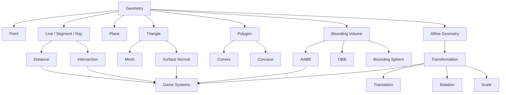
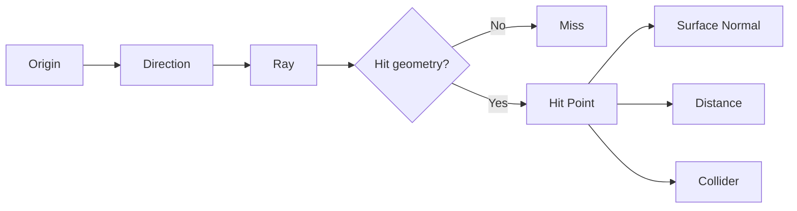
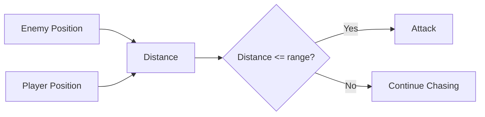
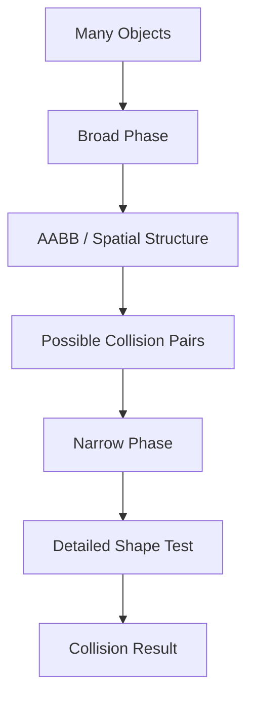
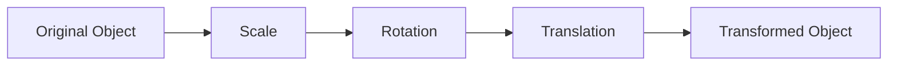
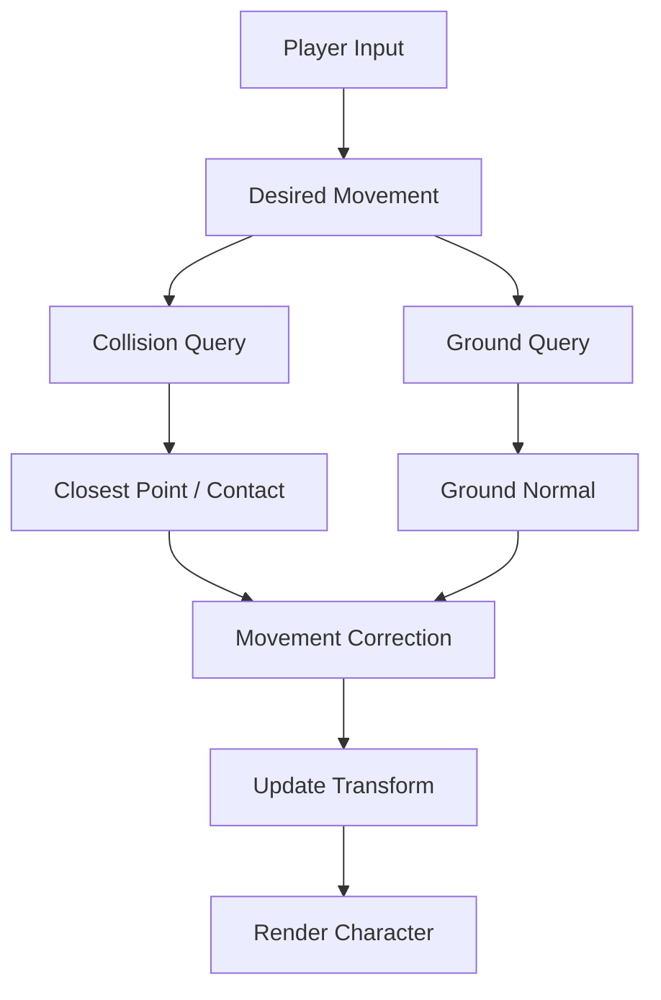
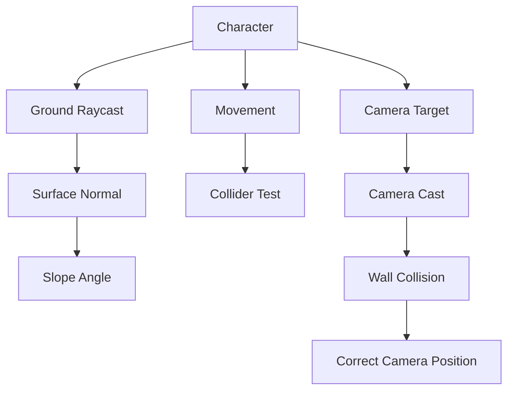
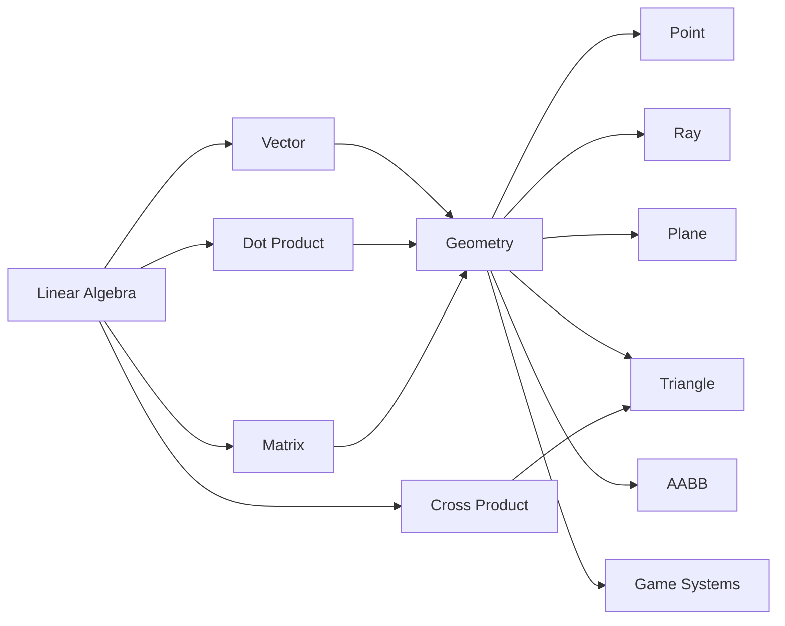
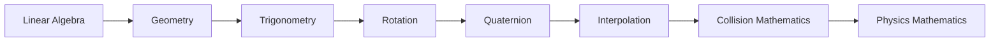

# 002 - Geometry

**Module:** Module 02 - Game Mathematics
**Roadmap item:** 2.2
**Nhóm nội dung:** Game Mathematics
**Thứ tự trong module:** 002
**Thời lượng gợi ý:** 40-55 phút
**Mức độ:** Nền tảng
**Ứng dụng chính:** Gameplay, Graphics, Physics, Collision, Camera, AI, Level Design

---

## 1. Tóm tắt

**Geometry – Hình học** trong Game Development là phần toán học dùng để mô tả:

* Object nằm ở đâu.
* Object có hình dạng như thế nào.
* Hai object có giao nhau hay không.
* Một điểm nằm bên trong hay bên ngoài một vùng.
* Khoảng cách giữa các object.
* Ray từ camera chạm vào vật thể nào.
* Mesh được cấu tạo từ các triangle như thế nào.
* Collider bao quanh object ra sao.
* Object thay đổi vị trí, rotation và scale như thế nào.

Có thể hình dung:

```text
Game World
│
├── Point
├── Line
├── Segment
├── Ray
├── Plane
├── Triangle
├── Polygon
├── Circle / Sphere
├── Rectangle / Box
└── Mesh

        ↓

Distance
Closest Point
Intersection
Inside / Outside
Surface Normal
Transform

        ↓

Movement
Collision
Raycast
Camera
Rendering
Animation
AI
```

Geometry thường kết hợp rất chặt với **Linear Algebra**.

Ví dụ:

```text
Geometry:
Triangle

Linear Algebra:
Cross Product

↓

Surface Normal
```

Hoặc:

```text
Geometry:
Ray

Linear Algebra:
Vector Direction

↓

Raycast
```

---

## 2. Mục tiêu học tập

Sau bài này, bạn nên có thể:

* Giải thích point, line, segment, ray và plane.
* Hiểu triangle và polygon trong game 2D/3D.
* Tính khoảng cách giữa hai điểm.
* Hiểu closest point.
* Hiểu surface normal.
* Phân biệt convex và concave.
* Hiểu bounding box.
* Hiểu AABB.
* Kiểm tra hai bounding box có overlap hay không.
* Hiểu khái niệm **Affine Space**.
* Hiểu **Affine Transformation**.
* Transform object trong không gian 2D/3D.
* Áp dụng Geometry vào:

  * movement;
  * collision;
  * raycast;
  * camera;
  * rendering;
  * animation;
  * AI;
  * level design.

---

# 3. Bức tranh tổng thể



---

# 4. Geometry trong Game

Một model 3D phức tạp thường được tạo từ rất nhiều vertex và triangle.

```text
Character Model
      ↓
Vertices
      ↓
Triangles
      ↓
Mesh Surface
```

Tuy nhiên phần physics không nhất thiết phải dùng chính mesh đó.

Ví dụ:

```text
Visual Mesh

      Character
         ↓
   Complex Geometry


Physics Collider

         ↓

      Capsule
```

Nguyên tắc quan trọng:

> **Visual Geometry không nhất thiết phải giống Collision Geometry.**

Một collider đơn giản thường:

* nhanh hơn;
* ổn định hơn;
* dễ debug hơn;
* ít gây lỗi physics hơn.

---

# 5. Point – Điểm

Point mô tả một **vị trí** trong không gian.

## 5.1 Point trong 2D

$$
P=(x,y)
$$

Ví dụ:

```text
Player = (4, 7)
```

---

## 5.2 Point trong 3D

$$
P=(x,y,z)
$$

Ví dụ:

```text
Player = (4, 2, 7)
```

Point trả lời câu hỏi:

```text
"Object đang ở đâu?"
```

---

# 6. Point và Vector

Trong code, cả point và vector có thể dùng cùng kiểu dữ liệu:

```csharp
Vector3 position;
Vector3 direction;
```

Nhưng ý nghĩa khác nhau.

### Point

```text
P = (5, 2, 8)

→ một vị trí
```

### Vector

```text
V = (1, 0, 0)

→ một hướng hoặc displacement
```

Một phép toán rất quan trọng:

```text
Point B - Point A
        ↓
      Vector
```

Ví dụ:

$$
A=(2,1)
$$

$$
B=(7,4)
$$

Khi đó:

$$
B-A=(7-2,\ 4-1)
$$

$$
B-A=(5,3)
$$

---

# 7. Line – Đường thẳng

Một line có thể biểu diễn bằng:

$$
P(t)=A+tD
$$

Trong đó:

* $A$ là một point nằm trên line.
* $D$ là direction vector.
* $t$ là parameter.

Với line vô hạn:

$$
t\in(-\infty,+\infty)
$$

Minh họa:

```text
←───────────────A────────────────→
                \
                 \ Direction
```

---

# 8. Line Segment

Line segment là đoạn hữu hạn nối hai điểm.

```text
A ●────────────────────────● B
```

Có thể biểu diễn:

$$
P(t)=A+t(B-A)
$$

với:

$$
0\leq t\leq1
$$

Khi:

$$
t=0
$$

thì:

$$
P=A
$$

Khi:

$$
t=1
$$

thì:

$$
P=B
$$

Khi:

$$
t=0.5
$$

thì $P$ nằm chính giữa $A$ và $B$.

---

# 9. Linear Interpolation trên Segment

Linear interpolation hay **Lerp**:

$$
P=(1-t)A+tB
$$

Dạng tương đương:

$$
P=A+t(B-A)
$$

Minh họa:

```text
A ●────────────────────────────● B

t=0      t=.25     t=.5     t=.75      t=1
```

Ứng dụng:

* camera movement;
* UI animation;
* waypoint movement;
* object transition;
* enemy movement.

---

# 10. Ray

Ray bắt đầu tại một origin và kéo dài vô hạn theo một hướng.

$$
R(t)=O+tD
$$

với:

$$
t\geq0
$$

Trong đó:

* $O$ = Origin.
* $D$ = Direction.
* $t$ = Distance parameter.

```text
Origin
  ●────────────────────────────→
              Direction
```

Ứng dụng:

* shooting;
* mouse picking;
* enemy vision;
* ground detection;
* camera collision;
* laser;
* interaction system.

---

# 11. Raycast

Raycast kiểm tra một ray có giao với geometry trong scene hay không.



Raycast thường trả về:

```text
Hit Point
Hit Distance
Surface Normal
Collider
Object
```

---

# 12. Ví dụ Raycast trong FPS

```text
Camera
  ●──────────────────────────────→

                     Enemy
                       █
                       █
                    Hit Point
```

Ví dụ Unity:

```csharp
Ray ray = new Ray(
    camera.transform.position,
    camera.transform.forward
);

if (Physics.Raycast(ray, out RaycastHit hit, 100f))
{
    Debug.Log(hit.point);
    Debug.Log(hit.normal);
}
```

---

# 13. Plane – Mặt phẳng

Plane là một bề mặt 2D vô hạn trong không gian 3D.

```text
              Normal
                 ↑
                 │
                 │
────────────────────────────────
              Plane
```

Một plane có thể được xác định bằng:

```text
1 Point
+
1 Normal Vector
```

---

# 14. Phương trình Plane

Một dạng phổ biến:

$$
ax+by+cz=d
$$

Trong đó normal của plane là:

$$
N=(a,b,c)
$$

Ví dụ ground:

$$
y=0
$$

có normal:

$$
N=(0,1,0)
$$

---

# 15. Plane được dùng ở đâu?

Plane xuất hiện trong:

* Ground detection.
* Water surface.
* Mirror.
* Portal.
* Clipping.
* Ray-plane intersection.
* Camera frustum.
* Collision.
* Projection.

Ví dụ:

```text
          Character
              ●
              │
              │
              ↓
================================
            Ground
```

---

# 16. Distance giữa hai điểm

## 16.1 Trong 2D

Cho:

$$
A=(x_1,y_1)
$$

và:

$$
B=(x_2,y_2)
$$

Khoảng cách:

$$
d=\sqrt{(x_2-x_1)^2+(y_2-y_1)^2}
$$

---

## 16.2 Trong 3D

$$
d=
\sqrt{
(x_2-x_1)^2+
(y_2-y_1)^2+
(z_2-z_1)^2
}
$$

Trong engine:

```csharp
float distance =
    Vector3.Distance(a, b);
```

---

# 17. Distance trong Gameplay

Ví dụ enemy attack:

```text
Enemy ●────────────────────● Player

             distance
```

Nếu:

```text
distance <= attackRange
```

thì enemy có thể attack.



---

# 18. Point-to-Line Distance

Giả sử point $P$ nằm ngoài line:

```text
                P
                ●
                │
                │ shortest distance
                │
A ●─────────────●────────────● B
                C
```

$C$ là closest point của $P$ lên line.

Một cách tính thực tế:

```text
P - A
   ↓
Project lên AB
   ↓
Find parameter t
   ↓
Closest Point
```

---

# 19. Closest Point trên Segment

Cho segment $AB$ và point $P$.

Parameter:

$$
t=
\frac{
(P-A)\cdot(B-A)
}{
|B-A|^2
}
$$

Sau đó clamp:

$$
t=\operatorname{clamp}(t,0,1)
$$

Closest point:

$$
C=A+t(B-A)
$$

Minh họa:

```text
                   P
                   ●
                   │
                   │
                   │
A ●────────────────●──────────────● B
                   C
```

Ứng dụng:

* Distance to road.
* Character vs wall.
* Capsule collision.
* Rail movement.
* Rope.
* AI path.
* Trigger regions.

---

# 20. Triangle – Tam giác

Triangle được xác định bởi 3 vertex.

```text
              C
              ●
             / \
            /   \
           /     \
          /       \
         ●─────────●
         A         B
```

Triangle có:

* 3 vertices;
* 3 edges;
* 1 surface;
* một normal trong 3D.

---

# 21. Vì sao Triangle quan trọng?

Hầu hết mesh 3D cuối cùng được render bằng triangle.

Ví dụ một quad:

```text
A ●────────────● B
  │            │
  │            │
  │            │
D ●────────────● C
```

có thể chia thành:

```text
A ●────────────● B
  │\           │
  │ \          │
  │  \         │
D ●────────────● C
```

Tạo thành:

```text
Triangle ABC
Triangle ACD
```

---

# 22. Triangle Normal

Cho triangle có ba điểm:

$$
A,\ B,\ C
$$

Ta tạo hai cạnh:

$$
E_1=B-A
$$

$$
E_2=C-A
$$

Normal:

$$
N=E_1\times E_2
$$

hay:

$$
N=(B-A)\times(C-A)
$$

Normalized normal:

$$
\hat N=\frac{N}{|N|}
$$

Ví dụ:

```text
          Normal
            ↑
            │
            │
           /\
          /  \
         /____\
```

---

# 23. Triangle Winding

Thứ tự vertex rất quan trọng.

```text
A → B → C
```

khác với:

```text
A → C → B
```

Vì:

$$
A\times B=-(B\times A)
$$

nên đổi thứ tự cross product sẽ làm normal đổi hướng.

Đây là nguyên nhân thường gặp của lỗi:

```text
normal hướng vào mesh
```

thay vì:

```text
normal hướng ra ngoài
```

---

# 24. Back-Face Culling

Renderer thường có thể bỏ qua những triangle quay mặt sau về phía camera.

```text
Camera
   ●
    \
     \
      \
       ▲
      / \
     /   \
    /_____\
```

Lợi ích:

* giảm số triangle cần xử lý;
* giảm fragment processing;
* tăng hiệu năng render.

---

# 25. Polygon

Polygon được tạo bởi nhiều vertex nối thành một vùng khép kín.

```text
        ●───────●
       /         \
      ●           ●
       \         /
        ●───────●
```

Ví dụ:

```text
Triangle
Quad
Pentagon
Hexagon
```

---

# 26. Convex Polygon

Một polygon là **convex** nếu đoạn thẳng nối bất kỳ hai điểm bên trong polygon vẫn nằm hoàn toàn bên trong polygon.

```text
       ●──────●
      /        \
     ●          ●
      \        /
       ●──────●
```

---

# 27. Concave Polygon

Concave polygon có phần lõm vào.

```text
       ●──────●
       │     /
       │    /
       ●   ●
       │    \
       │     \
       ●──────●
```

Một đoạn nối hai điểm trong polygon có thể đi ra ngoài polygon.

---

# 28. Vì sao Convex quan trọng trong Physics?

Convex geometry thường dễ kiểm tra collision hơn.

Ví dụ một mesh phức tạp:

```text
Detailed Character Mesh
```

có thể được bao bởi:

```text
Convex Hull
```

```text
        __________
      /            \
     /    OBJECT    \
    |                |
     \              /
      \____________/
```

Ưu điểm:

* collision nhanh hơn;
* shape đơn giản hơn;
* phù hợp broad/narrow phase;
* ổn định hơn trong physics simulation.

---

# 29. Barycentric Coordinates

Một point $P$ trong triangle có thể biểu diễn bằng:

$$
P=\alpha A+\beta B+\gamma C
$$

với:

$$
\alpha+\beta+\gamma=1
$$

Nếu point nằm trong triangle thì thường:

$$
\alpha\geq0,\qquad
\beta\geq0,\qquad
\gamma\geq0
$$

Minh họa:

```text
             C
             ●
            / \
           /   \
          /  P  \
         /   ●   \
        /         \
       ●───────────●
       A           B
```

Ứng dụng:

* interpolate UV;
* interpolate vertex color;
* interpolate normal;
* interpolate depth;
* rasterization.

---

# 30. Bounding Volume

Collision trực tiếp với một mesh nhiều triangle có thể rất tốn.

Do đó engine thường sử dụng bounding volume đơn giản hơn.

```text
Complex Mesh
     ↓
Bounding Volume
     ↓
Possible Collision?
     ↓
No  → Stop
Yes → Detailed Test
```

---

# 31. Bounding Box

Bounding box là một box bao quanh object.

```text
┌────────────────────────────┐
│                            │
│        Character           │
│           /\               │
│          /  \              │
│         /____\             │
│                            │
└────────────────────────────┘
```

---

# 32. AABB

**AABB = Axis-Aligned Bounding Box**

Các cạnh của AABB luôn song song với các trục coordinate.

```text
X
Y
Z
```

AABB thường được biểu diễn bằng:

```text
min
max
```

hoặc:

```text
position
size
```

---

# 33. AABB với Min và Max

Ví dụ:

$$
B_{\min}=(x_{\min},y_{\min},z_{\min})
$$

$$
B_{\max}=(x_{\max},y_{\max},z_{\max})
$$

Minh họa:

```text
                max
                 ●
               / |
              /  |
             /   |
            /    |
           ●─────┘
          min
```

---

# 34. AABB Intersection

Hai AABB overlap nếu chúng overlap trên tất cả các axis:

```text
X
AND
Y
AND
Z
```

Trong 2D:

```text
Box A

┌───────────┐
│           │
│      ┌────┼────────┐
│      │    │        │
└──────┼────┘        │
       │    Box B    │
       └─────────────┘
```

---

# 35. Điều kiện AABB 2D

Hai rectangle **không overlap** nếu một trong các điều kiện sau đúng:

```text
A.maxX < B.minX

OR

A.minX > B.maxX

OR

A.maxY < B.minY

OR

A.minY > B.maxY
```

Nếu không có điều kiện nào đúng thì hai box overlap.

Trong 3D bổ sung kiểm tra trục Z.

---

# 36. Broad Phase và Narrow Phase

Collision system thường chia thành:



### Broad Phase

Mục tiêu:

```text
Loại bỏ thật nhanh những object chắc chắn không thể va chạm.
```

### Narrow Phase

Mục tiêu:

```text
Kiểm tra collision chính xác hơn giữa các candidate còn lại.
```

---

# 37. OBB

**OBB = Oriented Bounding Box**

Khác với AABB, OBB có thể rotate theo object.

```text
AABB

┌──────────────────┐
│       /────/     │
│      /____/      │
│                  │
└──────────────────┘
```

So với:

```text
OBB

       /──────/
      /      /
     /______/
```

### AABB

* đơn giản;
* nhanh;
* không rotate theo object.

### OBB

* fit object tốt hơn;
* rotation được giữ;
* intersection test phức tạp hơn.

---

# 38. Bounding Sphere

Bounding sphere được xác định bởi:

* center;
* radius.

```text
        __________
      /            \
     /              \
    |       ●        |
     \              /
      \____________/
```

Hai sphere overlap nếu:

$$
d(C_1,C_2)\leq r_1+r_2
$$

Trong đó:

* $C_1$, $C_2$ là center.
* $r_1$, $r_2$ là radius.

---

# 39. Affine Space

Affine Space tập trung vào mối quan hệ giữa:

```text
Points
+
Vectors
```

Các phép toán quan trọng:

```text
Point - Point = Vector
```

```text
Point + Vector = Point
```

Ví dụ:

```text
Point A
   ●
    \
     \
      \ Vector V
       \
        ●
      Point B
```

Ta có:

$$
B=A+V
$$

---

# 40. Affine Space trong Gameplay

Movement cơ bản:

$$
P_{\text{new}}
==============

P_{\text{old}}
+
V\Delta t
$$

Trong đó:

* $P_{\text{old}}$ = old position.
* $V$ = velocity.
* $\Delta t$ = frame time.
* $V\Delta t$ = displacement.
* $P_{\text{new}}$ = new position.

Có thể hiểu:

```text
Old Point
   +
Displacement Vector
   ↓
New Point
```

---

# 41. Affine Transformation

Affine transformation bảo toàn các tính chất như:

* đường thẳng vẫn là đường thẳng;
* các đường song song vẫn song song;
* tỉ lệ điểm trên cùng một line được bảo toàn.

Các affine transformation phổ biến:

```text
Translation
Rotation
Scale
Shear
Reflection
```

---

# 42. Transformation Pipeline



Điều cần nhớ:

> **Thứ tự transform có thể thay đổi kết quả.**

```text
Rotate → Translate
```

không nhất thiết giống:

```text
Translate → Rotate
```

---

# 43. Translation

Translation di chuyển một point bằng displacement vector.

$$
P'=P+T
$$

Ví dụ:

$$
P=(2,3)
$$

$$
T=(5,1)
$$

Khi đó:

$$
P'=(7,4)
$$

Ứng dụng:

* Player movement.
* Camera movement.
* Projectile.
* Moving platform.
* Object placement.

---

# 44. Rotation trong 2D

Rotation một point quanh origin:

$$
x'=x\cos\theta-y\sin\theta
$$

$$
y'=x\sin\theta+y\cos\theta
$$

Minh họa:

```text
Y
↑

│       B
│      ●
│     /
│    /
│   /
O────────────● A → X
```

Point $A$ được rotate quanh origin $O$ thành $B$.

---

# 45. Rotation Matrix 2D

Rotation cũng có thể biểu diễn bằng matrix:

$$
R(\theta)=
\begin{bmatrix}
\cos\theta & -\sin\theta \
\sin\theta & \cos\theta
\end{bmatrix}
$$

Với point:

$$
P=
\begin{bmatrix}
x \
y
\end{bmatrix}
$$

Point sau rotation:

$$
P'=R(\theta)P
$$

Cụ thể:

$$
\begin{bmatrix}
x' \
y'
\end{bmatrix}
=============

\begin{bmatrix}
\cos\theta & -\sin\theta \
\sin\theta & \cos\theta
\end{bmatrix}
\begin{bmatrix}
x \
y
\end{bmatrix}
$$

---

# 46. Scale

Scale một point theo từng axis.

Trong 2D:

$$
x'=s_xx
$$

$$
y'=s_yy
$$

Scale matrix:

$$
S=
\begin{bmatrix}
s_x & 0 \
0 & s_y
\end{bmatrix}
$$

Ví dụ:

```text
Original

   □

Scale × 2

   ┌──────┐
   │      │
   │      │
   └──────┘
```

Trong 3D:

```text
Scale = (2, 1, 0.5)
```

nghĩa là:

```text
X × 2
Y × 1
Z × 0.5
```

---

# 47. Homogeneous Coordinates

Trong graphics 3D, transform thường dùng matrix $4\times4$.

Một point 3D:

$$
P=(x,y,z)
$$

được mở rộng thành:

$$
P_h=
\begin{bmatrix}
x \
y \
z \
1
\end{bmatrix}
$$

Một direction vector thường dùng:

$$
V_h=
\begin{bmatrix}
x \
y \
z \
0
\end{bmatrix}
$$

Điểm khác biệt ở thành phần cuối giúp translation ảnh hưởng tới point nhưng không ảnh hưởng direction theo cùng cách.

---

# 48. Affine Transform Matrix 3D

Một transform 3D có thể biểu diễn bằng matrix:

$$
M=
\begin{bmatrix}
r_{00} & r_{01} & r_{02} & t_x \
r_{10} & r_{11} & r_{12} & t_y \
r_{20} & r_{21} & r_{22} & t_z \
0 & 0 & 0 & 1
\end{bmatrix}
$$

Trong đó:

* phần $3\times3$ phía trên bên trái biểu diễn rotation/scale/shear;
* $t_x,t_y,t_z$ biểu diễn translation.

Transform point:

$$
P_{\text{world}}
================

M
P_{\text{local}}
$$

---

# 49. Local Geometry và World Geometry

Một mesh vertex có thể nằm tại:

```text
Local Position

(1, 0, 0)
```

Object được đặt tại:

```text
World Position

(10, 0, 5)
```

Pipeline:

```text
Local Point
    ↓
Object Transform
    ↓
World Point
```

Không nên so sánh trực tiếp:

```text
Local Vertex
```

với:

```text
World Player Position
```

nếu chưa chuyển chúng về cùng coordinate space.

---

# 50. Local Space và World Space

```text
World Y
↑

│                    local Y
│                       ↗
│                Object ●────→ local X
│
│
└────────────────────────────────→ World X
```

### Local Space

Tọa độ tương đối với object hoặc parent.

### World Space

Tọa độ chung của toàn scene.

---

# 51. Geometry trong Camera

Camera cũng được mô tả bởi geometry.

Ví dụ **view frustum**:

```text
                     Far Plane
               ┌────────────────┐
              /                  \
             /                    \
Camera ●────/                      \
           \                       /
            \                     /
             └───────────────────┘
                  Near Plane
```

Frustum có thể xem như một vùng được giới hạn bởi nhiều plane.

---

# 52. Frustum Culling

Nếu một object nằm hoàn toàn ngoài frustum:

```text
không cần render
```

Ví dụ:

```text
               Camera View

Camera ●   \                  /
           \       A ●       /
            \               /
             \             /
              \___________/

                           B ●
                       Outside
```

Object $B$ có thể bị cull.

---

# 53. Geometry trong Character Controller

Visual mesh:

```text
      O
     /|\
     / \
```

Collider thực tế có thể là:

```text
      ______
    /        \
   |          |
   |          |
    \________/
```

Capsule collider thường được dùng cho character vì:

* ít mắc vào corner;
* trượt dọc tường tốt;
* dễ xử lý slope;
* collision ổn định.

---

# 54. Ground Detection

Một cách phổ biến là cast ray xuống dưới.

```text
       Player
         ●
         │
         │ Ray
         ↓
───────────────────── Ground
         ↑
       Normal
```

Ta lấy được:

```text
Hit Point
Surface Normal
Distance
Collider
```

Từ đó xác định:

```text
isGrounded
```

---

# 55. Slope Detection

Cho:

* ground normal $N$;
* world up $U$.

Nếu cả hai normalized:

$$
N\cdot U=\cos\theta
$$

Do đó:

$$
\theta=
\arccos(N\cdot U)
$$

Minh họa:

```text
           Normal
             ↗
            /
           /
──────────/───────── Slope
```

Nếu:

```text
slopeAngle > maxSlopeAngle
```

character có thể không được phép đi lên.

---

# 56. Geometry trong Camera Collision

Third-person camera:

```text
Target ●────────────────────────● Desired Camera
```

Nếu có wall:

```text
Target ●──────█─────────────────●
              Wall
```

Camera không nên xuyên qua wall.

Pipeline:

```text
Target
   ↓
Ray / Sphere Cast
   ↓
Desired Camera Position
   ↓
Find Obstacle
   ↓
Move Camera Before Obstacle
```

---

# 57. Geometry trong AI

AI sử dụng Geometry cho:

* distance;
* line of sight;
* ray visibility;
* field of view;
* cover detection;
* navigation;
* obstacle avoidance;
* nearest point.

Ví dụ:

```text
                         Player
                           ●
                          /
                         /
                        /
Enemy ●────────────────→
       Forward
```

Hệ thống perception có thể kết hợp:

```text
Distance
+
Dot Product
+
Raycast
```

---

# 58. Geometry trong Navigation

Navigation mesh thường chia walkable area thành polygon.

```text
┌───────────────────────────────┐
│ \      /│\                    │
│  \    / │ \                   │
│   \  /  │  \                  │
│____\/___│___\_________________│
```

AI tìm path qua các polygon kết nối với nhau.

Geometry được dùng để:

* xác định walkable surface;
* kiểm tra adjacency;
* tìm portal giữa polygon;
* tính closest nav point;
* tránh obstacle.

---

# 59. Geometry trong Level Design

Level prototype thường bắt đầu từ primitive:

```text
Box
Plane
Cylinder
Sphere
Ramp
```

Sau đó kết hợp thành:

```text
Room
Corridor
Platform
Doorway
Stairs
Arena
```

Geometry giúp level designer kiểm soát:

* khoảng cách;
* scale;
* visibility;
* collision;
* cover;
* traversal.

---

# 60. Pipeline Geometry trong Character Movement



---

# 61. Demo thực hành đề xuất

## Geometry Playground

Scene:

```text
GeometryDemo
│
├── Player
├── Target
├── PointA
├── PointB
├── Triangle
├── Plane
├── BoxA
├── BoxB
└── DebugDrawer
```

Demo nên minh họa:

```text
Point
Segment
Ray
Plane
Triangle
Normal
Closest Point
AABB
Intersection
Transform
```

---

# 62. Demo 1 – Distance

Vẽ:

```text
Player ●────────────────────● Target
```

Hiển thị:

```text
Distance = 8.32
```

Unity:

```csharp
float distance =
    Vector3.Distance(
        player.position,
        target.position
    );
```

---

# 63. Demo 2 – Closest Point

```text
                 Player
                    ●
                    │
                    │
A ●─────────────────●─────────────● B
                  Closest
```

Hiển thị realtime:

```text
Closest Point
Distance
Parameter t
```

---

# 64. Demo 3 – Raycast

```text
Origin
  ●──────────────────────────────→

                     █
                     █ Box
                     █
```

Debug:

```text
Hit = true
Hit Point
Hit Distance
Normal
Collider
```

---

# 65. Demo 4 – Plane Projection

```text
         P
         ●
         │
         │
         │
         ● P'
──────────────────────── Plane
```

$P'$ là projection của $P$ xuống plane.

Về mặt vector, nếu plane đi qua $Q$ với unit normal $N$:

$$
d=(P-Q)\cdot N
$$

Projection:

$$
P'=P-dN
$$

---

# 66. Demo 5 – Triangle Normal

```csharp
Vector3 edge1 = B - A;
Vector3 edge2 = C - A;

Vector3 normal =
    Vector3.Cross(edge1, edge2).normalized;
```

Debug:

```text
         Normal
           ↑
           │
          /\
         /  \
        /____\
```

Thử đổi:

```csharp
Vector3.Cross(edge2, edge1)
```

để quan sát normal đảo hướng.

---

# 67. Demo 6 – AABB Collision

Không overlap:

```text
┌─────────┐       ┌─────────┐
│    A    │       │    B    │
└─────────┘       └─────────┘
```

Overlap:

```text
┌────────────┐
│ A   ┌──────┼──────┐
│     │      │ B    │
└─────┼──────┘      │
      └─────────────┘
```

Hiển thị:

```text
Overlap X
Overlap Y
Overlap Z
Collision
```

---

# 68. Demo 7 – Affine Transform

Tạo triangle:

```text
       ●
      / \
     /___\
```

Cho điều khiển:

```text
Position X/Y
Rotation
Scale X/Y
```

Pipeline:

```text
Original Vertices
       ↓
Scale
       ↓
Rotation
       ↓
Translation
       ↓
World Vertices
```

---

# 69. Geometry Debug Overlay

```text
┌──────────────────────────────────┐
│ GEOMETRY DEBUG                   │
├──────────────────────────────────┤
│ Point A      (2, 0, 3)           │
│ Point B      (8, 0, 7)           │
│ Distance     7.21                │
│ Closest      (5.2, 0, 4.8)       │
│ Ray Hit      YES                 │
│ Hit Distance 3.74                │
│ Normal       (0, 1, 0)           │
│ AABB Hit     NO                  │
└──────────────────────────────────┘
```

---

# 70. Debug Visualization nên có

Quy ước ví dụ:

```text
Point        → Sphere
Segment      → Line
Ray          → Arrow
Normal       → Arrow
AABB         → Wireframe Box
Plane        → Grid
ClosestPoint → Small Sphere
```

Concept:

```text
                  Normal
                    ↑
                    │
Ray ────────────────● Hit
                   /
                  /
─────────────────/──────── Plane
```

---

# 71. Các lỗi thường gặp

## Lỗi 1 – Nhầm Line, Segment và Ray

```text
Line

←────────────────────────────→
```

```text
Segment

●────────────────────────────●
```

```text
Ray

●────────────────────────────→
```

Parameter:

### Line

$$
t\in(-\infty,+\infty)
$$

### Segment

$$
0\leq t\leq1
$$

### Ray

$$
t\geq0
$$

---

## Lỗi 2 – Không clamp Closest Point

Công thức projection có thể tạo:

$$
t<0
$$

hoặc:

$$
t>1
$$

Nếu đang xử lý **segment**, phải clamp:

$$
t=\operatorname{clamp}(t,0,1)
$$

---

## Lỗi 3 – Cross Product sai thứ tự

$$
A\times B
$$

khác:

$$
B\times A
$$

và:

$$
A\times B=-(B\times A)
$$

Triệu chứng:

```text
Surface Normal bị ngược.
```

---

## Lỗi 4 – Dùng Collision Mesh quá chi tiết

Không nên mặc định:

```text
Visual Mesh
=
Collision Mesh
```

Một object có hàng chục nghìn triangle thường nên dùng collider đơn giản hơn nếu gameplay không cần collision chính xác tới từng polygon.

---

## Lỗi 5 – Nhầm Coordinate Space

Sai:

```text
Local Vertex
so sánh trực tiếp với
World Player Position
```

Đúng:

```text
Chuyển cả hai về cùng space
rồi mới tính toán.
```

---

## Lỗi 6 – So sánh Float tuyệt đối

Không nên mặc định:

```csharp
a == b
```

cho các kết quả hình học floating-point.

Thường nên sử dụng epsilon:

$$
|a-b|<\varepsilon
$$

Ví dụ:

```csharp
Mathf.Abs(a - b) < epsilon
```

---

## Lỗi 7 – Quên kiểm tra Degenerate Geometry

Ví dụ triangle:

```text
A, B, C
```

nằm trên cùng một line.

Khi đó area gần bằng 0.

Cross product:

$$
(B-A)\times(C-A)
$$

có magnitude gần:

$$
0
$$

Normal sẽ không còn ổn định.

---

# 72. Bài tập thực hành

## Bài 1 – Geometry Viewer

Hiển thị:

* Point A.
* Point B.
* Segment AB.
* Distance.
* Direction.
* Midpoint.

Midpoint:

$$
M=\frac{A+B}{2}
$$

---

## Bài 2 – Closest Point

Cho player chạy quanh segment.

Hiển thị:

```text
Player
Closest Point
Distance
Parameter t
```

---

## Bài 3 – Raycast Shooter

Click chuột:

```text
Camera
  ↓
Generate Ray
  ↓
Physics Query
  ↓
Hit Object
```

Debug:

```text
Hit Position
Normal
Distance
Object Name
```

---

## Bài 4 – Triangle Debugger

Cho phép kéo:

```text
A
B
C
```

Realtime hiển thị:

```text
Edge AB
Edge AC
Normal
Area
```

Area triangle:

$$
A_{\triangle}
=============

\frac{1}{2}
\left|
(B-A)\times(C-A)
\right|
$$

---

## Bài 5 – AABB Playground

Hiển thị:

```text
A.min
A.max

B.min
B.max

Overlap X
Overlap Y
Overlap Z

Collision
```

---

## Bài 6 – Affine Transform Playground

Tạo polygon 2D.

UI:

```text
Translation
Rotation
Scale
```

Hiển thị đồng thời:

```text
Original Shape
Transformed Shape
```

---

# 73. Mini Project

## `Game Geometry Visualizer`

Cấu trúc:

```text
game-geometry-visualizer/
│
├── README.md
│
├── Screenshots/
│
├── Scenes/
│   └── GeometryDemo
│
├── Scripts/
│   ├── DistanceDemo.cs
│   ├── ClosestPointDemo.cs
│   ├── RayDemo.cs
│   ├── TriangleDemo.cs
│   ├── BoundsDemo.cs
│   └── TransformDemo.cs
│
└── Demo.gif
```

README nên giải thích:

```text
Point
Segment
Ray
Plane
Triangle
Normal
AABB
Intersection
Affine Transform
```

---

# 74. Artifact nên tạo

## Artifact 1 – Geometry Math Demo

Demo:

```text
Point
Line
Ray
Plane
Triangle
AABB
Transform
```

---

## Artifact 2 – Geometry Cheat Sheet

File:

```text
game-geometry-cheatsheet.md
```

Bao gồm:

```text
Point
Vector
Segment
Ray
Plane
Triangle
Polygon
AABB
Closest Point
Intersection
```

---

## Artifact 3 – Debug Diagram

```text
                  Surface Normal
                        ↑
                        │
Ray ────────────────────● Hit
                       /
                      /
─────────────────────/────── Plane
```

---

# 75. Portfolio Project đề xuất

## Third-Person Geometry Debugger

Bao gồm:

```text
Character Capsule
Ground Raycast
Ground Normal
Slope Angle
Camera Raycast
Camera Collision
Obstacle Bounds
Closest Point
```

Pipeline:



Project này kết hợp:

```text
Linear Algebra
Geometry
Physics Query
Camera
Character Movement
Debug Visualization
```

---

# 76. Cheat Sheet

| Câu hỏi trong game                 | Geometry / phép toán |
| ---------------------------------- | -------------------- |
| Hai object cách nhau bao xa?       | Point distance       |
| Target nằm gần segment ở đâu nhất? | Closest point        |
| Đạn chạm vật gì?                   | Ray intersection     |
| Player cách ground bao xa?         | Raycast              |
| Surface hướng về đâu?              | Triangle normal      |
| Hai box overlap không?             | AABB intersection    |
| Hai sphere chạm nhau không?        | Center distance      |
| Mesh được cấu tạo từ gì?           | Triangle             |
| Camera thấy object không?          | Frustum              |
| Object nằm trong vùng không?       | Polygon / Volume     |
| Local point sang world thế nào?    | Transform            |
| AI đi được ở đâu?                  | Navigation geometry  |

---

# 77. Mental Model quan trọng

```text
POINT
"Ở đâu?"

↓

SEGMENT
"Đoạn này nối hai điểm nào?"

↓

RAY
"Nếu đi từ đây theo hướng này thì gặp gì?"

↓

PLANE
"Surface vô hạn này nằm ở đâu?"

↓

TRIANGLE
"Surface cơ bản được tạo thế nào?"

↓

POLYGON / MESH
"Object có hình dạng gì?"

↓

BOUNDING VOLUME
"Object được bao bởi vùng nào?"

↓

DISTANCE
"Chúng cách nhau bao xa?"

↓

INTERSECTION
"Chúng có giao nhau không?"

↓

TRANSFORM
"Geometry thay đổi thế nào?"
```

---

# 78. Câu hỏi tự kiểm tra

### Câu 1

Line, segment và ray khác nhau như thế nào?

<details>
<summary>Đáp án</summary>

```text
Line:
vô hạn theo cả hai hướng.

Segment:
hữu hạn giữa hai điểm.

Ray:
bắt đầu tại origin và vô hạn theo một hướng.
```

</details>

---

### Câu 2

Triangle normal được tính như thế nào?

<details>
<summary>Đáp án</summary>

$$
N=
(B-A)\times(C-A)
$$

Sau đó:

$$
\hat N=
\frac{N}{|N|}
$$

</details>

---

### Câu 3

Tại sao thứ tự vertex quan trọng?

<details>
<summary>Đáp án</summary>

Vì đổi winding order sẽ làm hướng normal thay đổi.

$$
A\times B=-(B\times A)
$$

</details>

---

### Câu 4

AABB là gì?

<details>
<summary>Đáp án</summary>

**Axis-Aligned Bounding Box** là bounding box có các cạnh luôn song song với các trục coordinate.

</details>

---

### Câu 5

AABB có lợi ích gì?

<details>
<summary>Đáp án</summary>

AABB có intersection test đơn giản và nhanh, phù hợp cho broad-phase collision detection và spatial query.

</details>

---

### Câu 6

Point + Vector tạo ra gì?

<details>
<summary>Đáp án</summary>

Một point mới.

$$
P_{\text{new}}
==============

P_{\text{old}}
+
V
$$

</details>

---

### Câu 7

Affine Transformation gồm những phép biến đổi nào?

<details>
<summary>Đáp án</summary>

Phổ biến gồm:

```text
Translation
Rotation
Scale
Shear
Reflection
```

</details>

---

### Câu 8

Raycast thường trả về gì?

<details>
<summary>Đáp án</summary>

Tùy engine nhưng thường gồm:

```text
Hit Object
Hit Point
Distance
Surface Normal
Collider
```

</details>

---

# 79. Checklist hoàn thành bài

* [ ] Hiểu point trong 2D/3D.
* [ ] Phân biệt point và vector.
* [ ] Phân biệt line, segment và ray.
* [ ] Hiểu plane.
* [ ] Tính được distance.
* [ ] Hiểu closest point.
* [ ] Hiểu triangle.
* [ ] Tính được triangle normal.
* [ ] Hiểu winding order.
* [ ] Phân biệt convex và concave polygon.
* [ ] Hiểu bounding volume.
* [ ] Hiểu AABB.
* [ ] Hiểu AABB intersection.
* [ ] Hiểu bounding sphere.
* [ ] Hiểu affine space.
* [ ] Hiểu affine transformation.
* [ ] Hiểu homogeneous coordinates cơ bản.
* [ ] Phân biệt local và world geometry.
* [ ] Tạo được raycast demo.
* [ ] Tạo được geometry debug scene.
* [ ] Viết README giải thích demo.

---

# 80. Liên hệ với Linear Algebra

Geometry và Linear Algebra nên được học cùng nhau.



Ví dụ:

```text
Triangle
+
Cross Product
=
Surface Normal
```

```text
Ray
+
Direction Vector
=
Raycast
```

```text
Plane
+
Dot Product
=
Point-to-Plane Distance
```

```text
Point
+
Transform Matrix
=
Point trong Coordinate Space mới
```

---

# 81. Nội dung nên học tiếp



Các chủ đề tiếp theo nên học:

```text
Angles
Degrees / Radians
Sin / Cos / Tan
Quaternion
Lerp
Slerp
Ray Intersection
Sphere Intersection
SAT
Collision Response
Velocity
Acceleration
Forces
```

---

# 82. Tổng kết

Geometry trong Game Development không chỉ là:

```text
tam giác
hình vuông
đường tròn
```

mà là cách mô tả **không gian của game**.

Hãy nhớ:

```text
Point
→ Object ở đâu?

Segment
→ Đoạn nối hai vị trí nằm ở đâu?

Ray
→ Nếu bắn từ đây theo hướng này thì gặp gì?

Plane
→ Surface nằm ở đâu?

Triangle
→ Surface cơ bản được tạo thế nào?

Normal
→ Surface đang hướng về đâu?

Distance
→ Hai object cách nhau bao xa?

Closest Point
→ Điểm gần geometry nhất nằm ở đâu?

AABB
→ Object được bao bởi vùng nào?

Intersection
→ Hai geometry có giao nhau không?

Affine Transform
→ Geometry thay đổi vị trí, rotation hoặc scale thế nào?
```

Mental model tổng thể:

```text
                GAME WORLD
                    │
                    ▼

                 POINTS
                    │
                    ▼

          LINES / RAYS / PLANES
                    │
                    ▼

           TRIANGLES / POLYGONS
                    │
                    ▼

                  MESH
                    │
                    ▼

           BOUNDING VOLUMES
                    │
                    ▼

       DISTANCE / INTERSECTION
                    │
                    ▼

              TRANSFORMS
                    │
                    ▼

                  GAME
         ┌──────────┼──────────┐
         ↓          ↓          ↓
     Collision    Camera      AI
         ↓          ↓          ↓
      Physics    Rendering  Navigation
```

Mục tiêu cuối cùng không phải thuộc lòng tất cả công thức.

Mục tiêu là khi gặp một vấn đề như:

```text
Đạn có chạm enemy không?

Player cách mặt đất bao xa?

Camera có xuyên tường không?

NPC có nhìn xuyên vật cản không?

Object nào gần đường này nhất?

Hai collider có overlap không?

Surface đang nghiêng bao nhiêu?

Vertex này đang ở đâu trong World Space?
```

bạn có thể nhận ra:

> **Đây là một bài toán Geometry kết hợp với Linear Algebra.**

---

# Bài luyện tập

## Mục tiêu


## Đề bài


## Yêu cầu hoàn thành

- [ ] 
- [ ] 
- [ ] 

## Kết quả / lời giải


## Ghi chú
