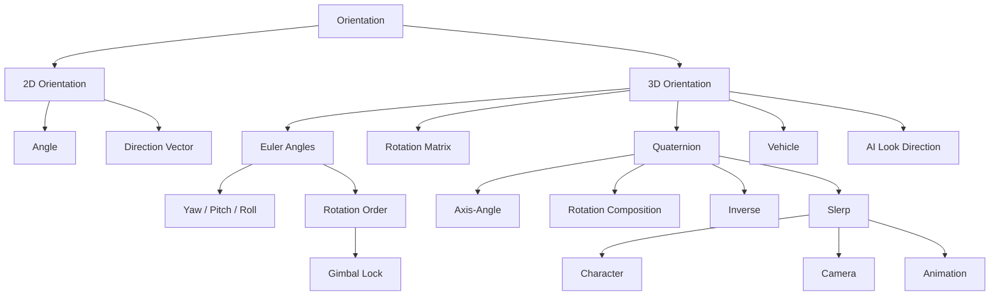
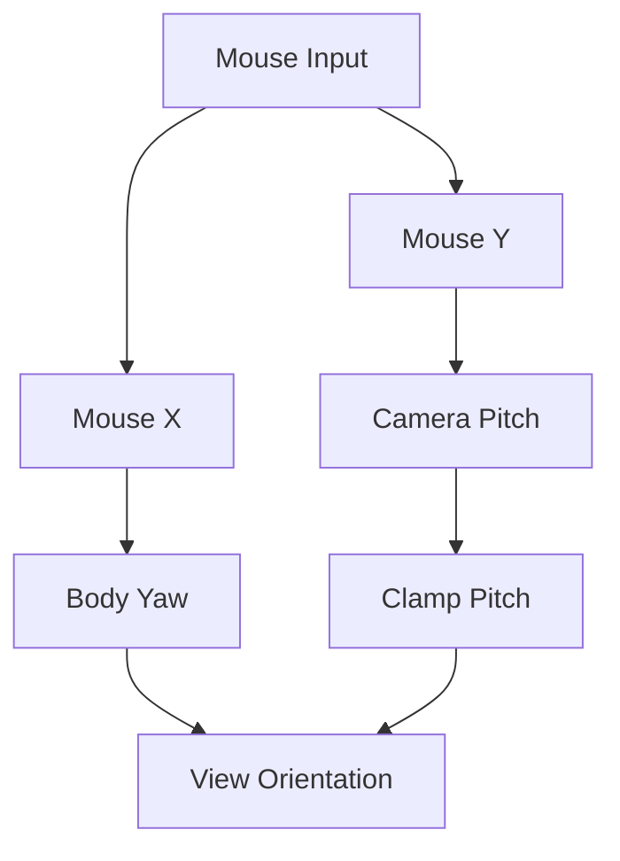
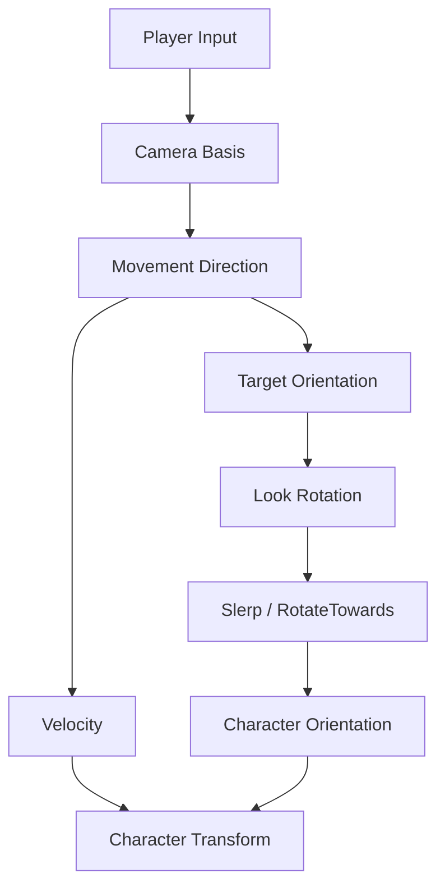
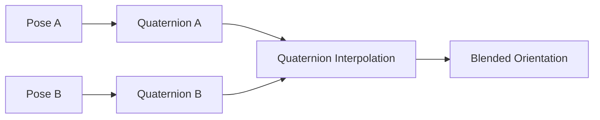
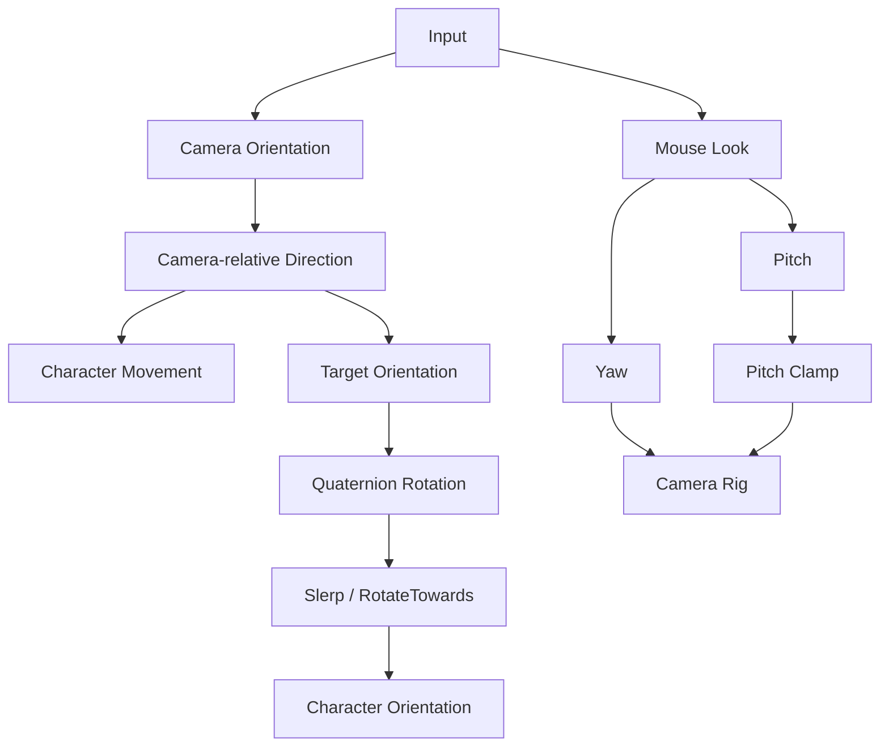
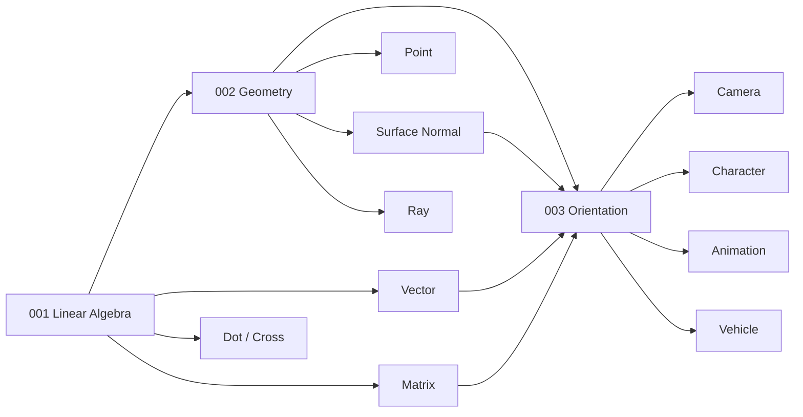
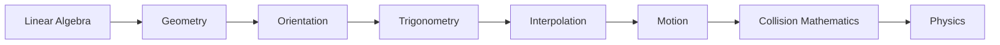

# 003 - Orientation

**Module:** Module 02 - Game Mathematics
**Roadmap item:** 2.3
**Nhóm nội dung:** Game Mathematics
**Thứ tự trong module:** 003
**Thời lượng gợi ý:** 40-55 phút
**Mức độ:** Nền tảng → Trung cấp
**Ứng dụng chính:** Character Controller, Camera, Animation, Vehicle, AI, Physics

---

## 1. Tóm tắt

**Orientation** mô tả một object đang **hướng hoặc quay như thế nào trong không gian**.

Có thể phân biệt nhanh:

```text
Position
→ Object đang ở đâu?

Orientation
→ Object đang hướng về đâu?
```

Ví dụ trong game:

* Nhân vật quay về hướng di chuyển.
* Camera nhìn lên, xuống, trái, phải.
* Enemy quay mặt về Player.
* Turret hướng nòng súng về target.
* Xe nghiêng khi vào cua.
* Máy bay sử dụng yaw, pitch và roll.
* Bone trong animation thay đổi orientation.
* Object chuyển mượt giữa hai rotation.

Hai representation quan trọng nhất cần học:

```text
Euler Angles
+
Quaternion
```

---

## 2. Mục tiêu học tập

Sau bài này, bạn nên có thể:

* Giải thích Orientation trong game 2D/3D.
* Phân biệt Position, Direction, Rotation và Orientation.
* Hiểu Yaw, Pitch và Roll.
* Biểu diễn rotation bằng Euler angles.
* Hiểu rotation order.
* Giải thích Gimbal Lock.
* Hiểu Quaternion ở mức cần thiết cho Game Development.
* Hiểu Axis-Angle.
* Tạo orientation từ direction.
* Hiểu quaternion multiplication.
* Hiểu quaternion inverse.
* Hiểu SLERP.
* Làm character quay mượt theo movement.
* Làm camera FPS/TPS.
* Làm enemy quay về target.
* Debug orientation bằng Forward, Right và Up.

---

## 3. Bức tranh tổng thể



---

# 4. Orientation khác Position như thế nào?

### Position

Position trả lời:

```text
"Object nằm ở đâu?"
```

Ví dụ:

$$
P=(4,2,8)
$$

### Orientation

Orientation trả lời:

```text
"Object đang hướng như thế nào?"
```

Hai object có thể cùng position nhưng orientation khác nhau.

```text
Object A

      ↑ Forward
      ●


Object B

      ●────→ Forward
```

---

# 5. Orientation và Rotation

Hai khái niệm liên quan nhưng không hoàn toàn giống nhau.

### Orientation

Là trạng thái hướng hiện tại.

```text
Object hiện đang nhìn sang phải.
```

### Rotation

Là phép biến đổi làm orientation thay đổi.

```text
Orientation A
     ↓
Rotate 45°
     ↓
Orientation B
```

Mental model:

```text
Rotation
→ hành động thay đổi hướng

Orientation
→ trạng thái hướng hiện tại
```

---

# 6. Orientation trong 2D

Trong 2D, orientation thường chỉ cần một góc:

$$
\theta
$$

Ví dụ:

```text
Y
↑

│        ↗ Forward
│       /
│      / θ
│     /
│    ●
└────────────────→ X
```

Nếu:

$$
\theta=0^\circ
$$

object có thể hướng theo trục X dương.

Nếu:

$$
\theta=90^\circ
$$

object hướng lên trên.

---

# 7. Angle → Direction Vector

Trong hệ tọa độ 2D thông thường:

$$
D=
\begin{bmatrix}
\cos\theta \
\sin\theta
\end{bmatrix}
$$

Ví dụ:

$$
\theta=0^\circ
$$

thì:

$$
D=
\begin{bmatrix}
1 \
0
\end{bmatrix}
$$

Với:

$$
\theta=90^\circ
$$

ta có:

$$
D=
\begin{bmatrix}
0 \
1
\end{bmatrix}
$$

---

# 8. Direction → Angle

Cho direction:

$$
D=(x,y)
$$

ta có thể tìm angle bằng:

$$
\theta=\operatorname{atan2}(y,x)
$$

Ví dụ:

```text
Player ●
        \
         \
          \
           ● Target
```

Trước tiên:

$$
D=P_{\text{target}}-P_{\text{player}}
$$

Sau đó:

$$
\theta=
\operatorname{atan2}(D_y,D_x)
$$

`atan2` đặc biệt hữu ích vì nó xác định đúng quadrant của vector.

---

# 9. Orientation trong 3D

Trong 3D, một object có thể rotate quanh ba trục.

```text
                Y
                ↑
                │
                │
                ●────────→ X
               /
              /
             Z
```

Ba rotation thường được gọi là:

```text
Yaw
Pitch
Roll
```

---

# 10. Yaw, Pitch và Roll


*Nguồn: [Wikimedia Commons - Yaw Axis Corrected](https://commons.wikimedia.org/wiki/File:Yaw_Axis_Corrected.svg)*

Hình trên minh họa ba chuyển động yaw, pitch và roll của máy bay.

### Yaw

Quay trái/phải quanh vertical axis.

```text
Top View

          Forward
             ↑
             │

       ←── Object ──→

            Yaw
```

### Pitch

Ngẩng lên hoặc cúi xuống.

```text
Side View

             ↗ Look Up
            /
Object ●───→ Forward
            \
             ↘ Look Down
```

### Roll

Nghiêng quanh forward axis.

```text
Front View

       ───────
          ●

          ↻
         Roll
```

---

# 11. Ứng dụng Yaw, Pitch và Roll

| Rotation | Ứng dụng                                                |
| -------- | ------------------------------------------------------- |
| Yaw      | Character turning, car steering, camera horizontal look |
| Pitch    | FPS camera, turret aiming, aircraft                     |
| Roll     | Aircraft banking, spaceship, camera effects             |

Ví dụ aircraft:

```text
Yaw
→ đổi hướng mũi trái/phải

Pitch
→ nâng hoặc hạ mũi

Roll
→ nghiêng thân
```

---

# 12. Euler Angles

Euler angles biểu diễn orientation bằng nhiều rotation tuần tự quanh các axis.

Ví dụ:

```text
Rotation X = 20°
Rotation Y = 45°
Rotation Z = 10°
```

Ta có thể viết:

$$
E=(\alpha,\beta,\gamma)
$$

Trong engine:

```csharp
Vector3 euler =
    new Vector3(
        20f,
        45f,
        10f
    );
```

---

# 13. Minh họa Euler Angles


*Nguồn: [Wikimedia Commons - Eulerangles](https://commons.wikimedia.org/wiki/File:Eulerangles.svg)*

Euler angles dễ hiểu đối với con người vì ta có thể suy nghĩ theo:

```text
X Rotation
Y Rotation
Z Rotation
```

hoặc:

```text
Pitch
Yaw
Roll
```

Tuy nhiên thứ tự áp dụng các rotation rất quan trọng.

---

# 14. Rotation Matrix quanh X

$$
R_x(\theta)=
\begin{bmatrix}
1 & 0 & 0 \
0 & \cos\theta & -\sin\theta \
0 & \sin\theta & \cos\theta
\end{bmatrix}
$$

Rotation quanh X chủ yếu làm thay đổi thành phần Y và Z.

---

# 15. Rotation Matrix quanh Y

$$
R_y(\theta)=
\begin{bmatrix}
\cos\theta & 0 & \sin\theta \
0 & 1 & 0 \
-\sin\theta & 0 & \cos\theta
\end{bmatrix}
$$

---

# 16. Rotation Matrix quanh Z

$$
R_z(\theta)=
\begin{bmatrix}
\cos\theta & -\sin\theta & 0 \
\sin\theta & \cos\theta & 0 \
0 & 0 & 1
\end{bmatrix}
$$

Các dấu cụ thể có thể thay đổi theo convention và handedness của hệ tọa độ.

Mental model quan trọng là:

```text
Rotation X
Rotation Y
Rotation Z

↓

Combined Orientation
```

---

# 17. Rotation Order

3D rotation không có tính giao hoán.

Nói cách khác:

$$
R_xR_y\neq R_yR_x
$$

Ví dụ:

```text
Rotate X 45°
↓
Rotate Y 90°
```

không nhất thiết cho kết quả giống:

```text
Rotate Y 90°
↓
Rotate X 45°
```

---

# 18. Vì sao Rotation Order quan trọng?

Sau rotation đầu tiên, orientation của object đã thay đổi.

Nếu rotation tiếp theo dùng local axes thì các axis cũng đã quay.

```text
Initial Object
      ↓
Rotate X
      ↓
Local Axes thay đổi
      ↓
Rotate Y
      ↓
Final Orientation
```

Do đó:

> **Cùng ba Euler angles nhưng rotation order khác có thể tạo orientation khác.**

---

# 19. Local Rotation và World Rotation

Object có thể rotate quanh:

```text
World Axis
```

hoặc:

```text
Local Axis
```

Ví dụ máy bay đang nghiêng:

```text
World Y
   ↑
   │

             Aircraft
                /
               /────→ Local Forward
```

Rotate quanh World Y khác với rotate quanh Local Y của aircraft.

---

# 20. Local Basis

Orientation có thể được hình dung bằng ba local basis vectors:

```text
Right
Up
Forward
```

```text
                  Up
                  ↑
                  │
                  │
       Left ←──── ● ────→ Right
                 /
                /
             Forward
```

Nếu ta biết ba vector này thì về cơ bản ta biết orientation của object.

---

# 21. Orientation Matrix

Một orientation có thể được biểu diễn bằng ba basis vectors.

Ví dụ dạng column-vector convention:

$$
R=
\begin{bmatrix}
r_x & u_x & f_x \
r_y & u_y & f_y \
r_z & u_z & f_z
\end{bmatrix}
$$

Trong đó:

```text
R = Right
U = Up
F = Forward
```

Mental model:

```text
Orientation
=
Local Right
+
Local Up
+
Local Forward
```

---

# 22. Gimbal Lock

Một hạn chế nổi tiếng của cách biểu diễn rotation bằng các rotation tuần tự là **Gimbal Lock**.

Gimbal Lock xảy ra khi hai rotation axis trở nên trùng hoặc song song.

Khi đó hệ thống mất một degree of rotational freedom.

```text
Normal

Axis X
Axis Y
Axis Z

→ 3 independent axes
```

Sau khi hai axis align:

```text
Axis A ↑
Axis B ↑
Axis C →

→ A và B không còn độc lập
```

Kết quả:

```text
3 rotational DOF
        ↓
2 effective DOF
```

---

# 23. Gimbal Lock không có nghĩa object ngừng quay

Một hiểu nhầm:

```text
Gimbal Lock
=
Object không quay được.
```

Không chính xác.

Vấn đề là:

```text
Hai rotation controls
bắt đầu tác động quanh cùng một axis.
```

Do đó một rotational degree of freedom bị mất trong representation đó.

---

# 24. Vì sao cần Quaternion?

Euler angles rất thuận tiện khi:

* hiển thị trong Inspector;
* nhập rotation;
* chỉnh yaw/pitch;
* debug đơn giản.

Nhưng khi cần:

* kết hợp nhiều rotation;
* animation blending;
* smooth orientation interpolation;
* full 3D rotation;
* rotate object về target;

Quaternion thường thuận tiện hơn.

---

# 25. Quaternion

Quaternion có bốn thành phần.

Một notation phổ biến:

$$
q=(w,x,y,z)
$$

hoặc:

$$
q=w+xi+yj+zk
$$

Một API khác có thể hiển thị component theo thứ tự:

```text
x, y, z, w
```

Điều quan trọng:

> **Quaternion component không phải Euler angle.**

---

# 26. Không hiểu Quaternion như "Euler có bốn trục"

Sai mental model:

```text
Quaternion.x = Rotation X
Quaternion.y = Rotation Y
Quaternion.z = Rotation Z
Quaternion.w = Rotation thứ tư
```

Không đúng.

Bốn component phối hợp với nhau để biểu diễn một rotation 3D.

Do đó gameplay code thường không nên tự chỉnh từng component quaternion.

---

# 27. Axis-Angle

Một rotation 3D có thể được mô tả bằng:

```text
Rotation Axis
+
Rotation Angle
```

Ví dụ:

```text
Axis = Up
Angle = 90°
```


*Nguồn: [Wikimedia Commons - Euler AxisAngle](https://commons.wikimedia.org/wiki/File:Euler_AxisAngle.svg)*

---

# 28. Axis-Angle → Quaternion

Cho unit axis:

$$
\hat{u}=(u_x,u_y,u_z)
$$

và rotation angle:

$$
\theta
$$

Quaternion theo notation $(w,x,y,z)$:

$$
q=
\left(
\cos\frac{\theta}{2},
u_x\sin\frac{\theta}{2},
u_y\sin\frac{\theta}{2},
u_z\sin\frac{\theta}{2}
\right)
$$

Nếu API sử dụng thứ tự `(x, y, z, w)` thì có thể hình dung:

$$
q=
\left(
u_x\sin\frac{\theta}{2},
u_y\sin\frac{\theta}{2},
u_z\sin\frac{\theta}{2},
\cos\frac{\theta}{2}
\right)
$$

---

# 29. Unit Quaternion

Quaternion dùng để biểu diễn rotation thường là **unit quaternion**.

Magnitude:

$$
|q|=
\sqrt{
w^2+x^2+y^2+z^2
}
$$

Unit quaternion thỏa:

$$
|q|=1
$$

Nếu tự thực hiện quaternion math, normalization là điều cần chú ý.

---

# 30. Quaternion Identity

Identity rotation nghĩa là:

```text
Không có rotation.
```

Theo notation $(w,x,y,z)$:

$$
q_I=(1,0,0,0)
$$

Nếu engine dùng `(x, y, z, w)` thì cùng quaternion có dạng:

$$
q_I=(0,0,0,1)
$$

---

# 31. Quaternion Multiplication

Hai rotation có thể kết hợp bằng quaternion multiplication.

Ví dụ:

$$
q_{\text{result}}=q_2q_1
$$

Mental model:

```text
Initial Orientation
       ↓
Rotation q1
       ↓
Rotation q2
       ↓
Final Orientation
```

Quaternion multiplication cũng không giao hoán:

$$
q_1q_2\neq q_2q_1
$$

Quaternion không loại bỏ vấn đề rotation order.

---

# 32. Quaternion Inverse

Nếu quaternion $q$ đưa orientation A tới B thì inverse của nó có thể đưa B trở lại A.

```text
A
↓ q
B
↓ q⁻¹
A
```

Với unit quaternion:

$$
q=(w,x,y,z)
$$

inverse là:

$$
q^{-1}=(w,-x,-y,-z)
$$

---

# 33. Rotate Vector bằng Quaternion

Cho vector:

$$
v=(v_x,v_y,v_z)
$$

ta có thể biểu diễn nó thành pure quaternion:

$$
p=(0,v_x,v_y,v_z)
$$

Rotation toán học:

$$
p'=qpq^{-1}
$$

Trong game engine, thường không cần tự triển khai công thức này.

Ví dụ Unity:

```csharp
Vector3 rotatedDirection =
    rotation * direction;
```

---

# 34. Euler → Quaternion

Ví dụ Unity:

```csharp
Quaternion rotation =
    Quaternion.Euler(
        pitch,
        yaw,
        roll
    );
```

Pipeline:

```text
Euler Angles
      ↓
Quaternion
      ↓
Transform Rotation
```

---

# 35. Camera Yaw / Pitch

Camera FPS thường giữ yaw và pitch dưới dạng state riêng.

```text
Mouse X
→ Yaw

Mouse Y
→ Pitch
```

Ví dụ:

```csharp
yaw += mouseX * sensitivity;
pitch -= mouseY * sensitivity;

pitch =
    Mathf.Clamp(
        pitch,
        -89f,
        89f
    );

transform.rotation =
    Quaternion.Euler(
        pitch,
        yaw,
        0f
    );
```

---

# 36. Vì sao cần Clamp Pitch?

Nếu không giới hạn pitch:

```text
80°
89°
90°
100°
180°
```

camera có thể lật qua đỉnh và làm control khó dự đoán.

Với FPS camera:

```text
Pitch Min ≈ -89°
Pitch Max ≈ +89°
```

là một pattern phổ biến.

---

# 37. Camera Hierarchy

Một cấu trúc dễ kiểm soát:

```text
Player Body
└── Camera Pivot
    └── Camera
```

Có thể chia:

```text
Player Body
→ Yaw

Camera Pivot
→ Pitch
```



---

# 38. Object quay về Target

Một bài toán rất phổ biến:

```text
Enemy
  ●────────────────→ Target
```

Direction:

$$
D=
P_{\text{target}}
-----------------

P_{\text{object}}
$$

Normalized direction:

$$
\hat{D}=\frac{D}{|D|}
$$

Sau đó chuyển direction thành target orientation.

---

# 39. Look Rotation

Ví dụ Unity:

```csharp
Vector3 direction =
    target.position -
    transform.position;

if (direction.sqrMagnitude > 0.0001f)
{
    Quaternion targetRotation =
        Quaternion.LookRotation(
            direction.normalized
        );

    transform.rotation =
        targetRotation;
}
```

Kiểm tra zero vector rất quan trọng vì:

$$
D=(0,0,0)
$$

không có một hướng xác định.

---

# 40. Orientation từ Forward và Up

Giả sử biết target forward:

$$
F
$$

và reference up:

$$
U_0
$$

Normalize forward:

$$
F=
\operatorname{normalize}(F)
$$

Một convention phổ biến để xây Right:

$$
R=
\operatorname{normalize}
(
U_0\times F
)
$$

Sau đó:

$$
U=F\times R
$$

Ta thu được một basis:

```text
Right
Up
Forward
```

Thứ tự cross product cần phù hợp với coordinate-system convention của engine.

---

# 41. Smooth Rotation

Nếu chuyển ngay:

```text
Current Orientation
        ↓
Target Orientation
```

trong một frame, chuyển động thường trông máy móc.

Thay vào đó:

```text
Current
   ↓
Interpolation
   ↓
Target
```

Một kỹ thuật quan trọng là **SLERP**.

---

# 42. SLERP

**SLERP = Spherical Linear Interpolation**

SLERP interpolate giữa hai unit quaternion trên không gian rotation.

```text
Orientation A ●
              ╲
               ╲
                ╲ spherical path
                 ╲
                  ● Orientation B
```

---

# 43. Công thức SLERP

Cho:

$$
q_0
$$

và:

$$
q_1
$$

là hai unit quaternion.

Ta xác định:

$$
\cos\Omega=q_0\cdot q_1
$$

Sau đó:

$$
\operatorname{Slerp}(q_0,q_1,t)
===============================

\frac{
\sin((1-t)\Omega)
}{
\sin\Omega
}
q_0
+
\frac{
\sin(t\Omega)
}{
\sin\Omega
}
q_1
$$

với:

$$
0\leq t\leq1
$$

---

# 44. Ý nghĩa của `t`

Nếu:

$$
t=0
$$

thì:

$$
q=q_0
$$

Nếu:

$$
t=1
$$

thì:

$$
q=q_1
$$

Nếu:

$$
t=0.5
$$

orientation nằm giữa hai rotation.

---

# 45. Slerp trong Unity

```csharp
transform.rotation =
    Quaternion.Slerp(
        transform.rotation,
        targetRotation,
        rotationSpeed *
        Time.deltaTime
    );
```

Mental model:

```text
Current Rotation
       ↓
     Slerp
       ↓
Target Rotation
```

---

# 46. Slerp và RotateTowards

Pattern:

```csharp
Quaternion.Slerp(
    current,
    target,
    speed * Time.deltaTime
);
```

thường cho cảm giác smoothing.

Nhưng nếu yêu cầu gameplay là:

```text
Quay đúng 180° mỗi giây.
```

thì một API kiểu:

```text
RotateTowards
```

thường dễ kiểm soát angular speed hơn.

---

# 47. Lerp, Nlerp và Slerp

### Lerp

$$
L(t)=(1-t)A+tB
$$

### Nlerp

$$
q(t)
====

\operatorname{normalize}
\left(
(1-t)q_0+tq_1
\right)
$$

### Slerp

Interpolation trên spherical path của quaternion orientation.

| Phương pháp | Đặc điểm                                |
| ----------- | --------------------------------------- |
| Lerp        | đơn giản                                |
| Nlerp       | Lerp + normalize                        |
| Slerp       | interpolation tự nhiên hơn cho rotation |

---

# 48. Quaternion Double Cover

Một đặc điểm của quaternion rotation:

$$
q
$$

và:

$$
-q
$$

biểu diễn cùng một physical orientation.

Điều này quan trọng khi interpolation vì engine thường muốn chọn đường rotation ngắn hơn.

---

# 49. Character quay theo Movement

Input tạo movement direction:

```csharp
Vector3 moveDirection =
    new Vector3(
        inputX,
        0f,
        inputY
    );
```

Nếu direction hợp lệ:

```csharp
if (moveDirection.sqrMagnitude > 0.001f)
{
    Quaternion targetRotation =
        Quaternion.LookRotation(
            moveDirection.normalized
        );

    transform.rotation =
        Quaternion.Slerp(
            transform.rotation,
            targetRotation,
            turnSpeed *
            Time.deltaTime
        );
}
```

---

# 50. Movement và Orientation nên tách riêng

Không phải lúc nào:

```text
Movement Direction
=
Current Forward
```

Một third-person game thường dùng:

```text
Input
   ↓
Camera-relative Direction
   ↓
Movement
   ↓
Target Orientation
   ↓
Smooth Rotation
```

Nhờ vậy nhân vật có thể:

* di chuyển ngay;
* xoay thân mượt;
* không bị snap orientation.

---

# 51. Camera-Relative Movement

Cho camera:

```text
Forward = F
Right   = R
```

Input:

```text
Vertical   = y
Horizontal = x
```

Movement direction:

$$
D=yF+xR
$$

Sau đó bỏ vertical component nếu game chỉ đi trên mặt đất:

```text
D.y = 0
```

rồi normalize.

Direction này có thể dùng cho cả:

```text
Velocity
+
Target Orientation
```

---

# 52. Character Controller Pipeline



---

# 53. Third-Person Orbit Camera

Camera có thể được xác định bởi:

```text
Target
Yaw
Pitch
Distance
```

Offset ban đầu:

$$
O_0=
\begin{bmatrix}
0 \
0 \
-d
\end{bmatrix}
$$

Cho rotation:

$$
R
$$

offset sau rotation:

$$
O=RO_0
$$

Camera position:

$$
P_{\text{camera}}
=================

P_{\text{target}}+O
$$

Đây là ví dụ kết hợp:

```text
Linear Algebra
+
Geometry
+
Orientation
```

---

# 54. Vehicle Orientation

Xe thường tập trung vào:

```text
Yaw
→ steering
```

nhưng có thể thêm:

```text
Pitch
→ slope

Roll
→ suspension / banking
```

Aircraft hoặc spaceship thường cần đầy đủ:

```text
Yaw
Pitch
Roll
```

---

# 55. Vehicle Banking

Khi vehicle rẽ:

```text
Steering Input
      ↓
Target Roll
      ↓
Smooth Rotation
```

Ví dụ:

$$
roll_{\text{target}}
====================

-steeringInput
\times
maxBankAngle
$$

Sau đó interpolate roll tới giá trị target.

---

# 56. Orientation trong Animation

Skeleton:

```text
Root
└── Spine
    └── Shoulder
        └── UpperArm
            └── Forearm
                └── Hand
```

Mỗi bone có:

```text
Local Position
Local Orientation
Local Scale
```

Orientation của parent ảnh hưởng toàn bộ child hierarchy.

---

# 57. Animation Blending

Giả sử:

```text
Pose A
→ Arm forward

Pose B
→ Arm upward
```

Quaternion interpolation có thể blend orientation của bone.



---

# 58. AI Look-at

Enemy:

```text
Enemy ●────────────────→ Player
```

Tính:

$$
D=
P_{\text{player}}
-----------------

P_{\text{enemy}}
$$

Sau đó:

```text
Direction
   ↓
Look Rotation
   ↓
Slerp
   ↓
Enemy Orientation
```

---

# 59. Turret Orientation

Một turret thường chia rotation thành hai object:

```text
Tank
└── TurretBase
    └── Barrel
```

### Turret Base

```text
Yaw
```

### Barrel

```text
Pitch
```

Pipeline:

```text
Target Direction
       ↓
Horizontal Component
       ↓
Yaw

Target Direction
       ↓
Vertical Component
       ↓
Pitch
```

Đây là demo rất tốt để học orientation.

---

# 60. Align Object với Surface

Raycast trả về surface normal:

$$
N
$$

Ta muốn:

```text
Object Up
→ Surface Normal
```

Ví dụ:

```text
             Object Up
                ↗
               /
        Object ●
              /
─────────────/──── Surface
             ↑
           Normal
```

Ứng dụng:

* vehicle trên terrain;
* character trên planet;
* spider đi trên tường;
* decal placement;
* object placement.

---

# 61. Angular Difference

Cho hai normalized direction:

$$
A
$$

và:

$$
B
$$

Dot product:

$$
A\cdot B=\cos\theta
$$

Do đó:

$$
\theta=
\arccos(A\cdot B)
$$

Có thể dùng để đo:

```text
Object còn phải quay bao nhiêu độ
để hướng về target?
```

---

# 62. Orientation Debug Visualization

Thay vì chỉ nhìn:

```text
Euler = (15, 120, 0)
```

hãy vẽ:

```text
Forward
Right
Up
Target Direction
```

```text
                  Up
                  ↑
                  │
                  │
                  ●────────→ Right
                 /
                /
             Forward
```

---

# 63. Debug Overlay

```text
┌──────────────────────────────────┐
│ ORIENTATION DEBUG                │
├──────────────────────────────────┤
│ Euler        (15, 120, 0)        │
│ Forward      (0.82, 0, -0.57)    │
│ Up           (0, 1, 0)           │
│ Right        (...)               │
│ Quaternion   (...)               │
│ Target Angle 42.5°               │
│ Turn Speed   180°/s              │
└──────────────────────────────────┘
```

---

# 64. Lỗi thường gặp

## Lỗi 1 - Nhầm Quaternion với Euler

Sai:

```text
Quaternion.x
=
Euler X
```

Quaternion component không tương ứng trực tiếp với Euler angles.

---

## Lỗi 2 - Chỉnh trực tiếp Quaternion component

Tránh:

```csharp
transform.rotation.x += 0.1f;
```

Ưu tiên API:

```csharp
Quaternion.Euler(...)
```

```csharp
Quaternion.AngleAxis(...)
```

```csharp
Quaternion.LookRotation(...)
```

```csharp
Quaternion.Slerp(...)
```

---

## Lỗi 3 - Degrees và Radians

Conversion:

$$
radians=
degrees
\times
\frac{\pi}{180}
$$

Ngược lại:

$$
degrees=
radians
\times
\frac{180}{\pi}
$$

Luôn kiểm tra API đang dùng degrees hay radians.

---

## Lỗi 4 - Bỏ qua Rotation Order

Sai:

$$
R_xR_y=R_yR_x
$$

Đúng:

$$
R_xR_y\neq R_yR_x
$$

---

## Lỗi 5 - Camera Flip

Nếu pitch không clamp, camera có thể đi qua vertical orientation.

```csharp
pitch =
    Mathf.Clamp(
        pitch,
        -89f,
        89f
    );
```

---

## Lỗi 6 - `LookRotation` với Zero Direction

Nếu:

$$
P_{\text{target}}
=================

P_{\text{object}}
$$

thì:

$$
D=(0,0,0)
$$

Zero vector không có hướng.

Luôn kiểm tra magnitude trước.

---

## Lỗi 7 - Forward Axis của Model sai

Engine có thể mong:

```text
+Z Forward
```

nhưng model được author:

```text
+X Forward
```

Kết quả:

```text
Math đúng
nhưng model nhìn lệch 90°.
```

Đây thường là vấn đề asset coordinate convention.

---

## Lỗi 8 - Nhầm Local và World Rotation

```text
rotation
```

và:

```text
localRotation
```

không giống nhau khi object có parent.

Ví dụ:

```text
Tank
└── Turret
```

Turret thường nên điều khiển yaw tương đối với Tank thay vì đặt world orientation tùy ý.

---

## Lỗi 9 - Interpolate Euler Angle ngây thơ

Ví dụ:

```text
350°
→
10°
```

Nếu interpolate số trực tiếp có thể đi đường:

```text
350
→
180
→
10
```

trong khi shortest rotation chỉ khoảng:

$$
20^\circ
$$

Quaternion interpolation phù hợp hơn cho trường hợp này.

---

# 65. Bài thực hành 1 - Euler Rotation Visualizer

Tạo một cube.

UI:

```text
Rotation X
Rotation Y
Rotation Z
```

Cho slider:

```text
-180° → 180°
```

Vẽ local axes:

```text
Local X
Local Y
Local Z
```

Mục tiêu:

> Quan sát basis của object thay đổi khi chỉnh Euler angles.

---

# 66. Bài thực hành 2 - Rotation Order

Tạo hai cube.

### Cube A

```text
Rotate X
↓
Rotate Y
```

### Cube B

```text
Rotate Y
↓
Rotate X
```

Sử dụng:

```text
X = 45°
Y = 90°
```

So sánh orientation cuối.

---

# 67. Bài thực hành 3 - Gimbal Lock Demo

Tạo object sử dụng Euler rotations.

Cho pitch tiến gần:

$$
90^\circ
$$

Vẽ ba rotation axes.

Quan sát khi hai axis trở nên gần align.

Debug:

```text
Pitch
Yaw Axis
Roll Axis
```

---

# 68. Bài thực hành 4 - Axis-Angle

UI:

```text
Axis X
Axis Y
Axis Z
Angle
```

Ví dụ:

```text
Axis  = (0, 1, 0)
Angle = 90°
```

Unity:

```csharp
Quaternion rotation =
    Quaternion.AngleAxis(
        angle,
        axis.normalized
    );
```

---

# 69. Bài thực hành 5 - Look At Target

Scene:

```text
OrientationDemo
│
├── Character
└── Target
```

Pipeline:

```text
Target Position
       ↓
Target - Character
       ↓
Direction
       ↓
Look Rotation
       ↓
Character Orientation
```

---

# 70. Bài thực hành 6 - Smooth Look

Nâng cấp:

```text
Instant Rotation
```

thành:

```text
Smooth Rotation
```

Sử dụng:

```csharp
Quaternion.Slerp(...)
```

hoặc:

```csharp
Quaternion.RotateTowards(...)
```

So sánh cảm giác chuyển động.

---

# 71. Bài thực hành 7 - FPS Camera

Hierarchy:

```text
PlayerBody
└── CameraPivot
    └── Camera
```

Controls:

```text
Mouse X
→ Body Yaw

Mouse Y
→ Camera Pitch
```

Thêm:

```text
Pitch Clamp
```

---

# 72. Bài thực hành 8 - Character Turning

Input:

```text
WASD
```

Character:

```text
Move theo input
+
Rotate mượt về movement direction
```

Debug:

```text
Current Forward
Target Direction
Angular Difference
```

---

# 73. Mini Project - Orientation Playground

Cấu trúc:

```text
OrientationPlayground
│
├── EulerDemo
├── GimbalLockDemo
├── AxisAngleDemo
├── QuaternionDemo
├── LookAtDemo
├── CharacterDemo
├── CameraDemo
└── DebugUI
```

---

# 74. UI đề xuất

### Euler Panel

```text
Pitch
Yaw
Roll
```

### Axis-Angle Panel

```text
Axis X
Axis Y
Axis Z
Angle
```

### Quaternion Panel

```text
X
Y
Z
W
Magnitude
```

Chỉ dùng component quaternion để **quan sát**, không khuyến khích người học chỉnh trực tiếp.

### Debug Panel

```text
Forward
Right
Up
Target Direction
Angular Error
```

---

# 75. Artifact nên tạo

## Artifact 1 - Orientation Demo

```text
orientation-demo/
│
├── README.md
├── Scenes/
├── Scripts/
├── Screenshots/
└── Demo.gif
```

---

## Artifact 2 - Orientation Cheat Sheet

```text
orientation-cheatsheet.md
```

Nội dung:

```text
Yaw
Pitch
Roll
Euler Angles
Rotation Order
Gimbal Lock
Quaternion
Axis-Angle
Quaternion Inverse
Slerp
Look Rotation
Local vs World Rotation
```

---

## Artifact 3 - Orientation Debugger

Tool:

```text
Select GameObject
       ↓

Euler
Quaternion
Forward
Right
Up
Local Rotation
World Rotation
Angular Difference
```

Artifact này phù hợp portfolio theo hướng gameplay hoặc engine tooling.

---

# 76. Portfolio Project đề xuất

## Third-Person Orientation Controller

Feature:

```text
Camera-relative movement
Character smooth turning
Yaw/Pitch camera
Pitch clamp
Target lock-on
Smooth look rotation
Surface alignment
Orientation debug axes
```

Architecture:



---

# 77. Cheat Sheet

| Mục tiêu            | Công cụ                   |
| ------------------- | ------------------------- |
| Rotation 2D         | Angle                     |
| Direction → angle   | `atan2`                   |
| Rotation dễ chỉnh   | Euler angles              |
| Camera FPS          | Yaw + Pitch               |
| Aircraft banking    | Roll                      |
| Rotation 3D         | Quaternion                |
| Rotate quanh axis   | Axis-Angle                |
| Quay về target      | Look Rotation             |
| Kết hợp rotation    | Quaternion multiplication |
| Đảo rotation        | Quaternion inverse        |
| Blend rotation      | Slerp                     |
| Tốc độ quay cố định | RotateTowards             |
| Không rotation      | Identity                  |
| Align ground        | Surface Normal + Rotation |
| Debug orientation   | Forward / Right / Up      |

---

# 78. Euler hay Quaternion?

Không nên nghĩ:

```text
Euler = xấu
Quaternion = tốt
```

Hai representation phục vụ mục đích khác nhau.

### Euler phù hợp khi

* Inspector.
* UI.
* Camera yaw/pitch state.
* Rotation bị giới hạn theo một số axis.
* Người dùng cần đọc giá trị.

### Quaternion phù hợp khi

* Lưu orientation 3D.
* Kết hợp rotation.
* Animation blending.
* Smooth interpolation.
* Look rotation.
* Vehicle/aircraft orientation.
* Complex 3D movement.

Mental model:

```text
Human Editing
→ Euler Angles

Rotation Mathematics
→ Quaternion
```

---

# 79. Câu hỏi tự kiểm tra

### Câu 1

Orientation khác Position như thế nào?

<details>
<summary>Đáp án</summary>

Position mô tả object nằm ở đâu.

Orientation mô tả object đang hướng như thế nào.

</details>

---

### Câu 2

Yaw, Pitch và Roll là gì?

<details>
<summary>Đáp án</summary>

```text
Yaw
→ quay trái/phải.

Pitch
→ quay lên/xuống.

Roll
→ nghiêng quanh forward axis.
```

</details>

---

### Câu 3

Tại sao rotation order quan trọng?

<details>
<summary>Đáp án</summary>

Vì 3D rotations không giao hoán.

$$
R_AR_B\neq R_BR_A
$$

</details>

---

### Câu 4

Gimbal Lock là gì?

<details>
<summary>Đáp án</summary>

Gimbal Lock xảy ra khi hai rotation axes align, khiến representation mất một rotational degree of freedom.

</details>

---

### Câu 5

Quaternion có bao nhiêu component?

<details>
<summary>Đáp án</summary>

Bốn component.

Một notation phổ biến:

$$
q=(w,x,y,z)
$$

</details>

---

### Câu 6

Unit quaternion có magnitude bằng bao nhiêu?

<details>
<summary>Đáp án</summary>

$$
|q|=1
$$

</details>

---

### Câu 7

SLERP dùng để làm gì?

<details>
<summary>Đáp án</summary>

SLERP dùng để interpolate mượt giữa hai quaternion orientation theo spherical path.

</details>

---

### Câu 8

Làm sao quay enemy về Player?

<details>
<summary>Đáp án</summary>

Tính:

$$
D=
P_{\text{player}}
-----------------

P_{\text{enemy}}
$$

Sau đó:

```text
Direction
→ Look Rotation
→ Slerp / RotateTowards
```

</details>

---

# 80. Checklist hoàn thành bài

* [ ] Hiểu Orientation.
* [ ] Phân biệt Position và Orientation.
* [ ] Hiểu orientation trong 2D.
* [ ] Biết Angle → Direction.
* [ ] Biết dùng `atan2`.
* [ ] Hiểu Yaw.
* [ ] Hiểu Pitch.
* [ ] Hiểu Roll.
* [ ] Hiểu Euler angles.
* [ ] Hiểu rotation order.
* [ ] Hiểu Local vs World Rotation.
* [ ] Hiểu local basis.
* [ ] Giải thích được Gimbal Lock.
* [ ] Hiểu Quaternion.
* [ ] Hiểu Unit Quaternion.
* [ ] Hiểu Axis-Angle.
* [ ] Hiểu Quaternion Identity.
* [ ] Hiểu Quaternion Multiplication.
* [ ] Hiểu Quaternion Inverse.
* [ ] Hiểu Look Rotation.
* [ ] Hiểu Slerp.
* [ ] Phân biệt Slerp và RotateTowards.
* [ ] Tạo được FPS camera.
* [ ] Tạo được character smooth turning.
* [ ] Có orientation debug visualization.
* [ ] Viết README giải thích demo.

---

# 81. Liên hệ với Linear Algebra và Geometry



Ví dụ:

```text
Geometry
Target Position

+

Linear Algebra
Direction Vector

+

Orientation
Look Rotation

=

Enemy quay về Player
```

---

# 82. Ví dụ tổng hợp - Enemy Vision

## Bước 1 - Geometry

$$
D=
P_{\text{player}}
-----------------

P_{\text{enemy}}
$$

## Bước 2 - Linear Algebra

$$
\hat D=
\frac{D}{|D|}
$$

Dot product:

$$
d=
F_{\text{enemy}}
\cdot
\hat D
$$

## Bước 3 - Geometry / Physics

```text
Raycast
→ kiểm tra vật cản
```

## Bước 4 - Orientation

```text
Direction
→ Look Rotation
```

## Bước 5 - Interpolation

```text
Current Orientation
       ↓
Slerp / RotateTowards
       ↓
Target Orientation
```

Kết quả:

```text
Enemy phát hiện Player
và quay nhìn Player mượt.
```

---

# 83. Nội dung nên học tiếp



Các chủ đề nên học tiếp:

```text
Degrees / Radians
Sin / Cos / Tan
Lerp
Inverse Lerp
Slerp
SmoothDamp
Angular Velocity
Velocity
Acceleration
Projectile Motion
Collision Response
Springs
Interpolation Curves
```

---

# 84. Tổng kết

Orientation trả lời:

```text
"Object đang hướng như thế nào?"
```

Trong 2D:

```text
Angle
```

thường đã đủ.

Trong 3D ta bắt đầu gặp:

```text
Yaw
Pitch
Roll
```

Euler angles:

```text
Dễ đọc
Dễ chỉnh
Dễ debug
```

nhưng cần chú ý:

```text
Rotation Order
Gimbal Lock
```

Quaternion phù hợp cho nhiều bài toán rotation 3D:

```text
Rotation Composition
Look Rotation
Animation
Character Turning
Vehicle Orientation
Interpolation
```

Mental model cuối cùng:

```text
                ORIENTATION
                     │
          ┌──────────┴──────────┐
          ↓                     ↓

         2D                    3D
          │                     │
        Angle          Yaw / Pitch / Roll
                                │
                                ↓
                          Euler Angles
                                │
                   ┌────────────┴────────────┐
                   ↓                         ↓
            Rotation Order              Gimbal Lock
                                             │
                                             ↓
                                        Quaternion
                                             │
                 ┌──────────┬──────────┬─────┴─────┐
                 ↓          ↓          ↓           ↓
            Axis-Angle   Compose    Inverse    Look Rotation
                                             │
                                             ↓
                                           Slerp
                                             │
                       ┌─────────────────────┼──────────────────┐
                       ↓                     ↓                  ↓
                    Camera               Character          Animation
                       ↓                     ↓                  ↓
                    Vehicle                 AI              Bone Pose
```

Khi gặp các câu hỏi:

```text
Nhân vật phải quay theo hướng chạy thế nào?

Camera FPS xử lý mouse look ra sao?

Enemy quay nhìn Player như thế nào?

Máy bay xử lý yaw, pitch và roll ra sao?

Làm sao blend hai bone rotations?

Vì sao Euler rotation đôi khi hoạt động kỳ lạ?

Gimbal Lock là gì?

Làm sao quay object mượt từ orientation A tới B?
```

hãy nghĩ tới:

> **Orientation → Euler Angles → Quaternion → Interpolation.**

---

# 85. Tài liệu và ảnh tham khảo

* [Unity Manual - Rotation and orientation](https://docs.unity3d.com/Manual/QuaternionAndEulerRotationsInUnity.html)
* [Unity API - Quaternion](https://docs.unity3d.com/ScriptReference/Quaternion.html)
* [Unity API - Quaternion.Slerp](https://docs.unity3d.com/ScriptReference/Quaternion.Slerp.html)
* [Godot Docs - Quaternion](https://docs.godotengine.org/en/stable/classes/class_quaternion.html)
* [Godot Docs - Using 3D transforms](https://docs.godotengine.org/en/stable/tutorials/3d/using_transforms.html)
* [Wikimedia Commons - Yaw, Pitch and Roll](https://commons.wikimedia.org/wiki/File:Yaw_Axis_Corrected.svg)
* [Wikimedia Commons - Euler Angles](https://commons.wikimedia.org/wiki/File:Eulerangles.svg)
* [Wikimedia Commons - Axis-Angle](https://commons.wikimedia.org/wiki/File:Euler_AxisAngle.svg)
