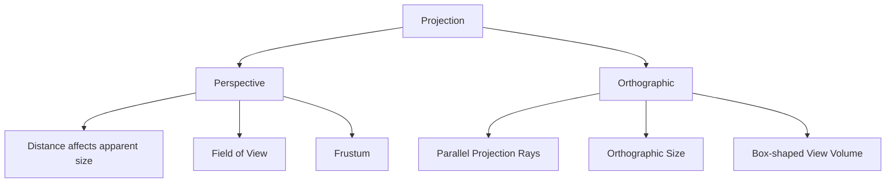
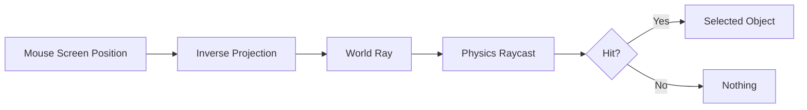
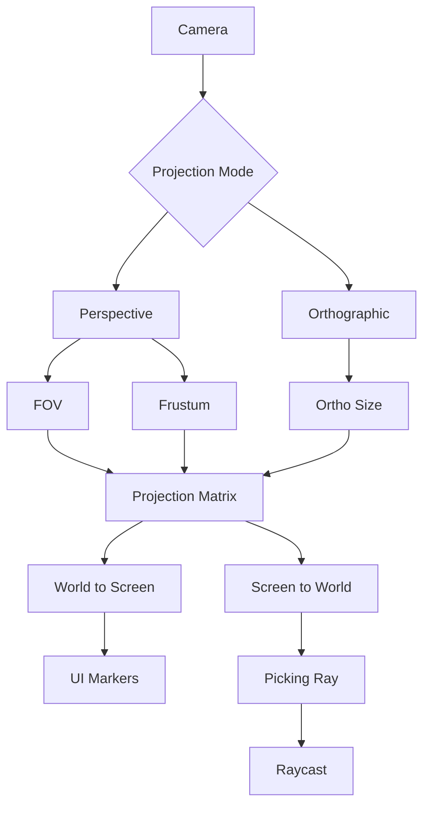
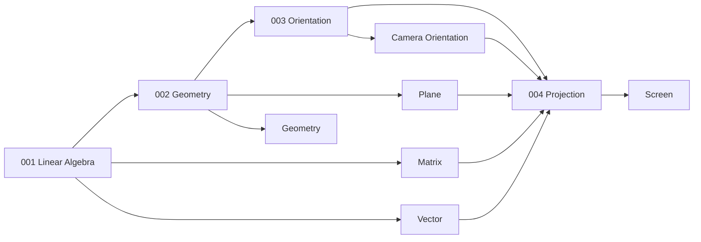
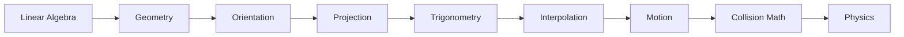

# 004 - Projection

**Module:** Module 02 - Game Mathematics
**Roadmap item:** 2.4
**Nhóm nội dung:** Game Mathematics
**Thứ tự trong module:** 004
**Thời lượng gợi ý:** 40-55 phút
**Mức độ:** Nền tảng → Trung cấp
**Ứng dụng chính:** Camera, Rendering, UI, Raycast, Culling, Level Design, Graphics

---

## 1. Tóm tắt

**Projection – Phép chiếu** là quá trình biến dữ liệu trong không gian 3D thành vị trí có thể hiển thị trên màn hình 2D.

Trong một game 3D, object có thể nằm tại:

```text
World Position

(x, y, z)
```

nhưng màn hình cuối cùng chỉ có:

```text
Screen Position

(x, y)
```

Camera và projection matrix thực hiện phần quan trọng của quá trình chuyển đổi đó.

Hai loại projection quan trọng nhất trong Game Development:

```text
Perspective Projection
+
Orthographic Projection
```

Perspective camera tạo cảm giác chiều sâu: object càng xa thường xuất hiện càng nhỏ. Orthographic camera sử dụng parallel projection nên kích thước biểu kiến không giảm theo khoảng cách theo cách perspective camera làm. Godot hiện hỗ trợ cả perspective và orthogonal camera modes, trong khi Unity mô tả perspective camera bằng view frustum cùng near/far clipping planes.

---

## 2. Mục tiêu học tập

Sau bài này, bạn nên có thể:

* Giải thích Projection trong graphics pipeline.
* Phân biệt Perspective và Orthographic Projection.
* Hiểu Camera/View Space.
* Hiểu Projection Matrix.
* Hiểu Field of View.
* Hiểu Aspect Ratio.
* Hiểu Near/Far Clipping Plane.
* Hiểu View Frustum.
* Hiểu Clip Space.
* Hiểu Perspective Divide.
* Hiểu Normalized Device Coordinates.
* Hiểu Viewport Transform.
* Chuyển World Position → Screen Position ở mức conceptual.
* Chuyển Screen Position → Ray trong world.
* Hiểu tại sao object xa hơn trông nhỏ hơn trong perspective.
* Biết khi nào nên dùng Orthographic Camera.
* Tạo một prototype so sánh hai projection mode.

---

## 3. Bức tranh tổng thể

```mermaid
flowchart LR
    LOCAL[Local Space]
    --> MODEL[Model Transform]

    MODEL --> WORLD[World Space]

    WORLD --> VIEW[View Matrix]

    VIEW --> CAMERA[Camera / View Space]

    CAMERA --> PROJ[Projection Matrix]

    PROJ --> CLIP[Clip Space]

    CLIP --> DIV[Perspective Divide]

    DIV --> NDC[NDC]

    NDC --> VIEWPORT[Viewport Transform]

    VIEWPORT --> SCREEN[Screen Space]
```



Model, view và projection matrices là ba khái niệm cốt lõi của pipeline 3D; projection matrix đưa dữ liệu về clip space trước khi rasterization diễn ra. ([MDN Web Docs][1])

---

# 4. Projection giải quyết vấn đề gì?

Game world có ba chiều:

$$
P=(x,y,z)
$$

Màn hình có hai chiều:

$$
S=(x_s,y_s)
$$

Projection phải trả lời:

```text
Một điểm 3D này
sẽ xuất hiện ở đâu trên màn hình?
```

Ví dụ:

```text
World

                Enemy
                  ●
                 /
                /
               /
Camera ●──────/

        ↓ Projection

Screen

┌────────────────────────┐
│              ● Enemy   │
│                        │
│                        │
└────────────────────────┘
```

---

# 5. Camera không phải chỉ là một object

Trong graphics, camera về mặt conceptual xác định:

```text
Position
Orientation
Projection
```

Có thể tách thành:

```text
Camera Transform
      ↓
View Matrix

Camera Lens / Projection Settings
      ↓
Projection Matrix
```

Godot `Camera3D` cho phép cấu hình perspective bằng FOV, near và far planes; orthogonal mode dùng size cùng near/far planes. ([Godot Engine documentation][2])

---

# 6. View Space / Camera Space

Giả sử camera đang ở:

$$
C=(10,5,-8)
$$

và player ở:

$$
P=(15,5,2)
$$

Renderer không nhất thiết tiếp tục làm việc trực tiếp bằng world coordinates.

View matrix chuyển scene sang hệ tọa độ nơi camera trở thành reference frame.

```text
World Space
     ↓
View Matrix
     ↓
Camera Space
```

Mental model:

```text
Thay vì:

Camera di chuyển trong World

hãy tưởng tượng:

Camera đứng ở origin
và cả World được transform ngược lại.
```

View matrix có nhiệm vụ thay đổi scene tương ứng với vị trí và orientation của camera. ([MDN Web Docs][1])

---

# 7. Projection Space

Sau View Space:

```text
Camera Space
     ↓
Projection Matrix
     ↓
Clip Space
```

Projection matrix xác định:

* camera nhìn rộng bao nhiêu;
* camera thấy gần bao nhiêu;
* camera thấy xa bao nhiêu;
* perspective hay orthographic;
* aspect ratio của image;
* geometry nào nằm ngoài vùng nhìn.

Godot `Projection` cung cấp constructors cho perspective, orthogonal và frustum projection, gồm aspect ratio và clipping distances. ([Godot Engine documentation][3])

---

# 8. Hai loại Projection chính



---

# 9. Perspective vs Orthographic


*Nguồn: [Gaffer Documentation - Anatomy of a Camera](https://www.gafferhq.org/documentation/1.4.0.0/WorkingWithScenes/AnatomyOfACamera/index.html)*

Hình trên cho thấy sự khác biệt rất trực quan:

```text
Perspective

Projection rays
hội tụ về camera.


Orthographic

Projection rays
song song với nhau.
```

---

# 10. Perspective Projection

Perspective Projection mô phỏng cảm giác nhìn gần giống camera/khả năng cảm nhận perspective trong đời thực.

```text
Camera
  ●
   \
    \
     \      Near
      \    ┌────┐
       \  /      \
        \/        \
        /\         \
       /  \         \
      /    └─────────┘
             Far
```

Unity mô tả vùng nhìn của perspective camera như một truncated pyramid hay **view frustum**.

---

# 11. Perspective View Frustum


*Nguồn: [Wikimedia Commons - Perspective view frustum](https://commons.wikimedia.org/wiki/File:Perspective_view_frustum.png)* ([Wikimedia Commons][4])

Frustum được giới hạn bởi:

```text
Left Plane
Right Plane
Top Plane
Bottom Plane
Near Plane
Far Plane
```

Có thể hình dung:

```text
                       Far Plane
                 ┌────────────────┐
                /                  \
               /                    \
Camera ●──────/                      \
              \                      /
               \                    /
                └──────────────────┘
                     Near Plane
```

---

# 12. Perspective làm object xa nhỏ hơn

Giả sử hai object có cùng chiều cao:

```text
Near Object

│
│
│


Far Object

│
│
│
```

Trong perspective projection:

```text
Screen

Near
████████

Far
████
```

Một mô hình pinhole đơn giản cho projection có thể viết:

$$
x'=
f\frac{x}{z}
$$

$$
y'=
f\frac{y}{z}
$$

Trong đó:

* $x,y,z$ là tọa độ trong camera space theo convention đơn giản có depth dương;
* $f$ đại diện focal scale;
* $x',y'$ là projected coordinates.

---

# 13. Vì sao object xa nhỏ hơn?

Từ:

$$
x'=
f\frac{x}{z}
$$

nếu $x$ giữ nguyên nhưng $z$ tăng:

$$
\frac{x}{z}
$$

sẽ nhỏ đi.

Ví dụ:

$$
x=2
$$

Với:

$$
z=2
$$

ta có:

$$
\frac{x}{z}=1
$$

Nhưng với:

$$
z=10
$$

ta có:

$$
\frac{x}{z}=0.2
$$

Đây là bản chất toán học trực quan của **perspective foreshortening**.

---

# 14. Similar Triangles

Perspective projection có thể được suy ra từ tam giác đồng dạng.

```text
             P
             ●
            /|
           / |
          /  |
Camera ●/___| Image Plane
```

Ta có tỷ lệ dạng:

$$
\frac{x'}{f}
============

\frac{x}{z}
$$

Do đó:

$$
x'=f\frac{x}{z}
$$

Tương tự:

$$
y'=f\frac{y}{z}
$$

---

# 15. Field of View

**Field of View – FOV** mô tả góc nhìn của camera.

```text
        \                   /
         \                 /
          \               /
           \             /
            \           /
             \         /
              \       /
               Camera
                  ●

              ← FOV →
```

Unity định nghĩa FOV từ các rays chạy từ centre of perspective tới mép image; Godot perspective camera cũng nhận `fov` như một tham số projection.

---

# 16. FOV nhỏ

Ví dụ:

$$
FOV=30^\circ
$$

```text
       \       /
        \     /
         \   /
          \ /
           ●
```

Kết quả thường mang cảm giác:

```text
Narrow view
Zoomed-in appearance
Ít scene xuất hiện trên màn hình
```

---

# 17. FOV lớn

Ví dụ:

$$
FOV=100^\circ
$$

```text
\                       /
 \                     /
  \                   /
   \                 /
    \               /
     \             /
      \           /
           ●
```

Kết quả:

```text
Wide view
Thấy nhiều môi trường hơn
Perspective distortion rõ hơn ở cạnh màn hình
```

---

# 18. FOV và kích thước Near Plane

Cho:

* vertical FOV là $\theta$;
* near distance là $n$.

Chiều cao của near plane:

$$
h=
2n
\tan
\left(
\frac{\theta}{2}
\right)
$$

Nếu aspect ratio là:

$$
a=
\frac{width}{height}
$$

thì:

$$
w=ha
$$

Do đó FOV trực tiếp quyết định độ mở của frustum.

---

# 19. Horizontal FOV và Vertical FOV

Nếu biết vertical FOV:

$$
FOV_y
$$

và aspect ratio:

$$
a=
\frac{width}{height}
$$

horizontal FOV có thể tính:

$$
FOV_x=
2\arctan
\left(
a
\tan
\frac{FOV_y}{2}
\right)
$$

Vì vậy cùng một vertical FOV nhưng viewport rộng hơn sẽ cho horizontal view rộng hơn.

Godot `Projection` cũng cung cấp conversion liên quan horizontal và vertical FOV cùng aspect ratio. ([Godot Engine documentation][3])

---

# 20. Aspect Ratio

Aspect ratio:

$$
a=
\frac{width}{height}
$$

Ví dụ:

### 16:9

$$
a=
\frac{16}{9}
\approx1.78
$$

### 9:16

$$
a=
\frac{9}{16}
=0.5625
$$

Aspect ratio ảnh hưởng hình dạng view frustum và projection matrix. ([Godot Engine documentation][3])

---

# 21. Projection trên màn hình ngang và dọc

Ví dụ cùng một scene:

```text
Landscape 16:9

┌──────────────────────────────┐
│                              │
│            Player            │
│                              │
└──────────────────────────────┘
```

Trong mobile portrait:

```text
┌──────────────┐
│              │
│              │
│    Player    │
│              │
│              │
│              │
└──────────────┘
```

Nếu game hỗ trợ nhiều aspect ratio, camera composition cần được kiểm tra ở từng viewport.

---

# 22. Near Clipping Plane

Near clipping plane xác định vị trí gần nhất camera có thể render.

```text
Camera ●────│────────────────────────→
            ↑
           Near
```

Object nằm trước near plane:

```text
Camera ● Object │ Near
```

sẽ bị clipped.

Unity mô tả near plane là giới hạn gần của vùng camera có thể nhìn/render.

---

# 23. Far Clipping Plane

Far clipping plane xác định giới hạn xa.

```text
Camera ●──────────────────│──── Object
                          ↑
                         Far
```

Object nằm ngoài far plane không được render bởi camera đó.

---

# 24. Viewable Range

Camera chỉ nhìn trong khoảng:

$$
z_{\text{near}}
\leq
z
\leq
z_{\text{far}}
$$

theo khái niệm distance dọc camera view.

```text
Camera
  ●
  │
  │ Near
  ▼
  ┌───────────────────────────────┐
  │        Visible Region         │
  └───────────────────────────────┘
                                  ↑
                                 Far
```

---

# 25. Vì sao cần Near/Far Plane?

Nếu không giới hạn vùng render, renderer phải xử lý một world có thể rất lớn.

Clipping planes giúp xác định camera volume:

```text
Camera
  ↓
View Volume
  ↓
Geometry inside?
  ├── Yes → tiếp tục render
  └── No  → bỏ
```

Unity mặc định thực hiện frustum culling đối với renderers nằm ngoài view frustum.

---

# 26. Near Plane và Depth Precision

Một lỗi camera phổ biến là đặt near plane cực nhỏ dù không cần thiết.

Ví dụ:

```text
Near = 0.00001
Far  = 100000
```

Khoảng depth rất lớn có thể làm bài toán depth-buffer precision khó hơn, tùy graphics API và depth-buffer technique.

Mental model nên dùng:

```text
Near
→ chỉ nhỏ tới mức gameplay thực sự cần.

Far
→ chỉ xa tới mức scene thực sự cần.
```

---

# 27. Z-Fighting

Nếu hai surface có depth rất gần nhau:

```text
Surface A
──────────────

Surface B
──────────────
```

depth buffer đôi khi khó phân biệt chính xác.

Kết quả có thể trông như:

```text
A B A B A B
B A B A B A
```

hiện tượng thường được gọi là **z-fighting**.

Projection và depth range là một phần của bài toán này.

---

# 28. Orthographic Projection

Orthographic projection sử dụng projection rays song song.

```text
→ → → → → → → →

┌─────────────────────┐
│                     │
│     View Volume     │
│                     │
└─────────────────────┘

→ → → → → → → →
```

Godot orthogonal camera sử dụng `size`, `z_near` và `z_far`; tài liệu cũng gợi ý projection này cho các game 3D muốn có appearance giống 2D. ([Godot Engine documentation][2])

---

# 29. Orthographic View Volume

Perspective:

```text
        /──────────\
       /            \
      /              \
     /                \
    ● Camera
```

Orthographic:

```text
┌────────────────────┐
│                    │
│                    │
│                    │
└────────────────────┘
```

Perspective có frustum dạng truncated pyramid, còn orthographic view volume thường có dạng rectangular box/prism.

---

# 30. So sánh các loại Projection


*Nguồn: [Wikimedia Commons - Graphical projection comparison](https://commons.wikimedia.org/wiki/File:Graphical_projection_comparison.png)* ([Wikimedia Commons][5])

Hình minh họa nhiều cách biến scene 3D thành biểu diễn 2D, bao gồm perspective và các dạng parallel projection.

---

# 31. Perspective vs Orthographic

| Thuộc tính              | Perspective | Orthographic                   |
| ----------------------- | ----------- | ------------------------------ |
| Object xa               | nhỏ hơn     | giữ scale biểu kiến theo depth |
| Projection rays         | hội tụ      | song song                      |
| View volume             | frustum     | box                            |
| FOV                     | quan trọng  | thường dùng size               |
| Cảm giác depth          | mạnh        | yếu hơn                        |
| FPS/TPS                 | rất phù hợp | ít phổ biến hơn                |
| Strategy/isometric-like | có thể dùng | rất phổ biến                   |
| CAD/editor view         | có thể dùng | rất phù hợp                    |

---

# 32. Ví dụ Perspective

```text
Perspective Camera

Near

██████████

Far

████
```

Các object cùng kích thước world nhưng ở depth khác nhau có screen size khác nhau.

Phù hợp với:

```text
FPS
TPS
Racing
Open World
Flight Simulator
3D Adventure
```

---

# 33. Ví dụ Orthographic

```text
Near Object

██████


Far Object

██████
```

Nếu world size giống nhau, screen size không bị perspective foreshortening chỉ vì depth thay đổi.

Phù hợp với:

```text
2D-style game in 3D
Tactical game
Strategy game
Map
Editor
CAD-like view
Some isometric-style games
```

Godot docs cũng nêu 3D games có appearance 2D thường sử dụng orthogonal projection. ([Godot Engine documentation][2])

---

# 34. Orthographic Size

Perspective camera thường điều chỉnh:

```text
FOV
```

Orthographic camera thường điều chỉnh:

```text
Size
```

Concept:

```text
Orthographic Size nhỏ

┌──────────┐
│  Player  │
└──────────┘

→ Zoom in
```

```text
Orthographic Size lớn

┌─────────────────────────────┐
│          Player             │
└─────────────────────────────┘

→ Zoom out
```

---

# 35. Orthographic Projection cơ bản

Nếu camera nhìn dọc trục Z và chỉ cần chiếu XY:

$$
P=(x,y,z)
$$

projection đơn giản có thể hình dung:

$$
P'=(x,y)
$$

Depth $z$ vẫn quan trọng cho:

* clipping;
* depth test;
* visibility;

nhưng không dùng để scale $x$ và $y$ như perspective projection.

---

# 36. Orthographic Projection Matrix

Một orthographic projection matrix phổ biến theo OpenGL-style convention là:

$$
P_{\text{ortho}}
================

\begin{bmatrix}
\frac{2}{r-l} & 0 & 0 & -\frac{r+l}{r-l} \
0 & \frac{2}{t-b} & 0 & -\frac{t+b}{t-b} \
0 & 0 & -\frac{2}{f-n} & -\frac{f+n}{f-n} \
0 & 0 & 0 & 1
\end{bmatrix}
$$

Trong đó:

```text
l = left
r = right
b = bottom
t = top
n = near
f = far
```

> Projection-matrix convention thay đổi giữa graphics APIs, handedness và depth-range conventions; không nên copy một matrix bất kỳ vào engine mà không kiểm tra convention của engine/API.

Godot chẳng hạn có utility riêng để chuyển depth range từ `-1..1` sang `0..1`, minh họa rõ rằng depth-space convention có thể khác nhau. ([Godot Engine documentation][3])

---

# 37. Perspective Projection Matrix

Đặt:

$$
s=
\frac{1}
{
\tan
\left(
\frac{FOV_y}{2}
\right)
}
$$

và:

$$
a=
\frac{width}{height}
$$

Một OpenGL-style perspective matrix phổ biến là:

$$
P_{\text{perspective}}
======================

\begin{bmatrix}
\frac{s}{a} & 0 & 0 & 0 \
0 & s & 0 & 0 \
0 & 0 & -\frac{f+n}{f-n} & -\frac{2fn}{f-n} \
0 & 0 & -1 & 0
\end{bmatrix}
$$

Matrix này dùng một convention cụ thể; Unity, Direct3D, Vulkan, Godot hoặc custom renderer có thể dùng variant khác.

Điều cần hiểu hơn là cấu trúc:

```text
FOV
Aspect Ratio
Near
Far

↓

Projection Matrix
```

---

# 38. Homogeneous Coordinates

Point 3D:

$$
P=
\begin{bmatrix}
x \
y \
z
\end{bmatrix}
$$

được mở rộng thành homogeneous point:

$$
P_h=
\begin{bmatrix}
x \
y \
z \
1
\end{bmatrix}
$$

Projection matrix tạo:

$$
P_{\text{clip}}
===============

P_{\text{projection}}
P_{\text{view}}
$$

với:

$$
P_{\text{clip}}
===============

\begin{bmatrix}
x_c \
y_c \
z_c \
w_c
\end{bmatrix}
$$

---

# 39. Perspective Divide

Sau projection matrix, GPU thực hiện phép chia:

$$
x_{\text{ndc}}
==============

\frac{x_c}{w_c}
$$

$$
y_{\text{ndc}}
==============

\frac{y_c}{w_c}
$$

$$
z_{\text{ndc}}
==============

\frac{z_c}{w_c}
$$

Đây gọi là:

> **Perspective Divide**

Perspective matrix được thiết kế để phép chia theo $w$ tạo ra hiệu ứng perspective. MDN mô tả perspective projection matrix kết hợp homogeneous $w$ và phép chia để tạo projection. ([MDN Web Docs][1])

---

# 40. Tại sao `w` quan trọng?

Trong perspective projection, $w_c$ thường liên hệ với depth.

Do đó:

$$
x_{\text{ndc}}
==============

\frac{x_c}{w_c}
$$

tạo hiệu ứng:

```text
Depth lớn
   ↓
Projected X/Y nhỏ hơn
   ↓
Object trông nhỏ hơn
```

Đây là một trong những lý do homogeneous coordinates cực kỳ quan trọng trong computer graphics.

---

# 41. Clip Space

Trước perspective divide, vertex nằm trong:

```text
Clip Space
```

Nếu geometry vượt ra ngoài camera volume, pipeline có thể:

```text
clip
hoặc
discard phần ngoài
```

Trong WebGL, vertex shader biến data sang clip space; geometry vượt ngoài clip volume có thể bị clipped trước rasterization. ([MDN Web Docs][1])

---

# 42. Normalized Device Coordinates

Sau perspective divide:

```text
Clip Space
      ↓
Divide by W
      ↓
NDC
```

Trong WebGL convention được MDN mô tả:

$$
x,y,z\in[-1,1]
$$

cho NDC volume. Các graphics APIs có thể dùng depth convention khác. ([MDN Web Docs][1])

---

# 43. NDC → Screen Space

Giả sử:

```text
NDC X:
-1 → left
+1 → right

NDC Y:
-1 → bottom
+1 → top
```

Với viewport width $W$:

$$
x_s=
\frac{x_{\text{ndc}}+1}{2}
W
$$

Một common bottom-origin mapping cho Y:

$$
y_s=
\frac{y_{\text{ndc}}+1}{2}
H
$$

Nếu UI sử dụng top-left origin thì Y thường cần flip theo convention của hệ UI.

---

# 44. Toàn bộ Projection Pipeline

```text
Mesh Vertex
    │
    ▼
Local Space
    │
    │ Model Matrix
    ▼
World Space
    │
    │ View Matrix
    ▼
Camera Space
    │
    │ Projection Matrix
    ▼
Clip Space
    │
    │ Divide by W
    ▼
NDC
    │
    │ Viewport Transform
    ▼
Screen Space
```

---

# 45. Công thức tổng quát

Một vertex:

$$
P_{\text{local}}
$$

được transform thành:

$$
P_{\text{clip}}
===============

P
V
M
P_{\text{local}}
$$

nếu sử dụng column-vector convention và đặt tên:

```text
M = Model Matrix
V = View Matrix
P = Projection Matrix
```

Một số codebase dùng row vectors nên thứ tự nhân sẽ đảo.

Vì vậy:

> Luôn xác định matrix/vector convention trước khi debug graphics math.

---

# 46. World → Screen

Trong gameplay, bạn thường không tự nhân toàn bộ matrix.

Ví dụ:

```text
Enemy World Position
        ↓
Camera Projection
        ↓
Screen Position
        ↓
Health Bar UI
```

Godot `Camera3D.unproject_position()` trả về tọa độ 2D viewport tương ứng với một world-space 3D point. ([Godot Engine documentation][2])

Ứng dụng:

```text
Enemy Nameplate
Health Bar
Quest Marker
Damage Number
Target Indicator
```

---

# 47. Screen → World

Bài toán ngược:

```text
Mouse Position
      ↓
Camera
      ↓
World Ray
```

Godot có `project_ray_origin()` và `project_ray_normal()` để tạo world-space ray phục vụ picking/intersection. ([Godot Engine documentation][2])

Ứng dụng:

```text
Mouse Picking
RTS Unit Selection
Click Ground to Move
Editor Selection
Shooting
Object Placement
```

---

# 48. Screen Ray

Một perspective camera:

```text
              Screen
             ┌──────┐
Camera ●─────┼──●───┼────→ World
             └──────┘
```

Mouse position xác định một điểm trên image plane.

Ta inverse-project nó để tạo:

```text
Ray Origin
+
Ray Direction
```

Sau đó:

```text
Physics Raycast
```

---

# 49. Projection và Raycast



---

# 50. Camera Frustum và Culling

Renderer không muốn xử lý mọi object trong world.

Ví dụ:

```text
                  Inside
                    ●
                  /   \
                 /     \
Camera ●────────/───────\
               /         \
              /___________\

                         ● Outside
```

Object hoàn toàn ngoài frustum có thể bị loại khỏi camera rendering.

Unity gọi vùng này là view frustum và mặc định thực hiện frustum culling cho renderers ngoài nó.

---

# 51. Frustum Plane Test

Perspective frustum có thể được xem là sáu plane:

```text
Near
Far
Left
Right
Top
Bottom
```

Object bounding volume:

```text
Sphere
AABB
OBB
```

có thể được test với các plane.

```text
Object outside any plane
        ↓
Cull
```

---

# 52. Projection trong FPS

FPS camera thường sử dụng:

```text
Perspective Camera
FOV
Near Clip
Far Clip
```

Pipeline:

```text
Mouse
 ↓
Yaw / Pitch
 ↓
Camera Orientation
 ↓
Perspective Projection
 ↓
Screen
```

Weapon camera, scope hoặc sprint effects cũng thường thay đổi FOV để tạo cảm giác khác nhau.

---

# 53. Projection trong Third-Person Game

TPS camera:

```text
Player
  ●
   \
    \
     \
      ● Camera
```

Perspective projection kết hợp với:

```text
Orbit Camera
Camera Collision
FOV
Target Composition
```

để tạo hình ảnh cuối cùng.

---

# 54. Projection trong Strategy Game

Strategy game có thể chọn:

```text
Perspective Camera
```

để có depth tự nhiên.

Hoặc:

```text
Orthographic Camera
```

để:

* giảm perspective distortion;
* giữ relative size rõ ràng;
* tạo cảm giác board-game/isometric-like.

---

# 55. Projection trong 2.5D Game

Ví dụ:

```text
3D World
+
3D Lighting
+
3D Characters
+
Orthographic Camera
```

có thể tạo appearance gần game 2D.

Đây chính là một trong các use case mà Godot documentation nêu cho orthogonal camera. ([Godot Engine documentation][2])

---

# 56. Projection trong Shadow Mapping

Projection không chỉ dành cho player camera.

Shadow rendering cũng cần nhìn scene từ góc nhìn của light.

Concept:

```text
Light
  ↓
Light View Matrix
  ↓
Light Projection Matrix
  ↓
Depth Map
```

Directional-light shadow maps thường liên quan orthographic-style projection vì directional light rays được xem như song song trong mô hình rendering phổ biến.

---

# 57. Projection trong Minimap

Minimap camera thường đặt:

```text
Camera
  ↓
Top View
```

và có thể dùng:

```text
Orthographic Projection
```

```text
         Camera
           ↓
           ↓
           ↓

┌──────────────────────┐
│       World          │
│          ● Player    │
│                      │
└──────────────────────┘
```

Ưu điểm:

```text
Map scale dễ hiểu
Không bị perspective distortion
```

---

# 58. Projection trong UI Marker

Enemy nằm trong world:

$$
P_{\text{enemy}}
$$

Chuyển sang:

$$
P_{\text{screen}}
$$

Sau đó đặt UI:

```text
Enemy
  ●
  ↑
[ HEALTH BAR ]
```

Cần kiểm tra thêm:

```text
Enemy có phía sau camera không?
Enemy có ngoài viewport không?
Marker có cần clamp vào screen edge không?
```

Godot docs cũng lưu ý kiểm tra point có nằm sau camera khi dùng world-to-viewport projection cho GUI. ([Godot Engine documentation][2])

---

# 59. Off-Screen Indicator

Nếu target nằm ngoài màn hình:

```text
Target World Position
        ↓
Project
        ↓
Outside Viewport
        ↓
Clamp Direction to Screen Border
```

Ví dụ:

```text
┌──────────────────────────┐
│                       →  │ Target
│                          │
│          Player          │
│                          │
└──────────────────────────┘
```

Đây là ứng dụng thực tế của projection math trong UI/gameplay.

---

# 60. Các lỗi thường gặp

## Lỗi 1 - Nhầm Perspective và Orthographic

Sai mental model:

```text
Orthographic
=
Perspective nhưng FOV rất nhỏ.
```

Không hoàn toàn đúng.

Đó là hai projection model khác nhau, dù perspective camera với distance và focal properties cực lớn có thể tiến gần appearance của orthographic projection.

---

## Lỗi 2 - Đặt Near quá gần một cách không cần thiết

Ví dụ:

```text
Near = 0.000001
```

chỉ vì:

```text
"để camera render mọi thứ"
```

có thể gây khó khăn cho depth precision.

Hãy chọn near plane dựa trên nhu cầu gameplay/render thực tế.

---

## Lỗi 3 - Far Plane quá lớn

Ví dụ:

```text
Far = 10,000,000
```

cho một room chỉ dài:

```text
50 units
```

thường không cần thiết.

---

## Lỗi 4 - Nhầm FOV với Zoom

Thay đổi FOV:

```text
FOV 90°
↓
FOV 30°
```

tạo cảm giác zoom.

Nhưng điều này không hoàn toàn giống di chuyển camera trong world.

```text
Change FOV
≠
Move Camera Forward
```

Hai thao tác tạo perspective/composition khác nhau.

---

## Lỗi 5 - Nhầm Horizontal và Vertical FOV

Một engine/API có thể cấu hình:

```text
Vertical FOV
```

trong khi tài liệu khác nói:

```text
Horizontal FOV
```

Luôn xác định convention trước khi so sánh số.

Godot `create_perspective()` nhận Y-axis FOV, trong khi API cũng có utility để lấy horizontal FOV. ([Godot Engine documentation][3])

---

## Lỗi 6 - Quên Aspect Ratio

Camera đẹp trên:

```text
16:9
```

chưa chắc đẹp trên:

```text
9:16
```

hoặc:

```text
4:3
```

Luôn test gameplay camera trên target aspect ratios.

---

## Lỗi 7 - Nhầm Clip Space và NDC

```text
Projection Matrix
      ↓
Clip Space
```

chưa phải kết quả cuối.

Cần:

```text
Perspective Divide
      ↓
NDC
```

MDN phân biệt rõ clip-space transform và quá trình tiếp theo đưa dữ liệu tới normalized space/rasterized image. ([MDN Web Docs][1])

---

## Lỗi 8 - Chia X/Y trực tiếp cho Z trong mọi Engine Code

Công thức:

$$
x'=f\frac{x}{z}
$$

rất tốt để hiểu perspective.

Nhưng production graphics pipeline sử dụng:

```text
Homogeneous coordinates
Projection Matrix
Perspective Divide
```

và sign/convention của Z khác nhau giữa APIs.

---

## Lỗi 9 - Copy Projection Matrix từ Internet

Một matrix có thể giả định:

```text
Right-handed
OpenGL depth
-Z forward
Column vectors
```

trong khi project của bạn dùng:

```text
Left-handed
0..1 depth
+Z forward
Row vectors
```

Kết quả có thể sai hoàn toàn dù matrix nhìn "đúng".

---

# 61. Demo thực hành 1 - Perspective Playground

Tạo scene:

```text
ProjectionDemo
│
├── PerspectiveCamera
│
├── CubeNear
├── CubeMiddle
├── CubeFar
└── DebugUI
```

Ba cube có cùng scale:

```text
1 × 1 × 1
```

nhưng depth khác nhau.

Quan sát screen size của từng cube.

---

# 62. Demo thực hành 2 - FOV

Thêm slider:

```text
FOV

30° ───────────── 120°
```

Hiển thị:

```text
Current FOV
Horizontal FOV
Vertical FOV
Aspect Ratio
```

Quan sát:

* scene visibility;
* apparent object size;
* edge distortion;
* cảm giác tốc độ.

---

# 63. Demo thực hành 3 - Near/Far Plane

UI:

```text
Near Plane
Far Plane
```

Cho object di chuyển xuyên qua:

```text
Near Plane
```

và:

```text
Far Plane
```

Quan sát object bị clipped.

---

# 64. Demo thực hành 4 - Perspective vs Orthographic

Scene giống nhau.

Keyboard:

```text
1
→ Perspective

2
→ Orthographic
```

So sánh:

```text
Object apparent size
Depth perception
Parallel lines
Camera composition
```

---

# 65. Demo thực hành 5 - World to Screen

Tạo enemy chạy quanh scene.

Trên enemy luôn có:

```text
Enemy Name
HP Bar
```

Pipeline:

```text
Enemy World Position
        ↓
WorldToScreen
        ↓
UI Position
```

---

# 66. Demo thực hành 6 - Screen to Ray

Click mouse:

```text
Mouse Position
      ↓
Screen Ray
      ↓
Raycast
      ↓
Highlight Object
```

Debug:

```text
Ray Origin
Ray Direction
Hit Point
Hit Normal
Hit Distance
```

---

# 67. Demo thực hành 7 - Draw Frustum

Trong Scene View, vẽ:

```text
Near Plane
Far Plane
Left Plane
Right Plane
Top Plane
Bottom Plane
```

Dùng lines để visualise camera frustum.

```text
               Far
          ┌────────────┐
         /              \
        /                \
       /                  \
      └───────┬────────────┘
              │
              ● Camera
```

---

# 68. Demo thực hành 8 - Orthographic Minimap

Tạo camera thứ hai:

```text
Main Camera
→ Perspective

Minimap Camera
→ Orthographic
```

Scene:

```text
                Minimap Camera
                      ↓
                      ↓

Enemy ●      Player ●       ● Item
```

Render minimap vào UI.

---

# 69. Debug Overlay

```text
┌──────────────────────────────────┐
│ PROJECTION DEBUG                 │
├──────────────────────────────────┤
│ Mode        Perspective          │
│ FOV Y       60°                  │
│ Aspect      1.7778               │
│ Near        0.30                 │
│ Far         1000                 │
│ Viewport    1920 × 1080          │
│ World Pos   (4.2, 1.0, 8.3)      │
│ Screen Pos  (1240, 510)          │
└──────────────────────────────────┘
```

Orthographic mode:

```text
┌──────────────────────────────────┐
│ PROJECTION DEBUG                 │
├──────────────────────────────────┤
│ Mode        Orthographic         │
│ Size        10                   │
│ Aspect      1.7778               │
│ Near        0.30                 │
│ Far         1000                 │
└──────────────────────────────────┘
```

---

# 70. Debug Visualization

Nên vẽ:

```text
Camera Forward
Near Plane
Far Plane
Frustum Edges
Screen Ray
Projected Point
```

Ví dụ:

```text
                       Far
                ┌────────────────┐
               /                  \
              /        ● P         \
             /          \           \
Camera ●────/────────────\───────────\
           /              \
          └────────────────┘
               Near
```

---

# 71. Mini Project - Projection Visualizer

Cấu trúc:

```text
projection-visualizer/
│
├── README.md
│
├── Scenes/
│   ├── PerspectiveDemo
│   ├── OrthographicDemo
│   ├── FrustumDemo
│   ├── WorldToScreenDemo
│   └── PickingDemo
│
├── Scripts/
│   ├── ProjectionController.cs
│   ├── FrustumVisualizer.cs
│   ├── ScreenProjectionDemo.cs
│   └── MousePickingDemo.cs
│
├── Screenshots/
└── Demo.gif
```

---

# 72. Artifact nên tạo

## Artifact 1 - Projection Demo

Demo thể hiện:

```text
Perspective
Orthographic
FOV
Near/Far
Aspect Ratio
Frustum
```

---

## Artifact 2 - Camera Pipeline Note

File:

```text
camera-projection-pipeline.md
```

Bao gồm:

```text
Local
↓
World
↓
View
↓
Clip
↓
NDC
↓
Screen
```

---

## Artifact 3 - Projection Debug Diagram

```text
World Point
    ●
     \
      \
       \
Camera ●──────────────→

       ↓ View
       ↓ Projection
       ↓ Divide by W

Screen
┌──────────────────┐
│          ●       │
└──────────────────┘
```

---

## Artifact 4 - Frustum Debugger

Tool nhỏ cho phép chỉnh realtime:

```text
FOV
Aspect Ratio
Near
Far
Projection Mode
Orthographic Size
```

và vẽ camera volume trong Scene View.

Đây là artifact khá tốt cho portfolio gameplay/graphics tooling.

---

# 73. Portfolio Project đề xuất

## Camera Projection Laboratory

Feature:

```text
Perspective / Orthographic toggle
FOV visualizer
Near/Far clipping
Frustum drawing
World-to-screen markers
Screen-to-world ray
Mouse picking
Minimap
Camera debug overlay
```

Architecture:



---

# 74. Cheat Sheet

| Câu hỏi                               | Khái niệm                   |
| ------------------------------------- | --------------------------- |
| 3D point xuất hiện ở đâu trên screen? | Projection                  |
| Camera giống mắt người?               | Perspective                 |
| Không muốn object xa nhỏ đi?          | Orthographic                |
| Camera nhìn rộng bao nhiêu?           | FOV                         |
| Camera render gần nhất ở đâu?         | Near Plane                  |
| Camera render xa nhất ở đâu?          | Far Plane                   |
| Camera nhìn vùng nào?                 | View Frustum                |
| Scene sang camera coordinates?        | View Matrix                 |
| Camera → clip space?                  | Projection Matrix           |
| Vì sao perspective hoạt động?         | Divide by W                 |
| Clip → canonical coordinates?         | NDC                         |
| World object → UI marker?             | World to Screen             |
| Mouse → world ray?                    | Inverse Projection          |
| Object ngoài camera có render?        | Frustum Culling             |
| Minimap camera?                       | Orthographic thường phù hợp |

---

# 75. Mental Model quan trọng

```text
CAMERA
"Ta đang nhìn từ đâu?"

       ↓

VIEW MATRIX
"Đưa World về Camera Space"

       ↓

PROJECTION
"Camera nhìn theo kiểu gì?"

       ↓

Perspective
hoặc
Orthographic

       ↓

CLIP SPACE
"Geometry có nằm trong vùng camera?"

       ↓

PERSPECTIVE DIVIDE
"Chia cho W"

       ↓

NDC
"Chuẩn hóa tọa độ"

       ↓

VIEWPORT
"Map sang pixel"

       ↓

SCREEN
```

---

# 76. Perspective hay Orthographic?

Không nên nghĩ:

```text
Perspective = tốt

Orthographic = cũ
```

Hai projection phục vụ mục đích khác nhau.

### Perspective phù hợp khi

```text
FPS
TPS
Racing
Adventure
Simulation
Open World
Realistic 3D camera
```

### Orthographic phù hợp khi

```text
Strategy
Tactical
Map
Minimap
Editor
CAD-like view
2.5D
3D scene muốn appearance 2D
```

---

# 77. Câu hỏi tự kiểm tra

### Câu 1

Perspective Projection khác Orthographic như thế nào?

<details>
<summary>Đáp án</summary>

Perspective làm apparent size phụ thuộc depth, tạo cảm giác xa gần.

Orthographic dùng parallel projection nên apparent size không giảm theo depth theo cách perspective làm.

</details>

---

### Câu 2

View Frustum là gì?

<details>
<summary>Đáp án</summary>

Là vùng không gian camera perspective có thể nhìn/render, được giới hạn bởi:

```text
Near
Far
Left
Right
Top
Bottom
```

</details>

---

### Câu 3

Field of View là gì?

<details>
<summary>Đáp án</summary>

FOV là góc thể hiện camera nhìn rộng tới đâu.

FOV lớn:

```text
Wide view
```

FOV nhỏ:

```text
Narrow view
```

</details>

---

### Câu 4

Near/Far clipping plane dùng làm gì?

<details>
<summary>Đáp án</summary>

Chúng xác định giới hạn depth mà camera render.

```text
Closer than Near
→ clipped

Farther than Far
→ clipped
```

</details>

---

### Câu 5

Perspective Divide là gì?

<details>
<summary>Đáp án</summary>

Sau projection, clip coordinates được chia cho homogeneous $w$:

$$
x_{\text{ndc}}=\frac{x_c}{w_c}
$$

$$
y_{\text{ndc}}=\frac{y_c}{w_c}
$$

$$
z_{\text{ndc}}=\frac{z_c}{w_c}
$$

</details>

---

### Câu 6

Vì sao object xa trông nhỏ hơn?

<details>
<summary>Đáp án</summary>

Trong mô hình perspective đơn giản:

$$
x'=f\frac{x}{z}
$$

Khi $z$ tăng, projected coordinate nhỏ đi.

</details>

---

### Câu 7

Aspect Ratio là gì?

<details>
<summary>Đáp án</summary>

$$
aspect=
\frac{width}{height}
$$

Ví dụ 1920×1080:

$$
aspect=
\frac{1920}{1080}
=================

\frac{16}{9}
$$

</details>

---

### Câu 8

Làm sao tạo ray từ mouse position?

<details>
<summary>Đáp án</summary>

Concept:

```text
Mouse Screen Coordinate
        ↓
Inverse Camera Projection
        ↓
World Origin + Direction
        ↓
Raycast
```

</details>

---

# 78. Checklist hoàn thành bài

* [ ] Hiểu Projection.
* [ ] Hiểu Camera Space.
* [ ] Phân biệt Perspective và Orthographic.
* [ ] Hiểu perspective foreshortening.
* [ ] Hiểu Field of View.
* [ ] Hiểu Aspect Ratio.
* [ ] Hiểu Near Plane.
* [ ] Hiểu Far Plane.
* [ ] Hiểu View Frustum.
* [ ] Hiểu Projection Matrix.
* [ ] Hiểu Homogeneous Coordinates.
* [ ] Hiểu Clip Space.
* [ ] Hiểu Perspective Divide.
* [ ] Hiểu NDC.
* [ ] Hiểu Viewport Transform.
* [ ] Hiểu World → Screen.
* [ ] Hiểu Screen → Ray.
* [ ] Hiểu Frustum Culling.
* [ ] Tạo được perspective demo.
* [ ] Tạo được orthographic demo.
* [ ] Tạo được FOV demo.
* [ ] Tạo được near/far clipping demo.
* [ ] Tạo được mouse picking demo.
* [ ] Có projection debug visualization.
* [ ] Viết README giải thích demo.

---

# 79. Liên hệ với các bài trước



Ví dụ:

```text
Linear Algebra
Matrix

+

Geometry
Frustum / Planes

+

Orientation
Camera Direction

+

Projection
Perspective Matrix

=

3D Camera System
```

---

# 80. Ví dụ tổng hợp - Mouse Picking

## Bước 1 - Input

```text
Mouse Screen Position
```

## Bước 2 - Projection

```text
Inverse Projection
```

## Bước 3 - Linear Algebra

Tạo:

$$
R(t)=O+tD
$$

## Bước 4 - Geometry

```text
Ray
+
Collider
```

## Bước 5 - Physics

```text
Raycast
```

## Bước 6 - Gameplay

```text
Select Object
```

Pipeline:

```text
Mouse
  ↓
Screen Coordinate
  ↓
Inverse Projection
  ↓
World Ray
  ↓
Intersection
  ↓
Selected GameObject
```

---

# 81. Ví dụ tổng hợp - Enemy Health Bar

Enemy:

$$
P_{\text{world}}
$$

Camera transforms:

```text
World
↓
View
↓
Projection
↓
NDC
↓
Screen
```

Ta nhận:

$$
P_{\text{screen}}
$$

Sau đó:

```text
Health Bar UI
Position
=
P_screen
```

Kết quả:

```text
            [██████----]
                 ↓
               Enemy
                 ●
```

---

# 82. Nội dung nên học tiếp



Các chủ đề nên học tiếp:

```text
Trigonometry
Angles
Radians
Sin / Cos / Tan
Lerp
Inverse Lerp
Slerp
Motion
Velocity
Acceleration
Collision Detection
Collision Response
Physics
```

---

# 83. Tổng kết

Projection trả lời câu hỏi:

> **Một scene 3D sẽ được nhìn và hiển thị trên màn hình 2D như thế nào?**

Perspective:

```text
Xa
→ nhỏ

Gần
→ lớn
```

Orthographic:

```text
Depth thay đổi
→ không tạo perspective size falloff
```

Camera perspective được xác định bởi các yếu tố quan trọng như FOV và clipping planes, trong khi orthographic camera dùng một parallel-projection volume với size và clipping limits.

Mental model cuối cùng:

```text
                    PROJECTION
                         │
              ┌──────────┴──────────┐
              ↓                     ↓

         Perspective           Orthographic
              │                     │
             FOV                   Size
              │                     │
         View Frustum          View Box
              │                     │
              └──────────┬──────────┘
                         ↓
                Projection Matrix
                         │
                         ↓
                    Clip Space
                         │
                         ↓
                 Perspective Divide
                         │
                         ↓
                       NDC
                         │
                         ↓
                Viewport Transform
                         │
                         ↓
                      SCREEN
                         │
          ┌──────────────┼──────────────┐
          ↓              ↓              ↓
         HUD          Picking        Rendering
          ↓              ↓              ↓
      Nameplate       Raycast       Frustum Cull
```

Khi gặp các câu hỏi:

```text
Vì sao object ở xa nhỏ hơn?

Camera FOV ảnh hưởng game thế nào?

Near/Far plane dùng để làm gì?

Perspective và Orthographic khác gì?

Làm sao đưa vị trí enemy lên UI?

Làm sao click một object 3D bằng mouse?

Frustum culling hoạt động dựa trên vùng nào?

Làm sao làm minimap camera?

Vì sao game portrait và landscape nhìn khác nhau?
```

hãy nghĩ tới:

> **Camera Space → Projection → Clip Space → NDC → Screen Space.**

---

# 84. Tài liệu và ảnh tham khảo

* [Unity Manual - Introduction to the Camera View](https://docs.unity3d.com/6000.4/Documentation/Manual/UnderstandingFrustum.html) – FOV, near/far clipping planes và view frustum.
* [Godot Docs - Camera3D](https://docs.godotengine.org/en/stable/classes/class_camera3d.html) – perspective, orthogonal projection, world-to-screen và screen-to-ray. ([Godot Engine documentation][2])
* [Godot Docs - Projection](https://docs.godotengine.org/en/stable/classes/class_projection.html) – perspective/orthogonal projection matrices, aspect ratio và FOV. ([Godot Engine documentation][3])
* [MDN - WebGL Model View Projection](https://developer.mozilla.org/en-US/docs/Web/API/WebGL_API/WebGL_model_view_projection) – model/view/projection pipeline, clip space và perspective divide. ([MDN Web Docs][1])
* [Wikimedia Commons - Perspective View Frustum](https://commons.wikimedia.org/wiki/File:Perspective_view_frustum.png). ([Wikimedia Commons][4])
* [Wikimedia Commons - Graphical Projection Comparison](https://commons.wikimedia.org/wiki/File:Graphical_projection_comparison.png). ([Wikimedia Commons][5])
* [Gaffer Documentation - Anatomy of a Camera](https://www.gafferhq.org/documentation/1.4.0.0/WorkingWithScenes/AnatomyOfACamera/index.html) – sơ đồ trực quan perspective và orthographic camera.

[1]: https://developer.mozilla.org/en-US/docs/Web/API/WebGL_API/WebGL_model_view_projection "WebGL model view projection - Web APIs | MDN"
[2]: https://docs.godotengine.org/en/stable/classes/class_camera3d.html "Camera3D — Godot Engine (stable) documentation in English"
[3]: https://docs.godotengine.org/en/stable/classes/class_projection.html "Projection — Godot Engine (stable) documentation in English"
[4]: https://commons.wikimedia.org/wiki/File%3APerspective_view_frustum.png "File:Perspective view frustum.png - Wikimedia Commons"
[5]: https://commons.wikimedia.org/wiki/File%3AGraphical_projection_comparison.png "File:Graphical projection comparison.png - Wikimedia Commons"

---

# Bài luyện tập

## Mục tiêu


## Đề bài


## Yêu cầu hoàn thành

- [ ] 
- [ ] 
- [ ] 

## Kết quả / lời giải


## Ghi chú
