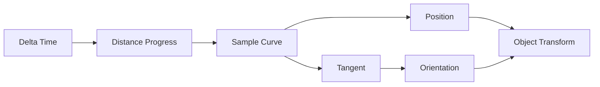
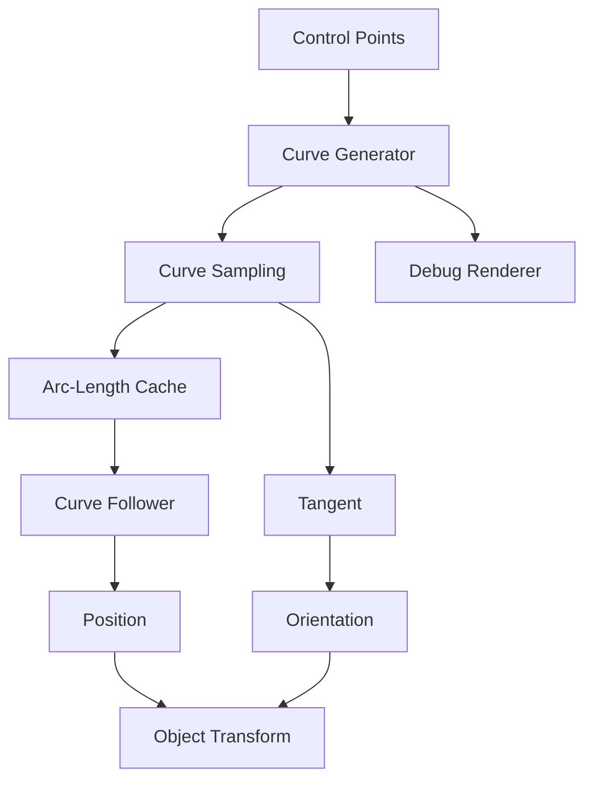
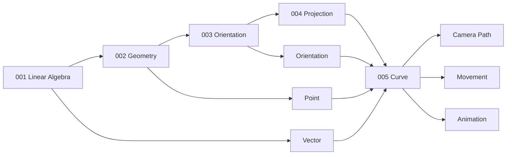
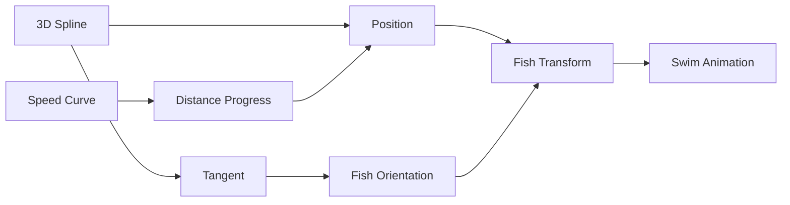
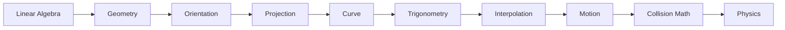

# 005 - Curve

**Module:** Module 02 - Game Mathematics
**Roadmap item:** 2.5
**Nhóm nội dung:** Game Mathematics
**Thứ tự trong module:** 005
**Thời lượng gợi ý:** 40-55 phút
**Mức độ:** Nền tảng → Trung cấp
**Ứng dụng chính:** Camera, Movement, Animation, Racing Track, Skill Trajectory, Path Following, Procedural Geometry

---

## 1. Tóm tắt

**Curve – Đường cong** trong Game Development là công cụ toán học dùng để mô tả một đường đi hoặc một giá trị thay đổi mượt theo một tham số.

Trong không gian 2D/3D, curve thường xuất hiện dưới dạng:

```text
Camera Path
Character Path
Enemy Patrol Route
Racing Track
Rail Movement
Projectile Trajectory
Fish / Bird Swimming Path
Animation Motion Path
```

Trong animation, curve cũng có thể không biểu diễn vị trí trong không gian mà biểu diễn **một giá trị theo thời gian**:

```text
Time
 ↓
Curve
 ↓
Value
```

Ví dụ:

```text
Time → Character Speed

Time → Camera FOV

Time → Light Intensity

Time → Animation Weight
```

Godot `Curve3D` hiện mô tả một Bézier curve trong không gian 3D, có thể dùng trực tiếp cho `Path3D`, lấy điểm theo curve, lấy độ dài baked, closest point và orientation dọc path. Unity Splines cũng biểu diễn cubic Bézier bằng bốn control points và hỗ trợ tạo Catmull-Rom spline từ danh sách các knot positions. ([Godot Engine documentation][1])

---

## 2. Mục tiêu học tập

Sau bài này, bạn nên có thể:

* Giải thích curve dưới dạng hàm tham số.
* Hiểu parameter $t$.
* Phân biệt control point và point thực sự nằm trên curve.
* Hiểu tangent của curve.
* Hiểu spline.
* Hiểu continuity giữa các curve segment.
* Hiểu Linear Bézier.
* Hiểu Quadratic Bézier.
* Hiểu Cubic Bézier.
* Hiểu thuật toán De Casteljau.
* Hiểu Hermite Curve.
* Hiểu Catmull-Rom Spline.
* Biết điểm mạnh/yếu của Bézier, Hermite và Catmull-Rom.
* Hiểu tại sao di chuyển bằng $t$ tuyến tính chưa chắc có tốc độ đều.
* Hiểu arc length và curve baking.
* Làm object di chuyển dọc curve.
* Tính orientation theo tangent.
* Tạo camera path.
* Tạo racing track hoặc movement path.
* Tạo skill trajectory.
* Tạo một Curve Visualizer để đưa vào portfolio.

---

## 3. Bức tranh tổng thể

```mermaid
flowchart TD
    CURVE[Curve]

    CURVE --> PARAM[Parametric Curve]
    CURVE --> SPLINE[Spline]

    PARAM --> POS[Position C(t)]
    PARAM --> TAN[Tangent C'(t)]
    PARAM --> LENGTH[Arc Length]

    SPLINE --> BEZIER[Bézier]
    SPLINE --> HERMITE[Hermite]
    SPLINE --> CAT[Catmull-Rom]

    BEZIER --> Q[Quadratic]
    BEZIER --> C[Cubic]

    HERMITE --> HP[Points + Tangents]

    CAT --> CP[Interpolating Control Points]

    TAN --> ORIENT[Object Orientation]

    LENGTH --> SPEED[Constant-Speed Traversal]

    ORIENT --> CAMERA[Camera Path]
    SPEED --> MOVE[Movement Path]

    CURVE --> ANIM[Animation Curve]
    CURVE --> TRACK[Racing Track]
    CURVE --> SKILL[Skill Trajectory]
```

---

# 4. Curve là gì?

Một curve có thể được mô tả bằng một hàm tham số:

$$
C(t)
$$

Trong đó:

```text
t = parameter
```

và kết quả của hàm là một point.

Trong 2D:

$$
C(t)=
\begin{bmatrix}
x(t) \
y(t)
\end{bmatrix}
$$

Trong 3D:

$$
C(t)=
\begin{bmatrix}
x(t) \
y(t) \
z(t)
\end{bmatrix}
$$

---

# 5. Parameter `t`

Thông thường một curve segment dùng:

$$
0\leq t\leq1
$$

Khi:

$$
t=0
$$

ta ở đầu segment.

Khi:

$$
t=1
$$

ta ở cuối segment.

Khi:

$$
t=0.5
$$

ta đang ở một vị trí trung gian trên curve.

```text
Start                             End

P0 ●──────────────────────────────● P1

t=0            t=0.5             t=1
```

Điểm quan trọng:

> **$t=0.5$ không nhất thiết có nghĩa là đã đi được 50% chiều dài thực tế của curve.**

Điều này là nguyên nhân lớn khiến object có thể tăng/giảm tốc ngoài ý muốn khi ta chỉ tăng `t` đều theo thời gian. Godot documentation cũng lưu ý traversal trên curve không tự động có constant speed và cung cấp cơ chế baking/sampling theo distance để giải quyết. ([Godot Engine documentation][2])

---

# 6. Parametric Curve đơn giản

Ví dụ:

$$
C(t)=
\begin{bmatrix}
t \
t^2
\end{bmatrix}
$$

Với:

$$
0\leq t\leq1
$$

ta có:

|  $t$ |  $x$ |    $y$ |
| ---: | ---: | -----: |
|    0 |    0 |      0 |
| 0.25 | 0.25 | 0.0625 |
|  0.5 |  0.5 |   0.25 |
| 0.75 | 0.75 | 0.5625 |
|    1 |    1 |      1 |

Curve không nhất thiết phải được tạo bằng Bézier; Bézier, Hermite và Catmull-Rom chỉ là những family rất hữu ích cho Game Development.

---

# 7. Curve trong không gian 3D

Curve không bị giới hạn trong mặt phẳng.

$$
C(t)=
\begin{bmatrix}
x(t) \
y(t) \
z(t)
\end{bmatrix}
$$

Ví dụ:

```text
              ●
            /   \
          /       \
        ●           ●
         \         /
          \       /
            ●
```

Trong game, curve 3D có thể dùng cho:

```text
Camera rail
Flying enemy
Fish swimming
Roller coaster
Spaceship route
Cinematic movement
```

Godot `Curve3D` hỗ trợ trực tiếp curve 3D, baked points, up vectors và cả transform bao gồm position/orientation tại một distance dọc curve. ([Godot Engine documentation][1])

---

# 8. Tangent của Curve

Nếu curve là:

$$
C(t)
$$

thì tangent được lấy từ đạo hàm:

$$
T(t)=C'(t)
$$

Normalized tangent:

$$
\hat T(t)=
\frac{C'(t)}
{|C'(t)|}
$$

Tangent cho biết **hướng di chuyển tức thời** của curve.

```text
                  Tangent
                     →
             ●────────────
           /
         /
       /
     ●
```

---

# 9. Vì sao Tangent quan trọng trong Game?

Nếu object di chuyển dọc path, position chỉ trả lời:

```text
Object đang ở đâu?
```

Tangent trả lời:

```text
Object nên nhìn về hướng nào?
```

Pipeline:

```text
Curve Position
     ↓
Object Position

Curve Tangent
     ↓
Object Forward
```

Đây là nền tảng của:

```text
Camera rail
Train
Vehicle
Fish
Flying enemy
Projectile
Roller coaster
```

Godot hiện có `Curve3D.sample_baked_with_rotation()` để lấy một `Transform3D` trong đó basis chứa sideways, up và forward vectors dọc curve. ([Godot Engine documentation][1])

---

# 10. Tangent bằng Numerical Approximation

Nếu không có công thức đạo hàm, có thể xấp xỉ:

$$
T(t)
\approx
C(t+\varepsilon)-C(t)
$$

với:

$$
\varepsilon
$$

là một số nhỏ.

Ví dụ:

```csharp
Vector3 p0 = Evaluate(t);
Vector3 p1 = Evaluate(t + epsilon);

Vector3 tangent =
    (p1 - p0).normalized;
```

Cách này rất hữu ích khi curve API chỉ cung cấp sampling position.

---

# 11. Orientation dọc Curve

Cho:

$$
F=\hat T(t)
$$

là forward.

Nếu dùng một reference up:

$$
U_0
$$

ta có thể xây basis:

$$
R=
\operatorname{normalize}
(
U_0\times F
)
$$

sau đó:

$$
U=
F\times R
$$

```text
                  Up
                  ↑
                  │
                  ●────→ Right
                 /
                /
             Forward
```

Cần chú ý thứ tự cross product theo convention của engine.

---

# 12. Curve và Curvature

Tangent cho biết hướng hiện tại.

Sự thay đổi của tangent cho biết curve đang cong mạnh hay nhẹ.

```text
Low Curvature

───────────────)


High Curvature

───────┐
       )
      /
```

Một đoạn curve có curvature cao thường cần nhiều sample points hơn khi tessellate. Godot `Curve3D.tessellate()` hiện tăng mật độ point ở những vùng cong hơn và dùng ít point hơn ở đoạn thẳng hơn. ([Godot Engine documentation][1])

---

# 13. Spline là gì?

Một curve phức tạp thường không được biểu diễn bằng một polynomial khổng lồ.

Thay vào đó ta chia thành nhiều **curve segments** nối nhau.

```text
Segment 1
     ↓
●────────╮

          ╰──────●
                  \
                   \ Segment 2
                    \
                     ●
```

Tập hợp các segment được nối thành một curve dài thường gọi là **Spline**.

Unity `Spline` hiện được tổ chức như một tập hợp các Bézier knot cùng trạng thái open/closed; Godot cũng biểu diễn path bằng nhiều Bézier segments nối qua các point có in/out control handles. ([Unity Documentation][3])

---

# 14. Vì sao dùng Spline?

Nếu dùng một polynomial degree rất cao với quá nhiều control points:

```text
P0 P1 P2 P3 P4 P5 P6 ...
```

việc chỉnh một point có thể ảnh hưởng tới hình dạng curve ở phạm vi lớn.

Spline chia path thành các đoạn nhỏ:

```text
Segment A
Segment B
Segment C
Segment D
```

giúp:

* local control;
* dễ chỉnh;
* dễ sample;
* dễ tạo track dài;
* dễ loop.

---

# 15. Continuity giữa các Curve Segment

Khi nối hai segment:

```text
Curve A ──────●────── Curve B
              ↑
             Join
```

ta quan tâm mức độ smooth tại điểm nối.

---

# 16. C0 Continuity

**C0 continuity** nghĩa là hai curve cùng gặp tại một point.

$$
C_A(1)=C_B(0)
$$

Ví dụ:

```text
──────●
       \
        \
```

Không có gap, nhưng có thể có góc gãy.

---

# 17. C1 Continuity

**C1 continuity** yêu cầu vị trí và first derivative khớp.

$$
C_A(1)=C_B(0)
$$

và:

$$
C'_A(1)=C'_B(0)
$$

Kết quả:

```text
────────────╮
             ╰────────────
```

Hướng và tốc độ theo parameter nối mượt hơn.

---

# 18. C2 Continuity

C2 continuity còn yêu cầu second derivative khớp:

$$
C''_A(1)=C''_B(0)
$$

Điều này liên quan tới thay đổi curvature mượt hơn.

Trong các path tốc độ cao như:

```text
Racing Track
Roller Coaster
Camera Cinematic
```

continuity cao có thể giúp giảm cảm giác chuyển động bị gãy.

---

# 19. Linear Bézier

Linear Bézier chỉ có hai points:

$$
P_0,\ P_1
$$

Công thức:

$$
B(t)
====

(1-t)P_0+tP_1
$$

Đây chính là **Lerp**.

```text
P0 ●────────────────────────● P1
```

---

# 20. Quadratic Bézier

Quadratic Bézier có ba points:

```text
P0 = Start
P1 = Control
P2 = End
```

```text
             P1 ●
                / \
               /   \
              /     \
P0 ●─────────╯       ╰────────● P2
```

Công thức:

$$
B(t)
====

(1-t)^2P_0
+
2(1-t)tP_1
+
t^2P_2
$$

với:

$$
0\leq t\leq1
$$

---

# 21. Cubic Bézier

Cubic Bézier có bốn control points:

$$
P_0,P_1,P_2,P_3
$$

Trong đó:

```text
P0 = Start
P1 = Start control handle
P2 = End control handle
P3 = End
```

Unity `BezierCurve` hiện cũng dùng đúng bốn control points `P0` đến `P3` theo thứ tự start → middle controls → end.


*Nguồn ảnh: [Wikimedia Commons - Cubic Bézier Curve](https://commons.wikimedia.org/wiki/File:Cubic_B%C3%A9zier_Curve.svg).* Ảnh minh họa cubic Bézier từ hai endpoints và hai control points. ([Wikimedia Commons][4])

---

# 22. Công thức Cubic Bézier

$$
B(t)
====

(1-t)^3P_0
+
3(1-t)^2tP_1
+
3(1-t)t^2P_2
+
t^3P_3
$$

với:

$$
0\leq t\leq1
$$

Tại:

$$
t=0
$$

ta có:

$$
B(0)=P_0
$$

Tại:

$$
t=1
$$

ta có:

$$
B(1)=P_3
$$

Hai control points giữa thường điều khiển shape/tangent nhưng curve không bắt buộc đi qua chúng. Unity cũng mô tả cubic Bézier bằng bốn control points liên tiếp với đầu và cuối là endpoints.

---

# 23. Cubic Bézier Tangent

Đạo hàm:

$$
B'(t)
=====

3(1-t)^2(P_1-P_0)
+
6(1-t)t(P_2-P_1)
+
3t^2(P_3-P_2)
$$

Tại đầu:

$$
B'(0)
=====

3(P_1-P_0)
$$

Do đó hướng đầu curve phụ thuộc vào:

```text
P0 → P1
```

Tại cuối:

$$
B'(1)
=====

3(P_3-P_2)
$$

nên hướng cuối phụ thuộc vào:

```text
P2 → P3
```

---

# 24. Bézier Handle

Có thể hình dung control handle:

```text
                P1 ●
                  /
                 /
P0 ●────────────╯
```

Nếu kéo $P_1$:

```text
P0 → P1
```

thay đổi, tangent đầu curve thay đổi.

Điều này lý giải vì sao Bézier editor thường cho phép kéo các handle thay vì nhập hệ số polynomial trực tiếp.

---

# 25. Thuật toán De Casteljau

Bézier cũng có thể được xây dựng bằng nhiều phép Lerp.

Với cubic Bézier:

```text
P0
P1
P2
P3
```

Bước đầu:

$$
A=(1-t)P_0+tP_1
$$

$$
B=(1-t)P_1+tP_2
$$

$$
C=(1-t)P_2+tP_3
$$

Tiếp:

$$
D=(1-t)A+tB
$$

$$
E=(1-t)B+tC
$$

Cuối cùng:

$$
P=(1-t)D+tE
$$

và:

$$
P=B(t)
$$

---

# 26. De Casteljau dạng sơ đồ

```text
P0 ●
    \
     ● A
      \
P1 ●───● D
    \    \
     ● B  ● Result
      \  /
P2 ●───● E
    \
     ● C
      \
P3 ●
```

Đây là một cách rất trực quan để hiểu rằng Bézier curve được tạo bởi **interpolation lặp lại**.

---

# 27. Bézier trong Game Engine

Godot `Curve3D` hiện mô tả Bézier curve 3D, dùng các vertex cùng `in`/`out` control points. Nó có thể sample trực tiếp, bake curve, lấy closest point và tạo orientation dọc path. ([Godot Engine documentation][1])

Unity Splines cũng có cubic `BezierCurve`, knot-based spline representation và utilities liên quan Bézier.

---

# 28. Bézier trong Animation Curve

Curve không nhất thiết biểu diễn:

```text
XYZ Position
```

Nó có thể biểu diễn:

$$
value=f(time)
$$

Ví dụ:

```text
Value
 ↑
1│            ●──────
 │         ╭──╯
 │      ╭──╯
 │   ╭──╯
0│●──╯
 └──────────────────→ Time
```

Godot hiện có Bézier Curve Track để animate một property value bằng Bézier curve. ([Godot Engine documentation][5])

---

# 29. Bézier Easing

Ví dụ một animation:

```text
Start
  ↓
Slow
  ↓
Fast
  ↓
Slow
  ↓
End
```

Curve có thể điều khiển:

```text
Position over Time
Rotation over Time
Opacity over Time
Speed over Time
FOV over Time
```

Cubic Bézier cũng là một model phổ biến cho easing functions; MDN mô tả `cubic-bezier()` là một cubic Bézier curve dùng để tạo smooth transition/easing. ([MDN Web Docs][6])

---

# 30. Hermite Curve

Hermite curve có một mental model khác Bézier.

Thay vì:

```text
Endpoints
+
Control Points
```

Hermite sử dụng:

```text
Endpoints
+
Tangents
```

Cho:

$$
P_0
$$

$$
P_1
$$

và tangent:

$$
M_0
$$

$$
M_1
$$

ta tạo một cubic curve.

---

# 31. Hình minh họa Hermite Spline


*Nguồn ảnh: [Wikimedia Commons - Hermite spline 2-segments](https://commons.wikimedia.org/wiki/File:Hermite_spline_2-segments.svg).* ([Wikimedia Commons][7])

Mental model:

```text
             tangent
                →
P0 ●────────────╮

                 ╰────────────● P1
                             →
                          tangent
```

---

# 32. Hermite Basis Functions

Các cubic Hermite basis functions thường được viết:

$$
h_{00}(t)
=========

2t^3-3t^2+1
$$

$$
h_{10}(t)
=========

t^3-2t^2+t
$$

$$
h_{01}(t)
=========

-2t^3+3t^2
$$

$$
h_{11}(t)
=========

t^3-t^2
$$

---

# 33. Công thức Cubic Hermite

$$
H(t)
====

h_{00}(t)P_0
+
h_{10}(t)M_0
+
h_{01}(t)P_1
+
h_{11}(t)M_1
$$

Khai triển:

$$
H(t)
====

(2t^3-3t^2+1)P_0
+
(t^3-2t^2+t)M_0
+
(-2t^3+3t^2)P_1
+
(t^3-t^2)M_1
$$

---

# 34. Hermite Matrix Form

Có thể viết:

$$
H(t)
====

\begin{bmatrix}
t^3 & t^2 & t & 1
\end{bmatrix}
\begin{bmatrix}
2 & -2 & 1 & 1 \
-3 & 3 & -2 & -1 \
0 & 0 & 1 & 0 \
1 & 0 & 0 & 0
\end{bmatrix}
\begin{bmatrix}
P_0 \
P_1 \
M_0 \
M_1
\end{bmatrix}
$$

Mental model:

```text
P0, P1
→ where the curve starts/ends

M0, M1
→ how the curve leaves/enters those points
```

---

# 35. Bézier vs Hermite

| Bézier                       | Hermite                             |
| ---------------------------- | ----------------------------------- |
| Endpoints + control handles  | Endpoints + tangents                |
| Artist-friendly              | Tangent-oriented                    |
| Editor handles rất trực quan | Hữu ích khi tangent đã biết         |
| Dùng rộng trong path editing | Dùng nhiều trong interpolation math |

Hai dạng cubic này có thể chuyển đổi qua nhau bằng cách liên hệ control handles và endpoint tangents.

---

# 36. Bézier ↔ Hermite

Cubic Bézier:

$$
P_0,P_1,P_2,P_3
$$

Equivalent endpoint tangents:

$$
M_0=3(P_1-P_0)
$$

$$
M_1=3(P_3-P_2)
$$

Ngược lại:

$$
P_1=P_0+\frac{M_0}{3}
$$

$$
P_2=P_3-\frac{M_1}{3}
$$

Điều này cho thấy Bézier và Hermite không phải hai thế giới tách biệt; chúng là hai cách parameterize cubic polynomial curve.

---

# 37. Catmull-Rom Spline

Catmull-Rom rất hữu ích khi ta muốn:

> **Curve đi qua các control points.**

Ví dụ:

```text
P0 ●

       P1 ●────╮
              ╰─────╮
                     ● P2
                       \
                        \
                         ● P3
```

Unity Splines hiện có factory trực tiếp tạo Catmull-Rom spline từ danh sách positions và đặt tangents tương ứng. Unity documentation cũng mô tả Catmull-Rom là một dạng Cubic Hermite spline mà tangents được suy ra từ control points thay vì nhập riêng.

---

# 38. Hình minh họa Catmull-Rom


*Nguồn ảnh: [Wikimedia Commons - Catmull-Rom Spline](https://commons.wikimedia.org/wiki/File:Catmull-Rom_Spline.png).* Ảnh minh họa interpolation qua bốn points. ([Wikimedia Commons][8])

---

# 39. Catmull-Rom từ Hermite

Uniform Catmull-Rom có thể được xem như Hermite curve với tangent được tính tự động.

Để interpolate segment:

```text
P1 → P2
```

dùng thêm hai điểm lân cận:

```text
P0, P3
```

Tangents:

$$
M_1=
\frac{P_2-P_0}{2}
$$

$$
M_2=
\frac{P_3-P_1}{2}
$$

Sau đó dùng Hermite interpolation giữa:

$$
P_1
$$

và:

$$
P_2
$$

Unity documentation cũng định nghĩa Catmull-Rom spline như Cubic Hermite với tangents được tính từ control points. ([Unity Documentation][9])

---

# 40. Uniform Catmull-Rom Formula

Cho:

$$
0\leq t\leq1
$$

segment giữa $P_1$ và $P_2$ có thể viết:

$$
C(t)
====

\frac{1}{2}
\Big[
2P_1
+
(-P_0+P_2)t
+
(2P_0-5P_1+4P_2-P_3)t^2
+
(-P_0+3P_1-3P_2+P_3)t^3
\Big]
$$

Tại:

$$
t=0
$$

ta được:

$$
C(0)=P_1
$$

và:

$$
C(1)=P_2
$$

---

# 41. Catmull-Rom Matrix Form

$$
C(t)
====

\frac{1}{2}
\begin{bmatrix}
t^3 & t^2 & t & 1
\end{bmatrix}
\begin{bmatrix}
-1 & 3 & -3 & 1 \
2 & -5 & 4 & -1 \
-1 & 0 & 1 & 0 \
0 & 2 & 0 & 0
\end{bmatrix}
\begin{bmatrix}
P_0 \
P_1 \
P_2 \
P_3
\end{bmatrix}
$$

Đây là **uniform Catmull-Rom**; các parameterization khác như chordal và centripetal thay đổi cách spacing parameter được xác định.

---

# 42. Ưu điểm Catmull-Rom

Catmull-Rom phù hợp khi designer chỉ muốn đặt:

```text
Waypoint A
Waypoint B
Waypoint C
Waypoint D
```

và muốn curve:

```text
đi qua
tất cả các waypoint
```

mà không phải chỉnh tangent handle thủ công.

Unity cung cấp API `CreateCatmullRom()` chính xác theo kiểu workflow này: truyền danh sách knot positions và nhận spline có Catmull-Rom tangents.

---

# 43. Catmull-Rom cho Camera Path

Ví dụ designer đặt:

```text
Camera Keyframe 0
Camera Keyframe 1
Camera Keyframe 2
Camera Keyframe 3
```

Catmull-Rom:

```text
P0 ●
     ╲
      ╲
       ● P1
          ╲
           ╲
            ● P2
              ╲
               ● P3
```

Curve đi qua các key positions nên rất tự nhiên cho cinematic camera.

---

# 44. Uniform vs Centripetal Catmull-Rom

Uniform Catmull-Rom sử dụng spacing parameter đồng đều bất kể khoảng cách giữa points.

Với control points phân bố không đều, uniform parameterization có thể tạo các shape không mong muốn.

**Centripetal Catmull-Rom** dùng parameter spacing phụ thuộc khoảng cách giữa các point và có các tính chất tốt hơn đối với cubic Catmull-Rom, đặc biệt tránh cusp và self-intersection bên trong một curve segment theo kết quả được chứng minh trong nghiên cứu của Yuksel, Schaefer và Keyser. ([ACM Digital Library][10])

---

# 45. Hình Catmull-Rom 3D


*Nguồn ảnh: [Wikimedia Commons - 3D Centripetal Catmull-Rom Spline segment](https://commons.wikimedia.org/wiki/File:3D_Centripetal_Catmull-Rom_Spline_segment.png).* ([Wikimedia Commons][11])

Đây là hình minh họa phù hợp cho path 3D như:

```text
Camera
Fish
Aircraft
Drone
Roller coaster
```

---

# 46. So sánh Bézier, Hermite và Catmull-Rom

| Curve       | Input chính          | Đi qua control points? | Mức kiểm soát     |
| ----------- | -------------------- | ---------------------: | ----------------- |
| Bézier      | endpoints + handles  |          qua endpoints | rất trực quan     |
| Hermite     | endpoints + tangents |          qua endpoints | tangent rõ ràng   |
| Catmull-Rom | waypoint positions   |     qua points nội suy | designer-friendly |

Unity Splines hỗ trợ Bézier và Catmull-Rom workflows, trong khi Godot `Curve2D/Curve3D` dùng Bézier handles cho path editing. ([Godot Engine documentation][1])

---

# 47. Curve Evaluation

Để di chuyển object, ta thường evaluate:

$$
P=C(t)
$$

Pseudo-code:

```csharp
float t = ...;

Vector3 position =
    EvaluateCurve(t);

transform.position =
    position;
```

Nếu $t$ tăng từ:

```text
0 → 1
```

object chạy từ start tới end.

---

# 48. Sai lầm: `t` tuyến tính = tốc độ tuyến tính

Không đúng với đa số curves.

Giả sử mỗi frame:

```csharp
t += speed * deltaTime;
```

và:

```csharp
position = Evaluate(t);
```

Nếu các đoạn $t$ bằng nhau tương ứng với các quãng đường khác nhau:

```text
t=0.0 → 0.1 : distance 1 m
t=0.1 → 0.2 : distance 3 m
```

thì velocity world-space thay đổi.

Godot documentation giải quyết chính vấn đề này bằng việc bake curve thành các point gần đều theo distance rồi sample theo `offset` tính bằng world units dọc curve. ([Godot Engine documentation][2])

---

# 49. Arc Length

Chiều dài curve từ $a$ tới $b$:

$$
L=
\int_a^b
\left|
C'(t)
\right|
dt
$$

Với nhiều curve thực tế, integral này không tiện tính chính xác trong runtime.

Do đó game engine thường dùng:

```text
Sampling
↓
Line Segments
↓
Approximate Length
```

Godot `get_baked_length()` hiện trả độ dài curve dựa trên cached/baked points. ([Godot Engine documentation][1])

---

# 50. Approximate Arc Length

Lấy các samples:

$$
P_0,P_1,\dots,P_n
$$

Approximate length:

$$
L
\approx
\sum_{i=0}^{n-1}
|P_{i+1}-P_i|
$$

Số sample càng cao:

```text
Accuracy ↑
Cost ↑
```

---

# 51. Curve Baking

Thay vì evaluate polynomial nhiều lần trong gameplay:

```text
Curve Formula
every frame
```

ta có thể bake:

```text
Curve
  ↓
Sample Points
  ↓
Cached Polyline
```

Godot `Curve3D` hiện giữ cache của các precalculated points, có `get_baked_points()`, `get_baked_length()` và sampling theo offset distance. ([Godot Engine documentation][1])

---

# 52. Constant-Speed Traversal

Giả sử curve length:

$$
L
$$

và tốc độ:

$$
v
$$

Distance travelled:

$$
s(t)=vt
$$

Ta muốn sample position theo:

$$
s
$$

thay vì raw curve parameter.

```text
Time
 ↓
Distance = Speed × Time
 ↓
Arc-Length Lookup
 ↓
Curve Parameter / Baked Sample
 ↓
Position
```

Godot hướng dẫn traversal constant-speed bằng baked curve sampling theo distance dọc curve. ([Godot Engine documentation][2])

---

# 53. Path Following

Một path-following object cần ít nhất:

```text
Position
Tangent
Progress
Speed
```

Pipeline:



---

# 54. Camera Path

Cinematic camera có thể dùng curve position:

$$
P_{\text{camera}}=C(t)
$$

và tangent:

$$
F=
\operatorname{normalize}
(
C'(t)
)
$$

Sau đó camera có thể:

```text
Option A
Look along tangent

Option B
Look at a target

Option C
Blend tangent + target look
```

---

# 55. Camera Look-Ahead

Nếu camera nhìn đúng tangent tại $t$, chuyển động có thể hơi phản ứng muộn với corner.

Có thể lấy point phía trước:

$$
P_{\text{look}}
===============

C(t+\Delta t)
$$

Direction:

$$
D=
P_{\text{look}}
---------------

C(t)
$$

```text
Camera ●
        \
         \
          ● Look Ahead
             \
              \
               Curve
```

Điều này thường tạo cảm giác camera “dự đoán” đường cong.

---

# 56. Racing Track

Spline rất phù hợp để định nghĩa **centerline** của racing track.

```text
Track Left
───────────────╮
               │
Center Spline ─●──────
               │
───────────────╯
Track Right
```

Nếu biết tangent:

$$
T
$$

và up:

$$
U
$$

side vector:

$$
R=
U\times T
$$

Ta có thể tạo track edges:

$$
P_L=P-Rw
$$

$$
P_R=P+Rw
$$

với $w$ là half-width.

---

# 57. Procedural Track Mesh

Sample spline:

```text
P0
P1
P2
...
```

Mỗi sample tính:

```text
Tangent
Right
Up
```

Sau đó tạo:

```text
Left Vertex
Right Vertex
```

và nối thành triangles.

```text
L0 ●────────● L1
   │\       │
   │ \      │
   │  \     │
R0 ●────────● R1
```

Curve tessellation/sampling là pattern engine hỗ trợ trực tiếp; Godot chẳng hạn cho phép tessellate với mật độ point tăng ở khu vực cong mạnh. ([Godot Engine documentation][2])

---

# 58. Skill Trajectory

Một skill có thể bay theo cubic Bézier.

Ví dụ:

```text
Caster
 P0 ●

       ↗ P1

                 P2 ↘

                       ● P3 Target
```

Cubic Bézier:

$$
B(t)
====

(1-t)^3P_0
+
3(1-t)^2tP_1
+
3(1-t)t^2P_2
+
t^3P_3
$$

Ứng dụng:

```text
Homing magic
Curved arrow
Chain spell
Boomerang
Dash trajectory
```

---

# 59. Bézier Projectile Arc

Ví dụ:

```text
P0 = Caster
P3 = Target
```

Set:

$$
P_1=P_0+Up\cdot h
$$

$$
P_2=P_3+Up\cdot h
$$

Ta nhận trajectory dạng:

```text
        ●──────●
      /          \
    /              \
●                    ●
Caster             Target
```

Lưu ý đây là designer-controlled curve, không nhất thiết là physical ballistic trajectory.

---

# 60. Curve trong Animation

Animation curve thường là function:

$$
value=f(time)
$$

Ví dụ:

```text
Speed
 ↑
 │        ╭────────
 │      ╭─╯
 │   ╭──╯
 │╭──╯
 └────────────────→ Time
```

Dùng để điều khiển:

```text
Blend Weight
IK Weight
Speed
FOV
Camera Shake
Light Intensity
Material Value
```

Godot có riêng Bézier Curve Track cho animation property values. ([Godot Engine documentation][5])

---

# 61. Curve không chỉ để Position

Có thể dùng curve cho:

$$
x=f(t)
$$

nhưng cũng có thể:

$$
speed=f(t)
$$

$$
rotation=f(t)
$$

$$
scale=f(t)
$$

$$
damage=f(distance)
$$

$$
volume=f(time)
$$

Mental model:

> **Curve là mapping từ input parameter sang output value hoặc position.**

---

# 62. Curve Closest Point

Một gameplay problem khác:

```text
Player
   ●
    \
     \
      ● Closest Point
────────────── Curve
```

Ta muốn tìm point trên curve gần player nhất.

Godot `Curve3D` hiện có `get_closest_point()` và `get_closest_offset()` trên baked curve segments. ([Godot Engine documentation][1])

Ứng dụng:

```text
Rail grinding
Road distance
Track checkpoint
Return to path
Spline-based AI
```

---

# 63. Closed Curve

Một spline có thể:

```text
Open
```

```text
A ●──────────────● B
```

hoặc:

```text
Closed
```

```text
      ╭────────╮
     /          \
    ●            ●
     \          /
      ╰────────╯
```

Godot `Curve3D.closed` nối point cuối với point đầu khi curve có đủ points; Unity Catmull-Rom factory cũng hỗ trợ tham số `closed` để tạo loop. ([Godot Engine documentation][1])

---

# 64. Closed Curve dùng ở đâu?

Ví dụ:

```text
Racing Circuit
Patrol Route
Fish Loop
Camera Orbit
Moving Platform Loop
Train Circuit
```

Khi loop cần chú ý continuity tại:

```text
Last Point → First Point
```

nếu không object có thể giật khi reset progress.

---

# 65. Curve Frame trong 3D

Chỉ có tangent chưa đủ để xác định full orientation.

Ta cần:

```text
Forward
Up
Right
```

```text
                  Up
                  ↑
                  │
                  ●────→ Right
                 /
                /
             Forward
```

Godot `Curve3D` hiện có tùy chọn bake up vectors và `sample_baked_with_rotation()` trả basis gồm sideways/up/forward, chính xác vì path-following 3D cần nhiều hơn chỉ position. ([Godot Engine documentation][1])

---

# 66. Vấn đề Roll / Twist

Nếu dùng:

```text
Forward = Tangent
Up = World Up
```

thì tại các curve gần vertical, cross product có thể trở nên không ổn định.

```text
Forward
   ↑

World Up
   ↑
```

Hai vector gần song song khiến:

$$
Up\times Forward
$$

gần zero.

Triệu chứng:

```text
Camera flip
Vehicle roll jump
Fish rotate 180°
```

---

# 67. Giải pháp Orientation nâng cao

Có thể dùng:

```text
Stored Up Vector
Parallel Transport
Frenet Frame
Path Authored Tilt
Quaternion Smoothing
```

Ở mức bài này, mental model quan trọng là:

> **Position trên curve và orientation dọc curve là hai bài toán liên quan nhưng riêng biệt.**

Godot hỗ trợ baked up vectors và per-point tilt để xử lý orientation dọc `Curve3D`. ([Godot Engine documentation][1])

---

# 68. Curve Sampling Density

Nếu sampling quá thưa:

```text
Smooth Curve

╭────────╮
```

có thể trở thành:

```text
Polyline

/───\
    └──\
```

Sampling quá dày:

```text
Accuracy ↑
Memory ↑
CPU ↑
```

Adaptive tessellation dùng nhiều sample hơn ở nơi cong mạnh và ít hơn ở đoạn gần thẳng; Godot `tessellate()` hiện làm đúng loại approximation này. ([Godot Engine documentation][2])

---

# 69. Các lỗi thường gặp

## Lỗi 1 - Cho rằng Control Point luôn nằm trên Bézier

Sai:

```text
P1
P2
```

của cubic Bézier thường chỉ điều khiển shape.

Curve bắt buộc đi qua:

```text
P0
P3
```

Unity cũng mô tả `P0..P3` của cubic Bézier trong đó đầu và cuối là endpoints còn hai middle points là control points.

---

## Lỗi 2 - `t` tăng đều nhưng object giật tốc độ

Sai mental model:

```text
Constant t speed
=
Constant world speed
```

Không đúng.

Hãy dùng:

```text
Arc Length
Baked Distance
Distance Lookup
```

Godot documentation khuyến nghị baked equidistant-style traversal để đạt chuyển động gần constant-speed. ([Godot Engine documentation][2])

---

## Lỗi 3 - Orientation chỉ dùng Position

Sai:

```text
position = C(t)
```

rồi giữ rotation cố định.

Đúng hơn với path-following:

```text
position = C(t)
forward = normalize(C'(t))
```

---

## Lỗi 4 - Tangent bằng Zero

Nếu:

$$
|C'(t)|\approx0
$$

thì:

$$
\frac{C'(t)}{|C'(t)|}
$$

không ổn định.

Nên kiểm tra magnitude trước normalize.

---

## Lỗi 5 - Curve quá nhiều Control Points

Một Bézier segment có quá nhiều degrees of freedom hoặc một spline quá dày knot có thể:

```text
Khó chỉnh
Lumpy
Dễ tạo wiggle
```

Thường nên bắt đầu bằng ít control points rồi thêm khi thực sự cần.

---

## Lỗi 6 - Catmull-Rom Overshoot

Nếu các waypoint có spacing rất không đều, uniform Catmull-Rom có thể tạo shape không mong muốn.

Nếu path dễ tự cắt hoặc tạo corner kỳ lạ, cân nhắc centripetal parameterization. Nghiên cứu của Yuksel và cộng sự phân tích chính các khác biệt parameterization này và chứng minh các tính chất tốt của centripetal cubic Catmull-Rom. ([ACM Digital Library][10])

---

## Lỗi 7 - Camera flip ở Curve 3D

Nguyên nhân có thể là:

```text
Forward gần song song Up
```

khi dựng orientation bằng cross product đơn giản.

Cần quản lý up vector hoặc frame dọc curve.

---

## Lỗi 8 - Curve nhìn mượt nhưng Collider không mượt

Visual spline:

```text
Smooth
```

nhưng collider có thể được tạo từ polyline ít segments.

```text
Visual Curve
      ↓
Tessellation
      ↓
Collider Segments
```

Collision quality phụ thuộc sampling/tessellation chứ không chỉ curve toán học.

---

# 70. Bài thực hành 1 - Cubic Bézier Visualizer

Tạo bốn draggable points:

```text
P0
P1
P2
P3
```

Vẽ:

```text
Control Polygon
Curve
Tangent
Sample Point
```

Slider:

```text
t = 0 → 1
```

Hiển thị:

```text
B(t)
B'(t)
Normalized Tangent
```

---

# 71. Bài thực hành 2 - De Casteljau Visualizer

Hiển thị realtime:

```text
P0 P1 P2 P3
 ↓
A B C
 ↓
D E
 ↓
Result
```

Sử dụng một slider:

```text
t
```

để quan sát toàn bộ quá trình interpolation.

---

# 72. Bài thực hành 3 - Hermite Curve

UI:

```text
P0
P1

Tangent M0
Tangent M1
```

Cho phép kéo tangent vectors.

Quan sát:

```text
Tangent direction
Tangent magnitude
Curve shape
```

---

# 73. Bài thực hành 4 - Catmull-Rom

Tạo waypoints:

```text
P0
P1
P2
P3
P4
P5
```

Curve phải đi qua các point.

So sánh với Bézier:

```text
Catmull-Rom
→ Waypoints nằm trên path

Bézier
→ Handles chủ yếu điều khiển shape
```

---

# 74. Bài thực hành 5 - Constant Speed

Tạo hai object cùng chạy trên một curve.

### Object A

```text
t += speed * deltaTime
```

### Object B

```text
distance += speed * deltaTime
sampleByDistance(distance)
```

Quan sát:

```text
A
→ speed thay đổi

B
→ gần constant-speed
```

Godot cung cấp `sample_baked(offset)` chính xác theo mental model của Object B, trong đó `offset` đo bằng 3D units dọc curve. ([Godot Engine documentation][1])

---

# 75. Bài thực hành 6 - Camera Path

Tạo:

```text
Path
Camera
Target
```

Modes:

```text
1. Look Tangent
2. Look Target
3. Look Ahead
```

Debug:

```text
Curve
Camera Forward
Tangent
Look Target
```

---

# 76. Bài thực hành 7 - Racing Track

Tạo spline centerline.

Sample:

```text
Position
Tangent
Right
```

Generate:

```text
Track Left
Track Right
```

Sau đó nối thành mesh.

---

# 77. Bài thực hành 8 - Skill Trajectory

Tạo:

```text
Caster
Target
```

Tự sinh hai Bézier handles.

Ví dụ:

$$
P_1=P_0+(0,h,0)
$$

$$
P_2=P_3+(0,h,0)
$$

Projectile chạy theo cubic Bézier từ caster tới target.

---

# 78. Debug Overlay

```text
┌─────────────────────────────────────┐
│ CURVE DEBUG                         │
├─────────────────────────────────────┤
│ Curve Type      Cubic Bézier        │
│ Parameter t     0.425               │
│ Distance        12.84 m             │
│ Total Length    30.12 m             │
│ Position        (4.2, 3.1, 8.4)     │
│ Tangent         (0.82, 0.11, 0.56)  │
│ Speed           5.00 m/s            │
│ Samples         128                 │
└─────────────────────────────────────┘
```

---

# 79. Debug Visualization

Nên vẽ:

```text
Control Points
Control Handles
Curve
Baked Samples
Current Point
Tangent
Up
Right
Closest Point
```

Ví dụ:

```text
                      Up
                      ↑
                      │
                ●─────┼────→ Tangent
              /
            /
P0 ●──────╯
  \
   ● Control Handle
```

---

# 80. Mini Project - Curve Playground

Cấu trúc:

```text
curve-playground/
│
├── README.md
│
├── Scenes/
│   ├── BezierDemo
│   ├── HermiteDemo
│   ├── CatmullRomDemo
│   ├── ConstantSpeedDemo
│   └── CameraPathDemo
│
├── Scripts/
│   ├── BezierCurve.cs
│   ├── HermiteCurve.cs
│   ├── CatmullRom.cs
│   ├── CurveFollower.cs
│   └── CurveDebugDrawer.cs
│
├── Screenshots/
└── Demo.gif
```

---

# 81. Artifact nên tạo

## Artifact 1 - Curve Math Visualizer

Chứa:

```text
Bézier
Hermite
Catmull-Rom
Tangent
Sampling
Arc Length
```

---

## Artifact 2 - Curve Comparison Note

File:

```text
curve-comparison.md
```

So sánh:

```text
Bézier
Hermite
Catmull-Rom

Control style
Interpolation
Tangents
Use cases
```

---

## Artifact 3 - Camera Path Demo

Feature:

```text
Spline Editor
Camera Follow
Look Ahead
Constant Speed
Debug Tangent
```

---

## Artifact 4 - Procedural Track Demo

Feature:

```text
Spline Centerline
Track Width
Mesh Generation
Tangent
Orientation
Loop
```

---

# 82. Portfolio Project đề xuất

## `Spline-Based Camera & Movement System`

Tính năng:

```text
Editable Path
Bézier / Catmull-Rom mode
Constant-Speed Traversal
Loop
Look Ahead
Orientation Along Path
Per-Point Speed
Camera FOV Curve
Debug Rendering
```

Architecture:



---

# 83. Cheat Sheet

| Muốn làm gì?                  | Curve / kỹ thuật             |
| ----------------------------- | ---------------------------- |
| Hai điểm nối thẳng            | Linear Bézier / Lerp         |
| Curve đơn giản với một handle | Quadratic Bézier             |
| Artist chỉnh handles          | Cubic Bézier                 |
| Biết endpoint + tangent       | Hermite                      |
| Muốn curve đi qua waypoint    | Catmull-Rom                  |
| Camera rail                   | Bézier / Catmull-Rom         |
| Racing track                  | Spline                       |
| Smooth orientation            | Tangent                      |
| Constant movement speed       | Arc-length sampling          |
| Animation easing              | Value Curve / Bézier         |
| Projectile cong               | Bézier                       |
| Loop patrol                   | Closed Spline                |
| Tìm path gần player nhất      | Closest Point                |
| Generate mesh                 | Tessellation + Tangent Frame |

---

# 84. Mental Model quan trọng

```text
CONTROL POINTS
"Curve được định hình bởi đâu?"

        ↓

CURVE C(t)
"Ở parameter t thì point nằm đâu?"

        ↓

DERIVATIVE C'(t)
"Curve đang hướng về đâu?"

        ↓

TANGENT
"Object nên nhìn hướng nào?"

        ↓

ARC LENGTH
"Object đã đi được bao xa?"

        ↓

DISTANCE SAMPLING
"Di chuyển constant speed"

        ↓

SPLINE
"Nối nhiều curve segments"

        ↓

GAME
Camera
Movement
Racing
Animation
Skills
Procedural Mesh
```

---

# 85. Bézier, Hermite hay Catmull-Rom?

Không có curve nào luôn tốt nhất.

### Bézier

Phù hợp khi:

```text
Designer muốn kéo handles
Camera path cần chỉnh tay
Skill trajectory
Animation curve
```

### Hermite

Phù hợp khi:

```text
Đã biết position
Đã biết tangent
Interpolation từ state A tới B
```

### Catmull-Rom

Phù hợp khi:

```text
Có danh sách waypoints
Muốn path đi qua tất cả points
Camera cinematic
AI / rail path
```

Unity hiện hỗ trợ cả cubic Bézier representation và Catmull-Rom factory, còn Godot `Curve3D` tập trung vào Bézier path với in/out control handles và baked traversal. ([Godot Engine documentation][1])

---

# 86. Câu hỏi tự kiểm tra

### Câu 1

Parameter $t$ trong curve là gì?

<details>
<summary>Đáp án</summary>

$t$ là parameter dùng để evaluate vị trí trên curve.

Thông thường:

$$
0\leq t\leq1
$$

</details>

---

### Câu 2

$t=0.5$ có luôn bằng 50% chiều dài curve không?

<details>
<summary>Đáp án</summary>

Không.

Parameterization không nhất thiết phân bố đều theo arc length.

</details>

---

### Câu 3

Cubic Bézier cần bao nhiêu points?

<details>
<summary>Đáp án</summary>

Bốn:

$$
P_0,P_1,P_2,P_3
$$

</details>

---

### Câu 4

Cubic Bézier có bắt buộc đi qua $P_1$ và $P_2$ không?

<details>
<summary>Đáp án</summary>

Không.

Curve bắt đầu tại:

$$
P_0
$$

và kết thúc tại:

$$
P_3
$$

$P_1$ và $P_2$ chủ yếu điều khiển shape/tangent.

</details>

---

### Câu 5

Hermite curve được xác định bởi gì?

<details>
<summary>Đáp án</summary>

Hai endpoints:

$$
P_0,P_1
$$

và hai tangents:

$$
M_0,M_1
$$

</details>

---

### Câu 6

Điểm đặc trưng của Catmull-Rom là gì?

<details>
<summary>Đáp án</summary>

Curve được xây để interpolate qua các waypoint/control points, với tangents suy ra tự động từ các points lân cận.

</details>

---

### Câu 7

Tangent của curve được lấy bằng gì?

<details>
<summary>Đáp án</summary>

$$
T(t)=C'(t)
$$

Sau đó thường normalize:

$$
\hat T(t)=
\frac{C'(t)}
{|C'(t)|}
$$

</details>

---

### Câu 8

Vì sao cần arc-length sampling?

<details>
<summary>Đáp án</summary>

Để map distance traveled sang vị trí trên curve và tránh object thay đổi tốc độ chỉ vì parameterization không đều theo khoảng cách.

</details>

---

# 87. Checklist hoàn thành bài

* [ ] Hiểu parametric curve.
* [ ] Hiểu parameter $t$.
* [ ] Hiểu tangent.
* [ ] Biết approximate tangent.
* [ ] Hiểu spline.
* [ ] Hiểu C0 continuity.
* [ ] Hiểu C1 continuity.
* [ ] Biết Linear Bézier.
* [ ] Biết Quadratic Bézier.
* [ ] Biết Cubic Bézier.
* [ ] Hiểu Bézier control handles.
* [ ] Hiểu De Casteljau.
* [ ] Hiểu Hermite curve.
* [ ] Hiểu Hermite tangents.
* [ ] Hiểu Catmull-Rom.
* [ ] Hiểu Catmull-Rom tangent generation.
* [ ] Biết sự khác nhau giữa Bézier và Catmull-Rom.
* [ ] Hiểu arc length.
* [ ] Hiểu curve baking.
* [ ] Hiểu constant-speed traversal.
* [ ] Biết orient object theo tangent.
* [ ] Tạo được camera path.
* [ ] Tạo được skill trajectory.
* [ ] Có Curve Visualizer.
* [ ] Viết README giải thích demo.

---

# 88. Liên hệ với các bài trước



Ví dụ camera spline:

```text
Curve
→ Camera Position

Linear Algebra
→ Tangent Vector

Orientation
→ Camera Rotation

Projection
→ Final Screen Image
```

---

# 89. Ví dụ tổng hợp - Camera Cinematic

## Bước 1 - Curve

$$
P=C(t)
$$

## Bước 2 - Tangent

$$
T=C'(t)
$$

## Bước 3 - Orientation

$$
F=
\frac{T}{|T|}
$$

## Bước 4 - Constant Speed

```text
Time
↓
Distance
↓
Arc-Length Sampling
```

## Bước 5 - Camera

```text
Position = Curve Point
Forward  = Tangent
```

## Bước 6 - Projection

```text
Camera View
↓
Perspective Projection
↓
Screen
```

Kết quả:

```text
Smooth cinematic camera movement
```

---

# 90. Ví dụ tổng hợp - Cá bơi theo Curve 3D

Một fish movement system có thể dùng:

```text
Curve Position
+
Curve Tangent
+
Up Vector
+
Speed Curve
+
Animation
```

Pipeline:



Đặc biệt trong 3D, cần quản lý up vector/tilt để tránh rotation flip; Godot `Curve3D` hiện hỗ trợ baked up vectors, tilt và sampled transform dọc curve cho kiểu bài toán này. ([Godot Engine documentation][1])

---

# 91. Nội dung nên học tiếp



Những chủ đề nên học tiếp:

```text
Trigonometry
Interpolation
Lerp
Slerp
Inverse Lerp
SmoothStep
Easing
Arc Length
Velocity
Acceleration
Projectile Motion
Springs
Collision Response
```

---

# 92. Tổng kết

Curve trả lời câu hỏi:

> **Một point hoặc một giá trị nên thay đổi mượt như thế nào theo một parameter?**

Mental model:

```text
POINTS
   ↓

CURVE C(t)
"Position ở đâu?"

   ↓

DERIVATIVE C'(t)
"Hướng ở đâu?"

   ↓

TANGENT
"Object nên quay hướng nào?"

   ↓

SPLINE
"Nối nhiều đoạn mượt"

   ↓

ARC LENGTH
"Curve dài bao nhiêu?"

   ↓

DISTANCE SAMPLING
"Đi với tốc độ đều"

   ↓

GAME
├── Camera
├── Character
├── AI
├── Racing Track
├── Skill
├── Animation
└── Procedural Geometry
```

Khi gặp các câu hỏi:

```text
Làm sao camera bay qua nhiều điểm mượt?

Làm sao cho cá bơi theo một đường 3D tự nhiên?

Làm sao tạo racing track cong?

Làm sao projectile bay vòng sang target?

Làm sao enemy patrol qua waypoint mà không rẽ gấp?

Làm sao object quay đúng hướng dọc path?

Vì sao tăng t đều nhưng object không chạy đều?

Làm sao tạo animation easing?
```

hãy nghĩ tới:

> **Curve → Tangent → Spline → Arc Length → Path Following.**

---

# 93. Tài liệu và ảnh tham khảo

* [Godot Docs - Béziers, curves and paths](https://docs.godotengine.org/en/stable/tutorials/math/beziers_and_curves.html) – Bézier, tessellation và constant-speed traversal bằng baked sampling. ([Godot Engine documentation][2])
* [Godot Docs - Curve3D](https://docs.godotengine.org/en/stable/classes/class_curve3d.html) – Bézier curve 3D, baked length, closest point, up vector, orientation và tessellation. ([Godot Engine documentation][1])
* [Godot Docs - Animation Track Types](https://docs.godotengine.org/en/stable/tutorials/animation/animation_track_types.html) – Bézier Curve Track cho animation values. ([Godot Engine documentation][5])
* [Unity Splines - BezierCurve](https://docs.unity3d.com/Packages/com.unity.splines%402.5/api/UnityEngine.Splines.BezierCurve.html) – cubic Bézier với `P0` đến `P3`.
* [Unity Splines - CreateCatmullRom](https://docs.unity3d.com/Packages/com.unity.splines%402.5/api/UnityEngine.Splines.SplineFactory.CreateCatmullRom.html) – tạo Catmull-Rom spline từ knot positions.
* [Yuksel, Schaefer & Keyser - On the Parameterization of Catmull-Rom Curves](https://cemyuksel.com/research/catmullrom_param/catmullrom.pdf) – phân tích uniform, chordal và centripetal parameterization. ([Cem Yuksel][12])
* [Wikimedia Commons - Cubic Bézier Curve](https://commons.wikimedia.org/wiki/File:Cubic_B%C3%A9zier_Curve.svg). ([Wikimedia Commons][4])
* [Wikimedia Commons - Hermite spline 2-segments](https://commons.wikimedia.org/wiki/File:Hermite_spline_2-segments.svg). ([Wikimedia Commons][7])
* [Wikimedia Commons - Catmull-Rom Spline](https://commons.wikimedia.org/wiki/File:Catmull-Rom_Spline.png). ([Wikimedia Commons][8])
* [Wikimedia Commons - 3D Centripetal Catmull-Rom Spline](https://commons.wikimedia.org/wiki/File:3D_Centripetal_Catmull-Rom_Spline_segment.png). ([Wikimedia Commons][11])

Toàn bộ math block ở trên dùng `$$ ... $$`; các matrix `bmatrix` đã dùng `\\` để xuống hàng, không dùng HTML image hay thumbnail Bing trước tiêu đề.

[1]: https://docs.godotengine.org/en/stable/classes/class_curve3d.html "Curve3D — Godot Engine (stable) documentation in English"
[2]: https://docs.godotengine.org/en/stable/tutorials/math/beziers_and_curves.html "Beziers, curves and paths — Godot Engine (stable) documentation in English"
[3]: https://docs.unity3d.com/Packages/com.unity.splines%402.0/api/UnityEngine.Splines.Spline.html?utm_source=chatgpt.com "Class Spline | Splines | 2.0.0"
[4]: https://commons.wikimedia.org/wiki/File%3ACubic_B%C3%A9zier_Curve.svg?utm_source=chatgpt.com "File:Cubic Bézier Curve.svg"
[5]: https://docs.godotengine.org/en/stable/tutorials/animation/animation_track_types.html "Animation Track types — Godot Engine (stable) documentation in English"
[6]: https://developer.mozilla.org/en-US/docs/Web/CSS/Reference/Values/easing-function/cubic-bezier?utm_source=chatgpt.com "cubic-bezier() CSS function - MDN Web Docs"
[7]: https://commons.wikimedia.org/wiki/File%3AHermite_spline_2-segments.svg?utm_source=chatgpt.com "File:Hermite spline 2-segments.svg"
[8]: https://commons.wikimedia.org/wiki/File%3ACatmull-Rom_Spline.png?utm_source=chatgpt.com "File:Catmull-Rom Spline.png"
[9]: https://docs.unity3d.com/Packages/com.unity.splines%401.0/api/UnityEngine.Splines.SplineType.html?utm_source=chatgpt.com "Enum SplineType | Splines | 1.0.1"
[10]: https://dl.acm.org/doi/10.1145/1629255.1629262?utm_source=chatgpt.com "On the parameterization of Catmull-Rom curves"
[11]: https://commons.wikimedia.org/wiki/File%3A3D_Centripetal_Catmull-Rom_Spline_segment.png?utm_source=chatgpt.com "File:3D Centripetal Catmull-Rom Spline segment.png"
[12]: https://cemyuksel.com/research/catmullrom_param/catmullrom.pdf?utm_source=chatgpt.com "On the Parameterization of Catmull-Rom Curves"
