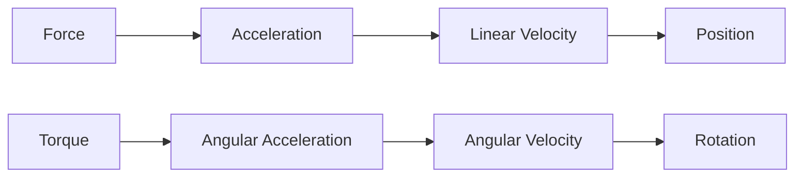
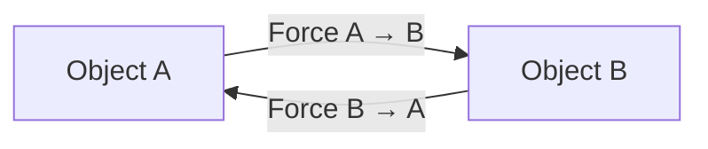
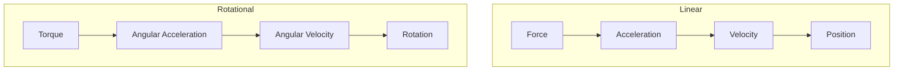
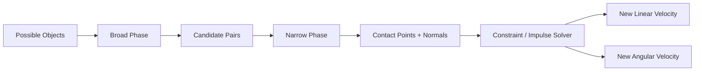
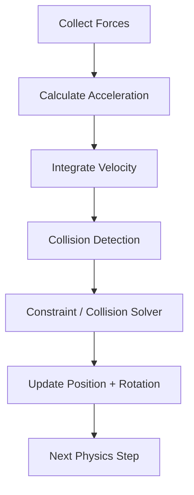
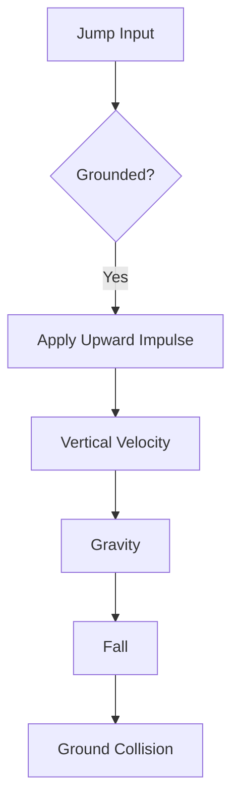
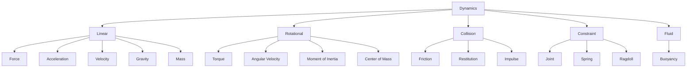

# 001 - Dynamics

| Thuộc tính | Nội dung |
|---|---|
| **Module** | Module 03 - Game Physics |
| **Roadmap item** | 3.1 |
| **Nhóm nội dung** | Game Physics |
| **Thứ tự trong module** | 001 |
| **Thời lượng gợi ý** | 40-55 phút |
| **Mức độ** | Cơ bản → Trung cấp |
| **Mục tiêu chính** | Hiểu cách lực, khối lượng, vận tốc, va chạm và chuyển động quay tạo ra hành vi vật lý trong game |

---

## 1. Tóm tắt

**Dynamics** là phần của cơ học nghiên cứu chuyển động của vật thể dưới tác dụng của **lực** và **mô-men lực**.

Trong game, Dynamics là nền tảng của:

- Rigidbody.
- Vật thể rơi.
- Nhân vật nhảy.
- Va chạm.
- Xe cộ.
- Đạn và projectile.
- Ragdoll.
- Vật thể nổi trên nước.
- Cửa, dây, cầu treo và hệ thống joint.
- Các vật thể có thể đẩy, kéo hoặc phá hủy.

Điểm quan trọng khi làm game là:

> Physics không nhất thiết phải mô phỏng thế giới thật tuyệt đối.
> Nó cần **ổn định, dễ điều khiển, dễ dự đoán và phục vụ gameplay**.

Một game platformer có thể cố tình dùng gravity lớn hơn thực tế để nhân vật rơi nhanh và responsive hơn. Xe arcade có thể được thêm lực ép xuống hoặc giới hạn rotation để dễ điều khiển.

---

## 2. Mục tiêu học tập

Sau bài này, bạn nên có thể:

- Giải thích Dynamics trong bối cảnh game physics.
- Hiểu mối liên hệ giữa **force → acceleration → velocity → position**.
- Hiểu chuyển động quay thông qua **torque → angular acceleration → angular velocity → rotation**.
- Giải thích ba định luật Newton ở mức cần thiết cho game development.
- Hiểu Rigidbody đại diện cho vật thể như thế nào.
- Phân biệt **Force** và **Impulse**.
- Hiểu:
  - Center of Mass.
  - Moment of Inertia.
  - Linear Velocity.
  - Angular Velocity.
  - Restitution.
  - Friction.
  - Buoyancy.
  - Joints.
- Biết vì sao một physics simulation ổn định quan trọng hơn một simulation hoàn toàn chính xác.
- Tạo một prototype nhỏ để kiểm nghiệm các tham số physics.

---

# 3. Dynamics là gì?

Có thể chia cơ học game thành ba khái niệm lớn:

| Khái niệm | Câu hỏi |
|---|---|
| **Kinematics** | Vật thể đang chuyển động như thế nào? |
| **Dynamics** | Vì sao vật thể chuyển động như vậy? |
| **Statics** | Khi nào các lực cân bằng và vật thể đứng yên? |

Ví dụ một quả bóng đang rơi:

### Kinematics

Quan tâm đến:

- Position.
- Velocity.
- Acceleration.
- Trajectory.

### Dynamics

Quan tâm đến:

- Gravity.
- Mass.
- Drag.
- Collision.
- Friction.
- Restitution.

---

## 3.1 Chuỗi mô phỏng chuyển động



Ở dạng đơn giản:

$$
F = ma
$$

suy ra:

$$
a = \frac{F}{m}
$$

Sau đó physics engine tích phân acceleration theo thời gian:

$$
v_{t+\Delta t} = v_t + a\Delta t
$$

và cập nhật vị trí:

$$
x_{t+\Delta t} = x_t + v\Delta t
$$

Đối với rotation:

$$
\tau = I\alpha
$$

trong đó:

- $\tau$: torque.
- $I$: moment of inertia.
- $\alpha$: angular acceleration.

---

# 4. Rigidbody

**Rigidbody** là mô hình dùng để biểu diễn một vật thể được xem như không biến dạng trong quá trình mô phỏng.

Một rigidbody thường có những trạng thái quan trọng:

```text
Rigidbody
│
├── Position
├── Rotation
│
├── Linear Velocity
├── Angular Velocity
│
├── Mass
├── Center of Mass
├── Moment / Tensor of Inertia
│
├── Forces
├── Torques
│
└── Collider / Collision Shape
```

Physics engine sử dụng những thông tin này để quyết định vật thể:

- Di chuyển bao xa.
- Quay bao nhiêu.
- Phản ứng thế nào khi bị đẩy.
- Phản ứng thế nào khi va chạm.
- Có bị lật hay không.
- Truyền động lượng sang vật thể khác như thế nào.

---

## 4.1 Rigidbody không giống Collider

Hai khái niệm thường đi cùng nhau nhưng khác nhiệm vụ:

| Thành phần | Vai trò |
|---|---|
| Rigidbody | Mô phỏng chuyển động |
| Collider | Xác định hình dạng va chạm |
| Physics Material | Điều khiển ma sát/bounce |
| Joint | Ràng buộc nhiều rigidbody |

Một object có thể được hình dung như:

```text
Game Object
├── Visual Mesh
├── Rigidbody
└── Collider
```

Mesh render không nhất thiết phải giống collider.

Trong thực tế, collider thường được đơn giản hóa thành:

- Box.
- Sphere.
- Capsule.
- Convex hull.
- Một số primitive ghép lại.

Điều này giúp collision detection nhanh và ổn định hơn.

---

# 5. Newton's Laws

Ba định luật Newton là nền tảng của classical dynamics.

---

## 5.1 Định luật I — Quán tính

Nếu tổng lực tác dụng bằng 0:

$$
\sum F = 0
$$

thì vật thể giữ nguyên trạng thái chuyển động.

Nếu đang đứng yên:

```text
Velocity = 0
```

nó tiếp tục đứng yên.

Nếu đang chuyển động:

```text
Velocity = constant
```

nó tiếp tục chuyển động với vận tốc đó.

Trong game, friction, damping và drag thường được thêm vào nên vật thể có thể chậm dần.

---

## 5.2 Định luật II — Force và Acceleration

$$
F = ma
$$

hay:

$$
a = \frac{F}{m}
$$

Với cùng một lực:

```text
Object A
Mass = 1 kg

Object B
Mass = 10 kg
```

thì:

```text
A → tăng tốc mạnh

B → tăng tốc ít hơn
```

---

## 5.3 Định luật III — Action và Reaction

Nếu vật A tác dụng lực lên vật B thì vật B cũng tác dụng một lực ngược chiều lên A.



Đây là cơ sở của nhiều collision response.

---

## 5.4 Free-body diagram

Một cách rất hữu ích để debug physics là vẽ tất cả lực đang tác động lên vật thể.


*Nguồn: [Wikimedia Commons - Free body diagram](https://commons.wikimedia.org/wiki/File:Free_body_diagram.png)*

Trong hình:

- `W`: trọng lực.
- `N`: normal force.
- `F`: friction.

Khi object có hành vi bất thường, hãy thử tự hỏi:

> Hiện tại có những lực nào đang tác dụng lên object này?

---

# 6. Acceleration

Acceleration là tốc độ thay đổi của velocity:

$$
a = \frac{dv}{dt}
$$

Trong simulation rời rạc:

$$
a \approx \frac{v_{new}-v_{old}}{\Delta t}
$$

Acceleration có thể đến từ:

- Gravity.
- Player input.
- Engine thrust.
- Explosion.
- Spring.
- Friction.
- Drag.
- Collision impulse.

---

## 6.1 Ví dụ nhân vật chạy

Thay vì đặt velocity ngay lập tức:

```text
velocity = maxSpeed
```

có thể tăng dần velocity:

```text
current velocity
      ↓
acceleration
      ↓
desired velocity
```

Kết quả thường cho movement mềm hơn.

Tuy nhiên game arcade đôi khi cố tình thay đổi velocity trực tiếp để tăng responsiveness.

---

# 7. Force

Force là đại lượng làm thay đổi momentum của vật thể.

Đơn giản nhất:

$$
F = ma
$$

Một số lực thường gặp trong game:

```text
Gravity
Player Force
Vehicle Engine Force
Spring Force
Drag
Lift
Buoyancy
Explosion Force
Friction
Contact Force
```

---

## 7.1 Gravity

Trọng lực:

$$
F_g = mg
$$

Trong đó:

- $m$: mass.
- $g$: gravitational acceleration.

Trong simulation game:

```text
Gravity
    ↓
Acceleration
    ↓
Velocity Y
    ↓
Position Y
```

Game không bắt buộc phải sử dụng gravity giống Trái Đất.

Ví dụ platformer thường chỉnh gravity để đạt:

- Jump height mong muốn.
- Fall speed hợp lý.
- Air control tốt.
- Gameplay responsive.

---

# 8. Force vs Impulse

Đây là một trong những khái niệm quan trọng nhất khi lập trình game physics.

## Force

Force thường tác động liên tục qua thời gian.

Ví dụ:

- Engine xe.
- Jetpack.
- Wind.
- Gravity.

## Impulse

Impulse là tác động lớn trong khoảng thời gian rất ngắn.

$$
J = \int F\,dt
$$

Với force gần như không đổi:

$$
J = F\Delta t
$$

Impulse làm thay đổi momentum:

$$
J = \Delta p
$$

với:

$$
p = mv
$$

---

## 8.1 So sánh

| Force | Impulse |
|---|---|
| Tác dụng theo thời gian | Gần như tức thời |
| Dùng cho engine/thrust | Dùng cho explosion/jump |
| Tạo acceleration liên tục | Thay đổi velocity nhanh |
| Phụ thuộc timestep nếu triển khai sai | Thường dùng cho event tức thời |

Ví dụ:

```text
Giữ nút ga
→ Force

Nhân vật nhảy
→ Impulse

Lựu đạn nổ
→ Impulse

Gió thổi
→ Force
```

---

# 9. Center of Mass

**Center of Mass — tâm khối lượng** là vị trí đại diện cho phân bố khối lượng của vật.

Với nhiều point mass:

$$
r_{COM}
=
\frac{\sum_i m_i r_i}
{\sum_i m_i}
$$

Không phải lúc nào Center of Mass cũng nằm ở chính giữa mesh.

Ví dụ một chiếc búa:

```text
        Heavy
       Hammer
        Head
         ███
          │
          │
          │
          │
```

Tâm khối lượng sẽ gần phần đầu búa hơn.

---

## 9.1 Center of Mass ảnh hưởng đến gameplay

Đặc biệt quan trọng với:

- Car.
- Motorcycle.
- Boat.
- Aircraft.
- Ragdoll.
- Mech.
- Crates.
- Destructible objects.

Ví dụ xe có Center of Mass quá cao:

```text
        COM
         ●
         │
     ┌───────┐
─────O───────O─────
```

Xe rất dễ lật.

Hạ COM:

```text
     ┌───────┐
         ● COM
─────O───────O─────
```

xe ổn định hơn.

---

## 9.2 Force không đi qua Center of Mass

Một force tác dụng lệch Center of Mass vừa có thể:

- Làm object di chuyển.
- Làm object quay.


*Nguồn: [Wikimedia Commons - Force and couple](https://commons.wikimedia.org/wiki/File:Force_and_couple.PNG)*

Đây là lý do:

```text
Đẩy chính giữa hộp
→ chủ yếu translation

Đẩy vào góc hộp
→ translation + rotation
```

---

# 10. Moment of Inertia

Nếu mass mô tả mức độ khó thay đổi **linear velocity** thì moment of inertia mô tả mức độ khó thay đổi **angular velocity**.

Quan hệ cơ bản:

$$
\tau = I\alpha
$$

suy ra:

$$
\alpha = \frac{\tau}{I}
$$

$I$ càng lớn:

> Cần torque lớn hơn để đạt cùng angular acceleration.

Trong rigidbody 3D, engine thường biểu diễn đặc tính này bằng **inertia tensor** thay vì chỉ một số $I$.

---

## 10.1 Mass distribution rất quan trọng

Moment of inertia phụ thuộc không chỉ vào mass mà còn vào vị trí của mass so với trục quay.

Với các point mass:

$$
I = \sum_i m_i r_i^2
$$

Mass càng xa rotation axis thì đóng góp vào inertia càng lớn.


*Nguồn: [Wikimedia Commons - Moment of inertia rod end](https://commons.wikimedia.org/wiki/File:Moment_of_inertia_rod_end.svg)*

---

## 10.2 Ví dụ trong game

Hai object có cùng mass:

```text
Object A
Mass concentrated near center

Object B
Mass distributed far from center
```

Object B có thể khó xoay hơn dù tổng mass bằng Object A.

Ứng dụng:

- Wheels.
- Flywheel.
- Weapons.
- Vehicles.
- Props.
- Ragdolls.

---

# 11. Torque

Torque là phiên bản quay của force.

$$
\tau = r \times F
$$

Độ lớn:

$$
|\tau| = rF\sin\theta
$$

Trong đó:

- $r$: khoảng cách từ rotation axis đến điểm tác dụng lực.
- $F$: lực.
- $\theta$: góc giữa $r$ và $F$.

---

## 11.1 Ví dụ cánh cửa

Đẩy gần bản lề:

```text
Pivot ●─F────────────
```

Torque nhỏ.

Đẩy ở tay nắm:

```text
Pivot ●────────────F
```

Torque lớn hơn.

Đây cũng là nguyên lý xảy ra khi:

- Đạn bắn trúng cạnh thùng.
- Xe va vào góc tường.
- Một nhân vật đẩy mép vật thể.
- Explosion tác động lệch Center of Mass.

---

# 12. Linear Velocity

Linear Velocity mô tả:

> Object đang di chuyển nhanh bao nhiêu và theo hướng nào.

Vector:

$$
\vec v =
(v_x,v_y,v_z)
$$

Ví dụ:

```text
v = (5, 0, 0)
```

nghĩa là object di chuyển theo trục X.

Magnitude:

$$
|\vec v|
=
\sqrt{v_x^2+v_y^2+v_z^2}
$$

là speed.

---

## 12.1 Velocity khác speed

**Speed**

```text
5 m/s
```

chỉ có độ lớn.

**Velocity**

```text
5 m/s về phía East
```

có cả:

- Magnitude.
- Direction.

---

# 13. Angular Velocity

Angular Velocity mô tả tốc độ quay.

Đơn vị thường dùng:

```text
rad/s
```

Có thể biểu diễn bằng vector:

$$
\vec\omega =
(\omega_x,\omega_y,\omega_z)
$$


*Nguồn: [Wikimedia Commons - Angularvelocity](https://commons.wikimedia.org/wiki/File:Angularvelocity.svg)*

Direction của angular velocity có thể xác định bằng **right-hand rule**.

---

## 13.1 Linear và Angular Motion

Có sự tương đồng:

| Linear | Rotational |
|---|---|
| Position $x$ | Rotation $\theta$ |
| Velocity $v$ | Angular velocity $\omega$ |
| Acceleration $a$ | Angular acceleration $\alpha$ |
| Mass $m$ | Moment of inertia $I$ |
| Force $F$ | Torque $\tau$ |
| Momentum $p$ | Angular momentum $L$ |

Hai hệ gần như song song:



---

# 14. Friction

Friction — ma sát — chống lại chuyển động tương đối giữa hai bề mặt.

Có hai khái niệm quan trọng:

- Static friction.
- Kinetic/dynamic friction.

---

## 14.1 Static Friction

Static friction giữ object chưa trượt.

Giới hạn gần đúng:

$$
F_s \le \mu_s N
$$

Trong đó:

- $\mu_s$: hệ số ma sát tĩnh.
- $N$: normal force.

---

## 14.2 Kinetic Friction

Khi object đã trượt:

$$
F_k = \mu_k N
$$


*Nguồn: [Wikimedia Commons - Static and dynamic friction](https://commons.wikimedia.org/wiki/File:Static_and_dynamic_friction_on_a_hill.svg)*

---

## 14.3 Friction trong gameplay

Friction ảnh hưởng mạnh đến cảm giác điều khiển.

### Friction thấp

```text
Ice
↓
Object trượt lâu
```

### Friction cao

```text
Rubber / Rough ground
↓
Object dừng nhanh
```

Ứng dụng:

- Xe.
- Platformer.
- Hockey.
- Sliding puzzle.
- Physics sandbox.
- Character controller.

---

## 14.4 Friction và game feel

Physics đúng về mặt vật lý chưa chắc tạo gameplay tốt.

Ví dụ character platformer có thể sử dụng:

```text
Ground friction = cao
Air friction = rất thấp
```

nhằm:

- Dừng nhanh trên mặt đất.
- Vẫn điều khiển được khi nhảy.
- Không tạo cảm giác nhân vật trượt như trên băng.

---

# 15. Restitution

**Restitution** mô tả mức độ đàn hồi của collision.

Có thể hiểu đơn giản là:

> Sau va chạm, hai vật tách khỏi nhau nhanh đến mức nào so với tốc độ chúng tiến lại gần nhau.

Theo collision normal:

$$
e =
\frac
{\text{relative separation velocity}}
{\text{relative approach velocity}}
$$

Giá trị phổ biến:

```text
e = 0
→ hoàn toàn không đàn hồi

0 < e < 1
→ bounce một phần

e = 1
→ collision đàn hồi lý tưởng
```

---

## 15.1 Minh họa collision response


*Nguồn: [University of Illinois - CS 418 Physics-Based Animation](https://courses.physics.illinois.edu/cs418/fa2022/text/kinetics.html)*

---

## 15.2 Ví dụ gameplay

### Bowling ball

```text
Restitution thấp
```

### Basketball

```text
Restitution trung bình / cao
```

### Super bounce pad

```text
Restitution rất cao
hoặc
custom impulse
```

Trong game, bounce pad thường không cần tuân thủ vật lý hoàn toàn.

Ta có thể trực tiếp tạo impulse để đảm bảo player luôn bật đến độ cao mong muốn.

---

# 16. Collision Response

Khi hai rigidbody va chạm, physics solver cần quyết định:

1. Hai object có thực sự chạm nhau không?
2. Contact point ở đâu?
3. Contact normal là hướng nào?
4. Chúng đang xuyên vào nhau bao nhiêu?
5. Phải thay đổi velocity như thế nào?
6. Friction phải tác động bao nhiêu?

Pipeline khái niệm:



---

# 17. Broad Phase vs Narrow Phase

## Broad Phase

Mục tiêu:

> Loại bỏ nhanh những object chắc chắn không thể collision.

Các kỹ thuật thường gặp:

- Bounding volumes.
- Spatial partitioning.
- Sweep and prune.
- BVH.
- Grid.
- Tree structures.

Ví dụ:

```text
1000 objects
      ↓
Broad Phase
      ↓
25 candidate pairs
```

Không cần kiểm tra chính xác toàn bộ:

$$
1000 \times 999 / 2
$$

cặp object.

---

## Narrow Phase

Narrow phase kiểm tra collision chính xác hơn giữa các candidate pair.

Ví dụ:

```text
Box vs Box
Sphere vs Sphere
Capsule vs Triangle
Convex Hull vs Convex Hull
```

Kết quả có thể gồm:

- Collision normal.
- Penetration depth.
- Contact point.
- Contact manifold.

---

## 17.1 So sánh

| Broad Phase | Narrow Phase |
|---|---|
| Nhanh | Đắt hơn |
| Kiểm tra gần đúng | Kiểm tra chính xác |
| Loại bỏ phần lớn object | Chỉ xử lý candidate |
| Spatial structure | Collision geometry |

Pipeline:

```text
Scene
 ↓
Broad Phase
 ↓
Potential collision
 ↓
Narrow Phase
 ↓
Actual contacts
 ↓
Solver
```

---

# 18. Buoyancy

Buoyancy là lực hướng lên mà chất lỏng tác dụng lên vật thể bị chìm.

Theo nguyên lý Archimedes:

$$
F_b
=
\rho_{fluid}gV_{displaced}
$$

Trong đó:

- $\rho_{fluid}$: density của chất lỏng.
- $g$: gravity.
- $V_{displaced}$: thể tích chất lỏng bị displaced.


*Nguồn: [Wikimedia Commons - Archimedes principle](https://commons.wikimedia.org/wiki/File:Archimedes_principle.svg)*

---

## 18.1 Trạng thái nổi

Nếu:

$$
F_b > F_g
$$

vật tăng tốc lên trên.

Nếu:

$$
F_b < F_g
$$

vật chìm.

Khi:

$$
F_b \approx F_g
$$

vật có thể đạt trạng thái cân bằng.

---

## 18.2 Buoyancy trong game

Ứng dụng:

- Boat.
- Floating crates.
- Submarine.
- Swimming characters.
- Debris.
- Water physics.

Game thường đơn giản hóa buoyancy.

Thay vì tính chính xác toàn bộ thể tích mesh chìm dưới nước, có thể đặt nhiều **buoyancy points**:

```text
       Boat

       ┌──────────────┐
       │              │
       └──────────────┘
         ↑    ↑    ↑
        B1   B2   B3

~~~~~~~~~~~~~~~~~~~~~~~~ Water
```

Mỗi điểm kiểm tra độ sâu dưới mặt nước rồi tạo force hướng lên.

Cách này:

- Dễ tính.
- Dễ tune.
- Có thể tạo pitching và rolling cho thuyền.

---

# 19. Joints

Joint kết nối hai rigidbody bằng một hoặc nhiều constraint.

Các loại phổ biến:

- Fixed Joint.
- Hinge Joint.
- Distance Joint.
- Spring Joint.
- Slider / Prismatic Joint.
- Ball-and-Socket Joint.
- Configurable Joint.


*Nguồn: [Apple Developer - Simulating Physics](https://developer.apple.com/library/archive/documentation/GraphicsAnimation/Conceptual/SpriteKit_PG/Physics/Physics.html)*

---

## 19.1 Fixed Joint

Hai object gần như được khóa với nhau.

Ứng dụng:

- Weapon attachment.
- Connected machinery.
- Temporary object connection.

---

## 19.2 Hinge Joint

Chỉ cho phép rotation quanh một axis.

```text
Wall
 │
 ●──────── Door
 ↑
Hinge
```

Ứng dụng:

- Door.
- Wheel.
- Trap.
- Lever.

---

## 19.3 Slider Joint

Cho phép movement dọc theo một axis.

```text
────────────── Axis
      ⇆
     [Box]
```

Ứng dụng:

- Elevator mechanism.
- Piston.
- Mechanical platform.

---

## 19.4 Ball-and-Socket

Cho phép rotation theo nhiều hướng.

Ứng dụng:

- Shoulder.
- Hip.
- Ragdoll.

---

# 20. Spring System

Một spring đơn giản tuân theo Hooke's Law:

$$
F_{spring} = -kx
$$

Trong đó:

- $k$: spring stiffness.
- $x$: độ lệch khỏi rest position.

Nhưng spring hoàn hảo có thể dao động mãi.

Vì vậy game thường thêm damping:

$$
F
=
-kx-cv
$$

Trong đó:

- $c$: damping coefficient.
- $v$: velocity.

---

## 20.1 Spring trong gameplay

Ứng dụng:

- Car suspension.
- Camera spring.
- Rope.
- Grappling hook.
- Weapon recoil.
- Soft follow systems.
- Suspension bridge.

Ví dụ suspension:

```text
Vehicle Body
───────────────
     │
   Spring
     │
     O Wheel
```

Nếu:

```text
k quá nhỏ
```

xe quá mềm.

Nếu:

```text
k quá lớn
```

simulation dễ rung hoặc thiếu tự nhiên nếu timestep/solver không đủ tốt.

---

# 21. Physics Simulation Loop

Game physics không chạy liên tục.

Simulation thực hiện từng bước thời gian:

$$
t_0
\rightarrow
t_1
\rightarrow
t_2
\rightarrow
t_3
$$

Mỗi physics step thường thực hiện:



---

# 22. Fixed Timestep

Physics thường nên chạy theo **fixed timestep**.

Ví dụ:

```text
Render

Frame 1 = 12 ms
Frame 2 = 21 ms
Frame 3 = 16 ms
```

nhưng physics có thể chạy:

```text
Physics step = constant Δt
```

Điều này làm simulation:

- Ổn định hơn.
- Ít phụ thuộc FPS.
- Dễ debug hơn.

---

## 22.1 Timestep quá lớn

Có thể gây:

- Object xuyên tường.
- Joint rung.
- Stack object không ổn định.
- Collision thiếu chính xác.
- Spring phát nổ.

---

## 22.2 Timestep quá nhỏ

Cho:

- Simulation chính xác hơn.

Nhưng:

- Tốn CPU hơn.

Đây là một trade-off quan trọng của game physics.

---

# 23. Continuous Collision Detection

Một projectile rất nhanh có thể xảy ra:

```text
Frame N

Bullet ●        | Wall


Frame N+1

                | Wall
                       ● Bullet
```

Bullet chưa bao giờ nằm ngay trên wall tại thời điểm sampling.

Kết quả:

> Bullet có thể xuyên qua collider.

Hiện tượng này thường gọi là **tunneling**.

Một giải pháp là:

- Continuous Collision Detection — CCD.
- Raycast / shape cast.
- Physics substeps.

Đặc biệt hữu ích với:

- Bullet.
- Fast vehicles.
- Small fast objects.

---

# 24. Physics chính xác vs Physics phục vụ Gameplay

Đây là distinction rất quan trọng.

## Simulation hướng tới vật lý

Ưu tiên:

```text
Accuracy
↓
Realistic forces
↓
Realistic materials
↓
Physical consistency
```

Phù hợp với:

- Simulator.
- Engineering game.
- Realistic driving.

---

## Gameplay Physics

Ưu tiên:

```text
Player Control
↓
Readability
↓
Consistency
↓
Fun
```

Có thể sử dụng:

- Custom gravity.
- Extra downward force.
- Artificial traction.
- Velocity clamp.
- Rotation constraints.
- Fake suspension.
- Custom jump impulse.
- Magnet forces.
- Invisible stabilizers.

---

## 24.1 Ví dụ platformer

Physics thật:

```text
Player chạy khỏi mép
→ hoàn toàn tuân theo momentum
```

Gameplay platformer có thể thêm:

- Air control.
- Coyote time.
- Jump buffering.
- Faster falling.
- Different rising/falling gravity.
- Velocity clamp.

Vì vậy:

> Physics engine là công cụ phục vụ gameplay chứ không phải luật bắt buộc game phải tuân theo tuyệt đối.

---

# 25. Ứng dụng Dynamics trong Game

## 25.1 Nhân vật nhảy

Các yếu tố:

```text
Jump Impulse
Gravity
Vertical Velocity
Ground Detection
Air Control
```

Pipeline:



---

## 25.2 Vật thể rơi

Tối thiểu cần:

```text
Rigidbody
+
Gravity
+
Collider
+
Ground Collider
```

Có thể experiment với:

- Mass.
- Drag.
- Restitution.
- Friction.

---

## 25.3 Xe cộ

Vehicle dynamics thường liên quan:

- Center of Mass.
- Wheel friction.
- Suspension.
- Spring.
- Damping.
- Torque.
- Angular velocity.
- Aerodynamic forces.

Ví dụ:

```text
Engine Torque
       ↓
Wheel
       ↓
Friction with ground
       ↓
Vehicle acceleration
```

---

## 25.4 Projectile

Projectile đơn giản:

$$
a = g
$$

$$
v_{new}=v+g\Delta t
$$

$$
x_{new}=x+v\Delta t
$$

Trajectory:

```text
        ●
      ●
    ●
  ●
●
──────────────── Ground
```

Có thể thêm:

- Drag.
- Wind.
- Homing.
- Collision.
- Bounce.

---

## 25.5 Collision

Ví dụ crate:

```text
Player
   ↓ push

[Player] → [Crate]
             ↓
          Rigidbody
             ↓
          Friction
             ↓
           Ground
```

---

## 25.6 Ragdoll

Ragdoll thường là hệ thống nhiều rigidbody nối nhau bằng joint:

```text
       Head
        O
        |
     Chest
      / \
   Arm   Arm
      \ /
      Hip
      / \
    Leg Leg
```

Mỗi phần có:

- Rigidbody.
- Collider.
- Joint.

Ví dụ:

```text
Upper Arm
    ↓
Shoulder Joint
    ↓
Torso
```

---

## 25.7 Platformer Physics

Những thứ thường cần tune:

| Tham số | Ảnh hưởng |
|---|---|
| Gravity | Tốc độ rơi |
| Jump impulse | Độ cao jump |
| Ground friction | Khả năng dừng |
| Air control | Điều khiển trên không |
| Max fall speed | Tốc độ rơi tối đa |
| Restitution | Bounce |
| Slope handling | Di chuyển trên dốc |

---

# 26. Prototype thực hành

Tạo một scene **Dynamics Playground**.

Có thể chia scene thành bốn khu vực.

```text
┌──────────────────────────────────────────────┐
│                                              │
│  A. Friction Ramp                           │
│                                              │
│  B. Bounce Test                             │
│                                              │
│  C. Joint / Pendulum                        │
│                                              │
│  D. Buoyancy Pool                           │
│                                              │
└──────────────────────────────────────────────┘
```

---

## 26.1 Experiment A — Friction Ramp

Tạo:

- Một slope.
- 3 boxes.
- 3 mức friction khác nhau.

Ví dụ:

```text
Box A → low friction
Box B → medium friction
Box C → high friction
```

Quan sát:

- Box nào bắt đầu trượt trước?
- Box nào đi xa nhất?
- Friction ảnh hưởng game feel thế nào?

---

## 26.2 Experiment B — Restitution

Tạo ba quả bóng:

```text
Ball A
e = 0

Ball B
e ≈ medium

Ball C
e ≈ high
```

Thả từ cùng độ cao.

Quan sát:

```text
Initial Height
       ● ● ●
       │ │ │
       ↓ ↓ ↓

──────────────── Ground
```

Ghi lại:

- Bounce height.
- Số lần bounce.
- Thời gian để dừng.

---

## 26.3 Experiment C — Center of Mass

Tạo một vehicle đơn giản.

### Test 1

Center of Mass cao.

Chạy qua góc cua.

### Test 2

Hạ Center of Mass.

So sánh:

- Body roll.
- Khả năng lật.
- Stability.

---

## 26.4 Experiment D — Joint

Tạo pendulum:

```text
Fixed Point ●
            |
            |
            |
           [Box]
```

Dùng hinge joint.

Thử thay đổi:

- Mass.
- Joint limit.
- Gravity.
- Damping.

---

## 26.5 Experiment E — Spring

Tạo:

```text
Anchor
  |
Spring
  |
Object
```

Thay đổi:

```text
Spring stiffness
Damping
Mass
```

Quan sát:

- Oscillation.
- Settling time.
- Instability.

---

## 26.6 Experiment F — Buoyancy

Tạo water plane.

Cho một crate rơi xuống nước.

Áp dụng:

```text
Gravity ↓

Buoyancy ↑
```

Sau đó thêm:

- Linear damping.
- Angular damping.

Mục tiêu:

```text
Crate
 ↓
Water impact
 ↓
Sink slightly
 ↓
Rise
 ↓
Oscillate
 ↓
Stabilize
```

---

# 27. Bảng thí nghiệm nên ghi lại

| Test | Tham số thay đổi | Quan sát | Kết luận |
|---|---|---|---|
| Friction | $\mu$ | Quãng đường trượt | Friction ảnh hưởng stopping distance |
| Restitution | $e$ | Bounce height | Restitution điều khiển elasticity |
| Mass | $m$ | Response to force | Mass lớn → acceleration nhỏ |
| COM | Position | Vehicle roll | COM thấp → ổn định hơn |
| Spring | $k$ | Oscillation | $k$ lớn → spring cứng |
| Damping | $c$ | Settling | Damping lớn → giảm dao động |
| Buoyancy | $F_b$ | Floating | Lực nổi đối kháng gravity |

---

# 28. Physics Debugging

Physics bug thường khó tìm chỉ bằng mắt.

Nên sử dụng:

- Collider visualization.
- Contact point visualization.
- Normal visualization.
- Velocity vectors.
- Center of Mass gizmo.
- Physics profiler.
- Logs.
- Inspector.
- Slow motion.
- Frame stepping.

---

## 28.1 Debug velocity

Hiển thị:

```text
Object ●────────────→
         velocity
```

Nếu object bay sai hướng, kiểm tra vector velocity trước tiên.

---

## 28.2 Debug contact normal

```text
        ↑ Normal
        |
      Contact
────────●────────
```

Normal sai có thể làm collision response bất thường.

---

## 28.3 Debug Center of Mass

Vẽ gizmo:

```text
Object

┌─────────────┐
│             │
│       ● COM │
│             │
└─────────────┘
```

Đặc biệt hữu ích với vehicle.

---

# 29. Những lỗi Physics thường gặp

## 29.1 Object xuyên tường

Nguyên nhân có thể:

- Velocity quá lớn.
- Collider quá nhỏ.
- Timestep quá lớn.
- Không dùng CCD.

---

## 29.2 Object rung khi đứng trên ground

Có thể liên quan:

- Penetration correction.
- Solver.
- Collider geometry.
- Joint.
- Timestep.
- Hai hệ thống cùng điều khiển transform.

---

## 29.3 Joint phát nổ

Triệu chứng:

```text
Joint
 ↓
Huge velocity
 ↓
Object flying away
```

Kiểm tra:

- Mass ratio.
- Spring stiffness.
- Timestep.
- Solver iterations.
- Constraint configuration.

---

## 29.4 Physics và Transform đánh nhau

Một lỗi phổ biến:

```text
Physics Engine
     ↓
moves Rigidbody

Game Code
     ↓
directly sets Transform

          ↓

Conflict
```

Nên xác định rõ:

> Object đang được điều khiển bởi physics hay bởi animation/game logic?

---

## 29.5 Collider quá phức tạp

Ví dụ:

```text
Visual Mesh
100,000 triangles

Collider
100,000 triangles
```

có thể không cần thiết.

Thường nên dùng:

```text
Visual Mesh
100,000 triangles

Collider
↓
Box
Capsule
Convex Hull
```

tùy gameplay.

---

# 30. Physics Optimization

Physics có thể trở thành bottleneck nếu scene có rất nhiều object.

Các yếu tố cần chú ý:

- Số rigidbody.
- Số collider.
- Collider complexity.
- Collision pairs.
- Joint count.
- Solver iterations.
- Physics frequency.
- CCD usage.
- Sleeping objects.

---

## 30.1 Sleeping

Object đứng yên lâu có thể được physics engine cho **sleep**.

```text
Moving Rigidbody
      ↓
Velocity gần 0
      ↓
Sleep
      ↓
Skip unnecessary simulation
```

Khi có tác động:

```text
Collision / Force
      ↓
Wake Up
```

---

## 30.2 Collision Layers

Không phải tất cả object đều cần collision với nhau.

Ví dụ:

```text
Player
├── World      ✓
├── Enemy      ✓
├── Projectile ✓
└── UI         ✗
```

Collision filtering giúp giảm lượng work cho physics engine.

---

# 31. Mental Model quan trọng

Hãy hình dung một Rigidbody bằng hai hệ song song.

```text
LINEAR MOTION

Force
  ↓
Acceleration
  ↓
Velocity
  ↓
Position
```

và:

```text
ROTATIONAL MOTION

Torque
  ↓
Angular Acceleration
  ↓
Angular Velocity
  ↓
Rotation
```

Hai yếu tố quyết định độ khó thay đổi chuyển động:

```text
Linear
Mass

Rotational
Moment of Inertia
```

---

# 32. Sơ đồ tổng hợp Dynamics



---

# 33. Ứng dụng theo hệ thống Game

| Game System | Dynamics được sử dụng |
|---|---|
| Character | Gravity, impulse, friction |
| Vehicle | Torque, friction, COM, spring |
| Projectile | Velocity, gravity, collision |
| Ragdoll | Rigidbody, joint, torque |
| Water | Buoyancy, damping |
| Destruction | Force, impulse, collision |
| Platformer | Gravity, friction, velocity |
| Physics Puzzle | Mass, torque, joint |
| Sports Game | Restitution, friction, impulse |

---

# 34. Bài tập thực hành

## Bài 1 — Force vs Impulse

Tạo một rigidbody.

Test:

```text
Case A
Continuous force

Case B
Single impulse
```

Ghi lại sự khác biệt.

---

## Bài 2 — Mass

Tạo:

```text
Cube A = 1 kg
Cube B = 10 kg
```

Tác dụng cùng một force.

Giải thích vì sao acceleration khác nhau bằng:

$$
a = \frac{F}{m}
$$

---

## Bài 3 — Friction

Tạo slope và ba object với friction khác nhau.

Ghi lại:

- Góc bắt đầu trượt.
- Quãng đường.
- Thời gian dừng.

---

## Bài 4 — Restitution

Thả ba quả bóng với restitution khác nhau.

So sánh bounce height.

---

## Bài 5 — Torque

Tác dụng cùng một force:

```text
Case A
Force qua Center of Mass

Case B
Force lệch Center of Mass
```

Quan sát angular velocity.

---

## Bài 6 — Joint

Tạo:

- Một hinge.
- Một spring.
- Một fixed joint.

Mô tả trường hợp gameplay phù hợp với từng loại.

---

## Bài 7 — Debug một lỗi Physics

Cố tình tạo một bug như:

- Object xuyên wall.
- Joint rung.
- Ball bounce quá mạnh.
- Vehicle dễ lật.

Sau đó ghi lại:

```text
Bug
↓
Hypothesis
↓
Debug visualization
↓
Parameter changed
↓
Result
↓
Conclusion
```

---

# 35. Artifact nên tạo

## Artifact 1 — Dynamics Playground

Một scene chứa:

- Ramp.
- Boxes.
- Balls.
- Joint.
- Spring.
- Vehicle test.
- Water test.

README giải thích từng experiment.

---

## Artifact 2 — Collision Checklist

Ví dụ:

```markdown
## Collision Debug Checklist

- [ ] Collider có đúng kích thước không?
- [ ] Rigidbody có đúng mass không?
- [ ] Object có đang dùng CCD không?
- [ ] Collision layer có đúng không?
- [ ] Physics material có friction phù hợp không?
- [ ] Restitution có quá lớn không?
- [ ] Velocity có quá cao không?
- [ ] Timestep có phù hợp không?
- [ ] Có code nào sửa Transform trực tiếp không?
```

---

## Artifact 3 — Physics Bug Note

Template:

```markdown
# Physics Bug

## Problem

Object xuyên qua wall khi velocity > ...

## Expected

Projectile phải collision với wall.

## Actual

Projectile xuất hiện phía bên kia wall.

## Hypothesis

Discrete collision detection bỏ qua collider giữa hai physics steps.

## Debug

- Visualized collider.
- Logged velocity.
- Reduced timestep.
- Enabled CCD.

## Solution

...

## Lesson Learned

...
```

Artifact dạng này rất tốt để thể hiện:

- Debugging skill.
- Engineering reasoning.
- Khả năng ghi lại technical trade-off.

---

# 36. Câu hỏi tự kiểm tra

1. Dynamics khác Kinematics như thế nào?
2. Rigidbody lưu những trạng thái quan trọng nào?
3. Vì sao cùng một force nhưng object nhẹ tăng tốc nhanh hơn?
4. Force và Impulse khác nhau như thế nào?
5. Center of Mass ảnh hưởng vehicle stability ra sao?
6. Moment of Inertia khác mass như thế nào?
7. Torque được sinh ra như thế nào?
8. Linear Velocity khác Angular Velocity ở đâu?
9. Friction ảnh hưởng game feel như thế nào?
10. Restitution bằng 0 có ý nghĩa gì?
11. Vì sao projectile nhanh có thể xuyên collider?
12. Broad phase khác Narrow phase như thế nào?
13. Spring damping dùng để làm gì?
14. Joint được sử dụng như thế nào trong ragdoll?
15. Vì sao game physics không nhất thiết phải chính xác tuyệt đối?
16. Khi nào nên sử dụng physics và khi nào nên điều khiển movement bằng game logic?

---

# 37. Checklist hoàn thành

- [ ] Giải thích được Dynamics.
- [ ] Hiểu $F=ma$.
- [ ] Hiểu Rigidbody.
- [ ] Phân biệt Force và Impulse.
- [ ] Hiểu Gravity.
- [ ] Hiểu Center of Mass.
- [ ] Hiểu Moment of Inertia.
- [ ] Hiểu Torque.
- [ ] Phân biệt Linear Velocity và Angular Velocity.
- [ ] Hiểu Friction.
- [ ] Hiểu Restitution.
- [ ] Hiểu Buoyancy.
- [ ] Biết các loại Joint cơ bản.
- [ ] Hiểu Spring và Damping.
- [ ] Phân biệt Broad Phase và Narrow Phase.
- [ ] Hiểu tunneling và CCD.
- [ ] Biết debug collider/velocity/contact.
- [ ] Hoàn thành ít nhất một physics prototype.
- [ ] Ghi lại ít nhất một physics bug và cách giải quyết.

---

# 38. Tổng kết

**Dynamics** là nền tảng của hầu hết các hệ thống vật lý tương tác trong game.

Mental model quan trọng nhất là:

```text
Force
 ↓
Acceleration
 ↓
Linear Velocity
 ↓
Position
```

và:

```text
Torque
 ↓
Angular Acceleration
 ↓
Angular Velocity
 ↓
Rotation
```

Trong đó:

```text
Mass
→ chống lại thay đổi linear motion

Moment of Inertia
→ chống lại thay đổi rotational motion
```

Collision bổ sung:

```text
Contact
├── Normal
├── Impulse
├── Friction
└── Restitution
```

Constraint bổ sung:

```text
Joint
├── Hinge
├── Fixed
├── Slider
├── Spring
└── Ball-and-Socket
```

Điểm quan trọng nhất đối với game developer:

> Không nên hỏi chỉ rằng **"physics này có đúng ngoài đời không?"**.

Cần hỏi thêm:

> **"Physics này có ổn định, dễ điều khiển và tạo gameplay tốt không?"**

Một hệ thống Dynamics tốt thường cân bằng giữa:

```text
Physical Plausibility
        +
Numerical Stability
        +
Performance
        +
Gameplay Control
        =
Useful Game Physics
```

---

# 39. Nguồn tham khảo và ảnh minh họa

- [Wikimedia Commons - Free body diagram](https://commons.wikimedia.org/wiki/File:Free_body_diagram.png)
- [Wikimedia Commons - Force and couple](https://commons.wikimedia.org/wiki/File:Force_and_couple.PNG)
- [Wikimedia Commons - Moment of inertia rod end](https://commons.wikimedia.org/wiki/File:Moment_of_inertia_rod_end.svg)
- [Wikimedia Commons - Angular velocity](https://commons.wikimedia.org/wiki/File:Angularvelocity.svg)
- [Wikimedia Commons - Static and dynamic friction](https://commons.wikimedia.org/wiki/File:Static_and_dynamic_friction_on_a_hill.svg)
- [Wikimedia Commons - Archimedes principle](https://commons.wikimedia.org/wiki/File:Archimedes_principle.svg)
- [University of Illinois CS 418 - Physics-Based Animation](https://courses.physics.illinois.edu/cs418/fa2022/text/kinetics.html)
- [Apple Developer - Simulating Physics](https://developer.apple.com/library/archive/documentation/GraphicsAnimation/Conceptual/SpriteKit_PG/Physics/Physics.html)

---

# Bài luyện tập

## Mục tiêu


## Đề bài


## Yêu cầu hoàn thành

- [ ] 
- [ ] 
- [ ] 

## Kết quả / lời giải


## Ghi chú
