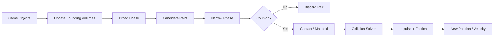
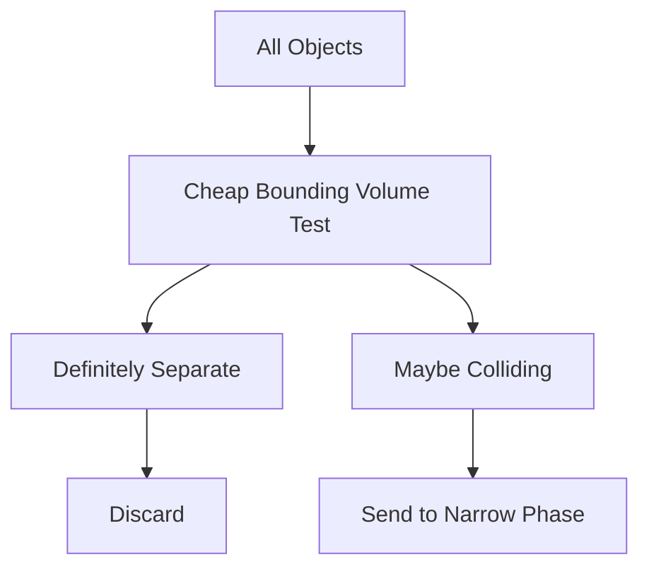
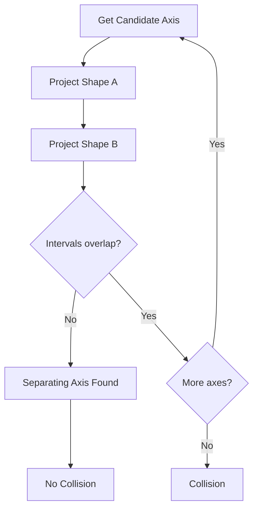
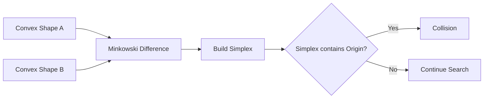
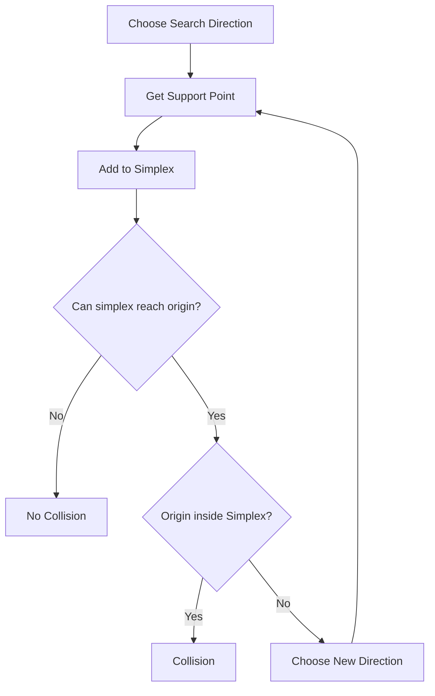
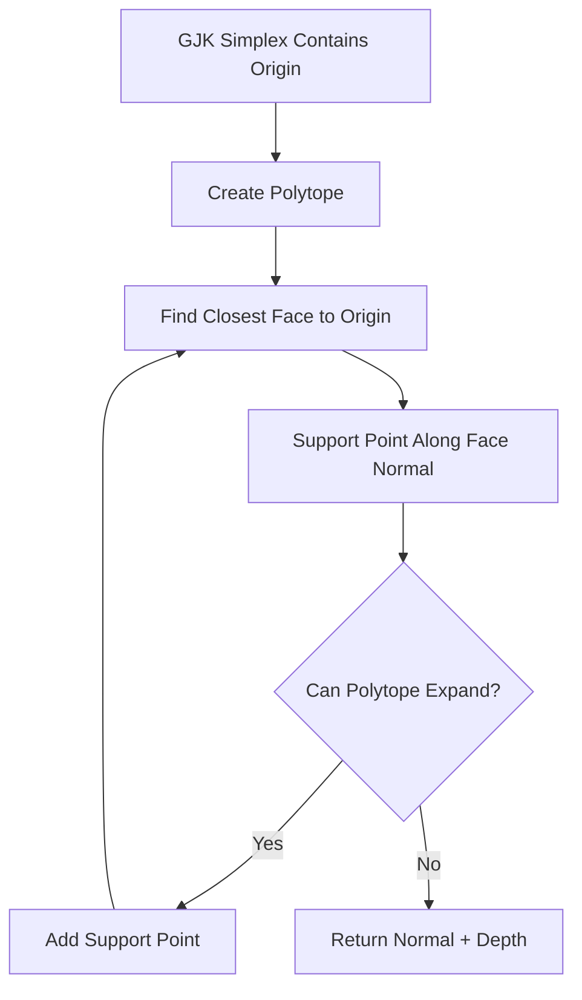
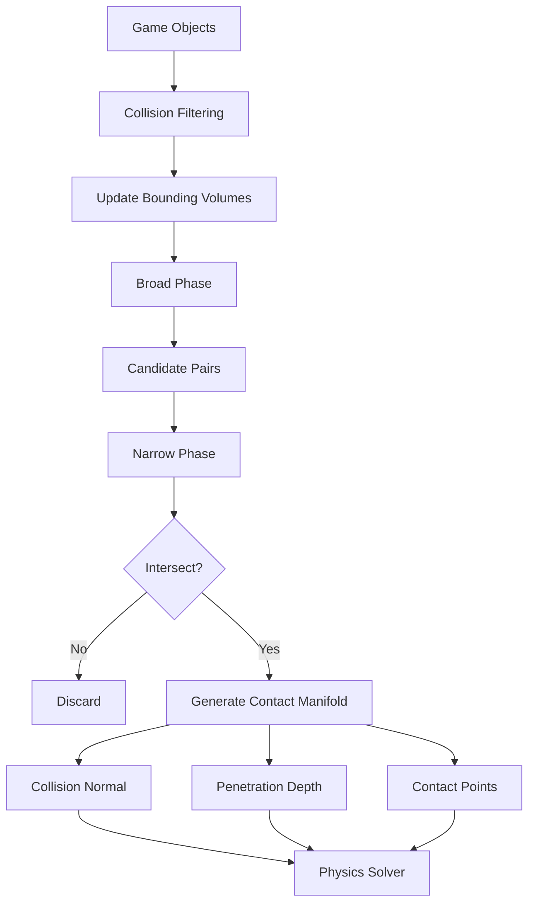
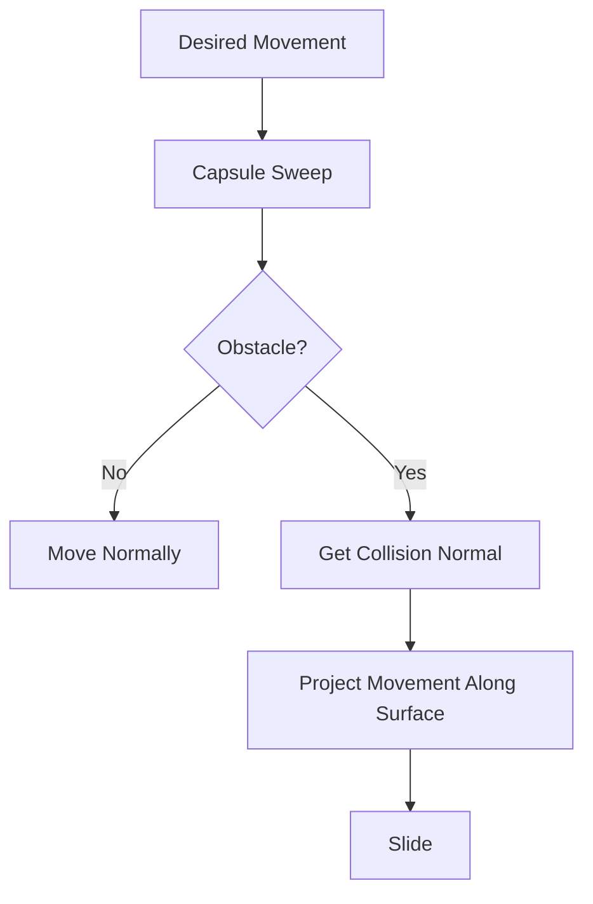
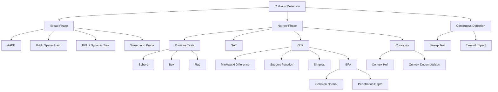

# 002 - Collision Detection

| Thuộc tính | Nội dung |
|---|---|
| **Module** | Module 03 - Game Physics |
| **Roadmap item** | 3.2 |
| **Nhóm nội dung** | Game Physics |
| **Thứ tự trong module** | 002 |
| **Thời lượng gợi ý** | 40-55 phút |
| **Mức độ** | Cơ bản → Trung cấp |
| **Mục tiêu chính** | Hiểu cách game engine phát hiện hai vật thể có giao nhau hay không và cách tối ưu việc kiểm tra va chạm |

---

## 1. Tóm tắt

**Collision Detection** là quá trình xác định:

> Hai hoặc nhiều hình học trong game có đang chạm, giao nhau hoặc sẽ va chạm hay không?

Ví dụ:

```text
Player ↔ Wall
Bullet ↔ Enemy
Wheel ↔ Ground
Sword ↔ Character
Car ↔ Barrier
Ray ↔ Object
```

Collision Detection khác với **Collision Response**.

```text
Collision Detection
        ↓
"Chúng có va chạm không?"
        ↓
Contact information
        ↓
Collision Response
        ↓
"Phải xử lý va chạm như thế nào?"
```

Detection có thể trả về:

- Có collision hay không.
- Contact point.
- Collision normal.
- Penetration depth.
- Time of Impact.
- Khoảng cách giữa hai shape.

Sau đó physics solver mới sử dụng dữ liệu này để:

- Ngăn object xuyên nhau.
- Thay đổi velocity.
- Tạo bounce.
- Tính friction.
- Tạo impulse.

---

## 2. Mục tiêu học tập

Sau bài này, bạn nên có thể:

- Giải thích Collision Detection trong game engine.
- Phân biệt:
  - Broad Phase.
  - Narrow Phase.
  - Collision Response.
- Hiểu:
  - AABB.
  - OBB.
  - Circle / Sphere.
  - Ray.
- Hiểu sự khác biệt giữa:
  - Convex.
  - Concave.
  - Convex Hull.
  - Convex Decomposition.
- Hiểu nguyên lý của:
  - SAT.
  - GJK.
  - EPA.
  - CCD.
- Hiểu nguyên nhân của **tunneling**.
- Biết vì sao collider thường đơn giản hơn visual mesh.
- Biết cách lựa chọn collision algorithm theo loại game.
- Tạo một Collision Detection Playground để kiểm nghiệm các thuật toán.

---

# 3. Collision Detection nằm ở đâu trong Physics Pipeline?

Một pipeline physics điển hình có thể hình dung như sau:



Điểm quan trọng:

```text
Collision Detection
≠
Collision Resolution
```

Detection tìm collision.

Resolution quyết định phải làm gì sau khi collision được tìm thấy.

---

# 4. Tại sao không kiểm tra mọi object với mọi object?

Giả sử scene có:

```text
1000 objects
```

Nếu kiểm tra tất cả object với nhau:

$$
\frac{n(n-1)}{2}
$$

Với:

$$
n=1000
$$

ta có:

$$
\frac{1000\times999}{2}
=
499500
$$

cặp cần kiểm tra.

Trong một game chạy:

```text
60 FPS
```

việc thực hiện hàng trăm nghìn narrow-phase collision test mỗi frame có thể rất đắt.

Vì vậy physics engine chia collision detection thành:

```text
Broad Phase
    ↓
Narrow Phase
```

---

# 5. Broad Phase

**Broad Phase** trả lời câu hỏi:

> Những cặp object nào **có khả năng** va chạm?

Broad Phase không cần chính xác tuyệt đối.

Mục tiêu chính là:

> Loại bỏ càng nhiều cặp chắc chắn không collision càng tốt với chi phí thấp.

Ví dụ:

```text
1000 objects

      ↓ Broad Phase

34 candidate pairs

      ↓ Narrow Phase

4 actual collisions
```

---

## 5.1 Broad Phase thường dùng gì?

Các kỹ thuật phổ biến:

- AABB.
- Bounding Sphere.
- Uniform Grid.
- Spatial Hashing.
- Sweep and Prune.
- BVH.
- Dynamic AABB Tree.
- Octree.
- Quadtree.

---

## 5.2 Mental Model



Broad Phase chấp nhận:

```text
False Positive
```

Ví dụ:

```text
Broad Phase:
"có thể collision"

Narrow Phase:
"thực ra không collision"
```

Nhưng Broad Phase không nên bỏ sót collision thật.

---

# 6. Narrow Phase

**Narrow Phase** nhận các candidate pair từ Broad Phase và thực hiện collision test chính xác hơn.

Ví dụ:

```text
Broad Phase

Player AABB
overlaps
Enemy AABB

        ↓

Narrow Phase

Capsule vs Convex Hull

        ↓

Actual collision?
```

Narrow Phase có thể sử dụng:

- Sphere vs Sphere.
- Sphere vs Plane.
- Capsule vs Capsule.
- Box vs Box.
- SAT.
- GJK.
- Triangle tests.
- Mesh collision.

---

## 6.1 Output của Narrow Phase

Một collision test nâng cao có thể trả về:

```text
CollisionResult
├── collided
├── contactPoint
├── contactNormal
├── penetrationDepth
└── separationDistance
```

Ví dụ:

```text
        Object B
      ┌───────────┐
      │           │
      │     ↑ N   │
──────┼─────●─────┤
      │   contact │
      └───────────┘
        Object A
```

Trong đó:

```text
N = collision normal
● = contact point
```

---

# 7. Broad Phase vs Narrow Phase

| Broad Phase | Narrow Phase |
|---|---|
| Nhanh | Chính xác hơn |
| Test gần đúng | Test geometry |
| Loại bỏ phần lớn object | Xác định collision thật |
| Dùng bounding volume | Dùng shape thật hoặc proxy chính xác |
| Chạy trên rất nhiều object | Chỉ chạy với candidate pairs |
| Ưu tiên performance | Ưu tiên accuracy |

Pipeline:

```text
Objects
   ↓
Broad Phase
   ↓
Possible collisions
   ↓
Narrow Phase
   ↓
Actual collisions
   ↓
Contact Generation
   ↓
Solver
```

---

# 8. Bounding Volume

Thay vì collision test trực tiếp visual mesh:

```text
Character Mesh
50,000 triangles
```

game có thể bao nó bằng một shape đơn giản:

```text
Capsule Collider
```

hoặc:

```text
AABB
```

Ví dụ:

```text
        Visual Mesh

           /\
          /  \
         /    \
        /______\

      ┌──────────┐
      │          │
      │   Mesh   │
      │          │
      └──────────┘

      Bounding Box
```

Điều này giảm rất nhiều chi phí collision detection.

---

# 9. AABB — Axis-Aligned Bounding Box

**AABB** là bounding box luôn song song với các trục tọa độ.

Trong 2D:

```text
Y
↑

│       ┌────────────┐
│       │            │
│       │   Object   │
│       │            │
│       └────────────┘
│
└────────────────────────→ X
```

Trong 3D nó tương đương một box song song với:

```text
X
Y
Z
```

---

## 9.1 Minh họa AABB 3D


*Nguồn: [MDN - 3D Collision Detection](https://developer.mozilla.org/en-US/docs/Games/Techniques/3D_collision_detection)*

---

## 9.2 AABB Intersection trong 2D

Giả sử:

```text
A.minX
A.maxX
A.minY
A.maxY

B.minX
B.maxX
B.minY
B.maxY
```

Hai box giao nhau nếu chúng overlap trên **tất cả các axis**.

```text
A.maxX >= B.minX
A.minX <= B.maxX

A.maxY >= B.minY
A.minY <= B.maxY
```

Pseudo-code:

```cpp
bool AABBOverlap(AABB a, AABB b)
{
    return
        a.maxX >= b.minX &&
        a.minX <= b.maxX &&
        a.maxY >= b.minY &&
        a.minY <= b.maxY;
}
```

Trong 3D thêm trục Z:

```cpp
a.maxZ >= b.minZ &&
a.minZ <= b.maxZ
```

---

## 9.3 Tư duy dễ nhớ

Hai AABB **không collision** nếu tồn tại ít nhất một axis mà chúng không overlap.

```text
A:

────[=======]────────────

B:

────────────────[=====]──

No overlap on X
→ no collision
```

---

# 10. Ưu và nhược điểm của AABB

## Ưu điểm

- Rất nhanh.
- Dễ implement.
- Dễ update.
- Phù hợp Broad Phase.
- Chỉ cần so sánh min/max.

## Nhược điểm

AABB không rotate cùng object.

Ví dụ object xoay:

```text
        /────/
       /    /
      /────/

┌────────────────┐
│                │
│  rotated mesh  │
│                │
└────────────────┘
```

Bounding box có thể chứa nhiều vùng trống.

Kết quả:

```text
nhiều false positive hơn
```

---

# 11. OBB — Oriented Bounding Box

**OBB** là bounding box có orientation riêng.

Nó có thể xoay theo object.

```text
AABB:

┌───────────────┐
│      /──/     │
│     /__/      │
└───────────────┘


OBB:

       /──────/
      /      /
     /______/
```

OBB thường fit object tốt hơn AABB nhưng collision test phức tạp hơn.

---

## 11.1 Minh họa AABB và OBB


*Nguồn: [DEV Community - AABB vs OBB](https://dev.to/pratyush_mohanty_6b8f2749/the-math-behind-bounding-box-collision-detection-aabb-vs-obbseparate-axis-theorem-1gdn)*

---

# 12. AABB vs OBB

| AABB | OBB |
|---|---|
| Axis-aligned | Có orientation |
| Collision test rất nhanh | Collision test đắt hơn |
| Fit object xoay kém | Fit object tốt hơn |
| Tốt cho Broad Phase | Tốt cho Narrow Phase |
| Update đơn giản | Cần cập nhật orientation |

Một architecture phổ biến:

```text
Broad Phase
→ AABB

Narrow Phase
→ OBB / Capsule / Convex Shape
```

---

# 13. Circle / Sphere Collision

Đây là một trong những collision test đơn giản nhất.

Hai circle collision khi:

$$
d \le r_A+r_B
$$

Trong đó:

- $d$: khoảng cách giữa hai tâm.
- $r_A$: radius của A.
- $r_B$: radius của B.

---

## 13.1 Không cần căn bậc hai

Khoảng cách:

$$
d=
\sqrt{
(x_B-x_A)^2+
(y_B-y_A)^2
}
$$

Nhưng có thể so sánh squared distance:

$$
d^2
\le
(r_A+r_B)^2
$$

Pseudo-code:

```cpp
Vector difference = centerB - centerA;

float distanceSquared =
    dot(difference, difference);

float radius =
    radiusA + radiusB;

bool collision =
    distanceSquared <= radius * radius;
```

Cách này tránh:

```text
sqrt()
```

trong collision test.

---

# 14. Sphere Collision trong 3D

Công thức tương tự:

$$
d^2
=
(x_B-x_A)^2
+
(y_B-y_A)^2
+
(z_B-z_A)^2
$$

Collision nếu:

$$
d^2
\le
(r_A+r_B)^2
$$

Sphere có lợi thế:

> Rotation của object không làm thay đổi sphere.

Nhược điểm:

- Fit object dài hoặc phẳng kém.

Ví dụ:

```text
Sword
──────────────

Bounding Sphere

      ________
   .-'        '-.
  /              \
 |  ────────────  |
  \              /
   '-.________.-'
```

Có rất nhiều empty space.

---

# 15. Ray Collision

Ray có thể biểu diễn:

$$
P(t)
=
O+tD
$$

Trong đó:

- $O$: ray origin.
- $D$: ray direction.
- $t$: khoảng cách dọc ray.

```text
Origin
  ●────────────────────→
             Direction
```

Raycast được dùng rất nhiều trong game.

---

## 15.1 Ứng dụng Raycast

- Hitscan gun.
- Mouse picking.
- Ground detection.
- AI line-of-sight.
- Camera obstruction.
- Interaction system.
- Laser.
- Navigation queries.

Ví dụ:

```text
Gun
 ●────────────────────────→ Enemy
           Ray
```

Thay vì mô phỏng bullet rigidbody, FPS có thể raycast ngay khi player bắn.

---

# 16. Ray vs AABB

Một kỹ thuật phổ biến là **slab method**.

Hình dung box gồm các vùng giới hạn trên từng axis:

```text
       minX       maxX
         │          │
         │ ┌──────┐ │
Ray ─────┼─┤      ├─┼────→
         │ └──────┘ │
```

Ta tìm khoảng $t$ mà ray nằm bên trong box trên mỗi axis.

```text
X interval
Y interval
Z interval
```

Nếu ba interval có giao nhau:

```text
Ray intersects box
```

---

# 17. Intersection

**Intersection test** là câu hỏi cơ bản của collision detection:

> Hai geometry có vùng chung hay không?

Một số test thường gặp:

```text
Point vs AABB
AABB vs AABB
Circle vs Circle
Sphere vs Sphere
Ray vs Plane
Ray vs Triangle
Sphere vs Plane
Capsule vs Capsule
OBB vs OBB
Convex vs Convex
```

Không có một thuật toán duy nhất tối ưu cho tất cả shape.

---

# 18. Convexity

Một shape là **convex** nếu với bất kỳ hai điểm nào bên trong shape, đoạn thẳng nối chúng vẫn nằm hoàn toàn trong shape.

Ví dụ convex:

```text
     ______
    /      \
   /        \
   \        /
    \______/
```

Concave:

```text
     ______
    /      |
   /   ____|
  |   /
  |   \____
   \       |
    \______|
```

---

## 18.1 Minh họa Convex


*Nguồn: [dyn4j - Separating Axis Theorem](https://dyn4j.org/2010/01/sat/)*

---

## 18.2 Minh họa Concave


*Nguồn: [dyn4j - Separating Axis Theorem](https://dyn4j.org/2010/01/sat/)*

---

# 19. Vì sao Convex Shape quan trọng?

Nhiều collision algorithm hoạt động rất tốt với convex shape.

Ví dụ:

- SAT.
- GJK.
- EPA.
- Convex contact generation.

Convex geometry dễ xử lý hơn vì:

```text
Không có hốc lõm
Không có vùng tự che
Support point đơn giản hơn
Separating plane dễ xác định hơn
```

Vì vậy physics engine thường ưu tiên:

```text
Convex Colliders
```

thay vì arbitrary concave mesh cho dynamic rigidbody.

---

# 20. Convex Hull

**Convex Hull** là convex shape nhỏ nhất bao toàn bộ một tập điểm hoặc mesh.

Ví dụ:

```text
Original object:

       ●
    ●     ●
       ●
  ●       ●
      ●


Convex Hull:

      /────\
    /        \
   |          |
    \        /
      \────/
```

Có thể hình dung:

> Bọc một sợi dây cao su quanh toàn bộ object.

Dây sẽ tạo thành convex hull.

---

## 20.1 Công dụng

Convex Hull thường dùng để tạo collider từ:

- Mesh.
- Point cloud.
- Imported model.
- Destructible fragment.

Ví dụ:

```text
Detailed Mesh
     ↓
Generate Convex Hull
     ↓
Simple Collision Shape
```

---

# 21. Vấn đề của Convex Hull

Giả sử object hình chữ U:

```text
|       |
|       |
|_______|
```

Convex Hull có thể trở thành:

```text
┌───────┐
│       │
│       │
└───────┘
```

Phần rỗng giữa chữ U bị collider lấp đầy.

Do đó player có thể không đi vào trong object dù visual mesh cho phép.

Giải pháp:

```text
Convex Decomposition
```

---

# 22. Convex Decomposition

**Convex Decomposition** chia một concave shape thành nhiều convex shape nhỏ.

Ví dụ:

```text
Concave Shape

      ┌────
      │
──────┘


        ↓ decomposition


Convex A
+
Convex B
+
Convex C
```

---

## 22.1 Minh họa Convex Decomposition


*Nguồn: [dyn4j - Separating Axis Theorem](https://dyn4j.org/2010/01/sat/)*

---

## 22.2 Trong game

Một chiếc ghế có thể không dùng một concave mesh collider.

Thay vào đó:

```text
Chair Collider

├── Seat Box
├── Back Box
├── Leg Box 1
├── Leg Box 2
├── Leg Box 3
└── Leg Box 4
```

Đây cũng là một dạng manual decomposition.

---

# 23. Convex Hull vs Convex Decomposition

| Convex Hull | Convex Decomposition |
|---|---|
| Một convex shape | Nhiều convex shapes |
| Nhanh hơn | Chính xác hơn |
| Có thể lấp vùng lõm | Giữ hình dạng concave tốt hơn |
| Collider đơn giản | Collider phức tạp hơn |
| Ít collision test hơn | Nhiều collision test hơn |

Trade-off:

```text
Accuracy
     ↑
More convex pieces
     ↑
CPU cost
```

---

# 24. Separating Axis Theorem — SAT

**SAT** là thuật toán quan trọng để kiểm tra intersection giữa các convex shape.

Ý tưởng chính:

> Nếu tồn tại ít nhất một axis mà projection của hai shape không overlap, hai shape không collision.

---

## 24.1 Projection

Giả sử ta chiếu hai polygon xuống một axis:

```text
Shape A           Shape B

  /\                /\
 /  \              /  \
/____\            /____\


Projection:

──────[AAAA]──────────[BBBB]──────
```

Không overlap:

```text
→ separation axis
→ không collision
```

---

## 24.2 Khi collision

```text
──────[AAAAAAA]────
          [BBBBBBB]
```

Projection overlap.

Nhưng một axis overlap chưa đủ.

SAT phải kiểm tra tất cả các candidate separating axis cần thiết.

Nếu:

```text
Tất cả projection overlap
```

thì:

```text
Shapes intersect
```

---

## 24.3 Minh họa SAT


*Nguồn: [dyn4j - Separating Axis Theorem](https://dyn4j.org/2010/01/sat/)*

Trong hình, đường nét đứt biểu diễn một separating axis.

Projection của hai polygon không overlap trên axis đó.

Vì vậy:

```text
No collision
```

---

# 25. SAT cho Polygon 2D

Với convex polygon 2D, các separating axis cần kiểm tra thường là:

```text
Normal của mỗi edge
```

Ví dụ polygon:

```text
      B
     / \
    /   \
   A─────C
```

Edge:

```text
AB
BC
CA
```

Candidate axes:

```text
normal(AB)
normal(BC)
normal(CA)
```

Nếu hai polygon:

```text
Polygon A
Polygon B
```

ta kiểm tra normals từ cả hai.

---

# 26. SAT Algorithm

Pseudo-code:

```cpp
bool SAT(Shape A, Shape B)
{
    axes = getCandidateAxes(A, B);

    for (axis : axes)
    {
        Projection pA = project(A, axis);
        Projection pB = project(B, axis);

        if (!overlap(pA, pB))
        {
            return false;
        }
    }

    return true;
}
```

Mental model:



---

# 27. Minimum Translation Vector

SAT có thể cung cấp thêm:

```text
Minimum Translation Vector
```

hay MTV.

Đó là vector nhỏ nhất cần dịch chuyển một object để hai object không còn overlap.

```text
Before:

┌───────┐
│   ┌───┼───┐
│   │###│   │
└───┼───┘   │
    └───────┘


MTV
→


After:

┌───────┐    ┌───────┐
│       │    │       │
└───────┘    └───────┘
```

MTV có thể hỗ trợ:

- Collision normal.
- Penetration depth.
- Collision resolution.

---

# 28. SAT và OBB

OBB vs OBB thường có thể được kiểm tra bằng SAT.

Trong 2D:

```text
OBB A axes
+
OBB B axes
```

được dùng làm candidate separating axes.

```text
        /────/
       / A  /
      /────/

             /────/
            / B  /
           /────/
```

Nếu có một axis mà projection không overlap:

```text
No collision
```

---

# 29. Hạn chế của SAT

SAT phù hợp với convex shape.

Nhưng có thể trở nên phức tạp hơn khi:

- Shape có nhiều edges.
- Mesh 3D có nhiều faces.
- Cần kiểm tra rất nhiều axes.

Trong 3D, candidate axes có thể bao gồm:

- Face normals.
- Cross products giữa edges.

Vì vậy nhiều engine sử dụng những thuật toán khác cho generic convex collision.

Một trong số đó là:

```text
GJK
```

---

# 30. GJK — Gilbert-Johnson-Keerthi

**GJK** là thuật toán dùng để xác định quan hệ giữa hai **convex shape**.

GJK dựa trên ba khái niệm chính:

```text
Minkowski Difference
Support Function
Simplex
```

Mental model:



---

# 31. Minkowski Difference

Cho hai shape:

$$
A
$$

và:

$$
B
$$

Minkowski difference có thể hình dung:

$$
A-B
=
\{a-b\mid a\in A,\ b\in B\}
$$

Điểm quan trọng:

> Nếu hai convex shape intersect, Minkowski Difference của chúng chứa origin.

```text
Origin = (0,0)
```

---

## 31.1 Minh họa Minkowski Space


*Nguồn: [dyn4j - GJK](https://dyn4j.org/2010/04/gjk-gilbert-johnson-keerthi/)*

---

# 32. Support Function

GJK không cần xây dựng toàn bộ Minkowski Difference.

Thay vào đó nó dùng:

```text
Support Function
```

Support function trả về:

> Điểm xa nhất của shape theo một direction.

Ví dụ:

```text
              direction →

        ●
     ●     ●
   ●         ● ← support point
     ●     ●
        ●
```

Với Minkowski Difference:

```text
support(A - B, d)

=

support(A, d)
-
support(B, -d)
```

---

# 33. Simplex

GJK xây dựng một **simplex**.

Trong 2D simplex có thể là:

```text
Point
→ Line
→ Triangle
```

Trong 3D:

```text
Point
→ Line
→ Triangle
→ Tetrahedron
```

Mục tiêu:

> Xác định simplex có bao quanh origin hay không.

---

## 33.1 Simplex không chứa Origin


*Nguồn: [dyn4j - GJK](https://dyn4j.org/2010/04/gjk-gilbert-johnson-keerthi/)*

---

## 33.2 Simplex chứa Origin


*Nguồn: [dyn4j - GJK](https://dyn4j.org/2010/04/gjk-gilbert-johnson-keerthi/)*

Khi origin nằm trong simplex:

```text
Minkowski Difference contains origin
        ↓
Shape A intersects Shape B
```

---

# 34. GJK Algorithm ở mức khái niệm



Pseudo-code mức cao:

```cpp
simplex.add(support(A, B, direction));

direction = -direction;

while (true)
{
    point = support(A, B, direction);

    if (dot(point, direction) <= 0)
        return false;

    simplex.add(point);

    if (handleSimplex(simplex, direction))
        return true;
}
```

Phần khó nhất thường là:

```text
handleSimplex()
```

đặc biệt trong 3D.

---

# 35. SAT vs GJK

| SAT | GJK |
|---|---|
| Projection lên axes | Search trong Minkowski space |
| Dễ hiểu trực quan | Khó hiểu hơn |
| Tốt với polygon | Tốt với generic convex shape |
| Có thể lấy MTV | Thường cần EPA cho penetration |
| Số axis có thể tăng mạnh | Iterative support search |
| Phổ biến trong 2D | Rất hữu ích cho 3D convex collision |

Không có nghĩa:

```text
GJK luôn tốt hơn SAT
```

Lựa chọn phụ thuộc:

- Shape.
- Dimension.
- Engine architecture.
- Performance requirements.
- Dữ liệu cần trả về.

---

# 36. EPA — Expanding Polytope Algorithm

Sau khi GJK trả lời:

```text
Collision = true
```

ta vẫn có thể cần biết:

```text
Collision normal là gì?
Penetration sâu bao nhiêu?
```

Một thuật toán thường dùng cùng GJK là:

**EPA — Expanding Polytope Algorithm**.

---

## 36.1 Vai trò của GJK và EPA

```text
GJK
 ↓
Are the shapes intersecting?
 ↓
Yes
 ↓
EPA
 ↓
Find penetration information
 ↓
Normal + Depth
```

---

# 37. EPA hoạt động như thế nào?

Ở mức khái niệm:

1. Bắt đầu từ simplex cuối của GJK.
2. Biến simplex thành polytope.
3. Tìm face/edge gần origin nhất.
4. Tìm support point theo normal của face.
5. Mở rộng polytope.
6. Lặp lại cho tới khi hội tụ.
7. Trả về penetration normal và depth.



---

# 38. GJK + EPA Pipeline

Một generic convex collision detector có thể hoạt động:

```text
Convex A
+
Convex B

   ↓

GJK

   ↓

Collision?

 ┌───────┴────────┐
 │                │
No               Yes
 │                │
Stop             EPA
                  │
                  ↓
          Penetration Depth
                  +
          Collision Normal
                  │
                  ↓
              Solver
```

---

# 39. Discrete Collision Detection

Physics engine thường kiểm tra object ở từng physics step.

Ví dụ:

```text
t0
↓
Physics step
↓
t1
↓
Physics step
↓
t2
```

Đây gọi là:

```text
Discrete Collision Detection
```

Ví dụ bullet:

```text
Frame N:

● Bullet        │ Wall


Frame N+1:

                │ Wall       ●
```

Không frame nào cho thấy bullet overlap với wall.

Kết quả:

```text
No collision detected
```

Bullet xuyên qua tường.

Hiện tượng này gọi là:

# Tunneling

---

# 40. Tunneling

Tunneling thường xảy ra khi:

```text
Object speed
       ×
Physics timestep

>

Collider thickness
```

Ví dụ:

```text
Bullet speed = 100 m/s

Physics timestep = 0.02 s
```

Trong một step bullet đi:

$$
100\times0.02
=
2m
$$

Nếu wall chỉ dày:

```text
0.2 m
```

bullet có thể nhảy từ trước wall sang sau wall trong một physics step.

---

# 41. Continuous Collision Detection — CCD

CCD cố gắng kiểm tra:

> Object có đi xuyên qua một collider trong khoảng thời gian giữa hai physics step hay không?

Thay vì chỉ kiểm tra:

```text
Position at t0
Position at t1
```

ta xét trajectory:

```text
t0
●──────────────→●
                t1
```

---

## 41.1 Swept Shape

Một cách hình dung:

```text
Sphere at t0

     ○

      ↓ movement

     ○──────○──────○──────○

                 │ Wall
```

Ta "sweep" sphere từ vị trí đầu đến vị trí cuối.

Nếu swept volume chạm wall:

```text
Collision detected
```

---

# 42. Time of Impact — TOI

CCD thường cần xác định:

```text
Time of Impact
```

hay:

```text
TOI
```

Ví dụ:

```text
t = 0

Bullet
●────────────────────│ Wall


t = 0.65

             ●───────│
              collision


t = 1

                     │────●
```

Ta muốn tìm:

$$
t_{impact}
$$

với:

$$
0\le t_{impact}\le1
$$

---

# 43. Minh họa Speculative CCD


*Nguồn: [Unity Manual - Continuous Collision Detection](https://docs.unity3d.com/es/2018.4/Manual/ContinuousCollisionDetection.html)*

Trong speculative CCD, broad-phase volume có thể được mở rộng để bao vùng object có thể di chuyển tới trong physics step kế tiếp.

---

# 44. Discrete vs Continuous Collision

| Discrete | CCD |
|---|---|
| Kiểm tra tại từng step | Kiểm tra chuyển động giữa các step |
| Rẻ hơn | Đắt hơn |
| Tốt cho object chậm | Tốt cho object nhanh |
| Có nguy cơ tunneling | Giảm tunneling |
| Phù hợp phần lớn props | Bullet, projectile, vehicle nhanh |

Không nên bật CCD cho mọi object nếu không cần.

Ví dụ:

```text
Static furniture
→ không cần CCD

Slow crate
→ thường không cần CCD

Bullet
→ nên cân nhắc CCD

Fast sword tip
→ có thể cần sweep

Fast car
→ có thể cần CCD
```

---

# 45. Swept AABB

Một kỹ thuật 2D thường gặp là:

```text
Swept AABB
```

Thay vì chỉ hỏi:

```text
Hai AABB đang overlap không?
```

ta hỏi:

> Trong quá trình A di chuyển từ vị trí cũ tới vị trí mới, khi nào nó chạm B?


*Nguồn: [Amanotes - Swept AABB](https://www.amanotes.com/post/using-swept-aabb-to-detect-and-process-collision)*

---

# 46. Collision Manifold

Hai shape 3D có thể tiếp xúc tại nhiều điểm.

Ví dụ box nằm trên ground:

```text
┌──────────────┐
│              │
└●────────────●┘
──────────────── Ground
```

Thay vì chỉ một point, engine có thể tạo:

```text
Contact Manifold
```

gồm nhiều contact points.

Ví dụ:

```text
Manifold
├── Contact 1
├── Contact 2
├── Normal
└── Penetration
```

Manifold giúp:

- Box đứng ổn định hơn.
- Stack object ổn định hơn.
- Friction tốt hơn.
- Solver ít rung hơn.

---

# 47. Collision Normal

Collision normal là vector vuông góc với bề mặt contact.

```text
           ↑ normal
           │
        ┌──●──┐
        │ Box │
        └─────┘
──────────────────── Ground
```

Normal rất quan trọng cho:

- Collision response.
- Bounce.
- Sliding.
- Friction.
- Ground detection.

---

# 48. Penetration Depth

Nếu hai object đã overlap:

```text
Object A

┌──────────┐
│      ┌───┼────┐
│      │###│    │
└──────┼───┘    │
       └────────┘

       Object B
```

Phần:

```text
###
```

là penetration.

Penetration depth mô tả mức độ cần tách chúng ra.

```text
penetration vector
=
normal × depth
```

---

# 49. Collision Layer / Collision Mask

Không phải object nào cũng cần collision với mọi object.

Ví dụ:

| A | B | Collision |
|---|---|---|
| Player | World | ✓ |
| Player | Enemy | ✓ |
| Player | Player Bullet | ✗ |
| Enemy | Enemy Bullet | ✗ |
| Bullet | World | ✓ |
| UI | World | ✗ |

Collision filtering giúp giảm số candidate pair ngay trước hoặc trong Broad Phase.

---

## 49.1 Ví dụ Layer Matrix

```text
            World Player Enemy Bullet UI

World        ✓      ✓      ✓      ✓    ✗
Player       ✓      ✗      ✓      ✓    ✗
Enemy        ✓      ✓      ✗      ✓    ✗
Bullet       ✓      ✓      ✓      ✗    ✗
UI           ✗      ✗      ✗      ✗    ✗
```

---

# 50. Spatial Partitioning

Nếu world rất lớn, ta có thể chia không gian.

---

## 50.1 Uniform Grid

```text
┌────┬────┬────┬────┐
│    │ A  │    │    │
├────┼────┼────┼────┤
│    │ A  │ B  │    │
├────┼────┼────┼────┤
│    │    │ B  │    │
├────┼────┼────┼────┤
│    │    │    │ C  │
└────┴────┴────┴────┘
```

Chỉ object trong:

```text
same cell
```

hoặc neighboring cells mới cần kiểm tra.

Phù hợp:

- Bullet hell.
- 2D worlds.
- Particle systems.
- Nhiều object có kích thước tương tự.

---

# 51. Quadtree

Quadtree chia không gian 2D thành bốn vùng.

```text
┌───────────────┐
│       │       │
│   1   │   2   │
│───────┼───────│
│   3   │   4   │
│       │       │
└───────────────┘
```

Các vùng đông object có thể tiếp tục subdivision.

```text
Region
 ↓
4 children
 ↓
4 children
 ↓
...
```

---

# 52. Octree

Octree là phiên bản 3D.

Mỗi node chia thành:

```text
8 children
```

Phù hợp với:

- 3D space.
- Visibility.
- Physics queries.
- Spatial indexing.

---

# 53. BVH — Bounding Volume Hierarchy

BVH tổ chức object theo dạng tree.

```text
               Root AABB
              /         \
             /           \
          AABB            AABB
         /   \            /   \
       Obj1  Obj2       Obj3  Obj4
```

Collision query:

```text
Nếu query không overlap root
→ bỏ toàn bộ subtree
```

Điều này rất hữu ích khi có nhiều object.

---

# 54. Dynamic AABB Tree

Một số physics engine sử dụng tree chứa AABB của object.

Ý tưởng:

```text
Object
 ↓
Proxy AABB
 ↓
Dynamic Tree
```

Khi object di chuyển:

```text
Update AABB
```

Tree giúp tìm nhanh những AABB gần hoặc overlap query region.

---

# 55. Sweep and Prune

Sweep and Prune thường:

1. Project bounding volumes lên một axis.
2. Sort min/max endpoints.
3. Tìm interval overlap.
4. Chỉ giữ candidate pair có khả năng collision.

Ví dụ:

```text
X axis

A:  [──────]
B:      [────────]
C:                   [────]

Candidates:

A ↔ B

C không cần test với A/B
```

---

# 56. Collision Pipeline hoàn chỉnh



CCD có thể bổ sung thêm một bước:

```text
Discrete Narrow Phase
        +
Continuous Collision Detection
```

cho những object có nguy cơ tunneling.

---

# 57. Collider Design trong Game

Visual mesh và collision mesh không nên mặc định giống nhau.

Ví dụ nhân vật:

```text
Detailed Character Mesh
        ↓

Capsule Collider
```

Xe:

```text
Detailed Car Mesh
        ↓

Box + Wheel Colliders
```

Rock:

```text
Detailed Rock
        ↓

Convex Hull
```

Building:

```text
Complex Concave Mesh
        ↓

Multiple Boxes
or
Static Mesh Collider
```

---

# 58. Collider càng chính xác càng tốt?

Không nhất thiết.

Ví dụ:

```text
Visual mesh:
80,000 triangles

Collider:
80,000 triangles
```

có thể tạo:

- Narrow phase đắt.
- Nhiều contact points.
- Solver phức tạp.
- Collision khó ổn định.
- Debug khó.

Một collider tốt thường là:

```text
Simple enough
+
Accurate enough
```

chứ không phải:

```text
Pixel perfect
```

---

# 59. Hitbox và Hurtbox

Trong gameplay combat, collision detection không nhất thiết dùng rigidbody physics.

Ví dụ:

```text
Sword Hitbox
        ↓
Enemy Hurtbox
        ↓
Damage Event
```

Hitbox:

> Vùng có khả năng gây damage.

Hurtbox:

> Vùng có thể nhận damage.

Ví dụ:

```text
        Head Hurtbox
            ○
            │
      ┌─────┼─────┐
      │ Body      │
      │ Hurtbox   │
      └───────────┘

Sword Hitbox ─────→
```

---

# 60. Trigger vs Physical Collision

Một collider có thể chỉ phát hiện overlap mà không tạo physical response.

Ví dụ:

```text
Trigger Zone
```

Ứng dụng:

- Checkpoint.
- Item pickup.
- Quest area.
- Door sensor.
- Enemy aggro zone.
- Water volume.

```text
Player
  ↓
Trigger overlap
  ↓
Event fired
```

Không nhất thiết có:

```text
Impulse
Bounce
Physical blocking
```

---

# 61. Character Collision

Character controller thường không đơn giản là một Rigidbody vật lý hoàn toàn.

Nó có thể dùng:

```text
Capsule Cast
Raycast
Sweep Test
Ground Probe
Slope Check
Step Detection
```

Pipeline ví dụ:



---

# 62. Projectile Collision

Có ba cách phổ biến.

## Cách 1 — Discrete Rigidbody

```text
Bullet Rigidbody
+
Collider
```

Đơn giản nhưng có nguy cơ tunneling.

---

## Cách 2 — CCD Rigidbody

```text
Bullet
+
Continuous Collision Detection
```

Phù hợp projectile vật lý.

---

## Cách 3 — Ray / Shape Cast

```text
Previous position
        ↓
Cast
        ↓
Current position
```

Rất hữu ích cho projectile nhanh.

---

# 63. Bullet Raycast

Ví dụ:

```text
Previous
●

      trajectory

●──────────────────────●
                       Current
          │
          │ Enemy
```

Thực hiện:

```text
Raycast(previousPosition, currentPosition)
```

Nếu ray chạm enemy:

```text
Register hit
```

ngay cả khi bullet không overlap enemy ở cuối frame.

---

# 64. Melee Collision

Một thanh kiếm quay rất nhanh có thể có vấn đề giống bullet.

```text
Frame N

Sword |

Frame N+1

Sword ─────
```

Vùng giữa hai orientation có thể không được discrete collision phát hiện.

Giải pháp có thể là:

- CCD.
- Capsule cast.
- Sphere cast.
- Swept hitbox.
- Multi-sample animation.

---

# 65. Debug Collision Detection

Các gizmo rất quan trọng.

Nên hiển thị:

- AABB.
- OBB.
- Collider.
- Contact point.
- Contact normal.
- Ray.
- Sweep volume.
- Broad-phase pair.
- Convex hull.

---

## 65.1 Debug AABB

```text
Visual Object

       /\
      /  \
     /____\

┌──────────────┐
│              │
│    Object    │
│              │
└──────────────┘
```

Kiểm tra:

```text
AABB có update đúng khi object move không?
```

---

## 65.2 Debug Raycast

```text
Origin
 ●──────────────────────→
         Green Ray

Hit
              ×
```

Màu debug có thể thể hiện:

```text
Green = no hit
Red = hit
```

---

## 65.3 Debug Contact

```text
         ↑ normal
         |
         ● contact
─────────┴────────── surface
```

Nếu object bounce sai hướng:

> Kiểm tra collision normal trước tiên.

---

# 66. Bug: Collider sai kích thước

Triệu chứng:

```text
Player chạm tường
trước khi visual mesh thực sự chạm
```

Nguyên nhân:

```text
Collider quá lớn
```

Hoặc:

```text
Mesh scale
Collider scale
Transform scale
```

không đồng nhất.

---

# 67. Bug: Object xuyên tường

Checklist:

```text
[ ] Velocity quá lớn?
[ ] Collider quá mỏng?
[ ] Physics timestep quá lớn?
[ ] CCD đang tắt?
[ ] Collider layer đúng?
[ ] Object được teleport bằng Transform?
[ ] Collider có enabled?
```

---

# 68. Bug: False Positive

Ví dụ:

```text
AABB overlap

nhưng

actual shapes không chạm
```

Đây không nhất thiết là bug nếu AABB chỉ dùng Broad Phase.

Pipeline đúng là:

```text
AABB overlap
     ↓
Candidate Pair
     ↓
Narrow Phase
     ↓
No actual collision
```

---

# 69. Bug: False Negative

Nguy hiểm hơn:

```text
Actual collision
```

nhưng detector trả về:

```text
No collision
```

Có thể do:

- Tunneling.
- Floating-point issue.
- Incorrect transform.
- Sai separating axis.
- Bug GJK simplex.
- Collider chưa update.
- Collision layer filtering sai.

---

# 70. Floating-Point Precision

Collision detection hiếm khi nên kiểm tra:

```cpp
value == 0.0f
```

một cách ngây thơ.

Có thể dùng:

```text
epsilon
```

Ví dụ:

```cpp
abs(value) < epsilon
```

vì floating-point có sai số.

Điều này đặc biệt quan trọng ở:

- SAT projection.
- GJK.
- EPA.
- Coplanar geometry.
- Ray intersection.

---

# 71. Degenerate Geometry

Các edge case khó gồm:

```text
Zero-length edge
Zero-area triangle
Identical points
Parallel surfaces
Coplanar triangles
Touching exactly at vertex
Touching exactly at edge
```

Collision algorithm production cần xử lý các trường hợp này cẩn thận.

---

# 72. Performance Trade-off

Collision Detection luôn là trade-off giữa:

```text
Accuracy
Performance
Robustness
Implementation complexity
```

Ví dụ:

| Technique | Speed | Accuracy | Complexity |
|---|---:|---:|---:|
| Sphere | Rất cao | Thấp-Trung bình | Thấp |
| AABB | Rất cao | Trung bình | Thấp |
| OBB | Cao | Cao | Trung bình |
| SAT | Trung bình-Cao | Cao | Trung bình |
| GJK | Cao với convex | Cao | Cao |
| GJK + EPA | Trung bình-Cao | Rất cao | Cao |
| Triangle Mesh | Thấp hơn | Rất cao | Cao |
| CCD | Thấp hơn discrete | Cao với vật nhanh | Cao |

---

# 73. Chọn Collider theo Object

## Player

Thường:

```text
Capsule
```

vì:

- Không mắc góc dễ như box.
- Phù hợp nhân vật đứng.
- Slide tốt trên surface.

---

## Ball

```text
Sphere
```

---

## Crate

```text
Box
```

---

## Rock

```text
Convex Hull
```

---

## Building

```text
Static Mesh
```

hoặc:

```text
Compound Primitive Colliders
```

---

## Vehicle

```text
Compound Collider
```

gồm:

```text
Body box
Wheel shapes
Bumper shapes
```

---

# 74. Compound Collider

Một complex object có thể được tạo bởi nhiều primitive collider.

Ví dụ spaceship:

```text
            [Box]
              │
      [Box]──[Body]──[Box]
              │
          [Capsule]
```

Ưu điểm:

- Nhanh hơn detailed mesh.
- Fit shape tốt hơn single box.
- Dễ chỉnh gameplay.

---

# 75. Collision Detection trong 2D và 3D

Nhiều khái niệm giống nhau:

```text
2D               3D

Circle     →     Sphere
Rectangle  →     Box
Polygon    →     Polyhedron
Quadtree   →     Octree
Triangle   →     Triangle
```

Nhưng 3D phức tạp hơn vì:

- Nhiều axis hơn.
- Rotation phức tạp hơn.
- Contact manifold phức tạp hơn.
- GJK simplex có tetrahedron.
- EPA phải quản lý polytope 3D.

---

# 76. Prototype thực hành

Tạo một project:

# Collision Detection Playground

Scene gồm:

```text
┌─────────────────────────────────────────────┐
│                                             │
│  A. AABB Test                              │
│                                             │
│  B. Sphere Test                            │
│                                             │
│  C. SAT Polygon Test                       │
│                                             │
│  D. Raycast Test                           │
│                                             │
│  E. GJK Visualization                      │
│                                             │
│  F. CCD Projectile Test                    │
│                                             │
└─────────────────────────────────────────────┘
```

---

# 77. Experiment A — AABB

Tạo hai rectangle.

Cho player kéo một rectangle bằng chuột.

Hiển thị:

```text
No Collision
→ normal color

Collision
→ highlight
```

Thông tin debug:

```text
A.min
A.max
B.min
B.max
```

---

# 78. Experiment B — Sphere

Tạo hai circle hoặc sphere.

Hiển thị:

```text
Center A
Center B
Distance
rA + rB
```

Collision:

$$
|C_B-C_A|^2
\le
(r_A+r_B)^2
$$

---

# 79. Experiment C — SAT

Tạo hai convex polygon.

Hiển thị:

- Edge normals.
- Projection interval.
- Separating axis.
- MTV.

Ví dụ:

```text
Axis 1 → overlap
Axis 2 → overlap
Axis 3 → NO overlap

Result:
No collision
```

---

# 80. Experiment D — Raycast

Cho player click trong scene.

Tạo ray:

```text
Camera
   ↓
Mouse position
   ↓
Ray
   ↓
Scene
```

Hiển thị:

```text
Hit object
Hit point
Normal
Distance
```

---

# 81. Experiment E — GJK

Visualize:

```text
Shape A
Shape B
Minkowski support points
Simplex
Origin
Search direction
```

Cho phép:

```text
Drag Shape A
Rotate Shape A
```

Quan sát simplex thay đổi.

---

# 82. Experiment F — CCD

Tạo:

```text
Thin Wall
```

và:

```text
Fast Bullet
```

### Test A

```text
Discrete Collision
```

Tăng velocity cho tới khi bullet xuyên wall.

### Test B

```text
Continuous Collision
```

So sánh kết quả.

---

# 83. Experiment G — Convex Hull

Tạo một irregular mesh.

Hiển thị cùng lúc:

```text
Visual Mesh
+
Convex Hull
```

Quan sát vùng:

```text
Hull có collider
nhưng mesh không có geometry
```

---

# 84. Experiment H — Convex Decomposition

Dùng object hình chữ U.

So sánh:

```text
Single Convex Hull
```

với:

```text
Multiple Convex Pieces
```

Quan sát khả năng đưa object khác vào vùng lõm.

---

# 85. Bảng ghi kết quả thí nghiệm

| Test | Algorithm | Input | Kết quả | Nhận xét |
|---|---|---|---|---|
| AABB | Axis overlap | 2 boxes | Collision / No collision | Rất nhanh |
| Sphere | Distance | 2 spheres | Collision | Rotation-independent |
| SAT | Projection | Convex polygons | Intersection + MTV | Trực quan |
| GJK | Support mapping | Convex shapes | Intersection | Generic |
| EPA | Polytope expansion | GJK simplex | Normal + depth | Dùng sau GJK |
| CCD | Sweep / TOI | Fast body | Impact | Tránh tunneling |

---

# 86. Collision Debug Checklist

```markdown
## Collision Debug Checklist

### Geometry

- [ ] Collider đúng kích thước?
- [ ] Collider đúng vị trí?
- [ ] Collider đúng rotation?
- [ ] Scale có hợp lệ?
- [ ] Mesh có convex không?

### Layers

- [ ] Collision layer đúng?
- [ ] Collision mask đúng?
- [ ] Trigger setting đúng?

### Motion

- [ ] Velocity có quá cao?
- [ ] Object có bị teleport?
- [ ] Physics timestep phù hợp?
- [ ] Có cần CCD?

### Algorithm

- [ ] Broad Phase có tạo candidate pair?
- [ ] Narrow Phase có chạy?
- [ ] SAT axes đúng?
- [ ] Projection interval đúng?
- [ ] GJK search direction đúng?
- [ ] Simplex đúng?
- [ ] EPA có hội tụ?

### Debug

- [ ] Hiển thị collider?
- [ ] Hiển thị AABB?
- [ ] Hiển thị contact point?
- [ ] Hiển thị normal?
- [ ] Hiển thị ray/sweep?
```

---

# 87. Physics Bug Note

```markdown
# Collision Bug - Fast Projectile Tunneling

## Problem

Projectile đôi khi xuyên qua wall.

## Expected

Projectile phải collision với wall.

## Actual

Ở velocity cao, projectile xuất hiện phía bên kia wall.

## Hypothesis

Discrete collision detection chỉ kiểm tra projectile tại từng physics step.

Projectile di chuyển xa hơn độ dày của wall trong một step.

## Debug

- Hiển thị collider.
- Log projectile velocity.
- Log previous/current position.
- Giảm physics timestep.
- Bật CCD.
- Test bằng raycast giữa previous/current position.

## Solution

Sử dụng CCD hoặc shape cast cho projectile nhanh.

## Trade-off

CCD tốn CPU hơn discrete collision.

## Lesson Learned

Collision method nên được chọn dựa trên tốc độ và kích thước object,
không chỉ dựa vào loại collider.
```

---

# 88. Sơ đồ tổng hợp kiến thức



---

# 89. Mental Model quan trọng

Hãy ghi nhớ pipeline:

```text
Không kiểm tra mọi thứ chính xác ngay lập tức.
```

Thay vào đó:

```text
All Objects
    ↓
Cheap Broad Phase
    ↓
Candidate Pairs
    ↓
Accurate Narrow Phase
    ↓
Contact Information
    ↓
Physics Solver
```

Đối với fast object:

```text
Discrete Detection
        +
CCD / Sweep
```

Đối với complex mesh:

```text
Complex Visual Mesh
        ↓
Simple Collision Representation
        ↓
Convex Hull
hoặc
Convex Decomposition
```

---

# 90. Khi nào dùng thuật toán nào?

| Trường hợp | Giải pháp phù hợp |
|---|---|
| Broad Phase cơ bản | AABB |
| Ball | Sphere test |
| Box không xoay | AABB |
| Box xoay | OBB + SAT |
| Convex polygon 2D | SAT |
| Generic convex 3D | GJK |
| Cần penetration sau GJK | EPA |
| Bullet nhanh | CCD / Raycast |
| Object concave | Convex decomposition |
| Hitscan weapon | Raycast |
| Player | Capsule / shape cast |
| Large world | BVH / spatial partition |
| Nhiều object đồng đều | Grid / spatial hash |

---

# 91. Những điều không nên làm

## Không dùng visual mesh làm collider mặc định

```text
Render Mesh
≠
Ideal Collision Mesh
```

---

## Không bật CCD cho mọi rigidbody

```text
More accuracy
≠
Free performance
```

---

## Không dùng một collision algorithm cho mọi shape

```text
Sphere
AABB
SAT
GJK
Raycast
```

đều tồn tại vì có use case khác nhau.

---

## Không coi Broad Phase result là collision thật

```text
Broad Phase
→ candidate

Narrow Phase
→ actual collision
```

---

## Không chỉ debug bằng mắt

Hãy visualize:

```text
Collider
AABB
Normal
Contact
Ray
Sweep
Simplex
```

---

# 92. Artifact nên tạo

## Artifact 1 — Collision Detection Playground

Một demo cho phép bật/tắt:

```text
AABB
Sphere
SAT
Raycast
GJK
CCD
```

và hiển thị debug geometry.

---

## Artifact 2 — Collision Algorithm Comparison

README:

```markdown
# Collision Algorithm Comparison

| Algorithm | Shape | Complexity | Use Case |
|---|---|---|---|
| AABB | Box | Low | Broad Phase |
| Sphere | Sphere | Low | Simple objects |
| SAT | Convex | Medium | 2D polygons / OBB |
| GJK | Convex | High | Generic convex |
| EPA | Convex | High | Penetration data |
| CCD | Moving shapes | High | Fast objects |
```

---

## Artifact 3 — Collision Bug Report

Ghi lại một bug thật:

```text
Problem
→ Reproduction
→ Hypothesis
→ Visualization
→ Fix
→ Performance cost
→ Lesson learned
```

Đây là artifact tốt cho portfolio vì thể hiện:

- Math.
- Game engine knowledge.
- Debugging.
- Performance thinking.
- Technical communication.

---

# 93. Câu hỏi tự kiểm tra

1. Collision Detection khác Collision Response như thế nào?
2. Vì sao không nên narrow-phase test mọi object với mọi object?
3. Broad Phase có nhiệm vụ gì?
4. Narrow Phase có nhiệm vụ gì?
5. AABB là gì?
6. Vì sao AABB rẻ hơn OBB?
7. Sphere collision được kiểm tra bằng công thức nào?
8. Vì sao nên dùng squared distance?
9. Raycast được dùng ở đâu trong game?
10. Convex khác Concave như thế nào?
11. Convex Hull là gì?
12. Vì sao Convex Hull không phù hợp cho object hình chữ U?
13. Convex Decomposition giải quyết vấn đề gì?
14. SAT hoạt động dựa trên nguyên lý nào?
15. Separating axis là gì?
16. Projection được dùng như thế nào trong SAT?
17. GJK sử dụng Minkowski Difference để làm gì?
18. Support Function trả về gì?
19. Simplex trong GJK là gì?
20. EPA bổ sung thông tin gì sau GJK?
21. Tunneling là gì?
22. Vì sao fast projectile có thể xuyên tường?
23. CCD khác discrete collision thế nào?
24. Time of Impact là gì?
25. Khi nào nên dùng raycast thay rigidbody projectile?
26. Collision manifold là gì?
27. Collision normal dùng để làm gì?
28. Collision filtering cải thiện performance thế nào?
29. BVH giúp Broad Phase như thế nào?
30. Vì sao collider thường đơn giản hơn render mesh?

---

# 94. Checklist hoàn thành

- [ ] Giải thích được Collision Detection.
- [ ] Phân biệt Detection và Response.
- [ ] Phân biệt Broad Phase và Narrow Phase.
- [ ] Hiểu AABB.
- [ ] Hiểu OBB.
- [ ] Viết được AABB intersection test.
- [ ] Viết được Sphere collision test.
- [ ] Hiểu Raycast.
- [ ] Phân biệt Convex và Concave.
- [ ] Hiểu Convex Hull.
- [ ] Hiểu Convex Decomposition.
- [ ] Giải thích được SAT.
- [ ] Hiểu projection và separating axis.
- [ ] Hiểu GJK ở mức khái niệm.
- [ ] Hiểu Minkowski Difference.
- [ ] Hiểu Support Function.
- [ ] Hiểu Simplex.
- [ ] Hiểu vai trò của EPA.
- [ ] Hiểu Discrete Collision Detection.
- [ ] Hiểu tunneling.
- [ ] Hiểu CCD.
- [ ] Hiểu Time of Impact.
- [ ] Biết dùng collision layer/mask.
- [ ] Biết visualize collider và contact.
- [ ] Hoàn thành Collision Detection Playground.
- [ ] Ghi lại ít nhất một collision bug.

---

# 95. Tổng kết

**Collision Detection** là một trong những hệ thống cốt lõi của game physics.

Mental model quan trọng nhất:

```text
All Objects
    ↓
Broad Phase
    ↓
Candidate Pairs
    ↓
Narrow Phase
    ↓
Collision?
    ↓
Contact Data
    ↓
Physics Solver
```

Đối với shape đơn giản:

```text
AABB
Sphere
Ray
```

có thể giải quyết collision rất nhanh.

Đối với convex geometry phức tạp:

```text
SAT
```

hoặc:

```text
GJK
+
EPA
```

là những công cụ quan trọng.

Đối với concave geometry:

```text
Concave Mesh
      ↓
Convex Hull
hoặc
Convex Decomposition
```

Đối với object di chuyển nhanh:

```text
Discrete Detection
      ↓
Tunneling risk
      ↓
CCD / Sweep / Raycast
```

Điểm quan trọng nhất đối với game developer là:

> **Không cần collision geometry chính xác nhất có thể.
> Cần collision geometry đủ chính xác cho gameplay với chi phí phù hợp.**

Một collision system tốt cân bằng:

```text
Accuracy
   +
Performance
   +
Numerical Robustness
   +
Gameplay Requirements
   =
Useful Collision Detection
```

---

# 96. Nguồn tham khảo và ảnh minh họa

- [MDN - 3D Collision Detection](https://developer.mozilla.org/en-US/docs/Games/Techniques/3D_collision_detection)
- [MDN - 2D Collision Detection](https://developer.mozilla.org/en-US/docs/Games/Techniques/2D_collision_detection)
- [dyn4j - Separating Axis Theorem](https://dyn4j.org/2010/01/sat/)
- [dyn4j - GJK](https://dyn4j.org/2010/04/gjk-gilbert-johnson-keerti/)
- [dyn4j - Advanced Collision Detection](https://dyn4j.org/pages/advanced.html)
- [Winter - EPA Collision Response Algorithm](https://winter.dev/articles/epa-algorithm/)
- [Unity Manual - Continuous Collision Detection](https://docs.unity3d.com/es/2018.4/Manual/ContinuousCollisionDetection.html)
- [Box2D Documentation](https://box2d.org/documentation/)

---

# Bài luyện tập

## Mục tiêu


## Đề bài


## Yêu cầu hoàn thành

- [ ] 
- [ ] 
- [ ] 

## Kết quả / lời giải


## Ghi chú
