# 003 - Bounding Volume & Spatial Partitioning

| Thuộc tính              | Nội dung                                                                      |
| ----------------------- | ----------------------------------------------------------------------------- |
| **Module**              | Module 03 - Game Physics                                                      |
| **Roadmap item**        | 3.3                                                                           |
| **Nhóm nội dung**       | Game Physics                                                                  |
| **Thứ tự trong module** | 003                                                                           |
| **Thời lượng gợi ý**    | 40-55 phút                                                                    |
| **Mức độ**              | Cơ bản → Trung cấp                                                            |
| **Trọng tâm**           | Broad Phase, AABB/OBB, Sweep & Prune, BVH, DBVT và tối ưu truy vấn không gian |

---

## 1. Tóm tắt

**Bounding Volume & Spatial Partitioning** tập trung vào một vấn đề rất thực tế của game engine:

> Làm thế nào tìm nhanh những object **có khả năng** va chạm, bị raycast trúng hoặc nằm trong một khu vực mà không phải kiểm tra toàn bộ scene?

Giả sử game có:

```text
10,000 objects
```

Nếu mỗi object được kiểm tra với tất cả object còn lại, số cặp tiềm năng tăng rất nhanh:

$$
\frac{n(n-1)}{2}
$$

Với:

$$
n=10,000
$$

sẽ có:

$$
49,995,000
$$

cặp.

Game engine vì vậy thường sử dụng hai nhóm kỹ thuật:

```text
Bounding Volumes
        +
Spatial Acceleration Structures
```

để giảm số lượng object cần đưa vào **Narrow Phase**.

AABB là một trong những bounding volume đơn giản và nhanh nhất để kiểm tra overlap, còn các dynamic AABB tree như Box2D sử dụng cây nhị phân để tổ chức lượng lớn geometry và tăng tốc AABB query, raycast và shape cast. ([MDN Web Docs][1])

---

## 2. Mục tiêu học tập

Sau bài này, bạn nên có thể:

* Giải thích **Bounding Volume** là gì.
* Phân biệt:

  * AABB.
  * OBB.
  * Bounding Sphere.
* Hiểu bounding volume được sử dụng trong Broad Phase như thế nào.
* Hiểu **Spatial Partitioning** dùng để giảm search space.
* Giải thích:

  * Sort & Sweep / Sweep and Prune.
  * BVH.
  * Dynamic BVH.
  * DBVT.
  * Dynamic AABB Tree.
* Hiểu khái niệm:

  * Proxy.
  * Fat AABB.
  * Tree traversal.
  * Tree refit.
  * Tree rebuild.
* Biết tại sao BVH cũng rất hữu ích cho raycast.
* Biết lựa chọn cấu trúc phù hợp cho:

  * Scene nhỏ.
  * Nhiều rigidbody động.
  * Projectile.
  * Large open world.
  * Static environment.
* Tạo một prototype trực quan hóa Broad Phase.

---

# 3. Vị trí trong Collision Pipeline

Bounding Volume và Spatial Partitioning chủ yếu hoạt động trong:

**Broad Phase**.


Mục tiêu của Broad Phase:

```text
Không xác định collision chính xác.

Mà:

Tìm nhanh những cặp
có khả năng collision.
```

Ví dụ:

```text
10,000 objects
       ↓
Broad Phase
       ↓
43 candidate pairs
       ↓
Narrow Phase
       ↓
7 actual collisions
```

---

# 4. Bounding Volume là gì?

**Bounding Volume** là một hình học đơn giản bao quanh object hoặc một nhóm object.

Ví dụ:

```text
Complex Mesh
     ↓
Bounding Volume
```

Thay vì kiểm tra:

```text
20,000 triangles
vs
15,000 triangles
```

engine có thể kiểm tra trước:

```text
Box
vs
Box
```

Nếu hai bounding volume không overlap:

```text
Không cần kiểm tra mesh thật.
```

Đây là một dạng **rejection test**.

---

## 4.1 Ví dụ trực quan

```text
Actual Object

        /\
     __/  \__
    /        \
   /          \
   \          /
    \________/


Bounding Volume

┌────────────────┐
│                │
│     Object     │
│                │
└────────────────┘
```

Bounding volume nên đạt hai mục tiêu:

```text
Cheap to test
+
Fits object reasonably well
```

Hai mục tiêu này thường đối nghịch:

```text
Tighter volume
→ chính xác hơn
→ thường đắt hơn

Simpler volume
→ rẻ hơn
→ thường chứa nhiều vùng trống hơn
```

---

# 5. Các Bounding Volume thường gặp

| Bounding Volume | Ưu điểm                     | Nhược điểm                |
| --------------- | --------------------------- | ------------------------- |
| Sphere          | Collision test cực đơn giản | Fit object dài kém        |
| AABB            | Rất nhanh                   | Fit object xoay không tốt |
| OBB             | Fit object tốt              | Test phức tạp hơn         |
| Capsule         | Tốt cho character           | Không phù hợp mọi shape   |
| Convex Hull     | Fit geometry tốt            | Đắt hơn primitive         |
| k-DOP           | Tighter hơn AABB            | Phức tạp hơn              |

Trong Broad Phase, **AABB** rất phổ biến vì overlap test rẻ và dễ cập nhật. MDN mô tả AABB bằng một box không xoay, song song với các trục tọa độ. ([MDN Web Docs][1])

---

# 6. AABB — Axis-Aligned Bounding Box

**AABB** luôn song song với các axis của world.

Trong 2D:

```text
Y
↑

│       ┌───────────┐
│       │           │
│       │  Object   │
│       │           │
│       └───────────┘
│
└──────────────────────→ X
```

Trong 3D:

```text
X
Y
Z
```

các cạnh của box luôn song song với ba trục này.

---

## 6.1 AABB trong scene 3D


*Nguồn: [MDN - 3D Collision Detection](https://developer.mozilla.org/en-US/docs/Games/Techniques/3D_collision_detection)*

AABB có thể được biểu diễn bằng:

```text
min = (minX, minY, minZ)
max = (maxX, maxY, maxZ)
```

---

# 7. AABB Intersection

Hai AABB overlap khi chúng overlap trên **tất cả các axis**.

Trong 3D:

$$
A_{minX}\le B_{maxX}
$$

$$
A_{maxX}\ge B_{minX}
$$

và tương tự cho:

$$
Y
$$

và:

$$
Z
$$

Pseudo-code:

```cpp
bool Intersects(const AABB& a, const AABB& b)
{
    return
        a.min.x <= b.max.x &&
        a.max.x >= b.min.x &&
        a.min.y <= b.max.y &&
        a.max.y >= b.min.y &&
        a.min.z <= b.max.z &&
        a.max.z >= b.min.z;
}
```

MDN cũng trình bày AABB-vs-AABB theo cách kiểm tra interval overlap riêng trên từng axis. ([MDN Web Docs][1])

---

# 8. Tại sao AABB rất nhanh?

AABB intersection chủ yếu cần:

```text
Comparison
AND
Comparison
AND
Comparison
```

Không cần trực tiếp xử lý:

* Rotation matrix.
* Polygon edges.
* Triangle intersection.
* Minkowski Difference.
* GJK.
* SAT nhiều axis.

Do đó AABB đặc biệt phù hợp cho:

```text
Broad Phase
Scene Queries
BVH Nodes
Dynamic Trees
```

---

# 9. Nhược điểm của AABB

AABB không xoay cùng object.

Ví dụ:

```text
Object chưa xoay

┌─────────────┐
│ ███████████ │
└─────────────┘
```

Sau khi object rotate:

```text
       /████/
      /████/
     /████/

┌────────────────┐
│       /██/     │
│     /██/       │
│   /██/         │
└────────────────┘
```

AABB phải lớn hơn để vẫn bao toàn bộ object.

Kết quả:

```text
More empty space
       ↓
More false positives
       ↓
More Narrow Phase tests
```

---

# 10. OBB — Oriented Bounding Box

**OBB** cũng là box nhưng có orientation riêng.

Nó có thể xoay theo object.

```text
AABB

┌─────────────────┐
│       /───/     │
│      /   /      │
│     /───/       │
└─────────────────┘


OBB

       /──────/
      /      /
     /______/
```

---

## 10.1 AABB và OBB trực quan


AABB thường chứa nhiều không gian rỗng hơn khi object xoay, trong khi OBB bám theo orientation của object.

---

# 11. AABB vs OBB

| Thuộc tính         | AABB        | OBB             |
| ------------------ | ----------- | --------------- |
| Orientation        | World axes  | Object axes     |
| Update             | Dễ          | Phức tạp hơn    |
| Intersection test  | Rất rẻ      | Đắt hơn         |
| Fit rotated object | Kém hơn     | Tốt             |
| Broad Phase        | Rất phù hợp | Ít phổ biến hơn |
| Narrow Phase       | Có thể      | Rất hữu ích     |

Một pipeline phổ biến:

```text
Broad Phase
    ↓
AABB

Narrow Phase
    ↓
Actual Collider
OBB / Capsule / Convex Hull
```

---

# 12. Bounding Sphere

Bounding Sphere biểu diễn bằng:

```text
Center
+
Radius
```

Collision test hai sphere:

$$
|C_A-C_B|^2
\le
(r_A+r_B)^2
$$

Ưu điểm:

```text
Rotation không ảnh hưởng sphere.
```

Nhược điểm:

Một object dài:

```text
────────────── Sword
```

cần sphere rất lớn:

```text
       _____________
    .-'             '-.
  .'                   '.
 |      ──────────       |
  '.                   .'
    '-._____________.-'
```

nên tạo nhiều empty space.

---

# 13. Bounding Volume Hierarchy — BVH

Nếu chỉ dùng AABB nhưng vẫn kiểm tra:

```text
AABB 1 vs AABB 2
AABB 1 vs AABB 3
AABB 1 vs AABB 4
...
```

vấn đề số lượng pair vẫn còn.

**Bounding Volume Hierarchy — BVH** giải quyết bằng cách tổ chức bounding volumes thành một cây.

NVIDIA mô tả BVH là cấu trúc phân cấp trong đó các object hoặc geometry được gom nhóm và mỗi nhóm được bao bởi một bounding volume; nếu parent volume không intersect thì toàn bộ subtree có thể bị loại khỏi query. ([NVIDIA Developer][2])

---

## 13.1 BVH cơ bản

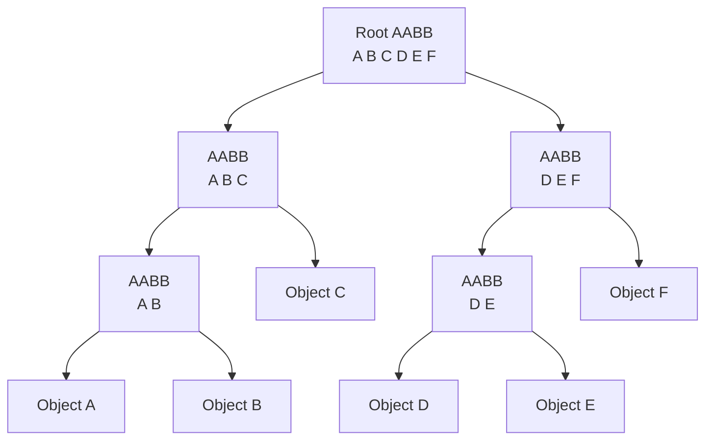

---

## 13.2 Minh họa Bounding Volume Hierarchy


Hình minh họa các shape được bao bởi AABB nhỏ, sau đó tiếp tục gom thành các bounding volume lớn hơn.

---

# 14. BVH Traversal

Giả sử ta raycast vào scene.

```text
Ray
 ↓
Root
```

Nếu ray không hit root:

```text
Stop.
```

Nếu hit:

```text
Test children.
```

Pseudo-code:

```cpp
void Query(Node* node, const AABB& query)
{
    if (!Intersects(node->bounds, query))
        return;

    if (node->isLeaf)
    {
        TestObject(node->object);
        return;
    }

    Query(node->left, query);
    Query(node->right, query);
}
```

---

## 14.1 Ý tưởng pruning

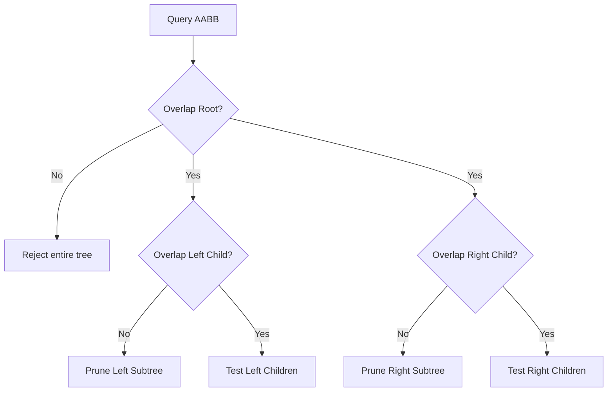

Điểm mạnh của hierarchy nằm ở:

> Một overlap test với node cấp cao có thể loại bỏ hàng chục, hàng trăm hoặc hàng nghìn object bên dưới.

---

# 15. BVH và Spatial Partitioning có giống nhau không?

Không hoàn toàn.

Một cách phân biệt hữu ích:

### BVH

**Object-centric**

```text
Objects
 ↓
Group nearby objects
 ↓
Create bounding volume
 ↓
Group again
```

### Spatial Partitioning

**Space-centric**

```text
World Space
 ↓
Divide space into regions
 ↓
Assign objects to regions
```

Ví dụ spatial partition:

* Uniform Grid.
* Spatial Hash.
* Quadtree.
* Octree.
* KD-Tree.
* BSP Tree.

Trong game engine, cả hai nhóm đều được dùng làm **acceleration structures**.

---

# 16. Spatial Partitioning

Ý tưởng:

> Nếu hai object nằm ở những vùng không gian cách xa nhau, không cần collision test chúng.

Ví dụ world 2D:

```text
┌────┬────┬────┬────┐
│ A  │    │    │    │
├────┼────┼────┼────┤
│ B  │ C  │    │    │
├────┼────┼────┼────┤
│    │    │ D  │    │
├────┼────┼────┼────┤
│    │    │    │ E  │
└────┴────┴────┴────┘
```

Object `A` không cần test với `E`.

---

# 17. Uniform Grid

Uniform Grid chia world thành các cell bằng nhau.

```text
World

┌────┬────┬────┬────┬────┐
│    │    │    │    │    │
├────┼────┼────┼────┼────┤
│    │ ●A │ ●B │    │    │
├────┼────┼────┼────┼────┤
│    │    │    │    │ ●C │
├────┼────┼────┼────┼────┤
│    │    │    │    │    │
└────┴────┴────┴────┴────┘
```

Object chỉ cần kiểm tra với:

```text
same cell
+
neighboring cells
```

---

## 17.1 Khi Grid hoạt động tốt?

Grid phù hợp khi:

* Object có kích thước khá tương đồng.
* World phân bố tương đối đều.
* Có rất nhiều object nhỏ.
* Query mang tính local.

Ví dụ:

* Bullet hell.
* Particle simulation.
* RTS units.
* 2D physics.
* Crowd simulation.

---

## 17.2 Cell quá lớn

```text
┌────────────────────┐
│ ● ● ● ● ● ● ● ● ●  │
│ ● ● ● ● ● ● ● ● ●  │
└────────────────────┘
```

Quá nhiều object nằm cùng cell.

Kết quả:

```text
Nhiều pair tests.
```

---

## 17.3 Cell quá nhỏ

Một object lớn có thể chiếm rất nhiều cell:

```text
┌──┬──┬──┬──┬──┐
│  │██│██│██│  │
├──┼──┼──┼──┼──┤
│  │██│██│██│  │
├──┼──┼──┼──┼──┤
│  │██│██│██│  │
└──┴──┴──┴──┴──┘
```

Kết quả:

* Memory overhead.
* Duplicate entries.
* Update tốn hơn.

---

# 18. Spatial Hashing

Thay vì tạo một array khổng lồ cho toàn bộ world, ta có thể ánh xạ cell tọa độ vào hash table.

Ví dụ:

```text
World position
      ↓
Cell coordinate
      ↓
Hash function
      ↓
Bucket
      ↓
Objects
```

Ví dụ:

```cpp
cellX = floor(position.x / cellSize);
cellY = floor(position.y / cellSize);
```

Hash key:

```text
hash(cellX, cellY)
```

Spatial Hash rất hữu ích cho:

* World rộng.
* Không gian sparse.
* Particle systems.
* Neighbor search.

---

# 19. Quadtree

**Quadtree** chia một vùng 2D thành bốn child region.

```text
┌───────────────┐
│       │       │
│   1   │   2   │
│       │       │
├───────┼───────┤
│       │       │
│   3   │   4   │
│       │       │
└───────────────┘
```

Nếu một vùng chứa quá nhiều object:

```text
Region
   ↓
Subdivide
   ↓
4 children
```

---

## 19.1 Quadtree phân cấp

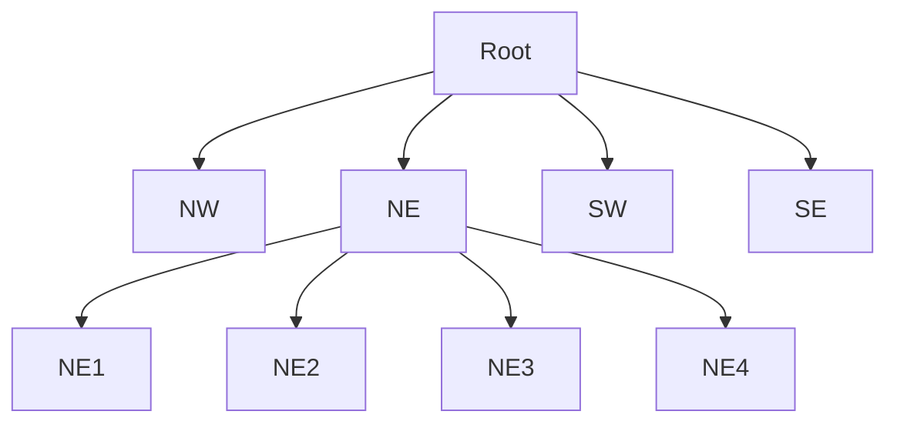

Điều này cho phép khu vực đông object có subdivision sâu hơn khu vực trống.

---

# 20. Octree

**Octree** là phiên bản 3D của Quadtree.

Mỗi node có tối đa:

```text
8 children
```

```text
3D Volume
    ↓
Split X
Split Y
Split Z
    ↓
8 sub-volumes
```

Ứng dụng:

* 3D scene queries.
* Collision candidates.
* Visibility.
* Terrain.
* Large worlds.

---

# 21. Sort & Sweep / Sweep and Prune

Roadmap sử dụng tên:

**Sort & Sweep**.

Trong physics engine thường gặp tên:

**Sweep and Prune — SAP**.

Ý tưởng:

> Chiếu bounding volumes lên một axis, sắp xếp các điểm min/max rồi tìm những interval overlap.

Bullet có implementation `btAxisSweep3` cho 3D axis sweep-and-prune broad phase. ([pybullet.org][3])

---

## 21.1 Projection lên X axis

Giả sử:

```text
Object A
Object B
Object C
Object D
```

Projection:

```text
X →

A:   [────────]

B:       [────────────]

C:                   [──────]

D:     [───]
```

Candidates:

```text
A ↔ B
A ↔ D
B ↔ D
```

C nằm riêng:

```text
không cần test với A/B/D.
```

---

## 21.2 Minh họa Sweep and Prune


Sơ đồ thể hiện các giá trị `min` và `max` của bounding volume được sắp xếp trên một axis để sinh danh sách candidate pair.

---

# 22. Sweep Stage

Sau khi sort endpoint:

```text
Amin
Bmin
Amax
Cmin
Bmax
Cmax
```

ta sweep từ trái sang phải.

Khi gặp:

```text
Object.min
```

object được thêm vào active set.

Khi gặp:

```text
Object.max
```

object được loại khỏi active set.

Ví dụ:

```text
Active Set:

Amin
→ {A}

Bmin
→ {A, B}
→ A-B candidate

Amax
→ {B}
```

---

# 23. Temporal Coherence

Trong game, giữa hai physics frame:

```text
Frame N
→ object position

Frame N+1
→ thường chỉ dịch một đoạn nhỏ
```

Do đó thứ tự endpoint trong SAP thường không thay đổi hoàn toàn.

Ví dụ:

```text
Frame N

Amin Bmin Amax Bmax


Frame N+1

Amin Bmin Bmax Amax
```

Chỉ cần swap một vài endpoint.

Điều này được gọi là:

**Temporal Coherence**.

Nó là một lý do SAP có thể hoạt động tốt trong các scene mà object di chuyển tương đối mượt.

---

# 24. SAP trên nhiều axis

Overlap trên X chưa đủ để kết luận collision.

Ví dụ:

```text
Overlap X ✓
Overlap Y ✗
```

thì:

```text
No AABB overlap.
```

Trong 3D:

```text
X overlap
AND
Y overlap
AND
Z overlap

→ Candidate
```

SAP có thể duy trì overlap information trên nhiều axis để giảm candidate pair.

---

# 25. Điểm yếu của Sweep and Prune

SAP có thể kém hiệu quả khi:

* Rất nhiều object overlap trên sorting axis.
* Scene cực kỳ dense.
* Object teleport thường xuyên.
* Distribution thay đổi mạnh.
* Order endpoint thay đổi rất nhiều mỗi frame.

Ví dụ:

```text
X axis

A [────────────────────]
B   [──────────────────]
C     [────────────────]
D       [──────────────]
E         [────────────]
```

Gần như mọi interval overlap.

Kết quả:

```text
SAP không prune được nhiều.
```

---

# 26. BVH vs Sweep and Prune

| Đặc điểm              | BVH                | Sweep & Prune               |
| --------------------- | ------------------ | --------------------------- |
| Cấu trúc              | Tree               | Sorted intervals            |
| Bounding volume       | Thường AABB        | Thường AABB                 |
| Query                 | Tree traversal     | Interval sweep              |
| Raycast               | Rất phù hợp        | Có thể nhưng không lý tưởng |
| Object insert/remove  | Tùy implementation | Có thể tốn                  |
| Scene động            | Dynamic BVH tốt    | Tốt khi coherence cao       |
| Large irregular scene | Tốt                | Có thể giảm hiệu quả        |
| Implementation        | Phức tạp hơn       | Tương đối đơn giản          |

Không có cấu trúc nào luôn thắng trong mọi workload.

---

# 27. Static BVH

Nếu geometry hầu như không thay đổi:

```text
Terrain
Buildings
Static rocks
Level geometry
```

ta có thể build BVH một lần.

```text
Static Geometry
      ↓
Build BVH
      ↓
Optimize hierarchy
      ↓
Queries
Queries
Queries
```

Chi phí build ban đầu cao hơn có thể chấp nhận được vì tree được tái sử dụng nhiều lần.

---

# 28. Dynamic BVH

Nếu object thường xuyên:

```text
Move
Rotate
Spawn
Despawn
```

tree phải có khả năng update.

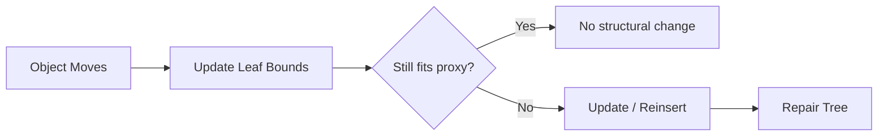

---

# 29. DBVT — Dynamic Bounding Volume Tree

**DBVT** thường được hiểu là:

**Dynamic Bounding Volume Tree**.

Bullet Physics có `btDbvt`, một dynamic bounding volume tree dựa trên AABB, hỗ trợ insert, remove và update node khi object di chuyển. ([pybullet.org][4])

Bullet cũng cung cấp `btDbvtBroadphase`, tức broad-phase dựa trên dynamic BVH. ([pybullet.org][5])

---

## 29.1 Quan hệ khái niệm

```text
BVH
│
├── Static BVH
│
└── Dynamic BVH
      │
      └── DBVT
```

Một DBVT thường:

```text
Binary Tree
+
AABB Nodes
+
Dynamic Insert
+
Dynamic Remove
+
Dynamic Update
```

---

# 30. Dynamic AABB Tree

Box2D sử dụng một **binary AABB tree** để tổ chức collision shapes thành một BVH và tăng tốc:

* AABB queries.
* Raycasts.
* Shape casts.

Box2D ghi rõ dynamic tree của nó được lấy cảm hứng từ `btDbvt`. ([box2d.org][6])

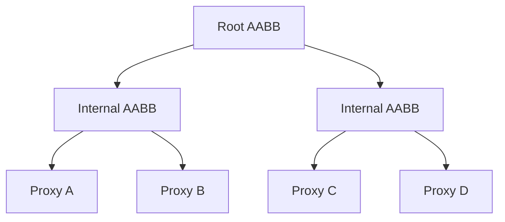

---

# 31. Proxy là gì?

Trong Broad Phase, object thật thường được đại diện bởi một **proxy**.

```text
Game Object
     ↓
Collider
     ↓
Broad Phase Proxy
     ↓
AABB Tree
```

Proxy chứa hoặc liên kết tới:

* AABB.
* Object ID.
* Collision category.
* User data.

Trong Box2D dynamic tree, leaf nodes đóng vai trò proxy chứa AABB và liên kết tới collision object. ([box2d.org][6])

---

# 32. Tight AABB và Fat AABB

Nếu object di chuyển một chút mỗi frame mà ta update tree liên tục:

```text
Move
→ remove node
→ reinsert node
→ rebalance
```

sẽ rất tốn.

Một kỹ thuật phổ biến là dùng:

**Fat AABB**.

---

## 32.1 Tight AABB

```text
┌─────────┐
│ Object  │
└─────────┘
```

Fit rất sát.

---

## 32.2 Fat AABB

```text
┌─────────────────┐
│                 │
│   ┌─────────┐   │
│   │ Object  │   │
│   └─────────┘   │
│                 │
└─────────────────┘

Outer = Fat AABB
```

Object có thể di chuyển một đoạn nhỏ bên trong proxy mà không cần thay đổi structure của tree.

---

# 33. Fat AABB trade-off

Fat AABB lớn hơn:

```text
Fewer tree updates
```

nhưng:

```text
More false positives
```

Trade-off:

```text
Small Fat Margin

✓ Tight bounds
✗ More updates


Large Fat Margin

✓ Fewer updates
✗ More candidate pairs
```

---

# 34. Tree Update

Giả sử leaf proxy:

```text
Fat AABB
```

Object di chuyển nhưng vẫn còn bên trong:

```text
No update required.
```

Khi object đi ra ngoài:

```text
Tight AABB
      ↓
outside Fat AABB
      ↓
Update Proxy
      ↓
Reinsert / Refit
```

---

# 35. Refit

**Refit** nghĩa là cập nhật bounding volume của nodes dựa trên bounds mới của children.

```text
Child A changed
Child B unchanged
      ↓
Parent bounds
must update
```

Ví dụ:

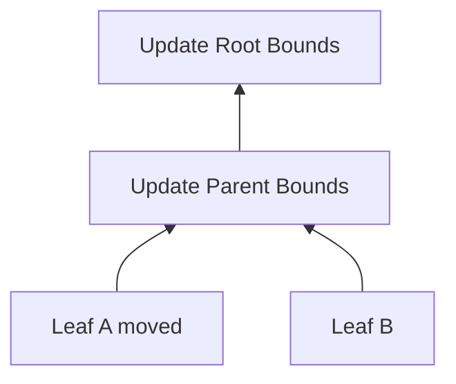

NVIDIA cũng mô tả việc tái sử dụng hierarchy của BVH động và cập nhật bounding boxes theo vị trí object mới như một chiến lược cho dynamic scenes. ([NVIDIA Developer][7])

---

# 36. Rebuild

Nếu object di chuyển quá nhiều, tree ban đầu có thể trở nên xấu:

```text
Nearby objects
no longer grouped together
```

Khi đó:

```text
BVH traversal
→ visits too many nodes
```

Engine có thể:

```text
Rebuild tree
```

Box2D dynamic tree cung cấp cả thao tác rebuild trong API của cấu trúc. ([box2d.org][6])

---

# 37. Tree Quality

Một BVH tốt thường cố gắng:

* Nhóm object gần nhau.
* Giảm overlap giữa sibling nodes.
* Giảm kích thước bounding volumes.
* Không để tree quá lệch.
* Cho phép prune branch sớm.

Ví dụ tree xấu:

```text
Root
 │
 A
 │
 B
 │
 C
 │
 D
```

Giống linked list.

Tree cân bằng hơn:

```text
       Root
      /    \
     A      B
    / \    / \
   C   D  E   F
```

thường giúp traversal hiệu quả hơn.

---

# 38. BVH cho Collision Detection

Collision pair generation:

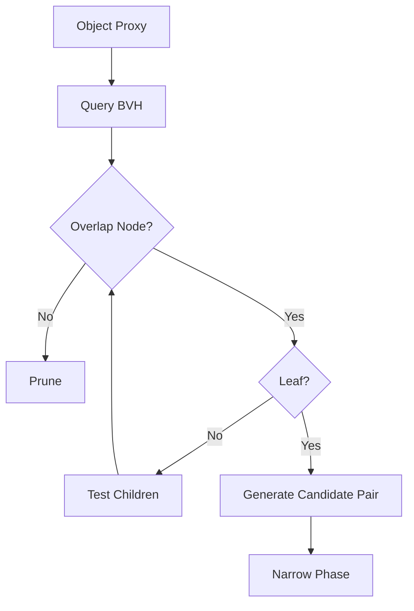

BVH được dùng để giảm số object cần đưa vào collision test chính xác. ([NVIDIA Developer][2])

---

# 39. BVH cho Raycast

Nếu không có acceleration structure:

```text
Ray
 ↓
Triangle 1
Triangle 2
Triangle 3
...
Triangle 1,000,000
```

Với BVH:

```text
Ray
 ↓
Root AABB
 ↓
Relevant branches only
 ↓
Small set of primitives
```

Box2D dynamic tree trực tiếp hỗ trợ raycast qua các proxy trong tree; NVIDIA cũng sử dụng BVH làm acceleration structure cho ray tracing. ([box2d.org][6])

---

# 40. Ray Traversal

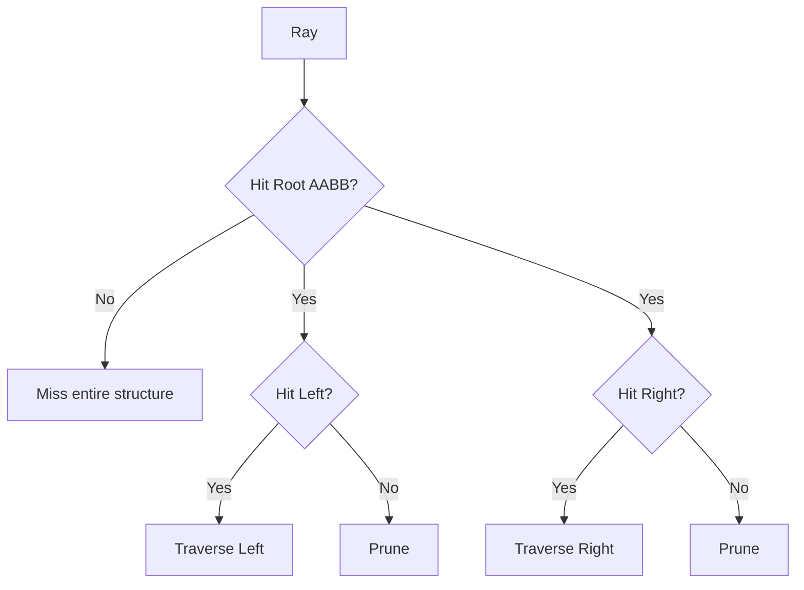

Nếu một branch không bị ray intersect:

```text
Tất cả geometry bên dưới
không cần test.
```

---

# 41. Scene Queries

Spatial structure không chỉ dành cho collision.

Một physics engine thường cần:

```text
Raycast
Shape Cast
Overlap Query
Nearest Objects
Area Query
Trigger Query
AI Perception
```

Ví dụ:

```text
Explosion
   ↓
Sphere Query
   ↓
Find nearby rigidbodies
   ↓
Apply impulse
```

Dynamic tree của Box2D cung cấp AABB query, ray cast và shape cast trên cùng acceleration structure. ([box2d.org][6])

---

# 42. Ví dụ Explosion Query

Không nên:

```text
for every object in world:
    calculate distance
```

Thay vào đó:

```text
Explosion Sphere
      ↓
Broad Phase Query
      ↓
Nearby Proxies
      ↓
Exact Distance Test
      ↓
Apply Force
```

---

# 43. Scene Partition cho Large Open World

Open world có thể có:

```text
Millions of static objects
Terrain
Trees
Rocks
Buildings
NPCs
Vehicles
Projectiles
```

Không nên đặt tất cả vào cùng một flat list.

Một architecture có thể là:

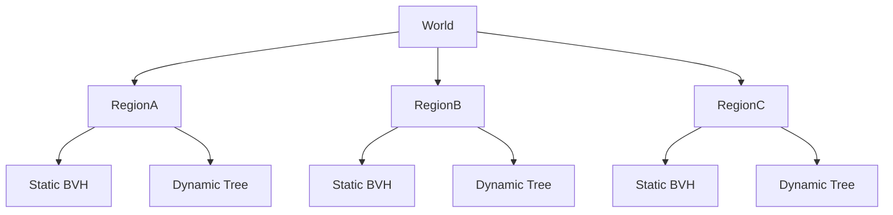

---

# 44. Static và Dynamic Object nên tách riêng?

Trong nhiều engine, đây là một strategy hữu ích.

```text
Static Objects
↓
Optimized Static Structure


Dynamic Objects
↓
Dynamic Tree
```

Ví dụ:

### Static

* Buildings.
* Terrain.
* Walls.
* Rocks.

### Dynamic

* Player.
* NPC.
* Vehicles.
* Physics props.

Bullet có broad-phase dynamic BVH implementations và các cấu trúc broad-phase khác nhau, cho phép engine chọn strategy phù hợp workload. ([pybullet.org][8])

---

# 45. Large Open World và Floating Origin

Spatial partitioning trong world cực lớn còn gặp vấn đề:

```text
Floating-point precision
```

Khi tọa độ quá xa origin:

```text
position = 1,000,000+
```

precision có thể giảm.

Một số game sử dụng:

```text
World Partition
+
Floating Origin
```

Ý tưởng:

```text
Player moves far
      ↓
Shift world coordinates
      ↓
Player remains near origin
```

Đây không phải chức năng trực tiếp của BVH nhưng có ảnh hưởng tới physics và scene partitioning.

---

# 46. Spatial Partitioning cho AI

Cùng acceleration structure có thể hỗ trợ:

```text
Enemy:
"Những player nào cách tôi < 30 m?"
```

Thay vì:

```text
Check every entity
```

có thể:

```text
Spatial Query
    ↓
Nearby entities
```

Ứng dụng:

* Aggro system.
* Flocking.
* Crowd simulation.
* Nearby interactables.
* Sound propagation approximation.

---

# 47. Spatial Partitioning cho Rendering

Khái niệm tương tự cũng xuất hiện trong graphics:

```text
Frustum Culling
Occlusion Culling
Ray Tracing
LOD
```

Ví dụ:

```text
Camera Frustum
      ↓
BVH / Scene Tree Query
      ↓
Potentially Visible Objects
```

BVH được sử dụng rộng rãi như acceleration structure cho ray traversal vì nó có thể bỏ qua toàn bộ branches không intersect với ray. ([NVIDIA Developer][9])

---

# 48. Broad Phase Candidate Pair

Một điều rất quan trọng:

```text
BVH overlap
≠
Actual collision
```

Ví dụ:

```text
AABB A overlaps AABB B

       ↓

Candidate Pair

       ↓

Narrow Phase

       ↓

Convex A vs Convex B

       ↓

No Collision
```

Đây không phải bug.

Broad Phase được phép sinh **false positive**.

---

# 49. False Positive vs False Negative

### False Positive

```text
Broad Phase:
Possible collision

Narrow Phase:
No collision
```

Chấp nhận được.

### False Negative

```text
Actual collision

Broad Phase:
No candidate
```

Nguy hiểm.

Vì Narrow Phase sẽ không bao giờ được chạy cho pair đó.

Một Broad Phase tốt cần:

```text
Conservative bounds
```

để tránh bỏ sót collision thật.

---

# 50. Complexity và hiệu năng

Không nên hiểu đơn giản:

```text
BVH = O(log n)
```

trong mọi trường hợp.

Performance thực tế phụ thuộc:

* Tree quality.
* Object distribution.
* Query size.
* Number of hits.
* Dynamic updates.
* Cache behavior.
* Branch overlap.

Box2D mô tả raycast trên dynamic tree có chi phí gần dạng `k * log(n)` trong use case điển hình, với `k` là số hit và `n` là số proxy. ([box2d.org][6])

Điểm cần nhớ:

> Spatial acceleration structure cải thiện **average practical workload**, nhưng vẫn có pathological cases.

---

# 51. Memory Trade-off

Acceleration structures cần thêm memory.

Ví dụ BVH node có thể chứa:

```text
AABB
Left Child
Right Child
Parent
Metadata
```

Grid có thể chứa:

```text
Cell
↓
List of object IDs
```

Spatial Hash:

```text
Hash Table
↓
Buckets
↓
Object IDs
```

Trade-off:

```text
More memory
     ↓
Fewer expensive geometry tests
```

---

# 52. So sánh các kỹ thuật

| Technique         | Scene phù hợp          | Điểm mạnh                     | Điểm yếu               |
| ----------------- | ---------------------- | ----------------------------- | ---------------------- |
| Brute Force       | Rất ít object          | Dễ làm                        | $O(n^2)$               |
| Uniform Grid      | Object đồng đều        | Rất nhanh                     | Khó với size khác nhau |
| Spatial Hash      | Sparse world           | Không cần grid khổng lồ       | Hash overhead          |
| Quadtree          | 2D uneven scene        | Adaptive                      | Update phức tạp        |
| Octree            | 3D uneven scene        | Adaptive 3D                   | Memory/tree overhead   |
| Sweep & Prune     | Dynamic coherent scene | Tận dụng sorted order         | Dense overlap kém      |
| Static BVH        | Static scene           | Query rất tốt                 | Build/update đắt       |
| DBVT              | Dynamic scene          | Insert/update/query linh hoạt | Tree maintenance       |
| Dynamic AABB Tree | Dynamic broad phase    | Collision + ray queries       | Có false positives     |

---

# 53. Chọn kỹ thuật theo loại game

## 53.1 Platformer nhỏ

Có thể chỉ cần:

```text
Simple AABB
+
Small physics engine
```

---

## 53.2 Bullet Hell

Rất nhiều object nhỏ:

```text
Uniform Grid
hoặc
Spatial Hash
```

có thể rất hiệu quả.

---

## 53.3 Racing Game

Có:

* Vehicle.
* Track.
* Dynamic props.

Có thể dùng:

```text
Static BVH
+
Dynamic Tree
```

---

## 53.4 Large Open World

Có thể kết hợp:

```text
World Partition
+
Regional BVHs
+
Dynamic Object Tree
```

---

## 53.5 Physics Sandbox

Rất nhiều rigidbody thay đổi liên tục:

```text
DBVT
Dynamic AABB Tree
Sweep and Prune
```

đều là những candidate cần benchmark theo workload.

---

# 54. Spatial Structure không nên chọn chỉ bằng Big O

Ví dụ hai algorithm cùng có performance lý thuyết tốt nhưng:

```text
Algorithm A
→ cache-friendly array

Algorithm B
→ pointer-heavy tree
```

có thể cho runtime khác rất nhiều.

Các yếu tố thực tế:

* CPU cache.
* Branch prediction.
* Allocation.
* SIMD.
* Multithreading.
* Object distribution.
* Update frequency.

Do đó game engine thường cần:

> Benchmark bằng scene thật.

---

# 55. Prototype thực hành

Tạo project:

# Broad Phase Visualizer

Scene gồm:

```text
┌────────────────────────────────────┐
│                                    │
│ A. AABB / OBB                      │
│                                    │
│ B. Brute Force                     │
│                                    │
│ C. Uniform Grid                    │
│                                    │
│ D. Sweep & Prune                   │
│                                    │
│ E. BVH                             │
│                                    │
│ F. Dynamic Tree                    │
│                                    │
│ G. Raycast Benchmark               │
│                                    │
└────────────────────────────────────┘
```

---

# 56. Experiment A — AABB vs OBB

Tạo một rectangle dài.

Cho phép:

```text
Move
Rotate
Scale
```

Hiển thị đồng thời:

```text
Visual Mesh
AABB
OBB
```

Quan sát:

* Rotation tăng empty space trong AABB như thế nào.
* OBB fit object tốt hơn bao nhiêu.

---

# 57. Experiment B — Brute Force

Spawn:

```text
100
500
1000
5000
```

objects.

Brute force:

```cpp
for (int i = 0; i < objects.size(); ++i)
{
    for (int j = i + 1; j < objects.size(); ++j)
    {
        TestAABB(objects[i], objects[j]);
    }
}
```

Đếm:

```text
Pair tests/frame
CPU time
Candidate pairs
```

---

# 58. Experiment C — Uniform Grid

Chia scene thành grid.

Hiển thị:

```text
Cell boundaries
Object → Cell
Objects per cell
```

Thử:

```text
Cell Size = 1
Cell Size = 2
Cell Size = 5
Cell Size = 10
```

Ghi lại số pair tests.

---

# 59. Experiment D — Sweep & Prune

Visualize X axis:

```text
Amin
Amax
Bmin
Bmax
Cmin
Cmax
```

Cho object di chuyển.

Hiển thị:

```text
Active Set
Endpoint swaps
Candidate pairs
```

---

# 60. Experiment E — BVH

Tạo:

```text
100 moving circles / boxes
```

Visualize:

```text
Level 0 = Root AABB
Level 1
Level 2
Leaves
```

Cho phép bật/tắt depth:

```text
Show BVH Level:
0
1
2
3
All
```

---

# 61. Experiment F — Dynamic Tree

Hiển thị:

```text
Tight AABB
Fat AABB
Tree Node
```

Cho object di chuyển nhẹ.

Quan sát:

```text
Inside Fat AABB
→ no reinsert

Outside Fat AABB
→ update tree
```

---

# 62. Experiment G — Raycast

Tạo:

```text
10,000 objects
```

So sánh:

### Brute Force

```text
Ray vs every object
```

### BVH

```text
Ray vs tree
```

Ghi:

```text
Nodes visited
Leaves visited
Actual object tests
Query time
```

Box2D cũng trả về thống kê như số internal node và leaf node được visit cho dynamic tree query. ([box2d.org][6])

---

# 63. Benchmark Table

| Objects | Method      | BV Tests | Candidate Pairs | Query Time |
| ------: | ----------- | -------: | --------------: | ---------: |
|     100 | Brute Force |          |                 |            |
|     100 | Grid        |          |                 |            |
|     100 | SAP         |          |                 |            |
|     100 | BVH         |          |                 |            |
|   1,000 | Brute Force |          |                 |            |
|   1,000 | Grid        |          |                 |            |
|   1,000 | SAP         |          |                 |            |
|   1,000 | BVH         |          |                 |            |
|  10,000 | BVH         |          |                 |            |

Quan trọng:

> Không chỉ ghi FPS.

Nên ghi số lượng operation để hiểu **vì sao** performance thay đổi.

---

# 64. Gizmo nên hiển thị

```text
Visual Mesh
     ↓
AABB

Broad Phase Proxy
     ↓
Fat AABB

BVH
     ↓
Internal Nodes

Query
     ↓
Visited Nodes

Candidate Pair
     ↓
Highlight
```

Ví dụ màu:

```text
White
→ object

Green
→ leaf AABB

Blue
→ internal BVH node

Yellow
→ queried node

Red
→ candidate pair
```

---

# 65. Bug — AABB không update

Triệu chứng:

```text
Object moved
```

nhưng broad-phase box vẫn ở vị trí cũ.

```text
Object

          ●


Old AABB

┌───────┐
│       │
└───────┘
```

Kết quả:

* Collision bị bỏ sót.
* Raycast sai.
* Trigger sai.

Debug:

```text
Draw AABB every physics frame.
```

---

# 66. Bug — Fat AABB quá lớn

Triệu chứng:

```text
Tree update ít
```

nhưng:

```text
Candidate pair tăng mạnh.
```

Ví dụ:

```text
Object nhỏ:

 ●

Fat AABB:

┌─────────────────────┐
│                     │
│          ●          │
│                     │
└─────────────────────┘
```

Nhiều object ở xa vẫn có thể overlap proxy.

---

# 67. Bug — Fat AABB quá nhỏ

Ngược lại:

```text
Object moves slightly
→ exits proxy
→ reinsert
→ exits proxy
→ reinsert
```

Tree update liên tục.

Kết quả:

* CPU spike.
* Tree maintenance cost tăng.

---

# 68. Bug — BVH quá lệch

Tree:

```text
Root
  \
   A
    \
     B
      \
       C
        \
         D
```

Query gần như phải traverse tuyến tính.

Debug nên ghi:

```text
Tree height
Node count
Leaf count
Area ratio
```

Box2D dynamic tree API cũng cung cấp các thông tin như tree height và area ratio để theo dõi cấu trúc. ([box2d.org][6])

---

# 69. Bug — Grid cell size sai

### Quá lớn

```text
Too many objects per cell.
```

### Quá nhỏ

```text
Objects occupy many cells.
```

Không có một cell size tối ưu cho mọi game.

Nên benchmark dựa trên:

* Object radius trung bình.
* Density.
* Query radius.
* Movement speed.

---

# 70. Bug — Duplicate Pair

Nếu object chiếm nhiều grid cells:

```text
A và B
```

có thể cùng xuất hiện trong nhiều cell.

```text
Cell 1
→ A-B

Cell 2
→ A-B

Cell 3
→ A-B
```

Cần tránh gửi cùng candidate pair nhiều lần.

Có thể dùng:

* Pair cache.
* Pair ID.
* Hash set.
* Ordered pair key.

---

# 71. Pair Key

Ví dụ:

```text
Object IDs:

A = 5
B = 12
```

Chuẩn hóa:

```text
minID = 5
maxID = 12
```

Pair:

```text
(5, 12)
```

Không để tồn tại đồng thời:

```text
(5,12)
(12,5)
```

---

# 72. Collision Filtering trước Broad Phase

Nếu biết:

```text
Bullet A
không bao giờ hit Bullet B
```

thì không cần gửi pair đó tới Narrow Phase.

Pipeline:

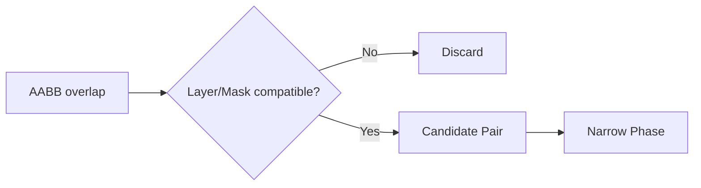

Filtering càng sớm có thể càng giảm công việc sau đó.

---

# 73. Sleeping Objects

Rigidbody đang đứng yên lâu có thể được đưa vào trạng thái:

```text
Sleeping
```

Khi đó engine có thể giảm:

* Physics integration.
* Broad-phase updates.
* Constraint solving.

Spatial structures cũng hưởng lợi vì static/sleeping proxies ít thay đổi hơn.

---

# 74. Sơ đồ tổng hợp kiến thức

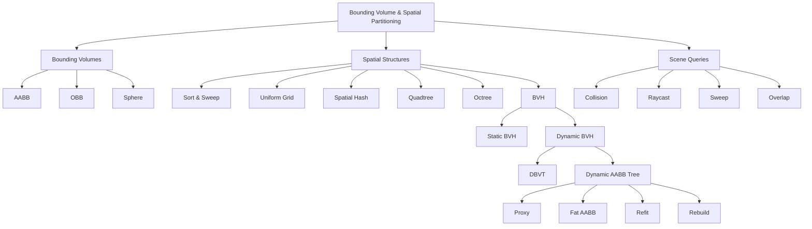

---

# 75. Mental Model quan trọng

Hãy ghi nhớ ba tầng:

```text
LEVEL 1
Bounding Volume

"Object ở đâu gần đúng?"
```

```text
LEVEL 2
Spatial Acceleration Structure

"Những object nào đáng để kiểm tra?"
```

```text
LEVEL 3
Narrow Phase

"Chúng có thật sự collision không?"
```

Pipeline:

```text
Complex Scene
      ↓
Bounding Volumes
      ↓
Spatial Structure
      ↓
Broad Phase
      ↓
Small Candidate Set
      ↓
Narrow Phase
```

---

# 76. Khi nào dùng gì?

| Tình huống                   | Candidate                             |
| ---------------------------- | ------------------------------------- |
| Box đơn giản                 | AABB                                  |
| Rotated object cần bound sát | OBB                                   |
| Ball                         | Bounding Sphere                       |
| Broad Phase nhỏ              | AABB brute force                      |
| Nhiều object đồng đều        | Uniform Grid                          |
| Sparse world                 | Spatial Hash                          |
| 2D spatial hierarchy         | Quadtree                              |
| 3D spatial hierarchy         | Octree                                |
| Coherent moving bodies       | Sweep & Prune                         |
| Static complex scene         | Static BVH                            |
| Dynamic rigidbodies          | DBVT / Dynamic AABB Tree              |
| Raycast-heavy scene          | BVH                                   |
| Large open world             | World partition + regional structures |

---

# 77. Bài tập thực hành

## Bài 1 — AABB vs OBB

Tạo một box dài.

```text
Rotate 0°
Rotate 30°
Rotate 45°
Rotate 90°
```

Ghi lại:

```text
AABB area/volume
OBB area/volume
```

---

## Bài 2 — Brute Force vs Grid

Spawn:

```text
1000 objects
```

So sánh:

```text
Brute Force
vs
Uniform Grid
```

Đếm số pair tests.

---

## Bài 3 — Sweep & Prune

Implement SAP 1D.

Hiển thị:

* Endpoint.
* Active list.
* Candidate pair.

---

## Bài 4 — BVH Traversal

Tạo binary AABB tree.

Implement:

```text
AABB Query
```

Hiển thị số node visited.

---

## Bài 5 — Raycast Benchmark

So sánh:

```text
Ray vs all objects

và

Ray vs BVH
```

với:

```text
100
1,000
10,000
objects
```

---

## Bài 6 — Dynamic Tree

Implement hoặc dùng engine có sẵn.

Quan sát:

```text
Object movement
Fat AABB
Tree update
```

---

# 78. Artifact nên tạo

## Artifact 1 — Broad Phase Visualizer

Scene cho phép chuyển:

```text
Brute Force
Grid
Sweep & Prune
BVH
Dynamic Tree
```

Overlay:

```text
Pair Tests
Candidate Pairs
Node Visits
Query Time
```

Đây là artifact rất tốt cho portfolio engine/gameplay programming.

---

## Artifact 2 — Spatial Structure Comparison

```markdown
# Broad Phase Benchmark

## Scene

- Objects: 10,000
- Dynamic objects: 2,000
- Static objects: 8,000

## Algorithms

- Brute Force
- Uniform Grid
- Sweep & Prune
- BVH
- Dynamic AABB Tree

## Metrics

- Broad phase time
- Candidate pairs
- Tree updates
- Nodes visited
- Memory

## Conclusion

...
```

---

## Artifact 3 — Collision Optimization Note

```markdown
# Physics Optimization Note

## Problem

Physics CPU time tăng mạnh khi scene có 5000 props.

## Investigation

Broad Phase sinh quá nhiều candidate pairs.

## Debug

- Visualized AABB.
- Logged broad-phase pairs.
- Logged tree height.
- Inspected object distribution.

## Cause

Fat AABB margin quá lớn.

## Change

Reduced proxy margin.

## Result

Candidate pairs giảm từ ... xuống ...

## Trade-off

Tree updates tăng từ ... lên ...

## Conclusion

...
```

---

# 79. Collision Optimization Checklist

```markdown
## Broad Phase Checklist

### Bounding Volumes

- [ ] AABB có đúng position không?
- [ ] Bounds có update khi object move không?
- [ ] AABB có quá lớn không?
- [ ] Có cần OBB không?
- [ ] Visual mesh có đang bị dùng làm collider không cần thiết?

### Spatial Structure

- [ ] Scene có quá nhiều brute-force pair tests không?
- [ ] Grid cell size có phù hợp không?
- [ ] Có duplicate pairs không?
- [ ] BVH có bị lệch không?
- [ ] Tree height có bất thường không?
- [ ] Sibling bounds có overlap quá nhiều không?

### Dynamic Objects

- [ ] Fat AABB margin có quá lớn không?
- [ ] Proxy có bị reinsert liên tục không?
- [ ] Object có teleport nhiều không?
- [ ] Static và dynamic objects có nên tách không?

### Queries

- [ ] Raycast có test toàn bộ scene không?
- [ ] Query có dùng collision mask không?
- [ ] Có thể prune branch sớm hơn không?
- [ ] Query radius có quá lớn không?

### Profiling

- [ ] Đã đo candidate pair count?
- [ ] Đã đo node visits?
- [ ] Đã đo update cost?
- [ ] Đã benchmark scene thực tế?
```

---

# 80. Câu hỏi tự kiểm tra

1. Bounding Volume dùng để làm gì?
2. AABB là gì?
3. Vì sao AABB nhanh?
4. OBB khác AABB ở đâu?
5. Tại sao OBB fit rotated object tốt hơn?
6. Vì sao bounding volume không cần giống visual mesh?
7. Broad Phase sử dụng bounding volume như thế nào?
8. Spatial Partitioning giải quyết vấn đề gì?
9. Uniform Grid hoạt động như thế nào?
10. Cell quá lớn gây vấn đề gì?
11. Cell quá nhỏ gây vấn đề gì?
12. Spatial Hash khác Grid array ở đâu?
13. Quadtree và Octree khác nhau thế nào?
14. Sweep & Prune hoạt động dựa trên ý tưởng nào?
15. `min` và `max` endpoint dùng để làm gì?
16. Temporal Coherence giúp SAP như thế nào?
17. BVH là gì?
18. Leaf node trong BVH thường chứa gì?
19. Vì sao parent AABB giúp prune nhiều object?
20. Static BVH khác Dynamic BVH thế nào?
21. DBVT là gì?
22. Dynamic AABB Tree là gì?
23. Proxy trong Broad Phase là gì?
24. Fat AABB dùng để làm gì?
25. Fat AABB quá lớn gây vấn đề gì?
26. Fat AABB quá nhỏ gây vấn đề gì?
27. Refit khác Rebuild như thế nào?
28. BVH giúp raycast nhanh hơn như thế nào?
29. Tại sao large open world thường cần nhiều tầng partition?
30. Vì sao phải benchmark workload thật thay vì chỉ nhìn Big O?

---

# 81. Checklist hoàn thành

* [ ] Hiểu Bounding Volume.
* [ ] Hiểu AABB.
* [ ] Viết được AABB overlap test.
* [ ] Hiểu OBB.
* [ ] Phân biệt AABB và OBB.
* [ ] Hiểu Bounding Sphere.
* [ ] Hiểu Spatial Partitioning.
* [ ] Hiểu Uniform Grid.
* [ ] Hiểu Spatial Hash.
* [ ] Hiểu Quadtree.
* [ ] Hiểu Octree.
* [ ] Hiểu Sort & Sweep.
* [ ] Hiểu Sweep and Prune.
* [ ] Hiểu Temporal Coherence.
* [ ] Hiểu BVH.
* [ ] Hiểu BVH traversal.
* [ ] Phân biệt Static và Dynamic BVH.
* [ ] Hiểu DBVT.
* [ ] Hiểu Dynamic AABB Tree.
* [ ] Hiểu Broad Phase Proxy.
* [ ] Hiểu Fat AABB.
* [ ] Hiểu Refit và Rebuild.
* [ ] Biết BVH hỗ trợ raycast như thế nào.
* [ ] Biết debug spatial structure bằng gizmo.
* [ ] Hoàn thành một Broad Phase Visualizer.
* [ ] Benchmark ít nhất hai spatial structures.

---

# 82. Tổng kết

**Bounding Volume & Spatial Partitioning** không trực tiếp giải quyết collision chính xác.

Nhiệm vụ chính của chúng là:

> **Giảm số lượng object cần kiểm tra chính xác.**

Mental model đầu tiên:

```text
Complex Object
      ↓
Simple Bounding Volume
      ↓
Cheap Intersection Test
```

Mental model thứ hai:

```text
Thousands of Objects
      ↓
Spatial Acceleration Structure
      ↓
Small Search Region
      ↓
Candidate Objects
```

Với Bounding Volume:

```text
AABB
→ nhanh, đơn giản

OBB
→ bound sát object xoay hơn

Sphere
→ rotation invariant
```

Với Broad Phase:

```text
Sweep & Prune
→ sort intervals

Grid / Spatial Hash
→ divide space

BVH
→ hierarchical bounds

DBVT
→ dynamic hierarchy
```

Dynamic tree thêm khái niệm:

```text
Object
 ↓
Proxy
 ↓
Fat AABB
 ↓
Dynamic BVH
```

Khi object di chuyển:

```text
Still inside Fat AABB?
        ↓
       Yes
        ↓
No structural update
```

Nếu ra ngoài:

```text
Update / Reinsert / Refit
```

Điểm quan trọng nhất:

> **Bounding Volume tốt không phải bounding volume chính xác nhất. Nó là volume đủ chặt nhưng đủ rẻ để giúp engine loại bỏ phần lớn công việc không cần thiết.**

Tương tự:

> **Spatial structure tốt nhất không tồn tại độc lập với workload.**

Lựa chọn phải dựa trên:

```text
Object Count
+
Object Size Distribution
+
Movement Pattern
+
World Size
+
Query Type
+
Update Frequency
+
Memory
=
Appropriate Spatial Structure
```

---

# 83. Nguồn tham khảo

* [MDN - 3D Collision Detection](https://developer.mozilla.org/en-US/docs/Games/Techniques/3D_collision_detection) — AABB và bounding volumes. ([MDN Web Docs][1])
* [Box2D - Dynamic Tree](https://box2d.org/documentation/group__tree.html) — binary AABB tree, query, raycast và shape cast. ([box2d.org][6])
* [Bullet Physics - btDbvt](https://pybullet.org/Bullet/BulletFull/structbtDbvt.html) — Dynamic Bounding Volume Tree dựa trên AABB. ([pybullet.org][4])
* [Bullet Physics - btDbvtBroadphase](https://pybullet.org/Bullet/BulletFull/structbtDbvtBroadphase.html) — DBVT Broad Phase. ([pybullet.org][5])
* [Bullet Physics - btAxisSweep3](https://pybullet.org/Bullet/BulletFull/classbtAxisSweep3.html) — Sweep and Prune Broad Phase. ([pybullet.org][3])
* [NVIDIA - BVH Tree Traversal](https://developer.nvidia.com/blog/thinking-parallel-part-ii-tree-traversal-gpu/) — BVH và hierarchical pruning. ([NVIDIA Developer][2])
* [NVIDIA - BVH Construction](https://developer.nvidia.com/blog/thinking-parallel-part-iii-tree-construction-gpu/) — xây dựng và cập nhật BVH cho dynamic scene. ([NVIDIA Developer][7])

[1]: https://developer.mozilla.org/en-US/docs/Games/Techniques/3D_collision_detection "3D collision detection - Game development | MDN"
[2]: https://developer.nvidia.com/blog/thinking-parallel-part-ii-tree-traversal-gpu/?utm_source=chatgpt.com "Thinking Parallel, Part II: Tree Traversal on the GPU"
[3]: https://pybullet.org/Bullet/BulletFull/classbtAxisSweep3.html?utm_source=chatgpt.com "Bullet Collision Detection & Physics Library: btAxisSweep3 ..."
[4]: https://pybullet.org/Bullet/BulletFull/structbtDbvt.html?utm_source=chatgpt.com "Bullet Collision Detection & Physics Library: btDbvt Struct ..."
[5]: https://pybullet.org/Bullet/BulletFull/structbtDbvtBroadphase.html?utm_source=chatgpt.com "btDbvtBroadphase Struct Reference"
[6]: https://box2d.org/documentation/group__tree.html "Box2D: Dynamic Tree"
[7]: https://developer.nvidia.com/blog/thinking-parallel-part-iii-tree-construction-gpu/?utm_source=chatgpt.com "Thinking Parallel, Part III: Tree Construction on the GPU"
[8]: https://pybullet.org/Bullet/BulletFull/classbtBroadphaseInterface.html?utm_source=chatgpt.com "btBroadphaseInterface Class Reference"
[9]: https://developer.nvidia.com/discover/ray-tracing?utm_source=chatgpt.com "Ray Tracing"
