# 001 — UNITY

> **Module:** Module 04 — Game Engine
> **Roadmap item:** 4.1
> **Nhóm nội dung:** Game Engine
> **Thứ tự trong module:** 001
> **Thời lượng gợi ý:** 45–60 phút
> **Mức độ:** Cơ bản → Trung cấp
> **Công cụ chính:** Unity Editor + C#
> **Phiên bản tham chiếu:** Unity 6.3 LTS

[](https://docs.unity.cn/cn/2021.3/Manual/UsingTheSceneView.html?utm_source=chatgpt.com)

> **Các hình trên lần lượt minh họa:** Unity Editor/Scene View → Prefab → Input Actions → Build Profiles.

---

## 1. Tóm tắt

**Unity** là một game engine đa nền tảng cho phép lập trình viên xây dựng game 2D, 3D và các ứng dụng tương tác rồi triển khai sang nhiều nền tảng khác nhau. Workflow của Unity xoay quanh một số khái niệm nền tảng:

```text
Project
   │
   ├── Scene
   │     │
   │     └── GameObject
   │            │
   │            ├── Transform
   │            ├── Renderer
   │            ├── Rigidbody
   │            ├── Collider
   │            ├── Animator
   │            └── Script C#
   │
   ├── Prefab
   ├── Materials / Textures / Models / Audio
   ├── UI
   ├── Input
   └── Build Profiles
```

Unity hiện cung cấp một workflow từ **tạo asset → dựng Scene → gắn Component → lập trình gameplay → test → build** trong cùng một hệ sinh thái. Unity cũng hướng tới triển khai trên nhiều loại thiết bị từ desktop, mobile tới console và XR. ([Unity][1])

Sau bài này, mục tiêu không phải là biết mọi nút trong Unity Editor, mà là hiểu được:

> **Game Unity được cấu thành như thế nào và dữ liệu/gameplay đi từ Editor tới bản build ra sao.**

---

# 2. Mục tiêu học tập

Sau khi hoàn thành bài, bạn nên có thể:

* giải thích **Scene, GameObject, Component và Prefab**;
* tạo một Scene đơn giản;
* tạo GameObject và gắn Component;
* sử dụng Rigidbody và Collider để tạo tương tác vật lý;
* tạo animation cơ bản với Animator;
* viết C# script điều khiển GameObject;
* nhận input bàn phím/gamepad;
* hiển thị UI;
* tạo Prefab;
* build game thành bản chạy độc lập;
* hiểu pipeline cơ bản của một project Unity;
* nhận biết khi nào nên dùng engine và khi nào việc tự xây engine có ý nghĩa.

---

# 3. Unity nằm ở đâu trong quá trình làm game?

Unity không chỉ là nơi viết code.

Một game hoàn chỉnh có thể đi qua pipeline:

```mermaid
flowchart LR
    A["Ý tưởng game"] --> B["Asset<br/>2D / 3D / Audio"]
    B --> C["Unity Project"]
    C --> D["Scene"]
    D --> E["GameObject"]
    E --> F["Component"]
    F --> G["C# Gameplay"]
    G --> H["Physics / Animation"]
    H --> I["UI + Input"]
    I --> J["Playtest"]
    J --> K["Optimize"]
    K --> L["Build"]
    L --> M["PC / Mobile / Web / Console"]
```

Ví dụ một game platformer:

```text
Player
 ├── SpriteRenderer
 ├── Rigidbody2D
 ├── CapsuleCollider2D
 ├── Animator
 └── PlayerController.cs

Ground
 ├── SpriteRenderer
 └── BoxCollider2D

Main Camera
 └── Camera

GameManager
 └── GameManager.cs

Canvas
 ├── Score
 ├── Health
 └── GameOverPanel
```

Chỉ với cấu trúc này đã có thể hình thành một prototype game hoàn chỉnh.

---

# 4. Unity Editor

## 4.1 Unity Editor là gì?

**Unity Editor** là môi trường chính để xây dựng project.

Các khu vực quan trọng nhất gồm:

| Cửa sổ        | Chức năng                        |
| ------------- | -------------------------------- |
| **Scene**     | Dựng thế giới game               |
| **Game**      | Xem hình ảnh camera thực tế      |
| **Hierarchy** | Danh sách GameObject trong Scene |
| **Inspector** | Xem/chỉnh Component của object   |
| **Project**   | Quản lý asset                    |
| **Console**   | Log, warning và error            |
| **Toolbar**   | Move, Rotate, Scale, Play…       |

Scene View là nơi bạn tương tác trực tiếp với thế giới đang xây dựng; Inspector cho phép xem và chỉnh các thuộc tính của object/component được chọn. ([Unity Documentation][2])

### Workflow đơn giản

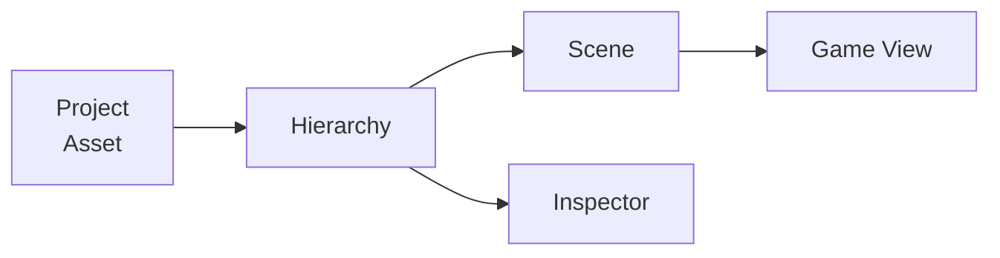

### Ví dụ

Bạn kéo file:

```text
player.png
```

từ:

```text
Project
```

vào:

```text
Scene
```

Unity tạo GameObject:

```text
Player
 ├── Transform
 └── SpriteRenderer
```

---

# 5. Scene

## 5.1 Scene là gì?

**Scene** có thể hiểu như một màn chơi hoặc một trạng thái lớn của game.

Ví dụ:

```text
Scenes/
├── MainMenu.unity
├── Level01.unity
├── Level02.unity
└── GameOver.unity
```

Một Scene có thể chứa:

```text
Level01
│
├── Main Camera
├── Directional Light
├── Player
├── Enemy
├── Ground
├── Environment
├── GameManager
└── UI
```

Không nhất thiết:

```text
1 Scene = 1 Level
```

Một game lớn có thể load nhiều Scene cùng lúc.

---

## 5.2 Scene chứa gì?

Chủ yếu là:

* GameObject;
* vị trí object;
* Component;
* reference giữa object;
* lighting;
* camera;
* environment;
* cấu hình cấp Scene.

### Hình dung

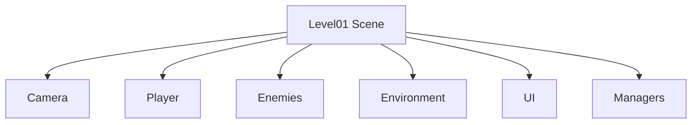

---

# 6. GameObject

## 6.1 GameObject là gì?

**GameObject là container cơ bản của Unity.**

Ví dụ:

```text
Player
Enemy
Camera
Sword
Tree
Bullet
GameManager
```

Bản thân GameObject gần như không định nghĩa gameplay.

Khả năng của nó đến từ **Component**.

Ví dụ:

```text
Player (GameObject)
│
├── Transform
├── SpriteRenderer
├── Rigidbody2D
├── CapsuleCollider2D
├── Animator
└── PlayerController
```

---

# 7. Component

Component là phần cung cấp **hành vi hoặc dữ liệu** cho GameObject.

Đây là một trong những ý tưởng quan trọng nhất của Unity.

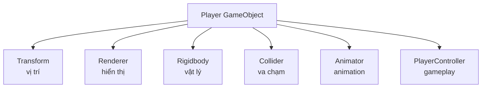

Unity cũng cho phép tạo component riêng thông qua script. Tài liệu Unity 6.3 tổ chức workflow GameObject xoay quanh việc thêm, sử dụng và quản lý Component. ([Unity Documentation][3])

---

## 7.1 Transform

Hầu như mọi GameObject đều có:

```text
Transform
```

Transform lưu:

```text
Position
Rotation
Scale
```

Ví dụ:

```text
Position
X = 2
Y = 1
Z = 0
```

nghĩa là object nằm tại tọa độ:

```text
(2, 1, 0)
```

### Quan hệ cha — con

Unity hỗ trợ hierarchy:

```text
Player
└── Weapon
    └── Muzzle
```

Nếu Player di chuyển:

```text
Player →
```

Weapon và Muzzle đi theo.

---

# 8. Prefab

## 8.1 Prefab là gì?

**Prefab là một GameObject hoặc hierarchy GameObject được lưu lại thành asset có thể tái sử dụng.**

Ví dụ tạo Enemy:

```text
Enemy
├── SpriteRenderer
├── Rigidbody2D
├── Collider2D
├── Animator
└── EnemyAI.cs
```

Thay vì thiết lập lại 50 lần:

```text
Enemy01
Enemy02
Enemy03
...
Enemy50
```

ta tạo:

```text
Enemy.prefab
```

sau đó instantiate nhiều instance.

Inspector của Prefab Instance cung cấp các công cụ để chỉnh instance và xử lý những thay đổi/override so với Prefab Asset. ([Unity Documentation][4])

---

## 8.2 Prefab workflow

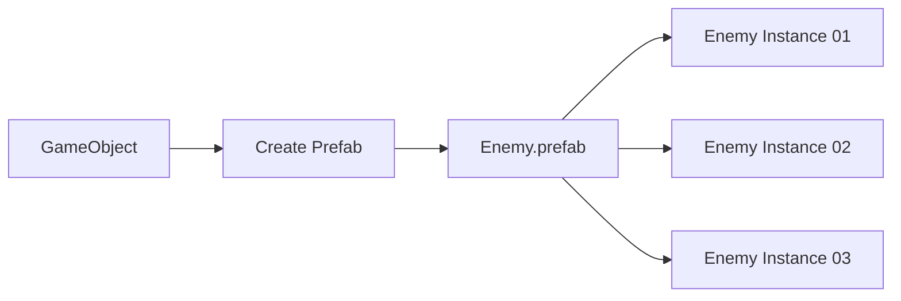

---

## 8.3 Ví dụ instantiate Prefab

```csharp
using UnityEngine;

public class EnemySpawner : MonoBehaviour
{
    [SerializeField]
    private GameObject enemyPrefab;

    public void SpawnEnemy()
    {
        Instantiate(
            enemyPrefab,
            transform.position,
            Quaternion.identity
        );
    }
}
```

Khi:

```text
SpawnEnemy()
```

được gọi:

```text
Enemy.prefab
       │
       ▼
Instantiate()
       │
       ▼
Enemy(Clone)
```

---

# 9. Rigidbody

## 9.1 Rigidbody làm gì?

**Rigidbody đưa GameObject vào mô phỏng vật lý.**

Nó có thể xử lý:

```text
Mass
Gravity
Velocity
Force
Drag
Collision response
```

Ví dụ:

```text
Ball
├── MeshRenderer
├── SphereCollider
└── Rigidbody
```

Khi Play:

```text
Gravity
   ↓
 Ball
   ↓
 Ground
```

---

## 9.2 2D và 3D khác nhau

Đừng trộn:

```text
Rigidbody
Collider
```

với:

```text
Rigidbody2D
Collider2D
```

Hai hệ thống physics riêng biệt.

### 3D

```text
Rigidbody
BoxCollider
SphereCollider
CapsuleCollider
MeshCollider
```

### 2D

```text
Rigidbody2D
BoxCollider2D
CircleCollider2D
CapsuleCollider2D
PolygonCollider2D
```

---

# 10. Collider

Collider định nghĩa **hình dạng va chạm**.

Ví dụ nhân vật có sprite:

```text
   O
  /|\
  / \
```

Collider có thể đơn giản hơn:

```text
 ┌─────┐
 │     │
 │     │
 │     │
 └─────┘
```

Không nhất thiết collider phải theo chính xác từng pixel/model.

Unity khuyến nghị cân nhắc loại collider vì độ phức tạp collision shape ảnh hưởng tới chi phí physics. Ví dụ, với object động phức tạp, nhiều primitive collider đôi khi phù hợp hơn một collision mesh phức tạp; dynamic Mesh Collider cũng có những hạn chế về convexity. ([Unity Documentation][5])

---

## 10.1 Rigidbody + Collider

Thông thường:

```text
Rigidbody
    +
Collider
    ↓
Physical Object
```

Ví dụ:

```text
Player
├── Rigidbody2D
└── CapsuleCollider2D

Ground
└── BoxCollider2D
```

Kết quả:

```text
Player
   ↓ gravity
██████████ Ground
```

Player đứng trên mặt đất thay vì rơi xuyên qua.

---

# 11. Collision và Trigger

Collider có hai cách dùng phổ biến.

### Collision

Hai vật thể tương tác vật lý:

```text
Player → | Wall
          ✕
```

Ví dụ:

```csharp
private void OnCollisionEnter2D(Collision2D collision)
{
    Debug.Log("Collision!");
}
```

### Trigger

Collider dùng như vùng phát hiện:

```text
Player
   ↓
┌──────────┐
│ Trigger  │
└──────────┘
```

Ví dụ coin:

```csharp
private void OnTriggerEnter2D(Collider2D other)
{
    if (other.CompareTag("Player"))
    {
        Destroy(gameObject);
    }
}
```

---

# 12. Animator

Animation asset mô tả chuyển động.

**Animator** chịu trách nhiệm quyết định animation nào đang chạy.

Ví dụ Player:

```text
Idle
Run
Jump
Attack
Death
```

State Machine:

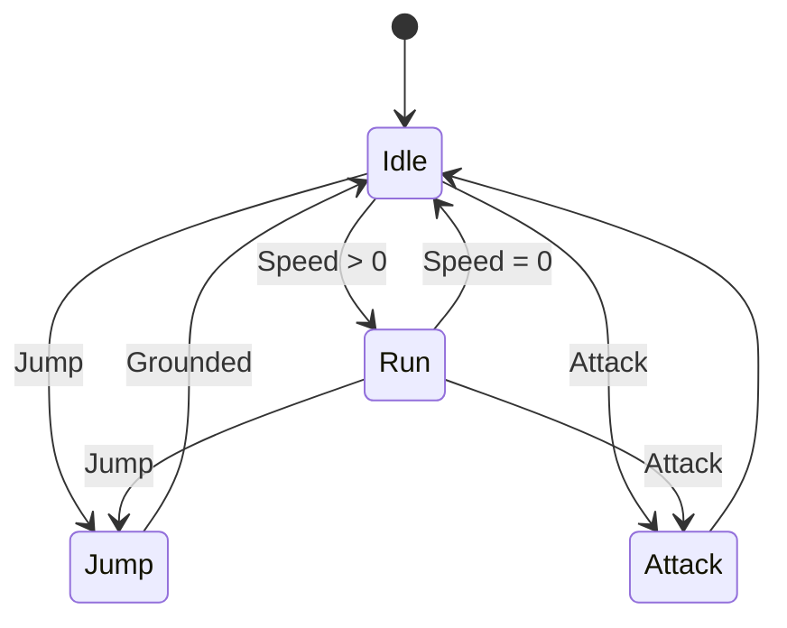

---

## 12.1 Parameter

Animator thường sử dụng:

```text
Speed    → Float
Grounded → Bool
Jump     → Trigger
Attack   → Trigger
```

Script:

```csharp
animator.SetFloat("Speed", Mathf.Abs(moveInput));

animator.SetBool("Grounded", isGrounded);

animator.SetTrigger("Attack");
```

### Luồng

```text
Input
 ↓
PlayerController
 ↓
Animator Parameter
 ↓
Animator State Machine
 ↓
Animation Clip
 ↓
Character Animation
```

---

# 13. Script bằng C#

Gameplay Unity thường được viết bằng **C#**.

Ví dụ:

```csharp
using UnityEngine;

public class PlayerController : MonoBehaviour
{
    [SerializeField]
    private float moveSpeed = 5f;

    private void Update()
    {
        float x = Input.GetAxisRaw("Horizontal");

        transform.position +=
            Vector3.right *
            x *
            moveSpeed *
            Time.deltaTime;
    }
}
```

Ý nghĩa:

```text
Input
 ↓
x
 ↓
speed
 ↓
Time.deltaTime
 ↓
Transform
 ↓
Player di chuyển
```

> Ví dụ trên dùng API input kiểu cũ để minh họa code ngắn. Với project mới, nên học **Input System** riêng ở phần dưới.

---

# 14. MonoBehaviour

Nhiều script gameplay Unity kế thừa:

```csharp
MonoBehaviour
```

Ví dụ:

```csharp
public class PlayerController : MonoBehaviour
{
}
```

Một số callback quan trọng:

```text
Awake()
Start()

Update()
FixedUpdate()
LateUpdate()

OnTriggerEnter()
OnCollisionEnter()

OnDestroy()
```

### Lifecycle rút gọn

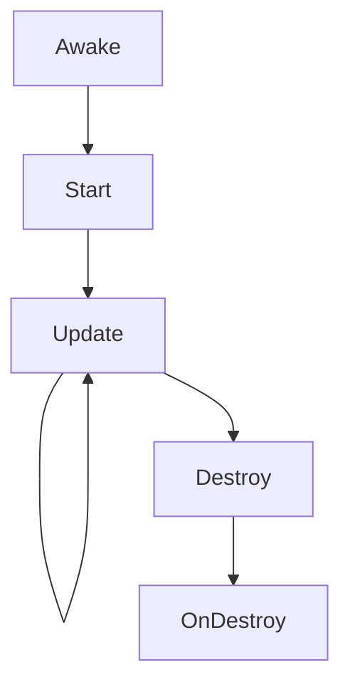

---

# 15. Update và FixedUpdate

Đây là lỗi người mới gặp rất nhiều.

### `Update()`

Thường dùng cho:

```text
Input
Game logic
Timer
Non-physics movement
```

### `FixedUpdate()`

Thường dùng cho:

```text
Physics
Rigidbody forces
Physics-related movement
```

Ví dụ:

```csharp
private void FixedUpdate()
{
    rb.AddForce(Vector3.forward * force);
}
```

---

# 16. UI System

Game thường cần:

```text
HP
Score
Coins
Pause
Inventory
Main Menu
Game Over
Settings
```

Trong Unity hiện có nhiều hệ UI; tài liệu Unity 6.3 bao gồm **UI Toolkit** bên cạnh hệ thống uGUI và còn cung cấp hướng dẫn migration giữa các hệ thống UI. ([Unity Documentation][6])

---

## 16.1 UI game đơn giản

Ví dụ:

```text
UI
│
├── Score
├── Coin
├── HealthBar
├── PauseButton
└── GameOverPanel
```

### Luồng cập nhật UI

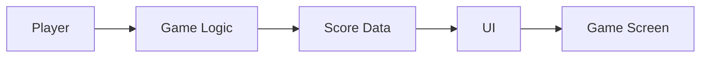

---

## 16.2 Không nên viết UI kiểu này

```text
PlayerController
├── movement
├── jump
├── attack
├── health
├── score
├── UI
├── audio
├── save
└── scene management
```

Vì sẽ nhanh chóng trở thành:

```text
God Class
```

Nên dần tách:

```text
PlayerController
PlayerHealth
PlayerCombat
ScoreManager
GameManager
UIController
AudioManager
```

---

# 17. Input System

Unity hiện cung cấp **Input System package**, cho phép xử lý keyboard, mouse, gamepad, touch và những loại input khác. Tài liệu hiện hành cũng nhấn mạnh việc sử dụng **Input Actions** để tách ý nghĩa gameplay như `Move`, `Jump`, `Attack` khỏi phím hoặc thiết bị vật lý cụ thể. ([Unity Documentation][7])

Thay vì suy nghĩ:

```text
Space = Jump
```

hãy suy nghĩ:

```text
Jump Action
│
├── Keyboard Space
├── Gamepad South Button
└── Mobile Button
```

---

## 17.1 Action Map

Ví dụ:

```text
Player
│
├── Move
├── Jump
├── Attack
├── Interact
└── Pause
```

`Move` có thể bind:

```text
Keyboard
WASD

Gamepad
Left Stick

Mobile
Virtual Joystick
```

---

## 17.2 Kiến trúc tốt hơn

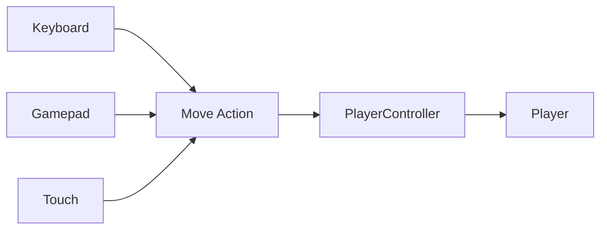

Gameplay không cần quan tâm input đến từ:

```text
Keyboard?
Gamepad?
Touch?
```

Nó chỉ nhận:

```text
Move
Jump
Attack
```

---

# 18. Ví dụ Player với Input System

Ví dụ concept:

```csharp
using UnityEngine;
using UnityEngine.InputSystem;

public class PlayerController : MonoBehaviour
{
    [SerializeField]
    private float moveSpeed = 5f;

    private Vector2 moveInput;

    public void OnMove(InputAction.CallbackContext context)
    {
        moveInput = context.ReadValue<Vector2>();
    }

    private void Update()
    {
        Vector3 direction =
            new Vector3(moveInput.x, 0f, moveInput.y);

        transform.position +=
            direction *
            moveSpeed *
            Time.deltaTime;
    }
}
```

Luồng:

```text
Keyboard/Gamepad
       ↓
Input Action
       ↓
OnMove()
       ↓
moveInput
       ↓
PlayerController
       ↓
Transform
```

---

# 19. Build Game

Trong Unity 6, workflow build sử dụng **Build Profiles**, cho phép quản lý cấu hình build cho các nền tảng và trường hợp triển khai khác nhau; tài liệu Unity 6.3 tiếp tục sử dụng `File > Build Profiles` trong hướng dẫn build. ([Unity Documentation][8])

Ví dụ:

```text
Development Windows
Release Windows
Android Debug
Android Release
Web
```

---

## 19.1 Pipeline build

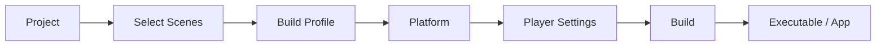

---

## 19.2 Ví dụ Windows

```text
Unity Project
      ↓
Windows Build Profile
      ↓
Build
      ↓
MyGame.exe
MyGame_Data/
```

---

## 19.3 Ví dụ Android

```text
Unity Project
      ↓
Android Build Profile
      ↓
Android configuration
      ↓
Build
      ↓
APK / AAB
```

---

# 20. Workflow Unity tổng thể

Đây là sơ đồ quan trọng nhất của bài.

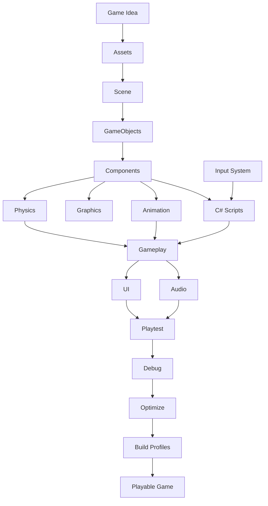

Nếu hiểu được sơ đồ này, bạn đã hiểu phần lớn **mental model cơ bản của Unity**.

---

# 21. Ví dụ hoàn chỉnh: Coin trong Platformer

Hãy xem một mechanic cực nhỏ.

## Yêu cầu

Player chạm coin:

```text
Coin biến mất
+
Score +1
+
UI cập nhật
```

### Coin

```text
Coin
├── SpriteRenderer
├── CircleCollider2D
└── Coin.cs
```

Collider:

```text
Is Trigger = true
```

Script:

```csharp
using UnityEngine;

public class Coin : MonoBehaviour
{
    private void OnTriggerEnter2D(Collider2D other)
    {
        if (!other.CompareTag("Player"))
            return;

        GameManager.Instance.AddCoin(1);

        Destroy(gameObject);
    }
}
```

---

## Luồng gameplay

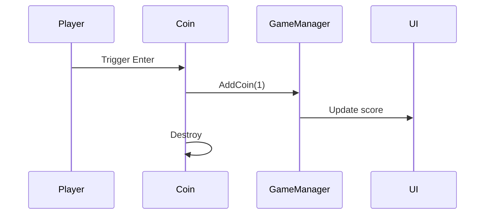

Chỉ mechanic này đã sử dụng:

```text
GameObject
Component
Collider
Script
Tag
GameManager
UI
```

---

# 22. Project Structure đề xuất

Không nên để tất cả file vào:

```text
Assets/
```

Ví dụ structure:

```text
Assets/
│
├── Art/
│   ├── Characters/
│   ├── Environment/
│   ├── UI/
│   └── Materials/
│
├── Audio/
│   ├── Music/
│   └── SFX/
│
├── Animations/
│
├── Prefabs/
│   ├── Characters/
│   ├── Environment/
│   └── UI/
│
├── Scenes/
│   ├── MainMenu/
│   └── Gameplay/
│
├── Scripts/
│   ├── Core/
│   ├── Player/
│   ├── Enemy/
│   ├── UI/
│   └── Systems/
│
├── Settings/
│
└── ThirdParty/
```

Mục tiêu:

```text
Nhìn folder
    ↓
Biết asset nằm đâu
    ↓
Giảm thời gian tìm kiếm
    ↓
Project dễ scale
```

---

# 23. Asset pipeline

Asset ngoài Unity có thể đến từ:

```text
Blender
Photoshop
Aseprite
Substance Painter
Audacity
DAW
```

Sau đó:

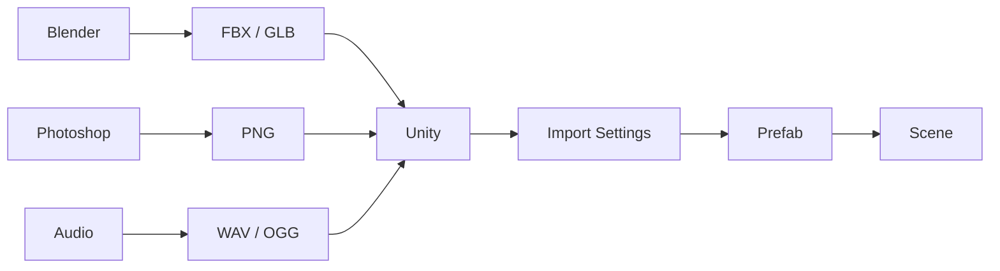

Ví dụ model:

```text
Blender
   ↓
fish.fbx
   ↓
Unity
   ↓
Mesh
Materials
Animations
   ↓
Fish.prefab
   ↓
Scene
```

---

# 24. Prototype nên làm

Roadmap đưa ra bốn lựa chọn rất phù hợp.

| Project                | Học được gì?                             |
| ---------------------- | ---------------------------------------- |
| **2D Platformer**      | Input, Rigidbody2D, Collider2D, Animator |
| **Top-down RPG**       | Input, interaction, inventory, scene     |
| **Endless Runner**     | Object pooling, spawn, score             |
| **Simple Mobile Game** | Touch input, UI, Android build           |

Nếu đây là project Unity đầu tiên, lựa chọn dễ nhất là:

> **2D Platformer mini.**

---

# 25. Mini Project — 2D Platformer

## Gameplay

```text
Move
Jump
Collect Coins
Avoid Enemy
Reach Goal
```

### Scene

```text
Level01
│
├── Player
├── Main Camera
├── Platforms
├── Coins
├── Enemies
├── Goal
└── Canvas
```

---

## Player

```text
Player
├── SpriteRenderer
├── Rigidbody2D
├── CapsuleCollider2D
├── Animator
└── PlayerController.cs
```

---

## Coin

```text
Coin
├── SpriteRenderer
├── CircleCollider2D
└── Coin.cs
```

---

## Enemy

```text
Enemy
├── SpriteRenderer
├── Rigidbody2D
├── Collider2D
├── Animator
└── EnemyController.cs
```

---

## UI

```text
Canvas
│
├── ScoreText
├── Health
└── GameOverPanel
```

---

# 26. Gameplay Loop

Gameplay loop nên rất ngắn:

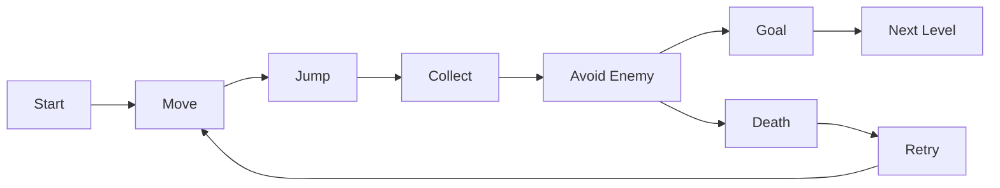

Bạn không cần làm:

```text
Inventory 100 item
Skill tree
Dialogue system
Multiplayer
Save cloud
Crafting
```

cho project đầu tiên.

Mục tiêu là chứng minh:

```text
Input
+
Physics
+
Gameplay
+
UI
+
Build
```

hoạt động thành một vòng khép kín.

---

# 27. Engine có sẵn vs tự viết engine

Một mục tiêu quan trọng trong roadmap là hiểu trade-off này.

| Unity                      | Tự viết Engine                  |
| -------------------------- | ------------------------------- |
| Prototype nhanh            | Mất thời gian hơn               |
| Có Editor                  | Phải tự làm tool                |
| Physics có sẵn             | Phải tích hợp/tự viết           |
| Animation có sẵn           | Phải tự xây                     |
| UI system có sẵn           | Phải tự làm                     |
| Asset pipeline có sẵn      | Phải tự thiết kế                |
| Cross-platform thuận tiện  | Phải tự xử lý                   |
| Ít kiểm soát low-level hơn | Kiểm soát sâu                   |
| Có abstraction/overhead    | Có thể tối ưu đặc thù           |
| Phù hợp đa số game         | Hợp nghiên cứu engine/rendering |

### Hình dung

```text
                 Làm game
                    │
          ┌─────────┴─────────┐
          │                   │
        Unity             Custom Engine
          │                   │
      Gameplay             Engine code
          │                   │
      Prototype           Renderer
          │               Physics
      Release             ECS
                          Asset pipeline
                          Editor
                          Build system
```

Nếu mục tiêu là:

> **làm game**

thì engine giúp bạn tập trung vào gameplay.

Nếu mục tiêu là:

> **học graphics, engine architecture hoặc low-level systems**

thì tự xây một engine mini có giá trị học tập lớn.

---

# 28. Những lỗi người mới Unity thường gặp

### 1. Một script làm mọi thứ

```text
Player.cs
5000 lines
```

Nên chia trách nhiệm.

---

### 2. Dùng `Find()` khắp nơi

```csharp
GameObject.Find(...)
```

liên tục sẽ tạo dependency khó kiểm soát.

Tốt hơn có thể sử dụng:

```text
[SerializeField]
reference
dependency component
manager
event
```

tùy kiến trúc.

---

### 3. Biến mọi thứ thành Singleton

```text
GameManager.Instance
AudioManager.Instance
EnemyManager.Instance
CoinManager.Instance
PlayerManager.Instance
WeaponManager.Instance
...
```

Singleton có chỗ dùng, nhưng không phải câu trả lời cho mọi dependency.

---

### 4. Không sử dụng Prefab

Copy:

```text
Enemy
Enemy
Enemy
Enemy
```

rồi chỉnh từng object là workflow khó maintain.

Prefab giải quyết chính vấn đề tái sử dụng cấu trúc object. ([Unity Documentation][4])

---

### 5. Collider quá phức tạp

Không nhất thiết:

```text
Collider = model chính xác 100%
```

Gameplay thường chỉ cần collision shape hợp lý.

Collider phức tạp hơn có thể làm physics đắt hơn. ([Unity Documentation][5])

---

### 6. Không build game cho tới cuối project

Một project có thể:

```text
Play trong Editor ✅
Build Android ❌
```

Do đó nên thử build sớm.

---

# 29. Checklist prototype

Khi hoàn thành mini project, kiểm tra:

```text
[ ] Có ít nhất 1 Scene gameplay

[ ] Player di chuyển được

[ ] Có input

[ ] Có Rigidbody hoặc Rigidbody2D

[ ] Có Collider

[ ] Có collision hoặc trigger

[ ] Có Prefab

[ ] Có ít nhất 1 Animator

[ ] Có ít nhất 1 C# gameplay script

[ ] Có UI

[ ] Có score / health / trạng thái game

[ ] Có game loop

[ ] Có restart

[ ] Không có Console Error

[ ] Folder được tổ chức

[ ] Build chạy được ngoài Editor
```

---

# 30. Bài tập thực hành

## Bài 1 — Unity Editor

Tạo project và xác định:

```text
Hierarchy
Scene
Game
Inspector
Project
Console
```

**Mục tiêu:** hiểu vị trí và chức năng của từng cửa sổ.

---

## Bài 2 — GameObject + Component

Tạo:

```text
Cube
```

và thêm:

```text
Rigidbody
```

sau đó Play.

Quan sát:

```text
Cube
 ↓
Gravity
 ↓
Ground
```

---

## Bài 3 — Collision

Tạo:

```text
Player
Ground
```

với:

```text
Rigidbody
+
Collider
```

và đảm bảo Player không rơi xuyên Ground.

---

## Bài 4 — Prefab

Tạo:

```text
Coin.prefab
```

sau đó đặt 10 coin trong Scene.

Thay đổi Prefab và quan sát những instance liên quan.

---

## Bài 5 — C# Script

Viết:

```text
PlayerController.cs
```

cho nhân vật:

```text
Move
Jump
```

---

## Bài 6 — Animator

Tạo:

```text
Idle
Run
Jump
```

và state machine:

```text
Idle ⇄ Run
  ↓
 Jump
```

---

## Bài 7 — UI

Hiển thị:

```text
Coins: 0
```

Khi nhặt coin:

```text
Coins: 1
Coins: 2
Coins: 3
```

---

## Bài 8 — Build

Tạo một Build Profile rồi build prototype thành bản chạy độc lập. Unity 6.3 sử dụng Build Profiles để quản lý quá trình này. ([Unity Documentation][8])

---

# 31. Artifact nên tạo

Sau bài học nên có ba artifact chính.

## 31.1 Playable Prototype

Ví dụ:

```text
UnityMiniPlatformer/
```

với:

```text
Move
Jump
Coin
Enemy
Goal
Score
Restart
```

---

## 31.2 Build README

Ví dụ:

```markdown
# Mini Platformer

## Engine

Unity 6

## Controls

A / D — Move
Space — Jump
Esc — Pause

## Gameplay

Collect 10 coins and reach the goal.

## Systems

- Input System
- Rigidbody2D
- Collider2D
- Animator
- Prefab
- UI

## Build

Windows
```

---

## 31.3 Engine Workflow Notes

Ghi lại pipeline:

```text
Asset
↓
Import
↓
Prefab
↓
Scene
↓
Component
↓
Script
↓
Playtest
↓
Build
```

---

# 32. Portfolio nên thể hiện gì?

Đừng chỉ ghi:

> “I know Unity.”

Nên cho thấy bằng artifact:

```text
GitHub repository
+
README
+
Gameplay GIF/video
+
Playable build
+
Architecture diagram
```

README có thể mô tả:

```text
Project
├── Goal
├── Gameplay Loop
├── Architecture
├── Controls
├── Physics
├── Animation
├── Input
├── Challenges
├── Optimization
└── Lessons Learned
```

---

# 33. Câu hỏi tự kiểm tra

Sau bài này hãy thử trả lời mà không xem tài liệu:

### Unity fundamentals

1. Unity Editor dùng để làm gì?
2. Scene khác GameObject như thế nào?
3. GameObject là gì?
4. Component là gì?
5. Transform chứa gì?
6. Prefab giải quyết vấn đề gì?

### Physics

7. Rigidbody khác Collider thế nào?
8. Trigger khác Collision thế nào?
9. Rigidbody2D khác Rigidbody thế nào?

### Gameplay

10. `MonoBehaviour` là gì?
11. `Update()` thường dùng khi nào?
12. `FixedUpdate()` thường dùng khi nào?
13. Animator Controller giải quyết vấn đề gì?

### Input/UI

14. Input Action có lợi gì hơn việc hard-code một phím?
15. UI nhận dữ liệu gameplay bằng cách nào?

### Build

16. Build Profile là gì?
17. Vì sao phải thử build sớm thay vì chỉ Play trong Editor?

### Architecture

18. Vì sao không nên đặt toàn bộ game logic vào một script?
19. Khi nào nên sử dụng Prefab?
20. Khi nào Unity phù hợp hơn tự viết engine?

---

# 34. Mental Model cần nhớ

Nếu chỉ giữ lại một sơ đồ từ bài này, hãy nhớ:

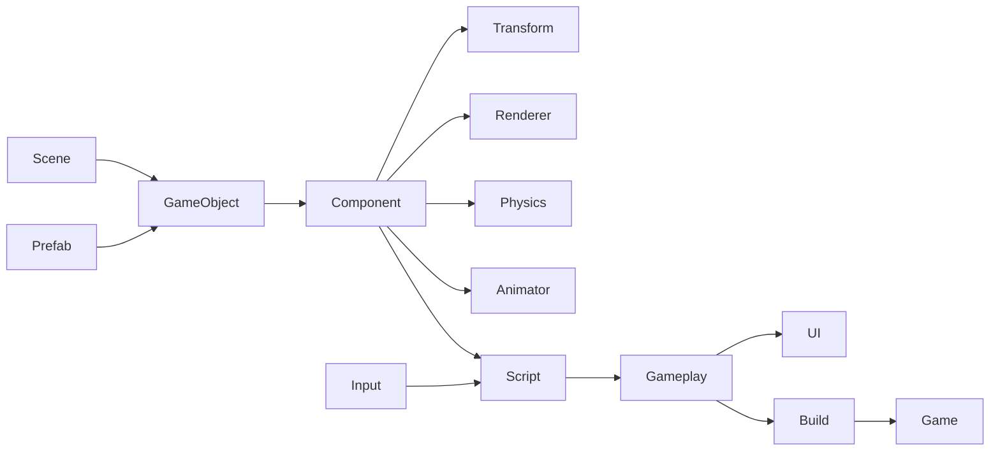

Hay rút gọn hơn nữa:

```text
SCENE
  ↓
GAMEOBJECT
  ↓
COMPONENT
  ↓
SCRIPT + PHYSICS + ANIMATION
  ↓
GAMEPLAY
  ↓
UI
  ↓
BUILD
```

---

# 35. Tổng kết

**Unity** nên được học như một **workflow làm game**, không phải học thuộc giao diện Editor.

Ba khái niệm quan trọng nhất của bài đầu tiên là:

```text
Scene
   ↓
GameObject
   ↓
Component
```

Sau đó mở rộng sang:

```text
Prefab
Physics
Animator
C#
Input
UI
Build
```

Với một project nhỏ như **2D Platformer**, toàn bộ chuỗi kiến thức có thể kết nối thành:

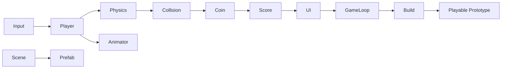

> **Đầu ra tốt nhất của bài 001 không phải một file ghi chú dài, mà là một prototype nhỏ có thể chơi được, có input, collision, animation, UI và một bản build thực sự chạy được.**

Tài liệu tham chiếu trong bài bám theo **Unity 6.3 LTS**; Unity hiện dùng Build Profiles trong workflow build và Input System package tiếp tục là hệ thống input hiện hành trong documentation. ([Unity Documentation][9])

[1]: https://unity.com/?utm_source=chatgpt.com "Unity: Develop, Deploy, and Grow | The World's Leading ..."
[2]: https://docs.unity3d.com/6000.3/Documentation/Manual/urp/camera-components-reference-landing.html?utm_source=chatgpt.com "Camera Inspector windows reference for URP"
[3]: https://docs.unity3d.com/6000.3/Documentation/Manual/test-framework/course/test-framework-general-introduction.html?utm_source=chatgpt.com "General introduction to Unity Test Framework"
[4]: https://docs.unity3d.com/6000.3/Documentation/Manual/prefab-instance-inspector-reference.html?utm_source=chatgpt.com "Prefab instance Inspector reference"
[5]: https://docs.unity3d.com/6000.3/Documentation/Manual/physics-optimization-cpu-collider-types.html?utm_source=chatgpt.com "Collider types and performance"
[6]: https://docs.unity3d.com/6000.3/Documentation/Manual/UIE-uxml-element-ToolbarSearchField.html?utm_source=chatgpt.com "ToolbarSearchField"
[7]: https://docs.unity3d.com/Packages/com.unity.inputsystem%40latest/?utm_source=chatgpt.com "Input System | 1.19.0"
[8]: https://docs.unity3d.com/6000.3/Documentation/Manual/UpgradeGuideUnity63.html?utm_source=chatgpt.com "Upgrade to Unity 6.3"
[9]: https://docs.unity3d.com/6000.3/Documentation/Manual/com.unity.modules.director.html?utm_source=chatgpt.com "Director"

---

# Bài luyện tập

## Mục tiêu


## Đề bài


## Yêu cầu hoàn thành

- [ ] 
- [ ] 
- [ ] 

## Kết quả / lời giải


## Ghi chú
