# 003 — GODOT

> **Module:** Module 04 — Game Engine
> **Roadmap item:** 4.3
> **Nhóm nội dung:** Game Engine
> **Thứ tự trong module:** 003
> **Thời lượng gợi ý:** 45–60 phút
> **Mức độ:** Cơ bản → Prototype
> **Mục tiêu đầu ra:** Tạo được một game 2D nhỏ có input, collision, animation, UI và bản build chạy được.

Godot là game engine **miễn phí, mã nguồn mở**, hỗ trợ phát triển game 2D, 3D và đa nền tảng. Ở thời điểm hiện tại, trang chính thức đang phát hành **Godot 4.7.1** là bản stable mới nhất. ([Godot Engine][1])

[](https://cococode.net/godot?utm_source=chatgpt.com)

Các hình trên lần lượt minh họa workflow editor/scene, xây level bằng tile, collision và hệ thống TileMap trong Godot. Giao diện giữa các phiên bản Godot có thể khác nhau; với Godot hiện tại, đặc biệt lưu ý thay đổi từ `TileMap` sang `TileMapLayer`. ([Godot Engine documentation][2])

---

## 1. Tóm tắt

Điểm quan trọng nhất khi bắt đầu Godot là hiểu triết lý:

```text
Game
 └── Scene
      └── Node
           ├── Node
           ├── Node
           └── Node
```

Khác với việc suy nghĩ game chỉ là một tập các class, Godot tổ chức phần lớn game dưới dạng **cây Node — Scene Tree**. Một Scene là tập hợp một hoặc nhiều Node và có thể được lưu, tái sử dụng, lồng vào Scene khác hoặc instantiate nhiều lần. ([Godot Engine documentation][3])

Ví dụ một nhân vật:

```text
Player.tscn
└── CharacterBody2D
    ├── Sprite2D
    ├── CollisionShape2D
    ├── AnimationPlayer
    └── Camera2D
```

Có thể hiểu nhanh:

| Godot             | Vai trò                           |
| ----------------- | --------------------------------- |
| `Node`            | Building block                    |
| `Scene`           | Một object/game system hoàn chỉnh |
| `GDScript`        | Logic                             |
| `Signal`          | Event/message                     |
| `PhysicsBody2D`   | Collision + physics               |
| `AnimationPlayer` | Animation timeline                |
| `TileMapLayer`    | Xây map 2D                        |
| Export            | Đóng gói game                     |

---

# 2. Mục tiêu học tập

Sau bài này, anh nên có thể:

* giải thích được **Node và Scene**;
* tạo Scene và instantiate Scene khác;
* viết script bằng **GDScript**;
* xử lý input;
* hiểu `_process()` và `_physics_process()`;
* sử dụng **Signals**;
* tạo nhân vật bằng `CharacterBody2D`;
* thêm `CollisionShape2D`;
* tạo animation bằng `AnimationPlayer`;
* xây map bằng `TileSet` + `TileMapLayer`;
* tạo UI đơn giản;
* export game;
* hoàn thành ít nhất một prototype nhỏ.

---

# 3. Mental model của Godot

Godot xoay quanh bốn thành phần chính:

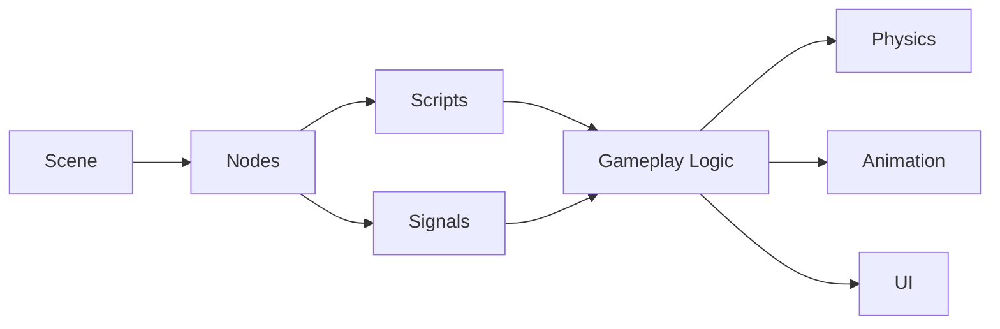

Một gameplay object thường không phải chỉ là một Node.

Ví dụ Player:

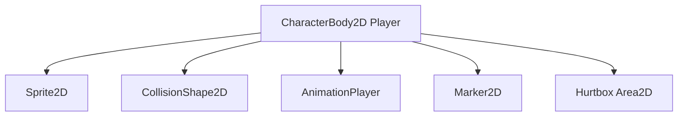

---

# 4. Node System

## 4.1 Node là gì?

**Node là building block cơ bản nhất của Godot.**

Một Scene được cấu tạo từ cây Node. Node cha có thể chứa nhiều Node con và mỗi loại Node đảm nhiệm một chức năng cụ thể. ([Godot Engine documentation][3])

Ví dụ:

```text
Player
├── Sprite2D
├── CollisionShape2D
├── Camera2D
└── AnimationPlayer
```

Trong đó:

* `CharacterBody2D` → movement/collision;
* `Sprite2D` → hình ảnh;
* `CollisionShape2D` → collider;
* `Camera2D` → camera;
* `AnimationPlayer` → animation.

---

## 4.2 Các Node thường gặp

### Node2D

Base cho object trong game 2D.

```text
Node2D
├── Sprite2D
├── Marker2D
├── Camera2D
└── PhysicsBody2D
```

### Control

Dùng cho UI.

```text
Control
├── Label
├── Button
├── Panel
├── TextureRect
└── ProgressBar
```

Godot sử dụng các node thuộc nhóm `Control` cho giao diện và truyền các input event thông qua `Viewport`. ([Godot Engine documentation][4])

---

# 5. Scene System

## 5.1 Scene là gì?

Scene có thể được hiểu như:

> **Một cây Node được đóng gói thành một object/game system có thể tái sử dụng.**

Godot cho phép Scene chứa Scene khác, nhờ vậy có thể xây game bằng composition. ([Godot Engine documentation][5])

Ví dụ:

```text
Game.tscn
├── Level
├── Player.tscn
├── Enemy.tscn
│
├── Enemy.tscn
│
└── UI.tscn
```

`Enemy.tscn` chỉ cần thiết kế một lần nhưng có thể instantiate nhiều lần.

---

## 5.2 Scene giống Prefab không?

Nếu đã học Unity, có thể hình dung gần đúng:

| Unity         | Godot                      |
| ------------- | -------------------------- |
| GameObject    | Node                       |
| Component     | Node hoặc script           |
| Prefab        | Scene                      |
| Hierarchy     | Scene Tree                 |
| MonoBehaviour | GDScript attached vào Node |
| UnityEvent    | Signal                     |

Nhưng đây chỉ là phép so sánh giúp nhập môn. Godot thiết kế Scene/Node sâu hơn theo hướng composition.

---

## 5.3 Ví dụ Player Scene

```text
Player.tscn

Player : CharacterBody2D
├── Sprite2D
├── CollisionShape2D
├── AnimationPlayer
├── Camera2D
└── WeaponPivot
    └── Sprite2D
```

Sau đó:

```text
Level01.tscn

Level01
├── TileMapLayer
├── Player
├── Enemy
├── Enemy
└── CanvasLayer
    └── HUD
```

---

# 6. GDScript

## 6.1 GDScript là gì?

GDScript là ngôn ngữ scripting do Godot thiết kế để tích hợp trực tiếp với engine. Đây là ngôn ngữ cấp cao, hướng đối tượng, hỗ trợ gradual typing và sử dụng cú pháp indentation tương tự Python. Tuy nhiên, **GDScript không phải Python và không được xây dựng dựa trên Python**. ([Godot Engine documentation][6])

Ví dụ:

```gdscript
extends CharacterBody2D

var speed := 300.0

func _physics_process(delta):
    var direction := Input.get_axis("move_left", "move_right")
    velocity.x = direction * speed

    move_and_slide()
```

---

## 6.2 Khai báo biến

```gdscript
var health = 100
var speed = 200.0
var player_name = "Knight"
```

Có thể khai báo type:

```gdscript
var health: int = 100
var speed: float = 200.0
var player_name: String = "Knight"
```

---

## 6.3 Constant

```gdscript
const MAX_HEALTH := 100
const SPEED := 250.0
```

---

## 6.4 Hàm

```gdscript
func attack():
    print("Attack!")
```

Có parameter:

```gdscript
func take_damage(damage: int):
    health -= damage
```

Có return:

```gdscript
func calculate_damage(base_damage: int) -> int:
    return base_damage * 2
```

---

# 7. Script lifecycle cơ bản

Hai callback cực kỳ quan trọng:

```text
_ready()
_process(delta)
_physics_process(delta)
```

---

## `_ready()`

Được dùng để khởi tạo object sau khi Node đã vào Scene Tree.

```gdscript
func _ready():
    print("Player ready")
```

---

## `_process(delta)`

Logic theo từng frame.

Ví dụ:

```gdscript
func _process(delta):
    rotate(delta)
```

Phù hợp:

* UI;
* visual logic;
* timers;
* animation logic không phụ thuộc physics.

---

## `_physics_process(delta)`

Gameplay liên quan physics nên xử lý tại physics processing.

```gdscript
func _physics_process(delta):
    move_player()
```

Godot tách idle processing và physics processing để logic vật lý có thể chạy theo physics tick ổn định. ([Godot Engine documentation][7])

---

# 8. Input

Ví dụ movement:

```gdscript
var direction := Input.get_vector(
    "move_left",
    "move_right",
    "move_up",
    "move_down"
)
```

Sau đó:

```gdscript
velocity = direction * speed
move_and_slide()
```

Flow:

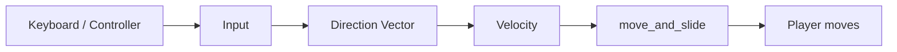

---

# 9. Signals

## 9.1 Signal là gì?

Signal là cơ chế event/message của Godot.

Một Node có thể phát signal và Node khác phản ứng mà không nhất thiết phải giữ reference trực tiếp tới nhau. Điều này giúp giảm coupling giữa các object. ([Godot Engine documentation][8])

Ví dụ:

```text
Enemy dies
     │
     │ signal: enemy_died
     ▼
GameManager
     │
     └── score += 100
```

---

## 9.2 Custom Signal

```gdscript
signal health_changed
```

Emit:

```gdscript
health_changed.emit()
```

Có dữ liệu:

```gdscript
signal health_changed(new_health)
```

```gdscript
health_changed.emit(health)
```

---

## 9.3 Connect Signal

```gdscript
player.health_changed.connect(_on_health_changed)
```

```gdscript
func _on_health_changed(new_health):
    health_bar.value = new_health
```

---

## 9.4 Tại sao Signals quan trọng?

Không dùng Signal:

```text
Player
 │
 ├── HUD reference
 ├── AudioManager reference
 ├── GameManager reference
 └── QuestManager reference
```

Coupling ngày càng lớn.

Dùng Signal:

```text
             health_changed
Player ──────────────────────────► HUD

             died
Player ──────────────────────────► GameManager
```

Code dễ mở rộng hơn.

---

# 10. Physics Body

Godot cung cấp nhiều loại physics body khác nhau. Trong 2D, `PhysicsBody2D` là base class chung của các body như `CharacterBody2D`, `RigidBody2D` và `StaticBody2D`. ([Godot Engine documentation][9])

---

## 10.1 CharacterBody2D

Dùng cho:

* player;
* enemy;
* NPC;
* object movement do code điều khiển.

`CharacterBody2D` được thiết kế cho object do người lập trình điều khiển; nó phát hiện collision nhưng không tự bị gravity/friction của physics simulation điều khiển. ([Godot Engine documentation][10])

Ví dụ:

```gdscript
extends CharacterBody2D

const SPEED := 300.0

func _physics_process(delta):

    var direction := Input.get_axis(
        "move_left",
        "move_right"
    )

    velocity.x = direction * SPEED

    move_and_slide()
```

---

# 11. CharacterBody2D + CollisionShape2D

Scene:

```text
Player
├── Sprite2D
└── CollisionShape2D
```

Movement pipeline:

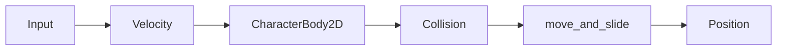

`move_and_slide()` đặc biệt hữu ích cho character controller vì Godot cung cấp xử lý movement cùng khả năng nhận biết tường và slope. ([Godot Engine documentation][11])

---

# 12. StaticBody2D

Dùng cho những object như:

```text
Wall
Floor
Platform
Obstacle
```

Ví dụ:

```text
Floor
└── CollisionShape2D
```

`StaticBody2D` không bị lực vật lý bên ngoài làm di chuyển nên phù hợp với sàn và tường. ([Godot Engine documentation][12])

---

# 13. RigidBody2D

Dùng cho những vật cần physics simulation:

```text
crate
rock
ball
debris
barrel
```

Ví dụ:

```text
Ball
├── Sprite2D
└── CollisionShape2D
```

`RigidBody2D` được physics engine mô phỏng đầy đủ; thay vì đặt movement trực tiếp như character, thường tác động thông qua force, gravity hoặc impulse. ([Godot Engine documentation][13])

Ví dụ:

```gdscript
apply_impulse(Vector2(400, -500))
```

---

# 14. So sánh Physics Body

| Node               | Dùng cho                        |
| ------------------ | ------------------------------- |
| `CharacterBody2D`  | Player/NPC                      |
| `RigidBody2D`      | vật thể chịu vật lý             |
| `StaticBody2D`     | tường/sàn                       |
| `AnimatableBody2D` | moving platform được điều khiển |
| `Area2D`           | trigger / detection             |

Ví dụ:

```text
Player       → CharacterBody2D
Box          → RigidBody2D
Floor        → StaticBody2D
MovingFloor  → AnimatableBody2D
CoinTrigger  → Area2D
```

---

# 15. AnimationPlayer

`AnimationPlayer` là Node dùng cho playback animation đa mục đích và có thể chứa các Animation Library khác nhau. ([Godot Engine documentation][14])

Scene:

```text
Player
├── Sprite2D
└── AnimationPlayer
```

---

## 15.1 Timeline

```text
time
0s       0.2       0.4       0.6
│---------│---------│---------│

scale
1.0       1.2       0.9       1.0

rotation
0°        10°      -10°       0°
```

AnimationPlayer có thể animate rất nhiều property.

Ví dụ:

```text
position
rotation
scale
modulate
sprite frame
audio
method call
```

---

## 15.2 Play animation bằng code

```gdscript
$AnimationPlayer.play("run")
```

Attack:

```gdscript
$AnimationPlayer.play("attack")
```

Death:

```gdscript
$AnimationPlayer.play("death")
```

---

# 16. AnimatedSprite2D vs AnimationPlayer

### AnimatedSprite2D

Tốt cho:

```text
idle frames
run frames
jump frames
```

Godot hỗ trợ animation sprite frame thông qua `AnimatedSprite2D`. ([Godot Engine documentation][15])

### AnimationPlayer

Tốt cho:

```text
Sprite
+ Transform
+ Sound
+ Collider
+ Effects
+ Functions
```

Ví dụ attack:

```text
0.00 → play attack sprite
0.10 → enable hitbox
0.18 → play sword sound
0.25 → disable hitbox
0.40 → animation finished
```

---

# 17. TileMap

## ⚠️ Lưu ý với roadmap

Roadmap ghi:

```text
TileMap
```

Nhưng trong Godot hiện tại, **`TileMap` đã deprecated** và tài liệu chính thức khuyến nghị sử dụng nhiều `TileMapLayer` thay thế. Vì vậy khi học roadmap này nên hiểu cả thuật ngữ cũ lẫn workflow mới. ([Godot Engine documentation][16])

Nên học theo:

```text
TileSet
   ↓
TileMapLayer
   ↓
Level
```

---

# 18. TileSet

`TileSet` là thư viện các tile được sử dụng bởi `TileMapLayer`. Tile có thể chứa thêm thông tin như physics hoặc navigation. ([Godot Engine documentation][17])

Ví dụ spritesheet:

```text
+---+---+---+---+
| G | G | G | G |
+---+---+---+---+
| W | W | W | W |
+---+---+---+---+
| S | S | S | S |
+---+---+---+---+
```

Trong đó:

```text
G = Grass
W = Wall
S = Sand
```

---

# 19. TileMapLayer

Tilemap là một grid tile dùng để xây layout level. So với đặt hàng nghìn `Sprite2D` riêng lẻ, TileMapLayer cho phép "paint" level trên grid và được tối ưu để vẽ số lượng tile lớn. ([Godot Engine documentation][18])

Ví dụ:

```text
World
├── Ground : TileMapLayer
├── Walls : TileMapLayer
├── Decoration : TileMapLayer
└── Foreground : TileMapLayer
```

Sơ đồ:

```text
Foreground
────────────

Decoration
────────────

Walls
────────────

Ground
────────────
```

---

# 20. Collision trong TileSet

Tile có thể chứa collision.

Ví dụ:

```text
Wall Tile
┌───────────┐
│ █████████ │
│ █ WALL ██ │
│ █████████ │
└───────────┘
      +
Collision Polygon
```

Sau đó level được paint bằng tile nhưng collision tự đi theo tile.

---

# 21. Workflow xây map 2D

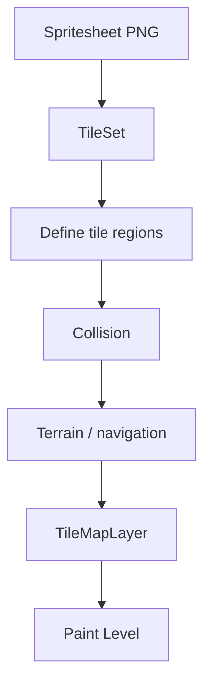

---

# 22. Export Game

Sau khi prototype chạy trong editor:

```text
Project
   ↓
Export
   ↓
Export Preset
   ↓
Windows / Linux / macOS / Android / Web ...
   ↓
Game build
```

Godot sử dụng **Export Preset** cho từng target platform; preset được thêm từ cửa sổ Project → Export. ([Godot Engine documentation][19])

---

## 22.1 Ví dụ Windows build

```text
build/
├── MyGame.exe
└── MyGame.pck
```

Tùy cấu hình export, resource của game được đóng gói vào build/PCK.

Godot cũng hỗ trợ export project resources thành PCK/ZIP. ([Godot Engine documentation][20])

---

## 22.2 Export workflow

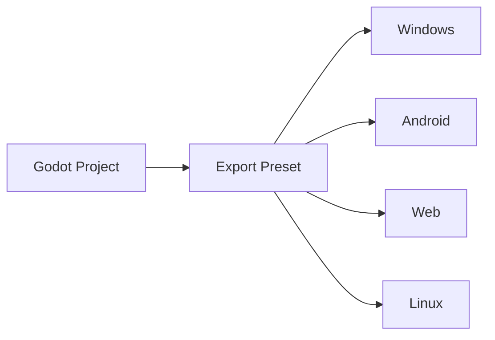

---

# 23. Folder Structure nên sử dụng

Không nên để project như:

```text
res://
├── player.png
├── game.gd
├── enemy.gd
├── music.wav
├── enemy.png
├── gun.png
├── level.tscn
├── explosion.wav
└── player.gd
```

Khi project lớn rất khó quản lý.

---

## Gợi ý

```text
res://

├── scenes/
│   ├── player/
│   │   └── player.tscn
│   │
│   ├── enemies/
│   │   ├── slime.tscn
│   │   └── boss.tscn
│   │
│   ├── levels/
│   │   ├── level_01.tscn
│   │   └── level_02.tscn
│   │
│   └── ui/
│       └── hud.tscn
│
├── scripts/
│   ├── player/
│   ├── enemies/
│   └── systems/
│
├── assets/
│   ├── sprites/
│   ├── tiles/
│   ├── audio/
│   └── fonts/
│
├── autoload/
│   └── game_manager.gd
│
└── project.godot
```

---

# 24. Asset Pipeline

Một pipeline đơn giản:

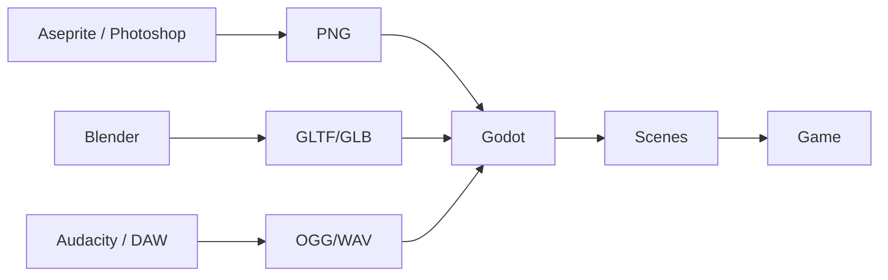

Nên giữ source asset riêng nếu cần:

```text
project/
├── source_assets/
│   ├── player.aseprite
│   └── environment.blend
│
└── game/
    └── assets/
        ├── player.png
        └── environment.glb
```

---

# 25. Prototype 1 — Simple Platformer

Đây là project phù hợp nhất để bắt đầu.

## Gameplay

```text
Move
 ↓
Jump
 ↓
Avoid obstacles
 ↓
Reach goal
```

---

## Scene

```text
Level
├── TileMapLayer
├── Player
├── Goal
└── CanvasLayer
    └── HUD
```

Player:

```text
Player
├── Sprite2D
├── CollisionShape2D
└── AnimationPlayer
```

---

# 26. Platformer movement

```gdscript
extends CharacterBody2D

const SPEED := 250.0
const JUMP_VELOCITY := -450.0
const GRAVITY := 1200.0

func _physics_process(delta):

    if not is_on_floor():
        velocity.y += GRAVITY * delta

    if Input.is_action_just_pressed("jump") and is_on_floor():
        velocity.y = JUMP_VELOCITY

    var direction := Input.get_axis(
        "move_left",
        "move_right"
    )

    velocity.x = direction * SPEED

    move_and_slide()
```

---

# 27. Platformer Architecture

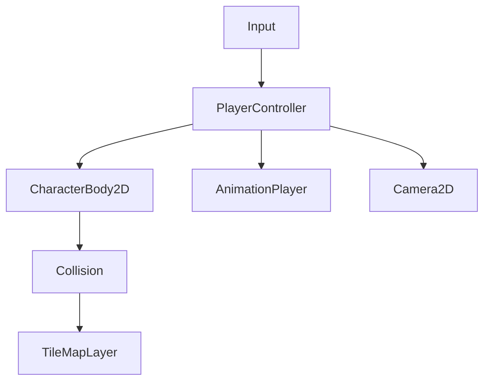

---

# 28. Prototype 2 — Top-down Shooter

Gameplay:

```text
Move
 ↓
Aim
 ↓
Shoot
 ↓
Bullet
 ↓
Enemy collision
 ↓
Damage
 ↓
Score
```

Scene:

```text
Game
├── World
├── Player
├── EnemySpawner
└── UI
```

Player:

```text
Player
├── Sprite2D
├── CollisionShape2D
├── GunPivot
│   └── Gun
└── AnimationPlayer
```

---

# 29. Bullet Scene

```text
Bullet
├── Sprite2D
└── CollisionShape2D
```

Script:

```gdscript
extends Area2D

var speed := 800.0

func _physics_process(delta):
    position += transform.x * speed * delta
```

---

# 30. Enemy hit

```gdscript
signal died(enemy)

var health := 3

func take_damage(amount: int):
    health -= amount

    if health <= 0:
        died.emit(self)
        queue_free()
```

Sau đó:

```text
Enemy
    │
    │ died
    ▼
GameManager
    │
    ▼
Score +100
```

Đây là ví dụ thực tế rất tốt để hiểu Signal.

---

# 31. Prototype 3 — 2D Puzzle Game

Ví dụ Sokoban đơn giản.

Gameplay:

```text
Move Player
     ↓
Push Box
     ↓
Box reaches Goal
     ↓
Check Puzzle
     ↓
All Goals Filled?
   /            \
 No              Yes
 │                │
Continue       Next Level
```

Scene:

```text
PuzzleLevel
├── Ground
├── Walls
├── Player
├── Boxes
├── Goals
└── UI
```

---

# 32. Gameplay Loop

Một prototype tốt nên có loop rõ ràng.

Top-down shooter:

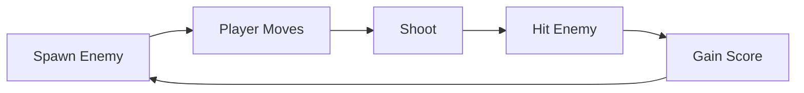

Platformer:

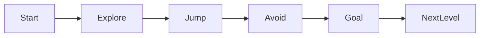

---

# 33. Mini-project khuyến nghị cho bài này

Nếu chỉ có khoảng **45–60 phút**, anh không cần làm cả ba project.

Nên chọn:

> **Simple Top-down Shooter**

Vì project nhỏ này có thể chạm gần như toàn bộ kiến thức của bài.

---

## Yêu cầu tối thiểu

### Player

```text
✓ CharacterBody2D
✓ Sprite
✓ Collision
✓ WASD movement
```

### Enemy

```text
✓ Enemy scene
✓ Collision
✓ HP
```

### Bullet

```text
✓ Bullet scene
✓ Move
✓ Collision
```

### Gameplay

```text
✓ Shoot
✓ Enemy takes damage
✓ Enemy dies
✓ Score increases
```

### UI

```text
✓ Score
✓ Player HP
```

### Build

```text
✓ Export Windows hoặc Web
```

---

# 34. Scene Tree hoàn chỉnh

```text
Main
│
├── World
│   ├── TileMapLayer_Ground
│   ├── TileMapLayer_Walls
│   │
│   ├── Player
│   │   ├── Sprite2D
│   │   ├── CollisionShape2D
│   │   ├── AnimationPlayer
│   │   └── WeaponPivot
│   │
│   ├── Enemy
│   └── Enemy
│
└── CanvasLayer
    └── HUD
        ├── HealthBar
        └── ScoreLabel
```

Đây là một ví dụ khá sát cách Scene/Node được dùng trong game Godot thực tế.

---

# 35. Luồng toàn bộ game

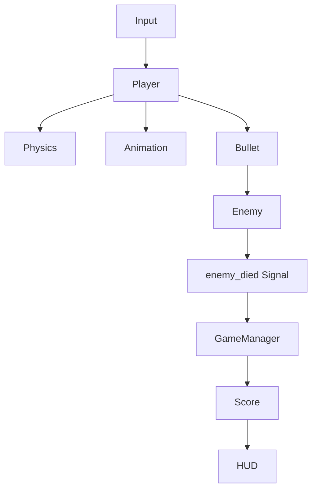

Nếu hiểu sơ đồ này thì anh đã hiểu phần lớn tư duy cơ bản của Godot.

---

# 36. Workflow làm game trong Godot

Một workflow nên hình thành:

```mermaid
flowchart LR

    IDEA[Gameplay idea]

    IDEA --> SCENE[Create Scenes]

    SCENE --> NODE[Build Node Trees]

    NODE --> SCRIPT[Attach Scripts]

    SCRIPT --> SIGNAL[Connect Signals]

    SIGNAL --> ASSET[Import Assets]

    ASSET --> TEST[Test]

    TEST --> DEBUG[Debug]

    DEBUG --> EXPORT[Export]

    EXPORT --> BUILD[Playable Build]
```

---

# 37. Engine có sẵn vs tự viết Engine

Một mục tiêu quan trọng của roadmap là hiểu trade-off.

|                                | Godot      | Tự viết engine     |
| ------------------------------ | ---------- | ------------------ |
| Scene editor                   | Có         | Phải viết          |
| Input                          | Có         | Phải viết          |
| Physics                        | Có         | Phải viết/tích hợp |
| Animation                      | Có         | Phải viết          |
| UI                             | Có         | Phải viết          |
| Asset import                   | Có         | Phải xây pipeline  |
| Export                         | Có         | Phải xây           |
| Rendering                      | Có         | Tự triển khai      |
| Gameplay prototype             | Rất nhanh  | Chậm               |
| Kiểm soát engine               | Khá cao    | Tối đa             |
| Giá trị học graphics internals | Trung bình | Rất cao            |

Godot là mã nguồn mở và được phát hành theo giấy phép MIT, vì vậy có thể nghiên cứu hoặc sửa engine source nếu muốn đi sâu hơn. ([GitHub][21])

---

# 38. Khi nào dùng Godot?

Godot đặc biệt phù hợp khi muốn:

```text
Indie games
2D games
Game jam
Rapid prototype
Learning game development
Small/medium game projects
Open-source workflow
```

Godot chính thức hỗ trợ cả workflow game 2D và 3D từ cùng một engine. ([Godot Engine][1])

---

# 39. Một số lỗi beginner thường gặp

## Lỗi 1 — Scene quá lớn

Không nên:

```text
Game.tscn
├── Player
├── Enemy1
├── Enemy2
├── Bullet
├── UI
├── Menu
├── Shop
├── Inventory
├── Boss
└── ...
```

Nên tách:

```text
Player.tscn
Enemy.tscn
Bullet.tscn
HUD.tscn
Level.tscn
```

Godot khuyến khích tổ chức Scene thành các phần có thể tái sử dụng thay vì dồn toàn bộ game vào một cây khổng lồ. ([Godot Engine documentation][22])

---

## Lỗi 2 — Dùng `RigidBody2D` cho player

Thông thường:

```text
Player
     ↓
CharacterBody2D
```

không phải:

```text
Player
     ↓
RigidBody2D
```

nếu anh cần movement chính xác do code điều khiển. `RigidBody2D` dành cho vật được physics simulation điều khiển, trong khi `CharacterBody2D` được thiết kế cho character do code điều khiển. ([Godot Engine documentation][13])

---

## Lỗi 3 — Di chuyển physics trong `_process()`

Nên:

```gdscript
func _physics_process(delta):
    move_and_slide()
```

thay vì đặt movement physics tùy tiện trong:

```gdscript
func _process(delta):
```

---

## Lỗi 4 — Hard-code mọi reference

Ví dụ:

```gdscript
get_node("../../../../UI/HUD/ScoreLabel")
```

rất dễ vỡ khi Scene Tree thay đổi.

Nên kết hợp:

```text
Signals
@onready
export Node
groups
autoload
```

tùy trường hợp.

---

# 40. Checklist thực hành

Sau bài học, kiểm tra:

### Editor

* [ ] Tạo Godot project
* [ ] Hiểu Scene dock
* [ ] Hiểu Inspector
* [ ] Hiểu FileSystem dock

### Node

* [ ] Tạo Node
* [ ] Thêm child Node
* [ ] Đổi property
* [ ] Hiểu Scene Tree

### Scene

* [ ] Save Scene
* [ ] Instantiate Scene
* [ ] Tái sử dụng Enemy scene

### GDScript

* [ ] Variables
* [ ] Functions
* [ ] `_ready()`
* [ ] `_process()`
* [ ] `_physics_process()`

### Gameplay

* [ ] Input
* [ ] Movement
* [ ] Collision

### Architecture

* [ ] Signal
* [ ] Player Scene
* [ ] Enemy Scene
* [ ] UI Scene

### Visual

* [ ] Sprite
* [ ] AnimationPlayer
* [ ] TileSet
* [ ] TileMapLayer

### Release

* [ ] Export preset
* [ ] Tạo playable build

---

# 41. Artifact nên tạo

Sau bài này nên có **3 artifact**.

## Artifact 1 — Playable Prototype

Ví dụ:

```text
godot-topdown-shooter/
```

Có:

```text
movement
shooting
enemy
collision
score
UI
```

---

## Artifact 2 — Build README

Ví dụ:

```markdown
# Mini Godot Shooter

## Controls

WASD — Move

Mouse — Aim

Left Click — Shoot

ESC — Pause

## Gameplay

Defeat enemies and survive as long as possible.

## Engine

Godot 4.x

## Features

- CharacterBody2D movement
- Signals
- Collision
- AnimationPlayer
- TileMapLayer
- UI
```

---

# 42. Artifact 3 — Engine Workflow Notes

Ví dụ:

```markdown
# Godot Notes

## Node

Smallest building block.

## Scene

Reusable Node tree.

## Signal

Event communication between Nodes.

## CharacterBody2D

Code-controlled physics character.

## AnimationPlayer

Timeline-based general animation.

## TileMapLayer

Grid-based level construction.

## Export

Build game using export presets.
```

---

# 43. Portfolio Structure

```text
godot-mini-game/
│
├── game/
│
├── screenshots/
│   ├── gameplay.png
│   ├── scene-tree.png
│   └── tilemap.png
│
├── builds/
│
└── README.md
```

README nên giải thích:

```text
Project
 ↓
Gameplay
 ↓
Controls
 ↓
Architecture
 ↓
Technical challenges
 ↓
What I learned
```

---

# 44. Những ảnh nên chụp cho portfolio

Không chỉ chụp gameplay.

Nên có:

### 1. Gameplay

```text
Player + enemies + level
```

### 2. Scene Tree

```text
Player
├── Sprite
├── Collider
└── Animation
```

### 3. TileMap editor

```text
TileSet + map
```

### 4. Script

Một đoạn movement hoặc signal ngắn.

### 5. Playable build

GIF/video khoảng:

```text
10–20 giây
```

show gameplay loop.

---

# 45. Câu hỏi tự kiểm tra

## Câu 1

**Node khác Scene như thế nào?**

<details>
<summary>Đáp án</summary>

Node là building block.

Scene là cây gồm một hoặc nhiều Node có thể lưu và tái sử dụng.

</details>

---

## Câu 2

Player nên dùng Node nào?

```text
A. StaticBody2D
B. CharacterBody2D
C. Label
D. TileMapLayer
```

**Đáp án:** `B`.

---

## Câu 3

Vật chịu physics như quả bóng nên dùng?

```text
RigidBody2D
```

---

## Câu 4

Signal giải quyết vấn đề gì?

Giảm phụ thuộc trực tiếp giữa các object bằng event communication.

---

## Câu 5

`AnimationPlayer` dùng làm gì?

Điều khiển animation theo timeline và có thể animate nhiều property khác nhau.

---

## Câu 6

Roadmap ghi `TileMap`, nhưng với Godot hiện tại nên dùng gì?

```text
TileMapLayer
```

vì `TileMap` hiện đã deprecated. ([Godot Engine documentation][2])

---

## Câu 7

Logic movement physics nên đặt ở đâu?

```gdscript
_physics_process(delta)
```

---

# 46. Bài kiểm tra thực hành

Không xem lại code, thử tạo:

```text
Player
├── Sprite2D
├── CollisionShape2D
└── AnimationPlayer
```

Yêu cầu:

```text
WASD movement
collision
idle animation
walk animation
```

Sau đó thêm:

```text
Enemy
```

và:

```text
Player touches Enemy
       ↓
Player HP -1
       ↓
Signal
       ↓
HUD update
```

Nếu tự làm được phần này, anh đã nắm được workflow cốt lõi của Godot.

---

# 47. Roadmap học Godot sau bài này

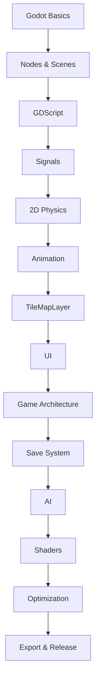

---

# 48. Bài thực hành 45–60 phút đề xuất

|  Thời gian | Công việc        |
| ---------: | ---------------- |
|   0–5 phút | Tạo project      |
|  5–12 phút | Tạo Player Scene |
| 12–20 phút | Input + movement |
| 20–27 phút | Collision        |
| 27–32 phút | Animation        |
| 32–38 phút | Enemy            |
| 38–43 phút | Signal           |
| 43–48 phút | HUD              |
| 48–53 phút | TileMapLayer     |
| 53–58 phút | Export           |
| 58–60 phút | README           |

Mục tiêu không phải làm game đẹp mà là hoàn thành pipeline:

```text
Input
 ↓
Gameplay
 ↓
Physics
 ↓
Animation
 ↓
UI
 ↓
Build
```

---

# 49. Kiến thức quan trọng nhất cần nhớ

```text
                 GODOT
                   │
        ┌──────────┼──────────┐
        │          │          │
      Scene       Node      GDScript
        │          │          │
        └──────────┼──────────┘
                   │
                Signals
                   │
       ┌───────────┼────────────┐
       │           │            │
    Physics    Animation     TileMap
       │           │            │
       └───────────┼────────────┘
                   │
                  UI
                   │
                 Export
                   │
             Playable Game
```

---

# 50. Tổng kết

**Godot** không nên được học bằng cách cố nhớ hàng trăm Node. Quan trọng hơn là hiểu cách các hệ thống kết hợp:

```text
Scene
 ↓
Node Tree
 ↓
Script
 ↓
Signal
 ↓
Physics
 ↓
Animation
 ↓
UI
 ↓
Export
```

Trong một game thực tế:

```text
Player.tscn
Enemy.tscn
Bullet.tscn
Level.tscn
HUD.tscn
```

được ghép thành:

```text
                 GAME
                   │
                 Level
         ┌─────────┼─────────┐
         │         │         │
      Player     Enemy      HUD
         │         │         │
       Script    Script    Control
         │         │         │
       Input    Physics      UI
         │         │         │
         └──── Signals ──────┘
                   │
             Gameplay Loop
                   │
                Export
                   │
            Playable Build
```

Điểm quan trọng nhất của **003 — Godot** là sau buổi học anh phải tạo được **một prototype chạy được**, chứ không chỉ biết định nghĩa thuật ngữ.

> **Definition of Done**
>
> `CharacterBody2D + input + collision + Signal + AnimationPlayer + TileMapLayer + UI + Export`
>
> Nếu hoàn thành đủ chuỗi này, anh đã có nền tảng cần thiết để tiếp tục sang gameplay programming, AI, shaders, optimization và các project Godot lớn hơn. ([Godot Engine documentation][23])

[1]: https://godotengine.org/?utm_source=chatgpt.com "Godot Engine - Free and open source 2D and 3D game ..."
[2]: https://docs.godotengine.org/en/stable/classes/class_tilemaplayer.html?utm_source=chatgpt.com "TileMapLayer - Godot Docs"
[3]: https://docs.godotengine.org/en/stable/classes/class_node.html?utm_source=chatgpt.com "Node — Godot Engine (stable) documentation in English"
[4]: https://docs.godotengine.org/en/stable/classes/class_control.html?utm_source=chatgpt.com "Control — Godot Engine (stable) documentation in English"
[5]: https://docs.godotengine.org/en/4.4/getting_started/step_by_step/nodes_and_scenes.html?utm_source=chatgpt.com "Nodes and Scenes — Godot Engine (4.4) documentation in ..."
[6]: https://docs.godotengine.org/en/4.4/tutorials/scripting/gdscript/gdscript_basics.html?utm_source=chatgpt.com "GDScript reference - Godot Docs"
[7]: https://docs.godotengine.org/en/4.4/tutorials/scripting/idle_and_physics_processing.html?utm_source=chatgpt.com "Idle and Physics Processing - Godot Docs"
[8]: https://docs.godotengine.org/en/4.4/getting_started/step_by_step/signals.html?utm_source=chatgpt.com "Using signals — Godot Engine (4.4) documentation in English"
[9]: https://docs.godotengine.org/en/stable/classes/class_physicsbody2d.html?utm_source=chatgpt.com "PhysicsBody2D - Godot Docs"
[10]: https://docs.godotengine.org/en/stable/tutorials/physics/physics_introduction.html?utm_source=chatgpt.com "Physics introduction - Godot Docs"
[11]: https://docs.godotengine.org/en/stable/classes/class_characterbody2d.html?utm_source=chatgpt.com "CharacterBody2D - Godot Docs"
[12]: https://docs.godotengine.org/en/stable/classes/class_staticbody2d.html?utm_source=chatgpt.com "StaticBody2D - Godot Docs"
[13]: https://docs.godotengine.org/en/stable/classes/class_rigidbody2d.html?utm_source=chatgpt.com "RigidBody2D - Godot Docs"
[14]: https://docs.godotengine.org/en/stable/tutorials/animation/introduction.html?utm_source=chatgpt.com "Introduction to the animation features - Godot Docs"
[15]: https://docs.godotengine.org/en/stable/tutorials/2d/2d_sprite_animation.html?utm_source=chatgpt.com "2D sprite animation - Godot Docs"
[16]: https://docs.godotengine.org/en/stable/classes/class_tilemap.html?utm_source=chatgpt.com "TileMap — Godot Engine (stable) documentation in English"
[17]: https://docs.godotengine.org/en/stable/tutorials/2d/using_tilesets.html?utm_source=chatgpt.com "Using TileSets - Godot Docs"
[18]: https://docs.godotengine.org/en/stable/tutorials/2d/using_tilemaps.html?utm_source=chatgpt.com "Using TileMaps - Godot Docs"
[19]: https://docs.godotengine.org/en/stable/tutorials/export/exporting_projects.html?utm_source=chatgpt.com "Exporting projects - Godot Docs"
[20]: https://docs.godotengine.org/en/stable/tutorials/export/exporting_pcks.html?utm_source=chatgpt.com "Exporting packs, patches, and mods - Godot Docs"
[21]: https://github.com/godotengine/godot?utm_source=chatgpt.com "Godot Engine – Multi-platform 2D and 3D game engine"
[22]: https://docs.godotengine.org/en/stable/tutorials/best_practices/scene_organization.html?utm_source=chatgpt.com "Scene organization - Godot Docs"
[23]: https://docs.godotengine.org/en/stable/getting_started/introduction/key_concepts_overview.html?utm_source=chatgpt.com "Overview of Godot's key concepts"

---

# Bài luyện tập

## Mục tiêu


## Đề bài


## Yêu cầu hoàn thành

- [ ] 
- [ ] 
- [ ] 

## Kết quả / lời giải


## Ghi chú
