# 004 — Native Engine

> **Module:** Module 04 — Game Engine
> **Roadmap item:** 4.4
> **Nhóm nội dung:** Game Engine
> **Thứ tự trong module:** 004
> **Thời lượng gợi ý:** 45–60 phút
> **Mức độ:** Trung cấp → Nâng cao
> **Mục tiêu chính:** Hiểu cách một game engine thực sự hoạt động bên dưới Unity, Unreal hoặc Godot.

[](https://www.rhelmer.org/blog/building-whiskers-engine-cpp-game-engine/?utm_source=chatgpt.com)

> Cụm ảnh trên minh họa các kiến trúc **custom/native game engine**, luồng giao tiếp giữa game–OS–renderer và mô hình **Entity Component System**.

---

## 1. Native Engine là gì?

Trong bài này, **Native Engine** không phải tên của một game engine cụ thể. Có thể hiểu nó là cách phát triển game bằng một **engine tự xây dựng hoặc native stack cấp thấp**, trong đó lập trình viên trực tiếp kiểm soát những thành phần như:

* game loop;
* cửa sổ ứng dụng;
* input;
* renderer;
* asset;
* physics;
* audio;
* quản lý entity;
* memory;
* build system.

Thay vì:

```text
Game
 ↓
Unity / Unreal / Godot
 ↓
Operating System
```

ta làm việc gần hệ thống hơn:

```text
Game
 ↓
Custom Engine
 ├── ECS
 ├── Renderer
 ├── Physics
 ├── Audio
 ├── Asset Manager
 └── Input
 ↓
SDL / GLFW / OpenGL / OS API
 ↓
Operating System + GPU
```

SDL hiện cung cấp API đa nền tảng cho những tác vụ cấp thấp như window, keyboard, mouse, joystick, audio và graphics hardware; GLFW tập trung mạnh vào window/context/input cho OpenGL, OpenGL ES và Vulkan. ([SDL Wiki][1])

### Native Engine khác Unity/Godot như thế nào?

| Engine có sẵn                    | Native/Custom Engine        |
| -------------------------------- | --------------------------- |
| Editor gần như hoàn chỉnh        | Có thể không có editor      |
| Scene system có sẵn              | Tự thiết kế scene/world     |
| Component có sẵn                 | Tự thiết kế component/ECS   |
| Renderer có sẵn                  | Tự gọi OpenGL/Vulkan/...    |
| Physics tích hợp                 | Tự tích hợp thư viện        |
| Audio tích hợp                   | Tự tích hợp                 |
| Asset importer có sẵn            | Tự xây asset pipeline       |
| Prototype nhanh                  | Phát triển chậm hơn         |
| Ít quyền kiểm soát low-level hơn | Kiểm soát kiến trúc rất sâu |

Native engine vì vậy đặc biệt hữu ích để **học engine programming, graphics programming, performance và kiến trúc runtime**, nhưng thường không phải con đường nhanh nhất nếu mục tiêu duy nhất là hoàn thành gameplay.

---

# 2. Bức tranh tổng thể của một Native Engine

Một engine 2D nhỏ có thể tổ chức như sau:

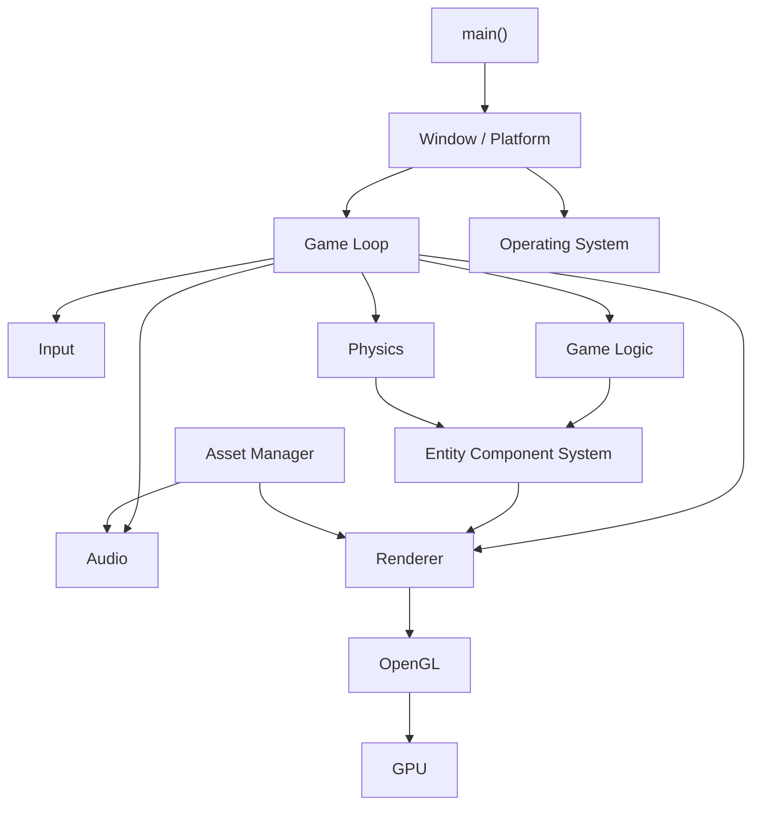

Một kiến trúc custom engine thực tế thường tách **platform layer**, **engine core**, renderer và resource management thay vì đặt toàn bộ code vào `main.cpp`. GLFW cũng tách rõ nhiệm vụ tạo window/OpenGL context và xử lý input/event khỏi chính OpenGL renderer. ([GLFW][2])

---

# 3. Các nội dung cần học

# 3.1. C/C++

Native game engine thường được viết bằng **C hoặc C++**, đặc biệt khi cần làm việc trực tiếp với API đồ họa, thư viện native và quản lý lifetime/resource.

Ở mức bài này, không cần trở thành chuyên gia C++ trước khi bắt đầu engine. Nhưng nên nắm chắc:

```text
Variables / Functions
        ↓
Struct / Class
        ↓
Pointer / Reference
        ↓
RAII / Lifetime
        ↓
std::vector / unordered_map
        ↓
Templates
        ↓
Smart Pointer
        ↓
Performance / Memory
```

### Ví dụ component bằng C++

```cpp
struct Transform {
    float x = 0.0f;
    float y = 0.0f;
    float rotation = 0.0f;
};

struct Velocity {
    float x = 0.0f;
    float y = 0.0f;
};
```

Sau này entity có thể sở hữu hai component:

```text
Player
├── Transform
└── Velocity
```

Một thư viện toán học thường gặp trong graphics C++ là GLM, cung cấp các kiểu vector/matrix theo phong cách GLSL. ([GitHub][3])

---

# 3.2. Game Loop

Đây là một trong những khái niệm quan trọng nhất của game engine.

Game không chạy:

```text
Input
→ Update
→ Render
→ Kết thúc
```

mà lặp liên tục:

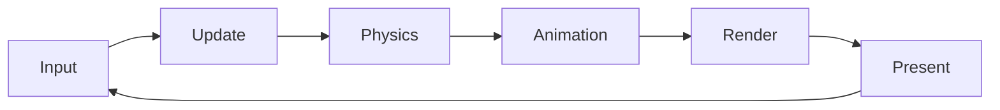

Ví dụ:

```cpp
while (running) {
    processInput();

    update(deltaTime);

    physicsUpdate(deltaTime);

    render();
}
```

Nếu game chạy ở:

```text
60 FPS
```

thì vòng lặp lý tưởng tạo khoảng:

```text
60 frame / giây
≈ 16.67 ms / frame
```

### `deltaTime`

Không nên viết:

```cpp
player.x += 5;
```

vì tốc độ nhân vật lúc đó phụ thuộc vào FPS.

Nên:

```cpp
player.x += speed * deltaTime;
```

Ví dụ:

```cpp
void update(float dt) {
    player.position.x += player.velocity.x * dt;
}
```

---

## Fixed timestep

Physics thường thuận lợi hơn khi simulation sử dụng bước thời gian cố định.

```text
Render
30 FPS ───┐
60 FPS ───┼──► Physics chạy timestep cố định
144 FPS ──┘
```

Ví dụ:

```cpp
constexpr double fixedDt = 1.0 / 60.0;
double accumulator = 0.0;

while (running) {

    double frameTime = getFrameTime();

    accumulator += frameTime;

    processInput();

    while (accumulator >= fixedDt) {
        physicsUpdate(fixedDt);
        accumulator -= fixedDt;
    }

    update(frameTime);

    render();
}
```

Điểm cần hiểu là **render frequency và simulation frequency không nhất thiết phải giống nhau**.

---

# 3.3. Window Management

Game cần một cửa sổ để hệ điều hành biết:

> "Đây là vùng mà application muốn vẽ."

Native engine thường không tự viết toàn bộ Win32/X11/Wayland layer ngay từ đầu mà sử dụng thư viện như:

```text
SDL
hoặc
GLFW
```

GLFW cung cấp API tạo window, graphics context/surface, nhận input và event trên nhiều desktop platform. ([GLFW][4])

### Ví dụ với GLFW

```cpp
glfwInit();

GLFWwindow* window =
    glfwCreateWindow(
        1280,
        720,
        "Mini Engine",
        nullptr,
        nullptr
    );

glfwMakeContextCurrent(window);
```

Luồng hoạt động:

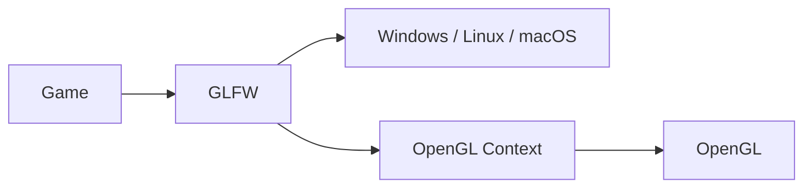

Tài liệu quick start của GLFW cũng sử dụng chính workflow tạo window → tạo OpenGL context → render → xử lý đóng cửa sổ/input. ([GLFW][5])

---

# 3.4. Input Handling

Game phải chuyển input vật lý:

```text
Keyboard
Mouse
Controller
Touch
```

thành hành động gameplay:

```text
MoveLeft
MoveRight
Jump
Attack
Pause
```

Không nên để gameplay phụ thuộc trực tiếp vào một phím cụ thể:

```cpp
if (key == KEY_SPACE)
    player.jump();
```

Kiến trúc tốt hơn:

```text
Space ──────┐
Controller A ├──► Jump Action ──► Player
Touch Button┘
```

Ví dụ:

```cpp
struct InputState {
    bool moveLeft;
    bool moveRight;
    bool jump;
};
```

Sau đó:

```cpp
if (input.moveLeft)
    velocity.x = -speed;

if (input.moveRight)
    velocity.x = speed;
```

SDL sử dụng event queue với `SDL_Event` làm cấu trúc trung tâm cho event processing; GLFW cũng có riêng input API cho keyboard, mouse, cursor và joystick. ([SDL Wiki][6])

---

# 3.5. Renderer

Renderer chịu trách nhiệm chuyển:

```text
Game World
```

thành:

```text
Pixels trên màn hình
```

Một pipeline đơn giản:

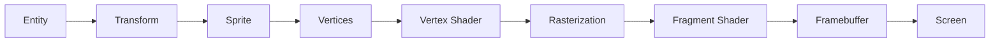

OpenGL là API graphics 2D/3D độc lập với window system; nghĩa là bạn thường cần một layer khác như GLFW hoặc SDL để tạo window/context. ([The Khronos Group][7])

---

## Renderer 2D tối thiểu

Bạn cần hiểu:

```text
Vertex
Triangle
Vertex Buffer
Index Buffer
Shader
Texture
Transform
Camera
Draw Call
```

Một sprite hình chữ nhật thường được tạo từ:

```text
4 vertices
6 indices
2 triangles
```

```text
0 ───────── 1
│        ／ │
│      ／   │
│    ／     │
│  ／       │
3 ───────── 2
```

Sau đó engine gửi geometry và texture cho GPU.

### Renderer interface

Nên tránh để gameplay gọi OpenGL trực tiếp:

```cpp
glBindTexture(...);
glDrawElements(...);
```

Có thể tạo abstraction:

```cpp
renderer.drawSprite(
    playerTexture,
    playerTransform
);
```

Kiến trúc:

```text
Gameplay
   ↓
Renderer API
   ↓
OpenGLRenderer
   ↓
OpenGL
   ↓
GPU
```

Cách này giúp renderer và game logic ít phụ thuộc nhau hơn.

---

# 3.6. Asset Loading

Game có thể cần nạp:

```text
PNG
JPG
WAV
OGG
Shaders
Fonts
Levels
JSON
Animations
```

Không nên để mỗi entity tự đọc asset từ ổ đĩa.

Sai:

```text
Player → load player.png
Enemy1 → load enemy.png
Enemy2 → load enemy.png
Enemy3 → load enemy.png
```

Tốt hơn:

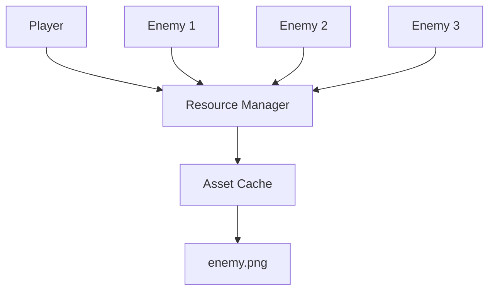

Ví dụ:

```cpp
Texture& AssetManager::getTexture(
    const std::string& path
) {
    if (!textures.contains(path)) {
        textures[path] = loadTexture(path);
    }

    return textures[path];
}
```

`stb_image` là một lựa chọn nhỏ gọn thường được dùng để decode ảnh trong project C/C++, nhưng asset manager của engine vẫn phải chịu trách nhiệm quản lý ownership/cache/lifetime của texture GPU. ([GitHub][8])

---

# 3.7. Physics Integration

Bạn **không nhất thiết phải tự viết physics engine**.

Engine tự viết vẫn có thể tích hợp:

```text
Box2D
Jolt
Bullet
PhysX
...
```

Đối với mini-engine 2D, Box2D là lựa chọn thích hợp để nghiên cứu vì nó là thư viện rigid-body simulation dành cho game 2D và cung cấp collision routines. ([Box2D][9])

### Kiến trúc

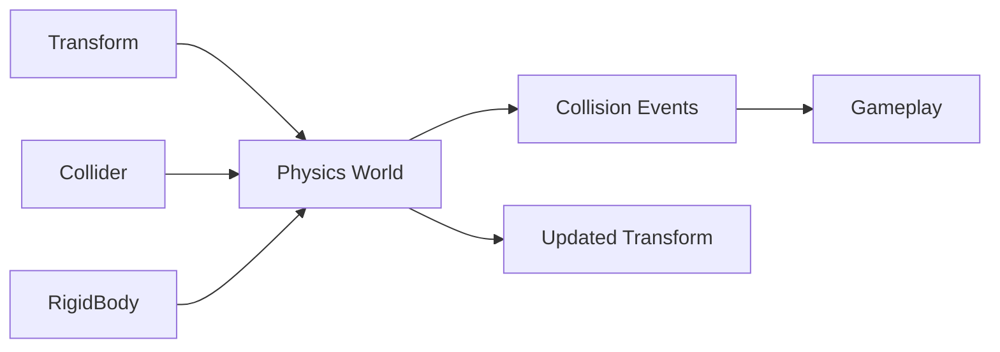

Ví dụ entity:

```text
Ball
├── Transform
├── Sprite
├── Rigidbody
└── CircleCollider
```

Physics update:

```cpp
physicsWorld.step(fixedDeltaTime);
```

sau đó engine đồng bộ:

```text
Physics Position
      ↓
Transform Component
      ↓
Renderer
```

---

# 3.8. Audio

Audio engine có thể xử lý:

```text
Sound Effects
Music
Volume
Loop
Channels
Spatial Audio
Audio Streaming
```

Luồng:

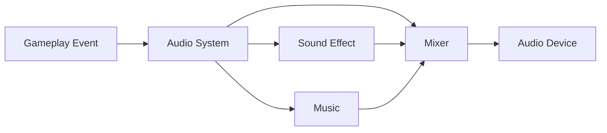

Ví dụ:

```cpp
if (collision.playerHitEnemy) {
    audio.play("hit.wav");
}
```

Thay vì:

```cpp
Player::update() {
    // tự mở file wav
    // tự decode
    // tự gửi audio device
}
```

Một thư viện native nhẹ có thể nghiên cứu là **miniaudio**. Nó cung cấp cả API low-level và high-level cho playback/capture, decoder, resource management và spatialization. ([Miniaudio][10])

---

# 3.9. ECS Architecture

## Entity Component System

Đây là một trong những kiến trúc quan trọng nhất nên hiểu khi học game engine.

ECS chia game object thành:

```text
ENTITY
   +
COMPONENT
   +
SYSTEM
```

EnTT mô tả ECS là một architectural pattern được sử dụng chủ yếu trong game development. ([Skypjack][11])

---

## Entity

Entity thường chỉ là ID.

```cpp
using Entity = uint32_t;

Entity player = 1;
Entity enemy = 2;
```

Entity không nhất thiết chứa logic.

```text
Entity #17
```

chỉ đại diện:

> "Có một object tồn tại trong world."

---

## Component

Component chứa **data**.

```cpp
struct Transform {
    Vec2 position;
    float rotation;
};

struct Velocity {
    Vec2 value;
};

struct Sprite {
    TextureID texture;
};
```

Player:

```text
Entity 1
├── Transform
├── Velocity
├── Sprite
└── PlayerController
```

Rock:

```text
Entity 2
├── Transform
├── Sprite
└── Collider
```

Bullet:

```text
Entity 3
├── Transform
├── Velocity
├── Sprite
└── Collider
```

---

## System

System chứa **logic**.

```text
MovementSystem
      ↓
Transform + Velocity
```

Ví dụ:

```cpp
for (Entity entity : entities) {

    auto& transform =
        transforms[entity];

    auto& velocity =
        velocities[entity];

    transform.position +=
        velocity.value * deltaTime;
}
```

### Sơ đồ ECS

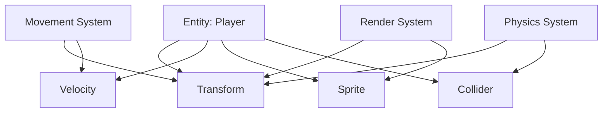

Điểm quan trọng:

```text
Entity = identity

Component = data

System = behavior
```

---

# 4. Scene / Object / Component / Script trong Native Engine

Ở Unity hoặc Godot bạn quen với:

```text
Scene
Object
Component
Script
```

Native engine không bắt buộc phải dùng đúng tên đó.

Có thể ánh xạ thành:

| Game Engine truyền thống | Native Engine         |
| ------------------------ | --------------------- |
| Scene                    | `Scene`, `World`      |
| GameObject / Node        | `Entity`              |
| Component                | ECS component         |
| Script                   | C++ System / Behavior |
| Prefab                   | Entity template       |
| Resource                 | Asset Handle          |
| Transform                | `TransformComponent`  |

Ví dụ:

```text
Level01
│
├── Player
│   ├── Transform
│   ├── Sprite
│   ├── Rigidbody
│   └── PlayerController
│
├── Enemy
│   ├── Transform
│   ├── Sprite
│   └── EnemyAI
│
└── Coin
    ├── Transform
    ├── Sprite
    └── Collider
```

Trong ECS:

```text
World
│
├── Entity 1
├── Entity 2
└── Entity 3

Components
├── Transform Pool
├── Sprite Pool
├── Velocity Pool
└── Collider Pool

Systems
├── InputSystem
├── MovementSystem
├── PhysicsSystem
└── RenderSystem
```

---

# 5. Workflow của Native Engine

Workflow có thể hình dung như sau:

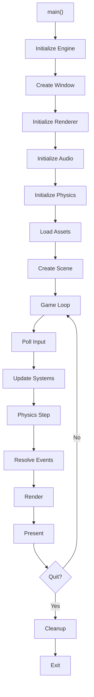

---

# 6. Stack đề xuất cho mini Native Engine

Để bài này không biến thành dự án engine kéo dài nhiều tháng, có thể sử dụng:

```text
Language
└── C++17 / C++20

Platform
└── GLFW hoặc SDL

Graphics
└── OpenGL

Math
└── GLM

Image Loading
└── stb_image

Physics
└── Box2D

Audio
└── miniaudio

ECS
├── Tự viết mini ECS trước
└── Sau đó thử EnTT

Build
└── CMake
```

OpenGL cung cấp phần graphics nhưng không tự cung cấp toàn bộ window/input/game framework; GLFW hoặc SDL đảm nhiệm platform-related functionality. CMake phù hợp để mô tả executable, source/header, library và dependency relationships của project C/C++. ([The Khronos Group][7])

---

# 7. Folder Structure

Một project sạch có thể bắt đầu như sau:

```text
MiniEngine/
│
├── CMakeLists.txt
│
├── assets/
│   ├── textures/
│   │   ├── player.png
│   │   └── enemy.png
│   │
│   ├── audio/
│   │   ├── hit.wav
│   │   └── music.ogg
│   │
│   └── shaders/
│       ├── sprite.vert
│       └── sprite.frag
│
├── engine/
│   ├── core/
│   │   ├── Engine.cpp
│   │   ├── Engine.h
│   │   └── Time.h
│   │
│   ├── platform/
│   │   ├── Window.cpp
│   │   └── Input.cpp
│   │
│   ├── renderer/
│   │   ├── Renderer.cpp
│   │   ├── Shader.cpp
│   │   ├── Texture.cpp
│   │   └── Camera.cpp
│   │
│   ├── ecs/
│   │   ├── Entity.h
│   │   ├── Component.h
│   │   └── Registry.cpp
│   │
│   ├── physics/
│   │   └── PhysicsWorld.cpp
│   │
│   ├── audio/
│   │   └── AudioEngine.cpp
│   │
│   └── assets/
│       └── AssetManager.cpp
│
├── game/
│   ├── Game.cpp
│   ├── PlayerSystem.cpp
│   └── EnemySystem.cpp
│
└── main.cpp
```

Kiến trúc quan trọng ở đây là:

```text
game/
   ↓ depends on

engine/
   ↓ depends on

third-party / OS / graphics APIs
```

Không nên đảo ngược thành:

```text
Renderer → Player
Physics → Enemy
Audio → GameLevel01
```

vì lúc đó engine core bị phụ thuộc vào một game cụ thể.

---

# 8. Renderer OpenGL cơ bản

## Mục tiêu

Đầu tiên chỉ cần render được:

```text
Window
  ↓
Triangle
  ↓
Quad
  ↓
Texture
  ↓
Sprite
```

Không cần lập tức làm:

```text
PBR
Shadow Mapping
Deferred Rendering
HDR
Bloom
SSAO
```

---

## Milestone 1 — Triangle

```text
CPU
 ↓
Vertex Buffer
 ↓
Vertex Shader
 ↓
Rasterizer
 ↓
Fragment Shader
 ↓
Triangle
```

### Vertex shader

```glsl
#version 330 core

layout(location = 0)
in vec3 aPosition;

void main()
{
    gl_Position =
        vec4(aPosition, 1.0);
}
```

### Fragment shader

```glsl
#version 330 core

out vec4 FragColor;

void main()
{
    FragColor =
        vec4(1.0, 0.5, 0.2, 1.0);
}
```

---

# 9. Dự án thực hành — Mini 2D Native Engine

## Game đề xuất: **Coin Hunter**

Gameplay:

```text
Player
 ↓
Di chuyển WASD
 ↓
Thu thập coin
 ↓
Tránh obstacle
 ↓
Tăng score
```

Màn hình:

```text
┌───────────────────────────────────────┐
│ Score: 120                            │
│                                       │
│          ● Coin                       │
│                                       │
│     █ Wall                  ●          │
│                                       │
│              ▲ Player                 │
│                                       │
└───────────────────────────────────────┘
```

### Engine phải hỗ trợ

```text
✓ Window
✓ Game loop
✓ Keyboard input
✓ Texture
✓ Sprite rendering
✓ Transform
✓ Entity
✓ Components
✓ Collision
✓ Audio effect
✓ Basic UI
✓ Scene
```

---

# 10. ECS mini cho project

Các component:

```cpp
struct TransformComponent {
    Vec2 position;
    Vec2 scale;
    float rotation;
};

struct VelocityComponent {
    Vec2 velocity;
};

struct SpriteComponent {
    TextureID texture;
};

struct ColliderComponent {
    Vec2 size;
};

struct PlayerComponent {};

struct CoinComponent {};
```

Entity:

```text
Player
├── Transform
├── Velocity
├── Sprite
├── Collider
└── Player

Coin
├── Transform
├── Sprite
├── Collider
└── Coin
```

Systems:

```text
InputSystem
      ↓
Velocity

MovementSystem
      ↓
Transform

PhysicsSystem
      ↓
Collider + Transform

CoinSystem
      ↓
Player + Coin

RenderSystem
      ↓
Transform + Sprite
```

---

# 11. Gameplay Loop của demo

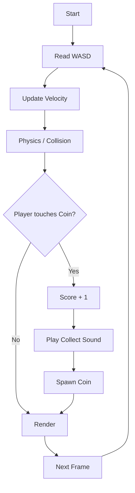

---

# 12. Asset Pipeline

Đây là phần rất đáng ghi vào portfolio.

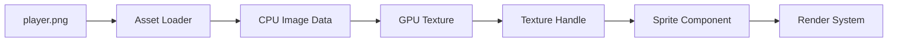

Ví dụ:

```text
assets/textures/player.png
            ↓
stb_image
            ↓
RGBA pixel buffer
            ↓
OpenGL Texture
            ↓
TextureID
            ↓
AssetManager Cache
            ↓
SpriteComponent
```

`stb_image` cung cấp image decoder dạng single-header/single-source phù hợp cho các demo C/C++ nhỏ. ([GitHub][8])

---

# 13. Build Pipeline

Sử dụng CMake:

```text
Source Code
     ↓
CMake
     ↓
Compiler
 ┌───┴────┐
MSVC     GCC/Clang
 └───┬────┘
     ↓
Executable
     ↓
game.exe
```

Ví dụ tối giản:

```cmake
cmake_minimum_required(VERSION 3.20)

project(MiniEngine)

set(CMAKE_CXX_STANDARD 20)

add_executable(
    MiniEngine
    main.cpp
    engine/core/Engine.cpp
    engine/renderer/Renderer.cpp
)
```

CMake hiện có tutorial chính thức dành cho việc xây C++ project từ executable/library cho tới dependencies và các build requirement phức tạp hơn. ([CMake][12])

---

# 14. Engine initialization

Một `main.cpp` cuối cùng nên khá nhỏ:

```cpp
#include "Engine.h"
#include "Game.h"

int main()
{
    Engine engine;

    if (!engine.init()) {
        return -1;
    }

    Game game(engine);

    game.load();

    engine.run(game);

    game.unload();

    engine.shutdown();

    return 0;
}
```

Engine chịu trách nhiệm:

```text
Engine
├── Window
├── Renderer
├── Input
├── Asset Manager
├── Audio
├── Physics
├── ECS
└── Game Loop
```

Game chỉ sử dụng engine:

```text
Game
├── Player
├── Enemy
├── Coin
├── Rules
└── Levels
```

---

# 15. Quan hệ giữa các subsystem

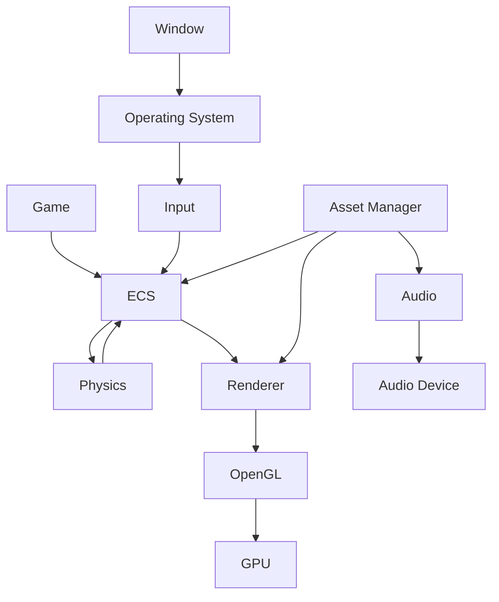

Đây chính là điểm quan trọng nhất của bài:

> **Game engine không phải một class khổng lồ. Nó là tập hợp các subsystem phối hợp với nhau trong một real-time loop.**

---

# 16. Engine có sẵn vs tự viết engine

| Tiêu chí                | Unity/Godot/Unreal | Native Engine |
| ----------------------- | -----------------: | ------------: |
| Prototype gameplay      |              ⭐⭐⭐⭐⭐ |            ⭐⭐ |
| Học graphics            |                ⭐⭐⭐ |         ⭐⭐⭐⭐⭐ |
| Kiểm soát memory        |                 ⭐⭐ |         ⭐⭐⭐⭐⭐ |
| Kiểm soát renderer      |                ⭐⭐⭐ |         ⭐⭐⭐⭐⭐ |
| Editor                  |              ⭐⭐⭐⭐⭐ |             ⭐ |
| Asset pipeline          |              ⭐⭐⭐⭐⭐ |            ⭐⭐ |
| Tooling                 |              ⭐⭐⭐⭐⭐ |             ⭐ |
| Học engine architecture |                ⭐⭐⭐ |         ⭐⭐⭐⭐⭐ |
| Thời gian phát triển    |              Nhanh |          Chậm |
| Khả năng tùy biến core  |     Trung bình–cao |       Rất cao |

Vì vậy:

```text
Muốn làm game nhanh
        ↓
Unity / Unreal / Godot

Muốn hiểu game engine hoạt động thế nào
        ↓
Native Engine

Muốn làm Graphics / Engine Programmer
        ↓
Native Engine rất đáng học
```

---

# 17. Lộ trình thực hành 45–60 phút

### 0–10 phút — Window

```text
CMake
 ↓
GLFW/SDL
 ↓
1280×720 Window
```

Mục tiêu:

```text
[✓] Application chạy
[✓] Có cửa sổ
[✓] Có event loop
```

### 10–20 phút — Game Loop + Input

```text
WASD
 ↓
Input
 ↓
Position
```

### 20–35 phút — OpenGL Renderer

```text
Triangle
 ↓
Quad
 ↓
Texture
```

### 35–45 phút — ECS

```text
Entity
 +
Transform
 +
Velocity
 +
Sprite
```

### 45–55 phút — Collision

```text
Player
   ↓ collide
Coin
   ↓
Score +1
```

### 55–60 phút — README

Ghi:

```text
Architecture
Controls
Dependencies
Build
Gameplay
Problems
Lessons Learned
```

---

# 18. Dự án thực hành chính

## Project A — Mini 2D Engine

**Mục tiêu:** tạo một playable game sử dụng engine tự viết.

Feature:

```text
Window
Input
Game loop
Renderer
Texture
ECS
Collision
Audio
UI
```

---

## Project B — OpenGL Renderer

Renderer hỗ trợ:

```text
Triangle
Quad
Texture
Transform
Camera
Sprite
Batching        ← bonus
```

OpenGL là API graphics; Khronos duy trì specification và reference material chính thức cho OpenGL. ([The Khronos Group][7])

---

## Project C — Mini ECS

API mong muốn:

```cpp
Entity player = registry.create();

registry.add<Transform>(
    player,
    Transform{}
);

registry.add<Velocity>(
    player,
    Velocity{}
);
```

Query:

```cpp
for (
    auto entity :
    registry.view<Transform, Velocity>()
) {
    // movement
}
```

Sau khi tự viết phiên bản nhỏ, có thể đọc EnTT để xem cách một ECS framework C++ thực tế tổ chức registry/view/component storage. ([Skypjack][13])

---

# 19. Bài tập thực hành

## Bài 1 — Game loop

Tạo:

```cpp
while (!shouldQuit()) {
    input();
    update();
    render();
}
```

Sau đó thêm `deltaTime`.

---

## Bài 2 — Character Controller

```text
W → Up
S → Down
A → Left
D → Right
```

Không cho player vượt khỏi cửa sổ.

---

## Bài 3 — Renderer

Render ít nhất:

```text
1 Player
10 Coin
5 Obstacle
```

---

## Bài 4 — Collision

Nếu:

```text
Player AABB
      intersects
Coin AABB
```

thì:

```text
score += 1
destroy(coin)
spawn(newCoin)
```

---

## Bài 5 — ECS

Không tạo:

```cpp
class Player {
    Transform
    Sprite
    Collider
    Input
    Physics
    Audio
    ...
};
```

Hãy chuyển thành:

```text
Entity
  +
Components
  +
Systems
```

---

# 20. README nên ghi gì?

```markdown
# MiniEngine

## Features

- C++20
- OpenGL renderer
- GLFW window/input
- ECS architecture
- Sprite rendering
- Collision
- Audio

## Controls

WASD — Move

ESC — Quit

## Architecture

Game
↓
ECS
↓
Renderer / Physics / Audio

## Build

mkdir build
cd build
cmake ..
cmake --build .

## Lessons Learned

- Game loop
- Delta time
- OpenGL rendering
- ECS
- Asset lifetime
```

---

# 21. Artifact nên tạo

Sau bài này, portfolio nên có **ba artifact chính**:

### 1. Playable Prototype

```text
Mini 2D Game
├── Movement
├── Collision
├── Sprite
├── Audio
└── Score
```

### 2. Engine Architecture Diagram

```text
Engine
├── Platform
├── Renderer
├── ECS
├── Physics
├── Audio
└── Assets
```

### 3. Build README

Chứng minh bạn hiểu:

```text
Build
Dependencies
Architecture
Controls
Pipeline
Trade-offs
```

Đây có giá trị hơn nhiều so với chỉ ghi:

> "Biết OpenGL/C++."

---

# 22. Những lỗi thường gặp

### ❌ Viết engine quá lớn ngay từ đầu

Không bắt đầu bằng:

```text
Editor
+
Vulkan
+
PBR
+
Network
+
Scripting
+
Physics
+
Animation
+
AI
```

Hãy bắt đầu:

```text
Window
 ↓
Game Loop
 ↓
Triangle
 ↓
Sprite
 ↓
Input
 ↓
Collision
```

---

### ❌ Gameplay gọi thẳng OpenGL

```cpp
Player::update() {
    glDrawElements(...);
}
```

Nên là:

```cpp
RenderSystem
    ↓
Renderer
    ↓
OpenGL
```

---

### ❌ Renderer chứa game logic

Không:

```cpp
if (player.health <= 0)
    renderer.drawDeathScreen();
```

Nên:

```text
Gameplay decides state
        ↓
Renderer displays state
```

---

### ❌ Load file mỗi frame

Không:

```cpp
while (running) {
    loadTexture("player.png");
}
```

Mà:

```text
Load once
 ↓
Cache
 ↓
Reuse
```

---

# 23. Checklist hoàn thành bài

```text
[ ] Tôi hiểu game loop.

[ ] Tôi hiểu deltaTime.

[ ] Tôi tạo được window bằng SDL/GLFW.

[ ] Tôi đọc được keyboard input.

[ ] Tôi render được triangle/quad.

[ ] Tôi load được texture.

[ ] Tôi hiểu Transform.

[ ] Tôi hiểu Entity.

[ ] Tôi hiểu Component.

[ ] Tôi hiểu System.

[ ] Tôi tạo được mini ECS.

[ ] Tôi tích hợp collision.

[ ] Tôi phát được sound effect.

[ ] Tôi hiểu asset manager.

[ ] Tôi có folder structure rõ ràng.

[ ] Tôi build được project bằng CMake.

[ ] Tôi có playable prototype.

[ ] Tôi viết README cho project.
```

---

# 24. Câu hỏi tự kiểm tra

### 1. Native Engine khác Unity như thế nào?

Bạn nên trả lời được:

> Unity cung cấp phần lớn renderer, scene, physics, input, editor và asset pipeline. Với native/custom engine, developer tự thiết kế hoặc tích hợp trực tiếp các subsystem này.

---

### 2. Game loop để làm gì?

Bạn phải giải thích được:

```text
Input
 ↓
Simulation
 ↓
Physics
 ↓
Render
 ↓
Next Frame
```

---

### 3. Tại sao cần `deltaTime`?

Để movement/simulation không phụ thuộc trực tiếp vào số FPS.

---

### 4. OpenGL có tạo window không?

Không phải nhiệm vụ chính của OpenGL. OpenGL tập trung vào rendering; thư viện như GLFW hoặc SDL thường được dùng cho window/context/input. ([Khronos Wiki][14])

---

### 5. ECS gồm gì?

```text
Entity
=
ID

Component
=
Data

System
=
Logic
```

---

### 6. Physics nằm ở đâu?

```text
ECS
 ↓
Physics World
 ↓
Collision / Simulation
 ↓
Transform
 ↓
Renderer
```

Box2D là ví dụ về thư viện rigid-body simulation 2D có thể được tích hợp vào engine thay vì tự xây toàn bộ physics solver. ([Box2D][15])

---

### 7. Renderer làm gì?

```text
World Data
 ↓
Geometry
 ↓
Shader
 ↓
GPU
 ↓
Framebuffer
 ↓
Screen
```

---

# 25. Sơ đồ kiến thức cuối bài

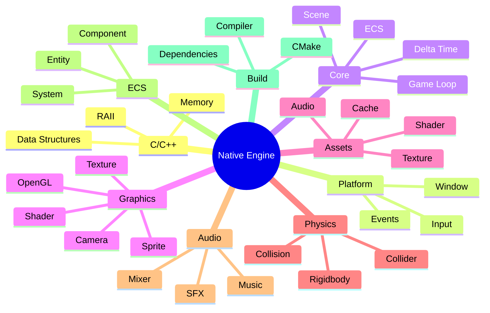

---

# 26. Kiến trúc mini-engine hoàn chỉnh

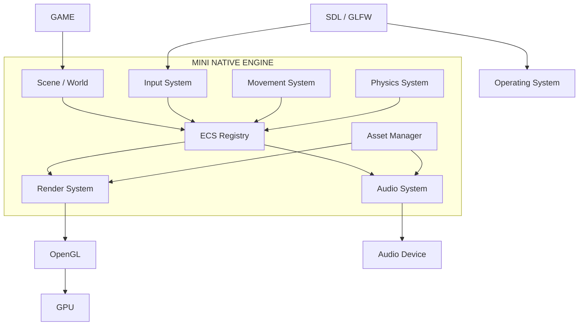

Nếu bạn hiểu được sơ đồ trên và có thể tự xây một phiên bản nhỏ của nó, mục tiêu bài **Native Engine** về cơ bản đã đạt.

---

# 27. Tổng kết

**Native Engine** là bài giúp bạn nhìn xuống tầng bên dưới của Unity, Unreal và Godot.

Thay vì chỉ biết:

```text
Create GameObject
Add Component
Attach Script
Press Play
```

bạn bắt đầu hiểu:

```text
Window
   ↓
Game Loop
   ↓
Input
   ↓
ECS
   ↓
Game Logic
   ↓
Physics
   ↓
Renderer
   ↓
OpenGL
   ↓
GPU
```

Các thư viện như SDL/GLFW giải quyết platform/window/input, OpenGL đảm nhiệm graphics, Box2D có thể đảm nhiệm rigid-body physics 2D, miniaudio cung cấp audio primitives và EnTT là một ECS framework C++ để nghiên cứu sau khi đã tự viết ECS nhỏ. ([SDL Wiki][1])

> **Mục tiêu cuối bài không phải là tạo ra “Unity thứ hai”.**
> Mục tiêu là tự làm một engine đủ nhỏ để bạn hiểu được **một frame game được tạo ra như thế nào — từ input của người chơi, simulation trên CPU, đến lệnh render gửi sang GPU và pixel xuất hiện trên màn hình.**

[1]: https://wiki.libsdl.org/?utm_source=chatgpt.com "SDL Wiki: SDL3/FrontPage"
[2]: https://www.glfw.org/docs/latest/context_guide.html?utm_source=chatgpt.com "Context guide"
[3]: https://github.com/g-truc/glm?utm_source=chatgpt.com "g-truc/glm: OpenGL Mathematics (GLM)"
[4]: https://www.glfw.org/?utm_source=chatgpt.com "GLFW: An OpenGL library"
[5]: https://www.glfw.org/docs/latest/quick.html?utm_source=chatgpt.com "Getting started"
[6]: https://wiki.libsdl.org/SDL3/SDL_Event?utm_source=chatgpt.com "SDL3/SDL_Event"
[7]: https://www.khronos.org/opengl/?utm_source=chatgpt.com "OpenGL - The Industry's Foundation for High Performance ..."
[8]: https://github.com/nothings/stb?utm_source=chatgpt.com "nothings/stb: stb single-file public domain libraries for C/C++"
[9]: https://box2d.org/?utm_source=chatgpt.com "Box2D"
[10]: https://miniaud.io/docs/manual/index.html?utm_source=chatgpt.com "Documentation"
[11]: https://skypjack.github.io/entt/?utm_source=chatgpt.com "EnTT"
[12]: https://cmake.org/cmake/help/latest/guide/tutorial/index.html?utm_source=chatgpt.com "CMake Tutorial — CMake 4.4.2 Documentation"
[13]: https://skypjack.github.io/entt/pages.html?utm_source=chatgpt.com "EnTT: Related Pages"
[14]: https://wikis.khronos.org/opengl/Getting_Started?utm_source=chatgpt.com "Getting Started - OpenGL Wiki"
[15]: https://box2d.org/documentation/?utm_source=chatgpt.com "Box2D: Overview"
