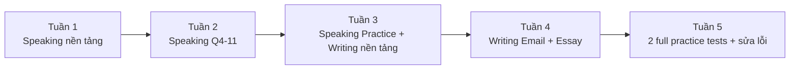

# Lộ trình học Collins TOEIC Speaking & Writing

Tài liệu gốc khuyến nghị học sớm, luyện hằng ngày, bấm giờ khi làm bài và hoàn thành toàn bộ practice activities. Gói này tổ chức lại thành lộ trình 5 tuần, mỗi ngày 45-75 phút.

## Tuần 1 - Speaking: phát âm và mô tả

- Ngày 1: `speaking/00-guide-va-challenges.md`
- Ngày 2-3: `speaking/01-read-a-text-aloud.md`
- Ngày 4-5: `speaking/02-describe-a-picture.md`
- Ngày 6: ghi âm lại 2 dạng, tự nghe và đánh dấu lỗi.

## Tuần 2 - Speaking: trả lời, xử lý thông tin, giải pháp, ý kiến

- Ngày 1: `speaking/03-respond-to-questions.md`
- Ngày 2: `speaking/04-information-provided.md`
- Ngày 3: `speaking/05-propose-a-solution.md`
- Ngày 4-5: `speaking/06-express-an-opinion.md`
- Ngày 6: luyện timer 15s / 30s / 60s.

## Tuần 3 - Speaking full test + Writing cơ bản

- Ngày 1: `speaking/07-practice-test.md`
- Ngày 2: nghe lại bản ghi và lập error log.
- Ngày 3: `writing/00-guide-va-challenges.md`
- Ngày 4-5: `writing/01-sentence-based-on-picture.md`
- Ngày 6: 5 câu/8 phút x 2 lượt.

## Tuần 4 - Writing email và essay

- Ngày 1-2: `writing/02-respond-to-written-request.md`
- Ngày 3-5: `writing/03-opinion-essay.md`
- Ngày 6: 2 email + 1 essay dưới giới hạn thời gian.

## Tuần 5 - Thi thử và sửa lỗi

- `writing/04-practice-test.md`
- `appendix/01-answer-key.md`
- `appendix/02-audio-scripts.md`
- Mỗi lỗi phải được đưa vào một trong 4 nhóm: **Task / Organization / Grammar / Vocabulary** (Writing) hoặc **Content / Pronunciation / Intonation-Stress / Fluency** (Speaking).
