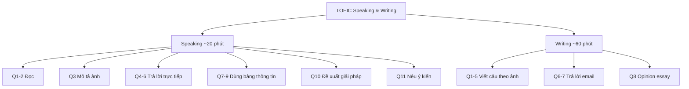

# Tổng quan TOEIC Speaking & Writing theo tài liệu Collins

## Speaking

Theo sách, phần Speaking gồm 11 câu và kéo dài khoảng 20 phút. Cấu trúc trong ấn bản này:

| Câu | Dạng | Điểm task |
|---|---|---:|
| 1-2 | Read a Text Aloud | 0-3 |
| 3 | Describe a Picture | 0-3 |
| 4-6 | Respond to Questions | 0-3 |
| 7-9 | Respond Using Information Provided | 0-3 |
| 10 | Propose a Solution | 0-5 |
| 11 | Express an Opinion | 0-5 |

## Writing

Writing gồm 8 câu và khoảng 60 phút:

| Câu | Dạng | Thời gian | Điểm task |
|---|---|---:|---:|
| 1-5 | Write a Sentence Based on a Picture | 8 phút cho 5 câu | 0-3 |
| 6-7 | Respond to a Written Request | 10 phút/câu | 0-4 |
| 8 | Write an Opinion Essay | 30 phút | 0-5 |

## Nguyên tắc xuyên suốt của sách

- Học theo **question type**, không học lan man theo ngữ pháp riêng lẻ.
- Dùng **Quick Guide** để hiểu đề; **Walk Through** để quan sát mẫu; **Get It Right** để học chiến thuật; **Progressive Practice** để tăng dần mức tự lập.
- Khi luyện, dùng timer giống thời gian thi thật.
- Speaking: ghi âm và nghe lại.
- Writing: gõ trên bàn phím QWERTY và tập sửa bài trong thời gian giới hạn.
