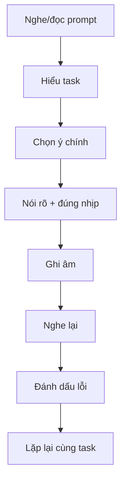

# Speaking 00 - Guide và các lỗi nền tảng cần xử lý

> **Nguồn:** PDF trang 9-14 (phần Guide to the TOEIC Speaking Test + Challenges and Solutions)

## Mục tiêu bài học

- Nắm 6 dạng câu của phần Speaking trong ấn bản Collins.
- Biết 5 nhóm vấn đề sách xem là trở ngại phổ biến: stress/rhythm/vocabulary, tâm lý, pronunciation, timing, reading-listening.
- Thiết lập thói quen ghi âm - nghe lại - sửa lỗi.

## Nội dung cốt lõi

### 1. Kỹ năng chung

Sách nhấn mạnh rằng điểm Speaking không chỉ là “nói được ý”. Người học cần phối hợp:

- **Pronunciation**: âm phải đủ rõ để người chấm hiểu.
- **Intonation & stress**: nhấn đúng từ mang nghĩa, không nhấn đều mọi từ.
- **Vocabulary & grammar**: dùng từ/cấu trúc đủ chính xác cho từng task.
- **Relevance & completeness**: trả lời đúng trọng tâm và đủ yêu cầu.

### 2. Stress trong câu

- Thường nhấn **content words**: nouns, main verbs, adjectives, adverbs, negative auxiliaries.
- Thường giảm lực ở **function words**: prepositions, articles, auxiliary verbs, pronouns, conjunctions.
- Có thể đổi trọng âm để **contrast** hoặc sửa thông tin sai.

### 3. Khi bí từ

Sách khuyên không dừng lại chỉ vì quên một từ. Hãy “nói vòng” bằng ba cách:

- phân loại: *It’s a type of ...*
- nói công dụng: *It’s used for ...*
- so sánh: *It’s similar to ...*

### 4. Khi thiếu thời gian / thừa thời gian

Ưu tiên nhịp nói đều, rõ, có transition. Đừng tăng tốc đến mức làm pronunciation và grammar sụp xuống.

### 5. Khi yếu đọc/nghe

Luyện scan các tài liệu thực tế: schedule, menu, price list, advertisement, invoice; sau đó nói lại thông tin vừa tìm được.

## Sơ đồ ghi nhớ

## Luyện tập

1. Ghi âm 60 giây nói về một hoạt động trong ngày.
2. Nghe lại và đánh dấu 5 content words cần được nhấn.
3. Ghi âm lần hai, cố giữ tốc độ đều hơn.
4. Chọn 5 đồ vật bất kỳ và luyện mô tả khi không nhớ tên chính xác bằng *type of / used for / similar to*.

## Checklist tự chấm

- [ ] Tôi nói đủ lớn và dễ nghe.
- [ ] Tôi có nhấn content words.
- [ ] Tôi không dừng quá lâu khi bí từ.
- [ ] Tôi có thể tự phát hiện ít nhất 3 lỗi sau khi nghe lại.
