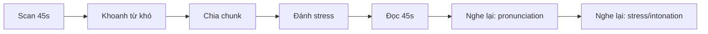

# Speaking 01 - Questions 1-2: Read a Text Aloud

> **Nguồn:** PDF trang 15-28 (trang sách 2-15)

## Mục tiêu bài học

- Đọc khoảng 100 từ rõ ràng trong thời gian quy định.
- Kiểm soát pronunciation, word stress, sentence stress và intonation.
- Biết scan đoạn trước khi đọc để dự đoán từ khó và chỗ cần ngắt.

## Nội dung cốt lõi

### Format

- 45 giây chuẩn bị.
- 45 giây đọc.
- Nội dung thường là announcement, advertisement, introduction, report hoặc thông tin đời sống/công việc.

### Quy trình đọc 45 giây chuẩn bị

**Bước 1 - Scan nội dung:** xác định chủ đề và thái độ của đoạn.

**Bước 2 - Khoanh từ khó:** đặc biệt là danh từ riêng, số, từ dài và cụm phụ âm.

**Bước 3 - Chunk:** chia câu thành nhóm nghĩa; dấu phẩy và dấu chấm là tín hiệu pause tự nhiên.

**Bước 4 - Mark stress:** đánh dấu từ mang thông tin mới hoặc từ cần contrast.

### Pronunciation

Sách dành nhiều phần cho các âm dễ sai như /θ/, /ð/, /z/, /w/, /l/, /r/, /ʃ/, /tʃ/, /dʒ/ và các cụm phụ âm. Mục tiêu không phải bắt chước một accent duy nhất; trọng tâm là **dễ hiểu**.

### Intonation

- Statement / information question: thường rising-falling.
- Yes-no question: thường rising.
- Danh sách: giữ nhịp và nhóm cụm để không đọc “từng từ một”.

### Cách tự luyện

1. Đọc một đoạn 80-120 từ.
2. Ghi âm.
3. Nghe lại ở ba tiêu chí: âm cuối, stress, pause.
4. Đọc lần hai với cùng văn bản để đo tiến bộ thay vì đổi văn bản ngay.

## Sơ đồ ghi nhớ

## Luyện tập

- Dùng trang bài tập trong phần **Get Ready -> Get Set -> Go for the TOEIC Test** của section này.
- Mỗi đoạn nên làm 3 lượt: không chuẩn bị -> chuẩn bị 45s -> đọc lại sau khi sửa lỗi.
- Lập “problem-sound list” tối đa 5 âm/cụm âm, không học quá nhiều cùng lúc.

## Checklist tự chấm

- [ ] Đọc hết trong 45 giây mà không tăng tốc ở cuối.
- [ ] Âm cuối không bị nuốt quá nhiều.
- [ ] Pause theo cụm nghĩa.
- [ ] Có rising/falling thay vì giọng đều.
- [ ] Không nói nhỏ để che lỗi phát âm.
