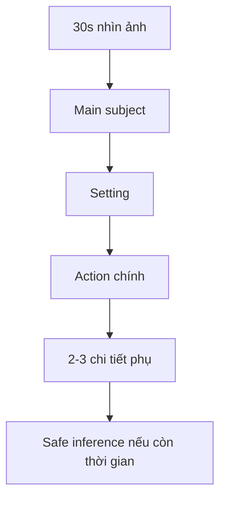

# Speaking 02 - Question 3: Describe a Picture

> **Nguồn:** PDF trang 29-38 (trang sách 16-25)

## Mục tiêu bài học

- Quan sát ảnh và chọn main subject trong 30 giây.
- Nói liên tục 45 giây về people, objects, actions và setting.
- Dùng từ vựng mô tả đủ cụ thể mà không suy đoán quá mức.

## Nội dung cốt lõi

### Format

- 30 giây chuẩn bị.
- 45 giây nói.
- Ảnh thường là tình huống đời thường: cửa hàng, nhà hàng, du lịch, công việc, giải trí.

### Khung mô tả 4 lớp

1. **Overview** - ảnh đang ở đâu, có bao nhiêu người, hoạt động chính là gì.
2. **Foreground / main subject** - mô tả người/vật nổi bật nhất.
3. **Background / secondary details** - thêm vật thể, người, vị trí.
4. **Safe inference** - chỉ suy đoán khi có tín hiệu rõ, dùng *seems / looks like / probably*.

### Ngôn ngữ hữu ích

- Location: *in the foreground, in the background, on the left, on the right, next to, behind*.
- Action: ưu tiên **present continuous** cho hành động đang diễn ra.
- Appearance: adjective + noun, relative clause để kéo dài câu tự nhiên.
- Uncertainty: *It looks like..., She may be..., He is probably...*

### Tránh

- Liệt kê danh từ không kết nối.
- Chỉ nói một người rồi hết thời gian.
- Bịa hoàn cảnh không nhìn thấy trong ảnh.

## Sơ đồ ghi nhớ

## Luyện tập

Mỗi ảnh hãy ghi 4 dòng brainstorm trước khi nói:

- **Who/what?**
- **Where?**
- **Doing what?**
- **Extra detail?**

Sau đó nói lại cùng ảnh 2 lần: lượt 1 ưu tiên đủ ý; lượt 2 ưu tiên cohesion và ít filler hơn.

## Checklist tự chấm

- [ ] Có overview ngay đầu.
- [ ] Dùng present continuous đúng.
- [ ] Có location words.
- [ ] Mô tả ít nhất 2 vùng của ảnh.
- [ ] Không suy diễn quá xa.
